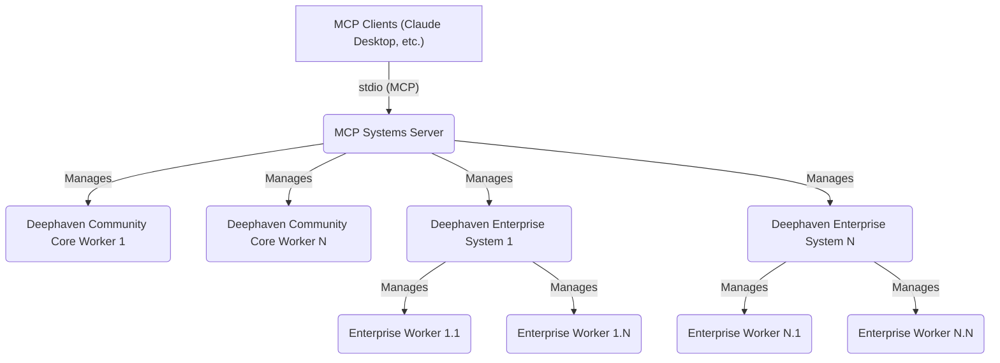
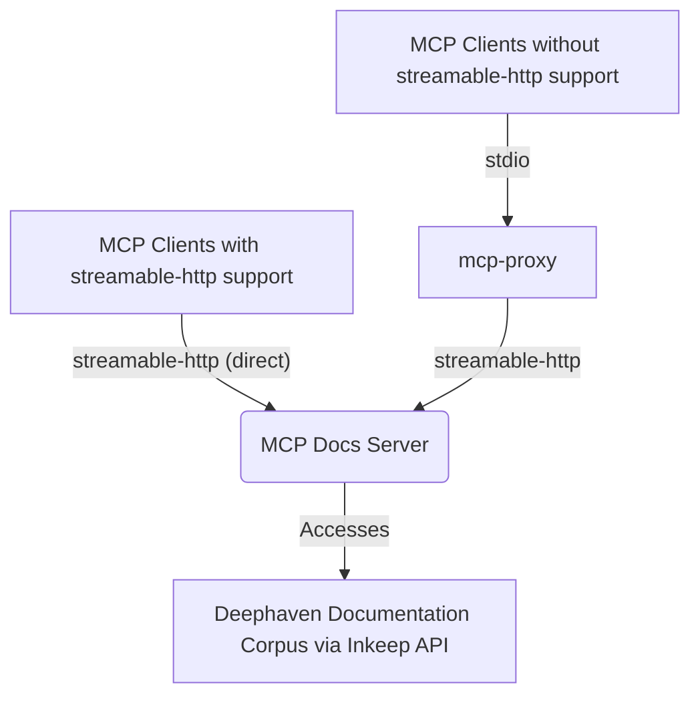

# deephaven-mcp

[](https://pypi.org/project/deephaven-mcp/)
[](https://github.com/deephaven/deephaven-mcp/blob/main/LICENSE)
[](https://github.com/deephaven/deephaven-mcp/actions/workflows/unit-tests.yml)

## Table of Contents

- [Overview](#overview)
- [Key Use Cases](#key-use-cases)
- [🚀 Quick Start](#-quick-start)
- [🔄 Quick Upgrade](#-quick-upgrade)
- [Deephaven MCP Components](#deephaven-mcp-components)
- [Available MCP Tools](#available-mcp-tools)
- [Architecture Diagrams](#architecture-diagrams)
- [Prerequisites](#prerequisites)
- [Installation & Initial Setup](#installation--initial-setup)
- [Configuration](#configuration)
  - [Configuring `deephaven_mcp.json`](#configuring-deephaven_mcpjson)
  - [Environment Variables](#environment-variables)
  - [Browser Access to Created Sessions](#browser-access-to-created-sessions)
  - [Applying Configuration Changes](#applying-configuration-changes)
- [AI Tool Setup](#ai-tool-setup)
- [Troubleshooting](#troubleshooting)
- [Advanced Usage](#advanced-usage)
- [Contributing](#contributing)
- [Community & Support](#community--support)
- [License](#license)

---

## Overview

**Supercharge your AI workflows with real-time data.** Deephaven MCP brings the power of [live dataframes](https://deephaven.io) directly to your favorite AI tools -— [Claude Desktop](https://claude.ai/download), [Cursor](https://cursor.sh/), [VS Code (GitHub Copilot)](https://code.visualstudio.com/docs/copilot/overview), [Windsurf](https://codeium.com/windsurf), and more.

### Why Deephaven MCP?

Most data tools force you to choose: **fast** or **real-time**. With Deephaven's revolutionary live dataframes, you get both. Process streaming data at millisecond speeds while your AI assistant helps you build, query, and analyze -— all through natural language.

**🚀 What makes this different:**

- **Live Data, Live Results**: Query streaming Kafka, real-time feeds, and batch data as easily as static CSV files
- **AI-Native Integration**: Your AI assistant understands your data pipeline and can help optimize, debug, and extend it
- **Enterprise Ready**: Battle-tested on Wall Street for over a decade, now available for your team
- **Zero Learning Curve**: Write queries as if working with static tables -— real-time updates happen automatically

Deephaven MCP implements the [Model Context Protocol (MCP)](https://spec.modelcontextprotocol.io/) standard using [FastMCP](https://github.com/jlowin/fastmcp) to provide seamless integration between [Deephaven Community Core](https://deephaven.io/community/) and [Deephaven Enterprise](https://deephaven.io/enterprise/) systems and your AI development workflow. Perfect for data scientists, engineers, analysts, business users, and anyone who wants to harness real-time data—regardless of programming experience. Let AI generate the code while you focus on insights.

---

## Key Use Cases

- **AI-Assisted Development**: Integrate Deephaven with LLM-powered development tools (e.g., [Claude Desktop](https://www.anthropic.com/claude), [GitHub Copilot](https://github.com/features/copilot)) for AI-assisted data exploration, code generation, and analysis.
- **Multi-Environment Management**: Programmatically manage and query multiple Deephaven Community Core and Enterprise deployments from a single interface.
- **Interactive Documentation**: Quickly find information and examples from Deephaven documentation using natural language queries.
- **Script Automation**: Execute Python or Groovy scripts across multiple Deephaven sessions for data processing workflows.
- **Schema Discovery**: Automatically retrieve and analyze table schemas from connected Deephaven instances.
- **Environment Monitoring**: Monitor session health, package versions, and system status across your Deephaven infrastructure.

---

## 🚀 Quick Start

**Get up and running in 5 minutes!** This quickstart assumes you have a local Deephaven Community Core instance running on `localhost:10000`. If you don't have one, [download and start Deephaven Community Core](https://deephaven.io/core/docs/getting-started/quickstart/) first.

### 1. Create Virtual Environment

**Using `uv` (recommended):**

Pick a suitable project directory for your venv.

```bash
name_of_your_venv=".venv"
uv venv $name_of_your_venv -p 3.11
```

**Using standard `venv`:**

```bash
python3.11 -m venv .venv
```

> Replace `3.11` / `python3.11` with any supported Python version (3.11, 3.12, or 3.13).

### 2. Install Deephaven MCP

For most users, installing with both Community + Enterprise support is the best default.

These instructions cover the installation of the Deephaven MCP system server, which enables AI agents to interact with Deephaven Community and Enterprise systems.

Note: The Deephaven MCP docs server is hosted by Deephaven and requires no installation.

**Using `uv` (recommended):**

```bash
uv pip install "deephaven-mcp[community,enterprise]"
```

**Using standard `pip`:**

```bash
.venv/bin/pip install "deephaven-mcp[community,enterprise]"
```

**Optional Dependencies:**

| Extra | Use when |
|-------|----------|
| `[community]` | You want to create Community Core sessions using python (no Docker) |
| `[enterprise]` | You need to connect to Deephaven Enterprise (Core+) systems |
| `[test]` | You want to run the test suite |
| `[lint]` | You only need code quality tools (linting, formatting, type checking) |
| `[dev]` | You're developing/contributing to this project (includes everything) |

> For more details and additional installation methods, see [Installation & Initial Setup](#installation--initial-setup).

### 3. Create Configuration File

Create a file called [`deephaven_mcp.json`](#configuring-deephaven_mcpjson) anywhere on your system:

```json5
{
  // Community Core session configurations
  "community": {
    "sessions": {
      // "local" is a custom name - use any name you want for your sessions
      "local": {
        "host": "localhost",           // Server hostname or IP address
        "port": 10000,                 // Deephaven gRPC port (default: 10000)
        // Full authentication handler class name (can also use "PSK" shorthand)
        "auth_type": "io.deephaven.authentication.psk.PskAuthenticationHandler",
        "auth_token": "YOUR_PASSWORD_HERE"  // Must match your Deephaven server token
      }
    },
    // Optional: Enable MCP tools for creating/deleting sessions on-demand
    // Useful for temporary workspaces and dynamic testing environments
    "session_creation": {
      "defaults": {
        "launch_method": "python"     // "python" or "docker"
      }
    }
  }
}
```

> **⚠️ Security Note**: Since this file contains authentication credentials, set restrictive permissions:
>
> ```sh
> chmod 600 deephaven_mcp.json
> ```

> **💡 Dynamic Sessions**: The `session_creation` section enables on-demand [Community Core](https://deephaven.io/community/) session creation. Requirements: `deephaven-server` (installed in any Python venv) for the python method, or [Docker](https://www.docker.com/get-started/) for the docker method. See [Community Session Creation Configuration](#community-session-creation-configuration) for details.

### 4. Configure Your AI Tool

**For Claude Desktop**, open **Claude Desktop** → **Settings** → **Developer** → **Edit Config** and add:

```json
{
  "mcpServers": {
    "deephaven-systems": {
      "command": "/full/path/to/your/.venv/bin/dh-mcp-systems-server",
      "args": [],
      "env": {
        "DH_MCP_CONFIG_FILE": "/full/path/to/your/deephaven_mcp.json",
        "PYTHONLOGLEVEL": "INFO"
      }
    },
    "deephaven-docs": {
      "command": "/full/path/to/your/.venv/bin/mcp-proxy",
      "args": [
        "--transport=streamablehttp",
        "https://deephaven-mcp-docs-prod.dhc-demo.deephaven.io/mcp"
      ]
    }
  }
}
```

**For other tools**, see the [detailed setup instructions](#setup-instructions-by-tool) below.

### 5. Try It Out

Restart your AI tool (or IDE). This will start your mcp servers from the installation in the venv you have supplied, located from the configuration supplied.

Confirm the setup is working by asking:

> "List my Deephaven sessions and show me the tables in the local session"

> "What Python packages are installed in my Deephaven environment?"

> "Execute this Python code in my Deephaven session: `t = empty_table(100).update('x=i', 'y=i*2')`"

**Need help?** Check the [Troubleshooting](#troubleshooting) section, ask the built-in docs server about Deephaven features, or join the [Deephaven Community Slack](https://deephaven.io/slack)!

---

## 🔄 Quick Upgrade

**Already have `deephaven-mcp` installed?** Here's how to upgrade:

**Using `uv`:**

```bash
uv pip install --upgrade deephaven-mcp
```

**Using standard `pip`:**

```bash
.venv/bin/pip install --upgrade deephaven-mcp
```

**To upgrade with optional dependencies:**

```bash
# uv
uv pip install --upgrade "deephaven-mcp[community,enterprise]"

# pip
.venv/bin/pip install --upgrade "deephaven-mcp[community,enterprise]"
```

After upgrading, restart your AI tool for changes to take effect.

---

## Deephaven MCP Components

### Systems Server

Manages and connects to multiple [Deephaven Community Core](https://deephaven.io/community/) sessions and [Deephaven Enterprise](https://deephaven.io/enterprise/) systems. This allows for unified control and interaction with your Deephaven instances from various client applications.

**Key Capabilities:**

- **Session Management**: List, monitor, and get detailed status of all configured Deephaven sessions
- **Community Session Creation**: Dynamically launch new Community Core sessions via Docker or python with configurable resources
- **Enterprise Systems**: Connect to and manage Deephaven Enterprise (Core+) deployments
- **Enterprise Session Creation**: Create and delete enterprise sessions with configurable resources and limits
- **Persistent Query Management**: Full lifecycle management of enterprise persistent queries (PQs) - create, start, stop, restart, and delete long-running worker sessions
- **Catalog Discovery**: Browse enterprise catalog at table and namespace levels to discover available data sources
- **Table Discovery**: Lightweight table name listing and comprehensive schema retrieval for both session and catalog tables
- **Table Operations**: Retrieve table schemas, metadata, and actual data with flexible formatting options
- **Script Execution**: Run Python or Groovy scripts directly on Deephaven sessions
- **Package Management**: Query installed Python packages in session environments
- **Configuration Management**: Dynamically reload and refresh session configurations

---

## Available MCP Tools

*Session Management:*

- `sessions_list` - List all configured sessions
- `session_details` - Get detailed session information
- `mcp_reload` - Reload configuration and clear caches

*Community Sessions:*

- `session_community_create` - Dynamically launch Community Core sessions
- `session_community_delete` - Delete dynamically created sessions
- `session_community_credentials` - Retrieve session credentials

*Enterprise Systems & Sessions:*

- `enterprise_systems_status` - Get enterprise system status
- `session_enterprise_create` - Create enterprise sessions
- `session_enterprise_delete` - Delete enterprise sessions

*Persistent Query (PQ) Management:*

- `pq_name_to_id` - Convert PQ name to canonical pq_id
- `pq_list` - List all persistent queries on a system
- `pq_details` - Get detailed PQ information
- `pq_create` - Create new persistent queries
- `pq_modify` - Modify existing persistent query configuration
- `pq_start` - Start persistent queries (supports parallel execution with configurable concurrency)
- `pq_stop` - Stop running persistent queries (supports parallel execution with configurable concurrency)
- `pq_restart` - Restart persistent queries (supports parallel execution with configurable concurrency)
- `pq_delete` - Delete persistent queries (supports parallel execution with configurable concurrency)

**Parallel Batch Operations**: When operating on multiple PQs, `pq_start`, `pq_stop`, `pq_restart`, and `pq_delete` execute operations in parallel with a default concurrency limit of 20. This provides near-batch performance (~10x faster for large batches) while maintaining granular per-item error reporting for AI agents. The concurrency limit can be adjusted via the `max_concurrent` parameter to balance performance and server load.

*Table Operations:*

- `session_tables_list` - List available tables
- `session_tables_schema` - Get table schema information
- `session_table_data` - Retrieve table data with formatting options

*Catalog Discovery (Enterprise):*

- `catalog_tables_list` - List catalog tables
- `catalog_namespaces_list` - Browse catalog namespaces
- `catalog_tables_schema` - Get catalog table schemas
- `catalog_table_sample` - Sample catalog table data

*Execution & Packages:*

- `session_script_run` - Execute Python/Groovy scripts
- `session_pip_list` - Query installed packages

> For detailed tool documentation with parameters and examples, see the [Developer & Contributor Guide](docs/DEVELOPER_GUIDE.md).

---

### Docs Server

Connects to Deephaven's documentation knowledge base via [Inkeep](https://inkeep.com/) AI to answer questions about Deephaven features, APIs, and usage patterns. Ask questions in natural language and get specific answers with code examples and explanations.

---

## Architecture Diagrams

### Systems Server Architecture



*Clients connect to the [MCP Systems Server](#systems-server-architecture), which in turn manages and communicates with [Deephaven Community Core](https://deephaven.io/community/) sessions and [Deephaven Enterprise](https://deephaven.io/enterprise/) systems.*

### Docs Server Architecture



*Modern MCP clients can connect directly via streamable-http for optimal performance. Clients without native streamable-http support can use [`mcp-proxy`](https://github.com/modelcontextprotocol/mcp-proxy) to bridge stdio to streamable-http.*

---

## Prerequisites

- **Python**: Version 3.11, 3.12, or 3.13. ([Download Python](https://www.python.org/downloads/))
- **Docker (Optional)**: Required for Docker-based community session creation. ([Download Docker](https://www.docker.com/get-started/))
- **Access to Deephaven systems:** To use the [MCP Systems Server](#systems-server-architecture), you will need one or more of the following:
  - **[Deephaven Community Core](https://deephaven.io/community/) instance(s):** For development and personal use.
  - **[Deephaven Enterprise](https://deephaven.io/enterprise/) system(s):** For enterprise-level features and capabilities.
- **Choose your Python environment setup method:**
  - **Option A: [`uv`](https://docs.astral.sh/uv/) (Recommended)**: A very fast Python package installer and resolver. If you don't have it, you can install it via `pip install uv` or see the [uv installation guide](https://github.com/astral-sh/uv#installation).
  - **Option B: Standard Python `venv` and `pip`**: Uses Python's built-in [virtual environment (`venv`)](https://docs.python.org/3/library/venv.html) tools and [`pip`](https://pip.pypa.io/en/stable/getting-started/).
- **Configuration Files**: Each integration requires proper configuration files (specific locations detailed in each integration section)

---

## Installation & Initial Setup

> **⚡ Quick Path**: For a fast getting-started experience, see the [🚀 Quick Start](#-quick-start) guide above. This section provides additional installation details and alternative methods.

The recommended way to install `deephaven-mcp` is from [PyPI](https://pypi.org/project/deephaven-mcp/), which provides the latest stable release.

### Installation Methods

#### Using `uv` (Fast, Recommended)

[`uv`](https://github.com/astral-sh/uv) is a high-performance Python package manager. For detailed [`uv`](https://github.com/astral-sh/uv) workflows and project-specific setup, see the [`uv` documentation](docs/UV.md).

**Install uv:**

```sh
pip install uv
```

**Create environment and install:**

```sh
# Create virtual environment with Python 3.11+, in a chosen project directory
name_of_your_venv=".venv"
uv venv $name_of_your_venv -p 3.11

# Install deephaven-mcp (choose your extras)
uv pip install deephaven-mcp                           # Basic
uv pip install "deephaven-mcp[community]"              # + Python session creation
uv pip install "deephaven-mcp[enterprise]"             # + Enterprise support
uv pip install "deephaven-mcp[community,enterprise]"   # Both
```

#### Using Standard `pip` and `venv`

**Create environment and install:**

```sh
# Create virtual environment
python3.11 -m venv .venv

# Install deephaven-mcp (choose your extras)
.venv/bin/pip install deephaven-mcp                           # Basic
.venv/bin/pip install "deephaven-mcp[community]"              # + Python session creation
.venv/bin/pip install "deephaven-mcp[enterprise]"             # + Enterprise support
.venv/bin/pip install "deephaven-mcp[community,enterprise]"   # Both
```

**Optional Dependency Reference:**

| Extra | Provides |
|-------|----------|
| `[community]` | Python-based Community Core session creation (no Docker) |
| `[enterprise]` | Deephaven Enterprise (Core+) system connectivity |
| `[test]` | Testing framework and utilities |
| `[lint]` | Code quality tools (linting, formatting, type checking) |
| `[dev]` | Full development environment (all of the above) |

---

## Configuration

This section covers all aspects of configuring Deephaven MCP, from defining your sessions and systems to setting environment variables and managing browser access.

### Configuring `deephaven_mcp.json`

This section explains how to configure the [Deephaven MCP Systems Server](#systems-server) to connect to and manage your [Deephaven Community Core](https://deephaven.io/community/) instances and [Deephaven Enterprise](https://deephaven.io/enterprise/) systems. This involves creating a [systems session definition file](#the-deephaven_mcpjson-file) and understanding how the server locates this file.

### The `deephaven_mcp.json` File

This file tells the MCP Systems Server how to connect to your Deephaven instances. You'll create this file to define your connections to either Community Core sessions or Enterprise systems (or both).

**File Format**: The configuration file supports both standard JSON and JSON5 formats:

- Single-line comments: `// This is a comment`
- Multi-line comments: `/* This is a multi-line comment */`
- Trailing commas are also supported

The configuration file supports two main sections:

- **`"community"`**: For connecting to Community Core session instances
- **`"enterprise"`**: For connecting to Enterprise systems

You can include either section, both, or neither (empty file). Each section contains connection details specific to that type of Deephaven system.

> **🔒 Security Note:** For controlling access to session credentials, see the [Security Configuration](#security-configuration) section below.

### Community Core Configuration

#### Community Examples

**Minimal configuration (no connections):**

```json
{}
```

**Anonymous authentication (simplest):**

```json5
{
  "community": {
    "sessions": {
      // No authentication required - use only for local development!
      // When auth_type is omitted, defaults to "Anonymous"
      "my_local_server": {
        "host": "localhost",  // Deephaven server address
        "port": 10000          // Default Deephaven port (gRPC)
      }
    }
  }
}
```

**PSK authentication:**

```json5
{
  "community": {
    "sessions": {
      "psk_server": {
        "host": "localhost",
        "port": 10000,
        // Pre-Shared Key authentication (most common for production)
        // Can use "PSK" shorthand or full class name shown here
        "auth_type": "io.deephaven.authentication.psk.PskAuthenticationHandler",
        "auth_token": "your-shared-secret-key"  // Token configured on server
      }
    }
  }
}
```

**Basic authentication with environment variable:**

```json5
{
  "community": {
    "sessions": {
      "prod_session": {
        "host": "deephaven-prod.example.com",  // Remote server
        "port": 10000,
        "auth_type": "Basic",  // HTTP Basic authentication
        // More secure: read credentials from environment variable
        // Set in shell: export DH_AUTH_TOKEN="username:password"
        "auth_token_env_var": "DH_AUTH_TOKEN"  // Must be in "user:pass" format
      }
    }
  }
}
```

**TLS/SSL configuration:**

```json5
{
  "community": {
    "sessions": {
      "secure_tls_session": {
        "host": "secure.deephaven.example.com",
        "port": 443,  // Standard HTTPS port (use 10000 for non-TLS)
        "use_tls": true,  // Enable SSL/TLS encryption
        // Optional: Custom CA certificate for server verification
        "tls_root_certs": "/absolute/path/to/ca.pem",  // Must be absolute path!
        // Optional: Mutual TLS (mTLS) for client authentication
        "client_cert_chain": "/absolute/path/to/client-cert.pem",
        "client_private_key": "/absolute/path/to/client-key.pem"
      }
    }
  }
}
```

#### Community Configuration Fields

*All community session fields are optional. Default values are applied by the server if a field is omitted.*

> 💡 **See Examples Above:** For complete configuration examples, refer to [Community Examples](#community-examples).

| Field | Type | Required When | Description |
|-------|------|---------------|-------------|
| `host` | string | Optional | Hostname or IP address of the Deephaven Community Core session (e.g., `"localhost"`) |
| `port` | integer | Optional | Port number for the session connection (e.g., `10000`) |
| `auth_type` | string | Optional | Authentication type: `"PSK"` (shorthand), `"Anonymous"` (default), `"Basic"`, or full class names like `"io.deephaven.authentication.psk.PskAuthenticationHandler"` |
| `auth_token` | string | Optional | Authentication token. For `"Basic"` auth: `"username:password"` format. Mutually exclusive with `auth_token_env_var` |
| `auth_token_env_var` | string | Optional | Environment variable name containing the auth token (e.g., `"MY_AUTH_TOKEN"`). More secure than hardcoding tokens |
| `never_timeout` | boolean | Optional | If `true`, attempts to configure the session to never time out |
| `session_type` | string | Optional | Type of session to create: `"groovy"` or `"python"` |
| `use_tls` | boolean | Optional | Set to `true` if the connection requires TLS/SSL |
| `tls_root_certs` | string | Optional | Absolute path to PEM file with trusted root CA certificates for TLS verification |
| `client_cert_chain` | string | Optional | Absolute path to PEM file with client's TLS certificate chain (for mTLS) |
| `client_private_key` | string | Optional | Absolute path to PEM file with client's private key (for mTLS) |

#### Community Session Creation Configuration

The `session_creation` key enables dynamic creation of Deephaven Community Core sessions on-demand. When configured, the MCP tools `session_community_create` and `session_community_delete` become available.

**Requirements by launch method:**

- **Docker method** (`launch_method: "docker"`):
  - Requires [Docker](https://www.docker.com/get-started/) installed and running
  - Works with base `deephaven-mcp` installation (no additional packages needed)

- **Python method** (`launch_method: "python"`):
  - Requires `deephaven-server` installed in a Python environment
  - **Default venv**: Uses same venv as MCP server
  - **Custom venv**: Optionally specify a different venv via `python_venv_path` parameter
  - No Docker needed

| Field | Type | Required When | Description |
|-------|------|---------------|-------------|
| `session_creation` | object | Optional | Configuration for creating community sessions. If omitted, session creation tools are unavailable |
| `session_creation.max_concurrent_sessions` | integer | Optional | Maximum concurrent sessions (default: 5). Set to 0 to disable session creation |
| `session_creation.defaults` | object | Optional | Default parameters for new sessions |
| `session_creation.defaults.launch_method` | string | Optional | How to launch sessions: `"docker"` or `"python"` (default: "docker") |
| `session_creation.defaults.auth_type` | string | Optional | Authentication type: `"PSK"` (default), `"Anonymous"`, or full class name `"io.deephaven.authentication.psk.PskAuthenticationHandler"`. Case-insensitive for shorthand. Basic auth not supported for dynamic sessions |
| `session_creation.defaults.auth_token` | string | Optional | Pre-shared key for PSK auth. If omitted with PSK auth, a secure token is auto-generated |
| `session_creation.defaults.auth_token_env_var` | string | Optional | Environment variable containing auth token. Mutually exclusive with `auth_token` |
| `session_creation.defaults.programming_language` | string | Optional | Programming language for Docker sessions: `"Python"` or `"Groovy"` (default: "Python"). Docker only. Mutually exclusive with `docker_image`. See examples below. |
| `session_creation.defaults.docker_image` | string | Optional | Custom Docker image to use. Docker only. Mutually exclusive with `programming_language`. If neither specified, defaults to Python image. See examples below. |
| `session_creation.defaults.docker_memory_limit_gb` | float | Optional | Container memory limit in GB (Docker only, default: no limit) |
| `session_creation.defaults.docker_cpu_limit` | float | Optional | Container CPU limit in cores (Docker only, default: no limit) |
| `session_creation.defaults.docker_volumes` | array | Optional | Volume mounts in format `["host:container:mode"]` (Docker only, default: []) |
| `session_creation.defaults.python_venv_path` | string | Optional | Path to custom Python venv directory (Python only). If provided, uses deephaven from that venv. If null (default), uses same venv as MCP server. Raises error if used with docker. |
| `session_creation.defaults.heap_size_gb` | float \| int | Optional | JVM heap size in gigabytes (e.g., 4 or 2.5, default: 4). Integer values use 'g' suffix (4 → `-Xmx4g`). Float values converted to MB (2.5 → `-Xmx2560m`) |
| `session_creation.defaults.extra_jvm_args` | array | Optional | Additional JVM arguments (e.g., `["-XX:+UseG1GC"]`, default: []) |
| `session_creation.defaults.environment_vars` | object | Optional | Environment variables as key-value pairs (default: {}) |
| `session_creation.defaults.startup_timeout_seconds` | float | Optional | Maximum time to wait for session startup (default: 60) |
| `session_creation.defaults.startup_check_interval_seconds` | float | Optional | Time between health checks during startup (default: 2) |
| `session_creation.defaults.startup_retries` | integer | Optional | Connection attempts per health check (default: 3) |

**Docker Image Configuration Examples:**

```json5
// ✅ CORRECT: Use programming_language for standard Deephaven images
{
  "session_creation": {
    "defaults": {
      "launch_method": "docker",
      "programming_language": "Python"  // Uses ghcr.io/deephaven/server:latest
    }
  }
}

// ✅ CORRECT: Use programming_language for Groovy
{
  "session_creation": {
    "defaults": {
      "launch_method": "docker",
      "programming_language": "Groovy"  // Uses ghcr.io/deephaven/server-slim:latest
    }
  }
}

// ✅ CORRECT: Use docker_image for custom images
{
  "session_creation": {
    "defaults": {
      "launch_method": "docker",
      "docker_image": "my-custom-deephaven:v1.0"  // Uses your custom image
    }
  }
}

// ❌ INCORRECT: Don't use both programming_language and docker_image together
{
  "session_creation": {
    "defaults": {
      "launch_method": "docker",
      "programming_language": "Python",  // ❌ Conflict!
      "docker_image": "custom:latest"     // ❌ Conflict!
    }
  }
}
```

> **📝 Session Lifecycle Notes**:
>
> **Automatic Cleanup:**
>
> - Sessions are automatically stopped and cleaned up when the MCP server shuts down
> - All ports are released and containers/processes are terminated gracefully
> - On restart, the MCP server detects and cleans up any orphaned resources from previous runs
>
> **Session Management:**
>
> - Auto-generated PSK tokens are logged at WARNING level for visibility (similar to [Jupyter](https://jupyter.org/) notebooks)
> - Created sessions use session IDs in format: `community:dynamic:{session_name}`
> - Only dynamically created sessions can be deleted via `session_community_delete`
> - Static configuration-based sessions cannot be deleted via MCP tools

### Enterprise System Configuration

#### Enterprise Examples

**Password authentication (direct):**

```json5
{
  "enterprise": {
    "systems": {
      // "dev_enterprise_system" is a custom name - use any name you like
      "dev_enterprise_system": {
        // Enterprise server provides this URL (for envoy on port 8000, and typically ends with /iris/connection.json)
        "connection_json_url": "https://dev-enterprise.example.com:8000/iris/connection.json",
        "auth_type": "password",  // Username/password authentication
        "username": "admin",
        "password": "your-password-here"  // ⚠️ Consider password_env_var for security!
      }
    }
  }
}
```

**Password authentication (environment variable):**

```json5
{
  "enterprise": {
    "systems": {
      "my_enterprise_system": {
        "connection_json_url": "https://my-enterprise.example.com:8000/iris/connection.json",
        "auth_type": "password",
        "username": "admin",
        // ✅ RECOMMENDED: Read password from environment variable
        // Set in shell: export DH_ENTERPRISE_PASSWORD="your-password"
        "password_env_var": "DH_ENTERPRISE_PASSWORD"
      }
    }
  }
}
```

**Private key authentication:**

```json5
{
  "enterprise": {
    "systems": {
      "saml_enterprise": {
        "connection_json_url": "https://enterprise.example.com:8000/iris/connection.json",
        // Private key authentication (commonly used with SAML/SSO setups)
        // Your IT/security team typically provides the private key file
        "auth_type": "private_key",
        "private_key_path": "/absolute/path/to/your/private_key.pem"  // Must be absolute!
      }
    }
  }
}
```

#### Enterprise Configuration Fields

The `enterprise` key contains a `"systems"` dictionary mapping custom system names to their configuration objects.

> 💡 **See Examples Above:** For complete configuration examples, refer to [Enterprise Examples](#enterprise-examples).

| Field | Type | Required When | Description |
|-------|------|---------------|-------------|
| `connection_json_url` | string | Always | URL to the Enterprise server's `connection.json` file. For standard HTTPS port 443, no port is needed (e.g., `"https://enterprise.example.com/iris/connection.json"`). For non-standard ports, include the port number explicitly (e.g., `"https://enterprise.example.com:8123/iris/connection.json"`) |
| `auth_type` | string | Always | Authentication method: `"password"` for username/password auth, or `"private_key"` for private key-based auth (e.g., SAML) |
| `username` | string | `auth_type` = `"password"` | Username for authentication |
| `password` | string | `auth_type` = `"password"` | Password (use `password_env_var` instead for security) |
| `password_env_var` | string | `auth_type` = `"password"` | Environment variable containing the password (recommended) |
| `private_key_path` | string | `auth_type` = `"private_key"` | Absolute path to private key file |
| `connection_timeout` | integer \| float | Optional | Timeout in seconds for establishing connection to Enterprise system (default: 10.0) |
| `session_creation` | object | Optional | Configuration for creating enterprise sessions. If omitted, session creation tools are unavailable |
| `session_creation.max_concurrent_sessions` | integer | Optional | Maximum concurrent sessions (default: 5). Set to 0 to disable session creation |
| `session_creation.defaults` | object | Optional | Default parameters for new sessions |
| `session_creation.defaults.heap_size_gb` | float \| int | Optional | Default JVM heap size in gigabytes for new sessions (e.g., 4 or 2.5). Enterprise library handles conversion internally |
| `session_creation.defaults.programming_language` | string | Optional | Default programming language for new sessions ("Python" or "Groovy", default: "Python") |
| `session_creation.defaults.auto_delete_timeout` | integer | Optional | Default auto-deletion timeout in seconds for idle sessions (API default: 600) |
| `session_creation.defaults.server` | string | Optional | Default target server/environment name where sessions will be created |
| `session_creation.defaults.engine` | string | Optional | Default engine type for new sessions (e.g., "DeephavenCommunity") |
| `session_creation.defaults.extra_jvm_args` | array | Optional | Default additional JVM arguments for new sessions (e.g., ["-XX:+UseG1GC"]) |
| `session_creation.defaults.extra_environment_vars` | array | Optional | Default environment variables for new sessions (format: ["NAME=value"]) |
| `session_creation.defaults.admin_groups` | array | Optional | Default user groups with administrative permissions for new sessions |
| `session_creation.defaults.viewer_groups` | array | Optional | Default user groups with read-only access to new sessions |
| `session_creation.defaults.timeout_seconds` | float | Optional | Default session startup timeout in seconds (API default: 60) |
| `session_creation.defaults.session_arguments` | object | Optional | Default arguments for pydeephaven.Session constructor (passed as-is, no validation of contents) |

> **📝 Note**: All file paths should be absolute and accessible by the MCP server process.

### Security Configuration

The top-level `security` section in `deephaven_mcp.json` controls security-sensitive features. This section is optional.

#### Community Credential Retrieval

The `security.community.credential_retrieval_mode` setting controls whether and how the `session_community_credentials` MCP tool can retrieve authentication credentials programmatically.

> **🔒 SECURITY WARNING**
>
> When credential retrieval is enabled, your AI assistant can see and access the authentication tokens. The AI can use these credentials to connect to your Deephaven sessions.  The credentials may also be logged by the AI assistant.
>
> Only enable credential retrieval modes if you understand these security implications. **NEVER** enable credential retrieval when the MCP server is accessible over untrusted networks.

| Field | Type | Values | Description |
|-------|------|--------|-------------|
| `security.community.credential_retrieval_mode` | string | `"none"` (default), `"dynamic_only"`, `"static_only"`, `"all"` | Controls credential retrieval access |

**Mode Descriptions:**

- **`"none"`** (default): Credential retrieval disabled for all sessions (most secure)
  - Tool returns error with configuration instructions
  - Credentials only available via console logs
  
- **`"dynamic_only"`**: Only dynamically created session credentials can be retrieved
  - Recommended for development environments
  - Allows retrieval for sessions created via `session_community_create`
  - Denies retrieval for static configuration-based sessions
  
- **`"static_only"`**: Only static configuration-based session credentials can be retrieved
  - For controlled environments where static credentials are managed
  - Allows retrieval for sessions defined in `community.sessions`
  - Denies retrieval for dynamically created sessions
  
- **`"all"`**: Both dynamic and static session credentials can be retrieved
  - Maximum flexibility but requires careful security consideration
  - Only enable if you understand the security implications

**Example Configuration:**

```json
{
  "security": {
    "community": {
      "credential_retrieval_mode": "dynamic_only"
    }
  },
  "community": {
    "sessions": {
      "local": {
        "host": "localhost",
        "port": 10000
      }
    }
  }
}
```

### Combined Configuration Example

Here's a complete example showing both Community and Enterprise configurations:

```json5
{
  /* ====================================
   * Community Core Session Configurations
   * ==================================== */
  "community": {
    "sessions": {
      // Local development - no authentication
      "my_local_deephaven": {
        "host": "localhost",
        "port": 10000,
        "session_type": "python"  // "python" or "groovy" - sets query language
      },
      // Staging environment - PSK authentication
      "psk_authenticated_session": {
        "host": "localhost",
        "port": 10001,
        "auth_type": "io.deephaven.authentication.psk.PskAuthenticationHandler",
        "auth_token": "your-shared-secret-key",
        "session_type": "python"
      },
      // Production - Basic auth with TLS
      "basic_auth_session": {
        "host": "secure.deephaven.example.com",
        "port": 10002,
        "auth_type": "Basic",
        "auth_token": "username:password",  // ⚠️ Better: use auth_token_env_var!
        "use_tls": true,
        "tls_root_certs": "/path/to/community_root.crt"  // Absolute path
      }
    },
    /* Dynamic session creation configuration
     * Enables on-demand session creation via MCP tools */
    "session_creation": {
      "max_concurrent_sessions": 5,  // Maximum number of concurrent dynamic sessions
      "defaults": {
        "launch_method": "docker",  // "docker" or "python"
        "auth_type": "PSK",  // Auto-generate PSK tokens for security
        "docker_image": "ghcr.io/deephaven/server:latest",  // Docker image to use
        "docker_memory_limit_gb": null,  // null = no limit, or specify GB (e.g., 8.0)
        "docker_cpu_limit": null,  // null = no limit, or specify cores (e.g., 2.0)
        "docker_volumes": [],  // Empty = no mounts, or add paths like ["/data:/data"]
        "heap_size_gb": 4.0,  // JVM heap size (4GB works for most cases)
        "extra_jvm_args": [],  // Custom JVM flags if needed
        "environment_vars": {},  // Custom environment variables
        "startup_timeout_seconds": 60,  // How long to wait for session to start
        "startup_check_interval_seconds": 2,  // How often to check if ready
        "startup_retries": 3  // Number of restart attempts on failure
      }
    }
  },
  /* ====================================
   * Enterprise System Configurations
   * ==================================== */
  "enterprise": {
    "systems": {
      // "prod_cluster" is a custom name - use whatever makes sense for your setup
      "prod_cluster": {
        "connection_json_url": "https://prod.enterprise.example.com/iris/connection.json",
        "auth_type": "password",
        "username": "your_username",
        "password_env_var": "ENTERPRISE_PASSWORD",  // ✅ Read from environment (secure)
        // Enable dynamic Enterprise session creation
        "session_creation": {
          "max_concurrent_sessions": 3,  // Lower limit for production stability
          "defaults": {
            "heap_size_gb": 8.0,  // Larger heap for production workloads
            "programming_language": "Groovy",  // "Python" or "Groovy"
            "auto_delete_timeout": 3600,  // Auto-delete idle sessions after 1 hour
            "server": "gpu-server-1",  // Target specific Enterprise server/node
            "engine": "DeephavenCommunity",  // Engine type (check with your admin)
            // Performance tuning: G1GC with 200ms pause target
            "extra_jvm_args": ["-XX:+UseG1GC", "-XX:MaxGCPauseMillis=200"],
            // Custom environment for your workflows (format: "KEY=value")
            "extra_environment_vars": ["PYTHONPATH=/custom/libs", "LOG_LEVEL=DEBUG"],
            // Access control: Who can admin vs view the session
            "admin_groups": ["deephaven-admins", "data-team-leads"],
            "viewer_groups": ["analysts", "data-scientists"],
            "timeout_seconds": 120.0,  // Wait up to 2 minutes for session startup
            // Custom args passed to pydeephaven.Session (advanced)
            "session_arguments": {"custom_setting": "example_value"}
          }
        }
      },
      // Separate data science environment - private key auth (SAML)
      "data_science_env": {
        "connection_json_url": "https://data-science.enterprise.example.com/iris/connection.json",
        "auth_type": "private_key",
        "private_key_path": "/path/to/your/private_key.pem"  // From your IT team
      }
    }
  }
}
```

### Security Note

> **⚠️ Security Warning**: The `deephaven_mcp.json` file can contain sensitive information such as authentication tokens, usernames, and passwords. Ensure that this file is protected with appropriate filesystem permissions to prevent unauthorized access.
>
> For example, on Unix-like systems (Linux, macOS), you can restrict permissions to the owner only:
>
> ```bash
> chmod 600 /path/to/your/deephaven_mcp.json
> ```

### Setting `DH_MCP_CONFIG_FILE`

The `DH_MCP_CONFIG_FILE` environment variable tells the [Deephaven MCP Systems Server](#systems-server) where to find your `deephaven_mcp.json` file (detailed in [The `deephaven_mcp.json` File](#the-deephaven_mcpjson-file)). You will set this environment variable as part of the server launch configuration within your LLM tool, as detailed in the [Setup Instructions by Tool](#setup-instructions-by-tool) section.

When launched by an LLM tool, the [MCP Systems Server](#systems-server-architecture) process reads this variable to load your session definitions. For general troubleshooting or if you need to set other environment variables like `PYTHONLOGLEVEL` (e.g., to `DEBUG` for verbose logs), these are also typically set within the LLM tool's MCP server configuration (see [Setup Instructions by Tool](#setup-instructions-by-tool)).

---

### Environment Variables

> **⚠️ Security Warning**: Environment variables containing sensitive information like API keys and authentication tokens should be handled securely and never committed to version control.

#### Systems Server Environment Variables

- **`DH_MCP_CONFIG_FILE`**: Path to your [`deephaven_mcp.json`](#configuring-deephaven_mcpjson) configuration file
  - Example: `DH_MCP_CONFIG_FILE=/path/to/your/deephaven_mcp.json`
  - Default: Looks for `deephaven_mcp.json` in the current directory

- **`PYTHONLOGLEVEL`**: Controls the verbosity of logging output
  - Values: `DEBUG`, `INFO`, `WARNING`, `ERROR`
  - Example: `PYTHONLOGLEVEL=DEBUG`
  - Default: `INFO`

- **Custom authentication variables**: Any environment variable specified in your [`deephaven_mcp.json`](#configuring-deephaven_mcpjson) configuration's `auth_token_env_var` field will be used to source authentication tokens
  - Example: If config specifies `"auth_token_env_var": "MY_AUTH_TOKEN"`, then `MY_AUTH_TOKEN=username:password`
  - Note: This is a more secure alternative to hardcoding tokens in configuration files

---

### Browser Access to Created Sessions

When you create a Deephaven session via the MCP tools, you may want to access it through a web browser. By default, authentication credentials are not returned through MCP tools for security.

### Viewing Credentials in Console

When a session is created with an auto-generated token, the connection information is logged to your console:

```text
====================================================================
🔑 Session 'my-analysis' Created - Browser Access Information:
   Port: 45123
   Base URL: http://localhost:45123
   Auth Token: abc123xyz789...
   Browser URL: http://localhost:45123/?psk=abc123xyz789

   To retrieve credentials via MCP tool, set security.community.credential_retrieval_mode
   in your deephaven_mcp.json configuration.
====================================================================
```

You can copy this URL directly into your browser.

### Retrieving Credentials via MCP Tool (Optional)

If you want AI agents to retrieve credentials programmatically, you can enable the `session_community_credentials` tool in your configuration:

1. **Edit your [`deephaven_mcp.json`](#configuring-deephaven_mcpjson):**

   ```json
   {
     "security": {
       "community": {
         "credential_retrieval_mode": "dynamic_only"
       }
     },
     "community": {
       "session_creation": {
         "defaults": {
           "launch_method": "docker",
           "heap_size_gb": 4
         }
       }
     }
   }
   ```

   **Valid `credential_retrieval_mode` values:**

   - **`"none"`** (default): Credential retrieval disabled for all sessions (most secure)
   - **`"dynamic_only"`**: Only auto-generated tokens from dynamically created sessions (recommended for development)
   - **`"static_only"`**: Only pre-configured tokens from static sessions in your config
   - **`"all"`**: Both dynamic and static session credentials

2. **Use the tool:**

   Ask your AI assistant: *"Get me the browser URL for session 'my-analysis'"*

   The AI will use `session_community_credentials` to retrieve the authenticated URL.

   > **🔒 SECURITY WARNING**
   >
   > This tool exposes sensitive credentials. Only enable credential retrieval if the MCP server is running locally and you understand the security implications. **NEVER** enable when accessible over untrusted networks.

---

### Applying Configuration Changes

After creating or modifying your MCP configuration, you must restart your IDE or AI assistant for the changes to take effect.

#### Restart and Verify

1. **Restart your tool** completely (Claude Desktop, VS Code, Cursor, etc.)
2. **Check MCP server status** in your tool's interface - you should see `deephaven-systems` and `deephaven-docs` listed
3. **Test the connection** by asking your AI assistant:

   ```text
   Are the Deephaven MCP servers working? Can you list any available sessions?
   ```

   Your AI assistant should connect to both servers and respond with information about Deephaven capabilities and available sessions.

If the servers don't appear or you encounter errors, see the [Troubleshooting](#troubleshooting) section.

---

## AI Tool Setup

This section explains how to connect Deephaven to your AI assistant or IDE. While the goal is the same -— pointing your tool to the Deephaven MCP servers -— the specific configuration steps vary for each tool.

### How Configuration Works

All AI tools that support MCP use the same core configuration format: a JSON object called `"mcpServers"`. This object defines how to launch the Deephaven MCP servers.

**The `mcpServers` object is always the same** - what differs between tools is only where this object goes in their configuration file:

| Tool | Configuration Structure |
|------|------------------------|
| **Windsurf, Cursor, Claude Desktop** | The `mcpServers` object is the root of the JSON file. |
| **VS Code** | The `mcpServers` object goes inside a `"servers"` key |

### Basic Configuration

Here's the standard `mcpServers` configuration for Deephaven. It works for both [`uv`](./docs/UV.md) and `pip` installations.

Note: you will not start these mcpServers directly. When configuration is supplied to your AI Tool, the servers will be started via that tool.

> **⚙️ Important**: All paths in the following examples must be **absolute paths**. Replace `/full/path/to/your/` with the correct absolute path to your project directory (where the venv was setup).

```json
"mcpServers": {
  "deephaven-systems": {
    "command": "/full/path/to/your/.venv/bin/dh-mcp-systems-server",
    "args": [],
    "env": {
      "DH_MCP_CONFIG_FILE": "/full/path/to/your/deephaven_mcp.json",
      "PYTHONLOGLEVEL": "INFO"
    }
  },
  "deephaven-docs": {
    "command": "/full/path/to/your/.venv/bin/mcp-proxy",
    "args": [
      "--transport=streamablehttp",
      "https://deephaven-mcp-docs-prod.dhc-demo.deephaven.io/mcp"
    ]
  }
}
```

> **📝 Note**: Change `"PYTHONLOGLEVEL": "INFO"` to `"PYTHONLOGLEVEL": "DEBUG"` for detailed server logs (see [Troubleshooting](#troubleshooting)).

### Direct HTTP Server Configuration

The Deephaven MCP Docs Server natively supports streaming HTTP connections and can be accessed directly by AI agents without requiring the [`mcp-proxy`](https://github.com/modelcontextprotocol/mcp-proxy) tool. This provides optimal performance with lower latency and reduced overhead compared to the proxy-based approach.

**How It Works:**

- The docs server runs as a FastAPI web service with native MCP streaming HTTP support
- It accepts direct HTTP connections on `https://deephaven-mcp-docs-prod.dhc-demo.deephaven.io/mcp`
- Modern AI agents can connect directly using their built-in streaming HTTP clients
- This eliminates the need for a local proxy process, simplifying the setup

**When to Use Direct HTTP:**

- Your AI agent supports native streaming HTTP MCP connections
- You want optimal performance and reduced resource usage
- You prefer simpler configuration without local proxy processes

**When to Use Proxy-Based Approach:**

- Your AI agent only supports stdio MCP connections
- You need universal compatibility across all MCP clients
- You're troubleshooting connection issues

> **⚠️ Note**: Each tool uses different configuration schemas for direct HTTP servers. The examples below show tool-specific formats.

**For Windsurf IDE:**

```json
"deephaven-docs": {
  "serverUrl": "https://deephaven-mcp-docs-prod.dhc-demo.deephaven.io/mcp",
  "disabled": false
}
```

**For VS Code:**

```json
"deephaven-docs": {
  "type": "http",
  "url": "https://deephaven-mcp-docs-prod.dhc-demo.deephaven.io/mcp"
}
```

For more details on HTTP server configuration, see the [Windsurf MCP documentation](https://docs.windsurf.com/windsurf/cascade/mcp) and [VS Code HTTP servers guide](https://code.visualstudio.com/docs/copilot/chat/mcp-servers#_http-and-server-sent-events-sse-servers).

> **📝 Note**: Claude Desktop and Cursor currently require the proxy-based approach shown in the standard configuration above.

### Setup Instructions by Tool

The following sections provide specific integration steps for each supported IDE and AI assistant platform, covering the required configuration and file locations.

### Claude Desktop

Open **Claude Desktop** → **Settings** → **Developer** → **Edit Config** to configure your MCP servers:

```json
{
  "mcpServers": {
    "deephaven-systems": {
      "command": "/full/path/to/your/.venv/bin/dh-mcp-systems-server",
      "args": [],
      "env": {
        "DH_MCP_CONFIG_FILE": "/full/path/to/your/deephaven_mcp.json",
        "PYTHONLOGLEVEL": "INFO"
      }
    },
    "deephaven-docs": {
      "command": "/full/path/to/your/.venv/bin/mcp-proxy",
      "args": [
        "--transport=streamablehttp",
        "https://deephaven-mcp-docs-prod.dhc-demo.deephaven.io/mcp"
      ]
    }
  }
}
```

**Additional Resources:**

- [MCP User Quickstart Guide](https://modelcontextprotocol.io/quickstart/user)
- [MCP Troubleshooting guide](https://modelcontextprotocol.io/docs/concepts/transports#troubleshooting)
- [Claude Desktop MCP Troubleshooting guide](https://support.anthropic.com/en/articles/10949351-getting-started-with-local-mcp-servers-on-claude-desktop)

### Cursor

Create or edit an MCP configuration file:

- **Project-specific**: `.cursor/mcp.json` in your project root
- **Global**: `~/.cursor/mcp.json` for all projects

```json
{
  "mcpServers": {
    "deephaven-systems": {
      "command": "/full/path/to/your/.venv/bin/dh-mcp-systems-server",
      "args": [],
      "env": {
        "DH_MCP_CONFIG_FILE": "/full/path/to/your/deephaven_mcp.json",
        "PYTHONLOGLEVEL": "INFO"
      }
    },
    "deephaven-docs": {
      "command": "/full/path/to/your/.venv/bin/mcp-proxy",
      "args": [
        "--transport=streamablehttp",
        "https://deephaven-mcp-docs-prod.dhc-demo.deephaven.io/mcp"
      ]
    }
  }
}
```

**Additional Resources:**

- [Cursor MCP documentation](https://docs.cursor.com/en/context/mcp)

### VS Code (GitHub Copilot)

To add MCP servers to your workspace, run the **MCP: Add Server** command from the Command Palette (Cmd-Shift-P), then select **Workspace Settings** to create the `.vscode/mcp.json` file. Alternatively, create `.vscode/mcp.json` manually in your project root.

Configure your servers:

```json
{
  "servers": {
    "deephaven-systems": {
      "command": "/full/path/to/your/.venv/bin/dh-mcp-systems-server",
      "args": [],
      "env": {
        "DH_MCP_CONFIG_FILE": "/full/path/to/your/deephaven_mcp.json",
        "PYTHONLOGLEVEL": "INFO"
      }
    },
    "deephaven-docs": {
      "command": "/full/path/to/your/.venv/bin/mcp-proxy",
      "args": [
        "--transport=streamablehttp",
        "https://deephaven-mcp-docs-prod.dhc-demo.deephaven.io/mcp"
      ]
    }
  }
}
```

You will see the mcp servers listed in the Extensions sidebar under "MCP Servers". (Collapse the sections for extensions to install to have the mcp servers easily visible.)

**Additional Resources:**

- [VS Code MCP documentation](https://code.visualstudio.com/docs/copilot/chat/mcp-servers)
- [VS Code MCP Configuration format reference](https://code.visualstudio.com/docs/copilot/chat/mcp-servers#_configuration-format)
- [VS Code MCP Troubleshooting guide](https://code.visualstudio.com/docs/copilot/chat/mcp-servers#_troubleshoot-and-debug-mcp-servers)

### Windsurf

Go to **Windsurf Settings** > **Cascade** > **MCP Servers** > **Manage MCPs** > **View Raw Config** to open `~/.codeium/windsurf/mcp_config.json` for editing.

Configure the file with your Deephaven servers:

```json
{
  "mcpServers": {
    "deephaven-systems": {
      "command": "/full/path/to/your/.venv/bin/dh-mcp-systems-server",
      "args": [],
      "env": {
        "DH_MCP_CONFIG_FILE": "/full/path/to/your/deephaven_mcp.json",
        "PYTHONLOGLEVEL": "INFO"
      }
    },
    "deephaven-docs": {
      "command": "/full/path/to/your/.venv/bin/mcp-proxy",
      "args": [
        "--transport=streamablehttp",
        "https://deephaven-mcp-docs-prod.dhc-demo.deephaven.io/mcp"
      ]
    }
  }
}
```

**Additional Resources:**

- [Windsurf MCP documentation](https://docs.windsurf.com/windsurf/cascade/mcp)
- [Windsurf MCP Troubleshooting guide](https://docs.windsurf.com/troubleshooting/windsurf-common-issues)

---

## Troubleshooting

This section provides comprehensive guidance for diagnosing and resolving common issues with Deephaven MCP setup and operation. Issues are organized by category, starting with the most frequently encountered problems.

### Quick Fixes

Before diving into detailed troubleshooting, try these common solutions:

1. **Restart your IDE/AI assistant** after any configuration changes
2. **Check that all file paths are absolute** in your JSON configurations
3. **Verify your virtual environment is activated** when running commands
4. **Validate JSON syntax** using [https://jsonlint.com](https://jsonlint.com/) or your IDE's JSON validator

### Common Error Messages

| Error | Where You'll See This | Solution |
|-------|----------------------|----------|
| `spawn uv ENOENT` | IDE/AI assistant logs | Use full path to [`uv`](docs/UV.md) |
| `Connection failed` | MCP server logs | Check internet connection and server URLs |
| `Config not found` | MCP server startup | Verify full path to [`deephaven_mcp.json`](#configuring-deephaven_mcpjson) |
| `Permission denied` | Command execution | Ensure [`uv`](docs/UV.md) executable has proper permissions |
| `Python version error` | Virtual environment | Verify supported Python version is installed and accessible |
| `JSON parse error` | IDE/AI assistant logs | Fix JSON syntax errors in configuration files |
| `Module not found: deephaven_mcp` | MCP server logs | Ensure virtual environment is activated and dependencies installed |
| `Invalid session_id format` | MCP tool responses | Use format: `{type}:{source}:{session_name}` |

### JSON Configuration Issues

**Most configuration problems stem from JSON syntax errors or incorrect paths:**

- **Invalid JSON Syntax:**
  - Missing or extra commas, brackets, or quotes
  - Use [JSON validator](https://jsonlint.com/) to check syntax
  - Common mistake: trailing comma in last object property

- **Incorrect File Paths:**
  - All paths in JSON configurations must be **absolute paths**
  - Use forward slashes `/` even on Windows in JSON
  - Verify files exist at the specified paths

- **Environment Variable Issues:**
  - `DH_MCP_CONFIG_FILE` must point to valid [`deephaven_mcp.json`](#configuring-deephaven_mcpjson) file
  - Environment variables in `env` block must use correct names
  - Sensitive values should use environment variables, not hardcoded strings

### LLM Tool Connection Issues

- **LLM Tool Can't Connect / Server Not Found:**
  - Verify all paths in your LLM tool's JSON configuration are **absolute and correct**
  - Ensure `DH_MCP_CONFIG_FILE` environment variable is correctly set in the JSON config and points to a valid [`deephaven_mcp.json`](#configuring-deephaven_mcpjson) file
  - Ensure any [Deephaven Community Core](https://deephaven.io/community/) sessions you intend to use (as defined in [`deephaven_mcp.json`](#configuring-deephaven_mcpjson)) are running and accessible from the [MCP Systems Server](#systems-server-architecture)'s environment
  - Check for typos in server names, commands, or arguments in the JSON config
  - Validate the syntax of your JSON configurations (`mcpServers` object in the LLM tool, and [`deephaven_mcp.json`](#configuring-deephaven_mcpjson)) using a [JSON validator tool](https://jsonlint.com/) or your IDE's linting features
  - Set `PYTHONLOGLEVEL=DEBUG` in the `env` block of your JSON config to get more detailed logs from the MCP servers

### Network and Firewall Issues

- **Firewall or Network Issues:**
  - Ensure that there are no firewall rules (local or network) preventing:
    - The [MCP Systems Server](#systems-server-architecture) from connecting to your [Deephaven Community Core](https://deephaven.io/community/) instances on their specified hosts and ports.
    - Your LLM tool or client from connecting to the `mcp-proxy`'s target URL (`https://deephaven-mcp-docs-prod.dhc-demo.deephaven.io`) if using the [Docs Server](#docs-server).
  - Test basic network connectivity (e.g., using [`ping`](https://en.wikipedia.org/wiki/Ping_(networking_utility)) or [`curl`](https://curl.se/docs/manpage.html) from the relevant machine) if connections are failing.

### Command and Path Issues

- **`command not found` for [`uv`](docs/UV.md) (in LLM tool logs):**
  - Ensure [`uv`](docs/UV.md) is installed and its installation directory is in your system's `PATH` environment variable, accessible by the LLM tool.
- **`command not found` for `dh-mcp-systems-server` or [`mcp-proxy`](https://github.com/modelcontextprotocol/mcp-proxy) (venv option in LLM tool logs):**
  - Double-check that the `command` field in your JSON config uses the **correct absolute path** to the executable within your `.venv/bin/` (or `.venv\Scripts\`) directory.

### Virtual Environment and Dependency Issues

- **Virtual Environment Not Activated:**
  - Symptoms: `Module not found` errors, `command not found` for installed packages
  - Solution: Activate your virtual environment before running commands
  - Verify: Check that your prompt shows the environment name in parentheses

- **Dependency Installation Problems:**
  - **Missing Dependencies:** Run `uv pip install -e ".[dev]"` in your virtual environment
  - **Version Conflicts:** Check for conflicting package versions in your environment
  - **Platform-Specific Issues:** Some packages may require platform-specific compilation

- **Python Version Compatibility:**
  - Deephaven MCP requires Python 3.11 or higher
  - Check your Python version: `python --version`
  - Ensure your virtual environment uses the correct Python version

### Server and Environment Issues

- **Server Startup Failures:**
  - **Python Errors:** Check server logs for Python tracebacks and ensure dependencies are installed correctly
  - **Permission Issues:** Ensure the MCP server process has necessary file and network permissions
  - **Path Issues:** Verify all executable paths in configuration are correct and accessible

- **Runtime Issues:**
  - **Coroutine errors:** Restart the MCP server after making code changes
  - **Memory issues:** Monitor server resource usage, especially with large datasets
  - **Cache issues:** Clear Python cache files if experiencing persistent issues:

    ```bash
    find . -name "*.pyc" -delete
    ```

- **uv-Specific Issues:**
  - **Command failures:** Ensure `uv` is installed and `pyproject.toml` is properly configured
  - **Path issues:** Verify `uv` is in your system's `PATH` environment variable
  - **Project detection:** Run `uv` commands from the project root directory

### Deephaven Session Configuration Issues

- **Session Connection Failures:**
  - Verify your `deephaven_mcp.json` file syntax and content - see [Community Configuration](#community-core-configuration) or [Enterprise Configuration](#enterprise-system-configuration)
  - Check the [Environment Variables](#environment-variables) section for required environment variables
  - Ensure target [Deephaven Community Core](https://deephaven.io/community/) instances are running and network-accessible
  - Check that the MCP Systems Server process has read permissions for the configuration file

- **Session ID Format Issues:**
  - Use the correct format: `{type}:{source}:{session_name}`
  - Examples: `community:local_dev:my_session`, `enterprise:staging:analytics`
  - Avoid special characters or spaces in session names

- **Authentication Problems:**
  - **Community sessions:** Verify connection URLs and authentication - see [Community Configuration Fields](#community-configuration-fields)
  - **Enterprise sessions:** Check authentication tokens and certificate paths - see [Enterprise Configuration Fields](#enterprise-configuration-fields)
  - **Environment variables:** Ensure sensitive credentials are properly set - see [Environment Variables](#environment-variables)
  - **Credential retrieval:** Check [Security Configuration](#security-configuration) for credential access settings

### Platform-Specific Issues

- **Windows-Specific:**
  - Use forward slashes `/` in JSON file paths, even on Windows
  - Executable paths should point to `.venv\Scripts\` instead of `.venv/bin/`
  - PowerShell execution policy may block script execution

- **macOS-Specific:**
  - Gatekeeper may block unsigned executables
  - File permissions may need adjustment: `chmod +x /path/to/executable`
  - Network security settings may block connections

- **Linux-Specific:**
  - Check firewall settings: `ufw status` or `iptables -L`
  - Verify user permissions for network binding
  - SELinux policies may restrict server operations

### Log Analysis and Debugging

**Log File Locations:**

- **Claude Desktop (macOS):** `~/Library/Logs/Claude/mcp-server-*.log`
- **VS Code/Copilot:** Check VS Code's Output panel and Developer Console
- **Cursor IDE:** Check the IDE's log panel and developer tools
- **Windsurf IDE:** Check the IDE's integrated terminal and log outputs

**What to Look For in Logs:**

- **Startup errors:** Python tracebacks, missing modules, permission denied
- **Connection errors:** Network timeouts, refused connections, DNS resolution failures
- **Configuration errors:** JSON parsing errors, invalid paths, missing environment variables
- **Runtime errors:** Unexpected exceptions, resource exhaustion, timeout errors

**Enabling Debug Logging:**

Set `PYTHONLOGLEVEL=DEBUG` in your MCP server configuration's `env` block for detailed logging:

```json
{
  "mcpServers": {
    "deephaven-systems": {
      "command": "/path/to/dh-mcp-systems-server",
      "env": {
        "DH_MCP_CONFIG_FILE": "/path/to/deephaven_mcp.json",
        "PYTHONLOGLEVEL": "DEBUG"
      }
    }
  }
}
```

### When to Seek Help

If you've tried the above solutions and are still experiencing issues:

1. **Gather Information:**
   - Error messages from logs
   - Your configuration files (remove sensitive information)
   - System information (OS, Python version, package versions)
   - Steps to reproduce the issue

2. **Check Documentation:**
   - Review the [Developer Guide](docs/DEVELOPER_GUIDE.md) for advanced troubleshooting
   - Check the [GitHub Issues](https://github.com/deephaven/deephaven-mcp/issues) for similar problems

3. **Community Support:**
   - Post in [Deephaven Community Slack](https://deephaven.io/slack)
   - Create a GitHub issue with detailed information
   - Check [Deephaven Community Forums](https://github.com/deephaven/deephaven-core/discussions)

### IDE and AI Assistant Troubleshooting

For IDE and AI assistant troubleshooting, refer to the official documentation for each tool:

- **VS Code (GitHub Copilot)**: [VS Code MCP Troubleshooting guide](https://code.visualstudio.com/docs/copilot/chat/mcp-servers#_troubleshoot-and-debug-mcp-servers)
- **Cursor**: [Cursor MCP documentation](https://docs.cursor.com/en/context/mcp)
- **Claude Desktop**: [Claude Desktop MCP Troubleshooting guide](https://support.anthropic.com/en/articles/10949351-getting-started-with-local-mcp-servers-on-claude-desktop)
- **Windsurf**: [Windsurf MCP Troubleshooting guide](https://docs.windsurf.com/troubleshooting/windsurf-common-issues)

---

## Advanced Usage

- **Detailed Server APIs and Tools:** For in-depth information about the tools exposed by the [Systems Server](#systems-server) (e.g., [`mcp_reload`](docs/DEVELOPER_GUIDE.md#mcp_reload), [`session_tables_schema`](docs/DEVELOPER_GUIDE.md#session_tables_schema)) and the [Docs Server](#docs-server) ([`docs_chat`](docs/DEVELOPER_GUIDE.md#docs_chat)), refer to the [Developer & Contributor Guide](docs/DEVELOPER_GUIDE.md).
- **`uv` Workflow:** For more details on using `uv` for project management, see [docs/UV.md](docs/UV.md).
- **Deephaven Documentation:**
  - [Deephaven Documentation](https://deephaven.io/docs/)
  - [Deephaven Community Core Python API Reference](https://deephaven.io/core/pydoc/)
  - [Deephaven Enterprise Python API Reference](https://docs.deephaven.io/pycoreplus/latest/worker/)

---

## Contributing

We warmly welcome contributions to Deephaven MCP! Whether it's bug reports, feature suggestions, documentation improvements, or code contributions, your help is valued.

**Where to Start:**

- **Reporting Issues**: Found a bug or have a feature request? Open an issue on GitHub: [https://github.com/deephaven/deephaven-mcp/issues](https://github.com/deephaven/deephaven-mcp/issues)
- **Contributing Guide**: See our [Contributing Guide](CONTRIBUTING.md) and [Code of Conduct](CODE_OF_CONDUCT.md) for guidelines on how to get involved.
- **Development Guide**: Looking to contribute code? See the [Developer & Contributor Guide](docs/DEVELOPER_GUIDE.md) for setup instructions, architecture details, and development workflows.

---

## Community & Support

- **GitHub Issues:** For bug reports and feature requests: [https://github.com/deephaven/deephaven-mcp/issues](https://github.com/deephaven/deephaven-mcp/issues)
- **Deephaven Community Slack:** Join the conversation and ask questions: [https://deephaven.io/slack](https://deephaven.io/slack)

---

## License

This project is licensed under the [Apache 2.0 License](./LICENSE). See the [LICENSE](./LICENSE) file for details.
