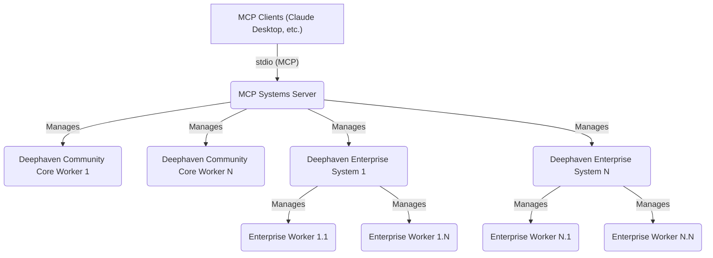
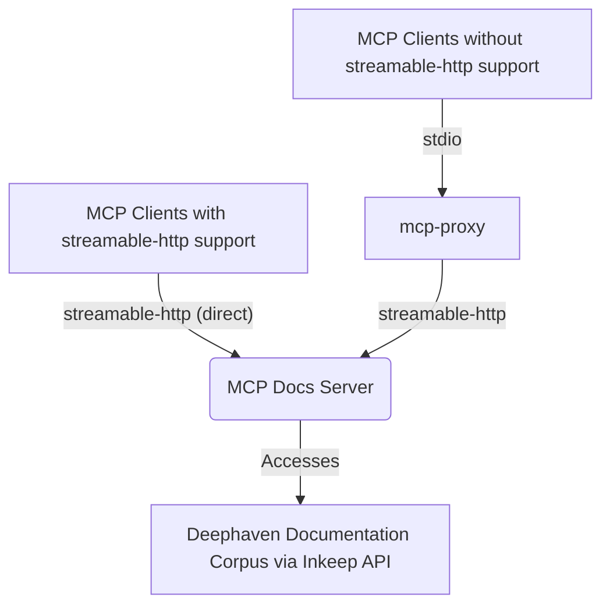

# deephaven-mcp

[](https://pypi.org/project/deephaven-mcp/)
[](https://github.com/deephaven/deephaven-mcp/blob/main/LICENSE)


## Table of Contents

- [Overview](#overview)
- [Prerequisites](#prerequisites)
- [Installation & Initial Setup](#installation--initial-setup)
- [Configuring `deephaven_mcp.json`](#configuring-deephaven_mcpjson)
- [Environment Variables](#environment-variables)
- [Configure Your LLM Tool to Use MCP Servers](#configure-your-llm-tool-to-use-mcp-servers)
  - [Defining MCP Servers](#defining-mcp-servers-for-your-llm-tool-the-mcpservers-json-object)
  - [IDE and AI Assistant Integrations](#ide-and-ai-assistant-integrations)
    - [GitHub Copilot (VS Code)](#github-copilot-in-visual-studio-code)
    - [Cursor IDE](#cursor-ide)
    - [Claude Desktop](#claude-desktop)
    - [Windsurf IDE](#windsurf-ide)
  - [Starting the MCP Servers](#starting-the-mcp-servers)
- [Applying Configuration Changes](#applying-configuration-changes)
- [Troubleshooting](#troubleshooting)
- [Advanced Usage & Further Information](#advanced-usage--further-information)
- [Contributing](#contributing)
- [Community & Support](#community--support)
- [License](#license)

---

## Overview

Deephaven MCP implements the [Model Context Protocol (MCP) standard](https://spec.modelcontextprotocol.io/) to provide tools for orchestrating, inspecting, and interacting with both [Deephaven Community Core](https://deephaven.io/community/) and [Deephaven Enterprise](https://deephaven.io/enterprise/) systems, plus access to conversational documentation via LLM-powered Docs Servers. It's designed for data scientists, engineers, and anyone looking to leverage Deephaven's capabilities through programmatic interfaces or integrated LLM tools.

### Deephaven MCP Components

#### Systems Server
Manages and connects to multiple [Deephaven Community Core](https://deephaven.io/community/) worker nodes and [Deephaven Enterprise](https://deephaven.io/enterprise/) systems. This allows for unified control and interaction with your Deephaven instances from various client applications.

**Key Capabilities:**
*   **Session Management**: List, monitor, and get detailed status of all configured Deephaven sessions
*   **Enterprise Systems**: Connect to and manage Deephaven Enterprise (Core+) deployments
*   **Table Operations**: Retrieve table schemas and metadata from any connected session
*   **Script Execution**: Run Python or Groovy scripts directly on Deephaven sessions
*   **Package Management**: Query installed Python packages in session environments
*   **Configuration Management**: Dynamically reload and refresh session configurations

#### Docs Server
Connects to Deephaven's documentation knowledge base via AI to answer questions about Deephaven features, APIs, and usage patterns. Ask questions in natural language and get specific answers with code examples and explanations.

### Key Use Cases

*   **AI-Assisted Development**: Integrate Deephaven with LLM-powered development tools (e.g., [Claude Desktop](https://www.anthropic.com/claude), [GitHub Copilot](https://github.com/features/copilot)) for AI-assisted data exploration, code generation, and analysis.
*   **Multi-Environment Management**: Programmatically manage and query multiple Deephaven Community and Enterprise deployments from a single interface.
*   **Interactive Documentation**: Quickly find information and examples from Deephaven documentation using natural language queries.
*   **Script Automation**: Execute Python or Groovy scripts across multiple Deephaven sessions for data processing workflows.
*   **Schema Discovery**: Automatically retrieve and analyze table schemas from connected Deephaven instances.
*   **Environment Monitoring**: Monitor session health, package versions, and system status across your Deephaven infrastructure.

### Architecture Diagrams

#### Systems Server Architecture


*Clients connect to the [MCP Systems Server](#systems-server-architecture), which in turn manages and communicates with [Deephaven Community Core](https://deephaven.io/community/) workers and [Deephaven Enterprise](https://deephaven.io/enterprise/) systems.*

#### Docs Server Architecture


*Modern MCP clients can connect directly via streamable-http for optimal performance. Clients without native streamable-http support can use [`mcp-proxy`](https://github.com/modelcontextprotocol/mcp-proxy) to bridge stdio to streamable-http.*

---

## Prerequisites

*   **Python**: Version 3.11 or later. ([Download Python](https://www.python.org/downloads/))
*   **Access to Deephaven systems:** To use the [MCP Systems Server](#systems-server-architecture), you will need one or more of the following:
    *   **[Deephaven Community Core](https://deephaven.io/community/) instance(s):** For development and personal use.
    *   **[Deephaven Enterprise](https://deephaven.io/enterprise/) system(s):** For enterprise-level features and capabilities.
*   **Choose your Python environment setup method:**
    *   **Option A: [`uv`](https://docs.astral.sh/uv/) (Recommended)**: A very fast Python package installer and resolver. If you don't have it, you can install it via `pip install uv` or see the [uv installation guide](https://github.com/astral-sh/uv#installation).
    *   **Option B: Standard Python `venv` and `pip`**: Uses Python's built-in [virtual environment (`venv`)](https://docs.python.org/3/library/venv.html) tools and [`pip`](https://pip.pypa.io/en/stable/getting-started/).
*   **Configuration Files**: Each integration requires proper configuration files (specific locations detailed in each integration section)

---

## Installation & Initial Setup

The recommended way to install `deephaven-mcp` is from PyPI. This provides the latest stable release and is suitable for most users.

### Installing from PyPI (Recommended for Users)

Choose one of the following Python environment and package management tools:

#### Option A: Using `uv` (Fast, Recommended)

1.  **Install `uv` (if not already installed):**
    You can install `uv` using `pip`:
    ```sh
    pip install uv
    ```
    For more information on `uv`, see the official [GitHub project](https://github.com/astral-sh/uv) or the local [`uv` documentation](docs/UV.md).

2.  **Create and activate a virtual environment with your desired Python version:**
    [uv](docs/UV.md) works best when operating within a virtual environment. To create one (e.g., named `.venv`) using a specific Python interpreter (e.g., Python 3.11), run:
    ```sh
    uv venv .venv -p 3.11 
    ```
    Replace `3.11` with your target Python version (e.g., `3.12`) or the full path to a Python executable.
    Then, activate it:
    *   On macOS/Linux: `source .venv/bin/activate`
    *   On Windows (PowerShell): `.venv\Scripts\Activate.ps1`
    *   On Windows (CMD): `.venv\Scripts\activate.bat`

3.  **Install the CorePlus client wheel (Enterprise systems only):**
    If you need Enterprise systems support, the `deephaven-coreplus-client` wheel must be installed first. This wheel is not available on PyPI and must be obtained from your Deephaven Enterprise administrator.
    
    Once you have the wheel file, install it using the provided script:
    ```sh
    ./bin/dev_manage_coreplus_client.sh install-wheel --file /path/to/deephaven_coreplus_client-X.Y.Z-py3-none-any.whl
    ```
    
    Replace `/path/to/deephaven_coreplus_client-X.Y.Z-py3-none-any.whl` with the actual path to the wheel file provided by your administrator. The script handles dependency version conflicts automatically. Skip this step if you only need Community Core support.

3.  **Install `deephaven-mcp`:**
    ```sh
    # For Community Core only
    uv pip install deephaven-mcp
    
    # For Enterprise systems
    uv pip install "deephaven-mcp[coreplus]"
    ```
This command installs `deephaven-mcp` and its dependencies into the virtual environment. Ensure the virtual environment remains active for manual command-line use of `dh-mcp-systems-server` or `dh-mcp-docs-server`, or if your LLM tool requires an active environment.

#### Option B: Using Standard `pip` and `venv`

1.  **Create a virtual environment** (e.g., named `.venv`):
    ```sh
    python -m venv .venv
    ```
2.  **Activate the virtual environment:**
    *   On macOS/Linux:
        ```sh
        source .venv/bin/activate
        ```
    *   On Windows (Command Prompt/PowerShell):
        ```sh
        .venv\Scripts\activate
        ```
3.  **Install the CorePlus client wheel (Enterprise systems only):**
    If you need Enterprise systems support, the `deephaven-coreplus-client` wheel must be installed first. This wheel is not available on PyPI and must be obtained from your Deephaven Enterprise administrator.
    
    Once you have the wheel file, install it using the provided script:
    ```sh
    ./bin/dev_manage_coreplus_client.sh install-wheel --file /path/to/deephaven_coreplus_client-X.Y.Z-py3-none-any.whl
    ```
    
    Replace `/path/to/deephaven_coreplus_client-X.Y.Z-py3-none-any.whl` with the actual path to the wheel file provided by your administrator. The script handles dependency version conflicts automatically. Skip this step if you only need Community Core support.

4.  **Install `deephaven-mcp`** into the activated virtual environment:
    ```sh
    # For Community Core only
    pip install deephaven-mcp
    
    # For Enterprise systems
    pip install "deephaven-mcp[coreplus]"
    ```
    Ensure this virtual environment is active in any terminal session where you intend to run `dh-mcp-systems-server` or `dh-mcp-docs-server` manually, or if your LLM tool requires an active environment when spawning these processes.

---

## Configuring `deephaven_mcp.json`

This section explains how to configure the [Deephaven MCP Systems Server](#systems-server) to connect to and manage your [Deephaven Community Core](https://deephaven.io/community/) instances and [Deephaven Enterprise](https://deephaven.io/enterprise/) systems. This involves creating a [systems session definition file](#the-deephaven_mcpjson-file-defining-your-community-sessions) and understanding how the server locates this file.

### The `deephaven_mcp.json` File

This file tells the MCP Systems Server how to connect to your Deephaven instances. You'll create this file to define your connections to either Community Core workers or Enterprise systems (or both).

The configuration file supports two main sections:
- **`"community"`**: For connecting to Community Core worker instances
- **`"enterprise"`**: For connecting to Enterprise systems

You can include either section, both, or neither (empty file). Each section contains connection details specific to that type of Deephaven system.

### Community Core Configuration

#### Community Examples

**Minimal configuration (no connections):**
```json
{}
```

**Anonymous authentication (simplest):**
```json
{
  "community": {
    "sessions": {
      "my_local_server": {
        "host": "localhost",
        "port": 10000
      }
    }
  }
}
```

**PSK authentication:**
```json
{
  "community": {
    "sessions": {
      "psk_server": {
        "host": "localhost",
        "port": 10000,
        "auth_type": "io.deephaven.authentication.psk.PskAuthenticationHandler",
        "auth_token": "your-shared-secret-key"
      }
    }
  }
}
```

**Basic authentication with environment variable:**
```json
{
  "community": {
    "sessions": {
      "prod_session": {
        "host": "deephaven-prod.example.com",
        "port": 10000,
        "auth_type": "Basic",
        "auth_token_env_var": "DH_AUTH_TOKEN"
      }
    }
  }
}
```

**TLS/SSL configuration:**
```json
{
  "community": {
    "sessions": {
      "secure_tls_session": {
        "host": "secure.deephaven.example.com",
        "port": 443,
        "use_tls": true,
        "tls_root_certs": "/path/to/ca.pem",
        "client_cert_chain": "/path/to/client-cert.pem",
        "client_private_key": "/path/to/client-key.pem"
      }
    }
  }
}
```

#### Community Configuration Fields

*All community session fields are optional. Default values are applied by the server if a field is omitted.*

| Field | Type | Required When | Description |
|-------|------|---------------|-------------|
| `host` | string | Optional | Hostname or IP address of the Deephaven Community Core worker (e.g., `"localhost"`) |
| `port` | integer | Optional | Port number for the worker connection (e.g., `10000`) |
| `auth_type` | string | Optional | Authentication type: `"Anonymous"` (default), `"Basic"`, or custom authenticator strings |
| `auth_token` | string | Optional | Authentication token. For `"Basic"` auth: `"username:password"` format. Mutually exclusive with `auth_token_env_var` |
| `auth_token_env_var` | string | Optional | Environment variable name containing the auth token (e.g., `"MY_AUTH_TOKEN"`). More secure than hardcoding tokens |
| `never_timeout` | boolean | Optional | If `true`, attempts to configure the session to never time out |
| `session_type` | string | Optional | Type of session to create: `"groovy"` or `"python"` |
| `use_tls` | boolean | Optional | Set to `true` if the connection requires TLS/SSL |
| `tls_root_certs` | string | Optional | Absolute path to PEM file with trusted root CA certificates for TLS verification |
| `client_cert_chain` | string | Optional | Absolute path to PEM file with client's TLS certificate chain (for mTLS) |
| `client_private_key` | string | Optional | Absolute path to PEM file with client's private key (for mTLS) |

### Enterprise System Configuration

#### Enterprise Examples

**Basic enterprise connection:**
```json
{
  "enterprise": {
    "systems": {
      "my_enterprise_system": {
        "connection_json_url": "https://my-enterprise.example.com/iris/connection.json",
        "auth_type": "password",
        "username": "admin",
        "password_env_var": "DH_ENTERPRISE_PASSWORD"
      }
    }
  }
}
```

**Private key authentication:**
```json
{
  "enterprise": {
    "systems": {
      "saml_enterprise": {
        "connection_json_url": "https://enterprise.example.com/iris/connection.json",
        "auth_type": "private_key",
        "private_key_path": "/path/to/your/private_key.pem"
      }
    }
  }
}
```

#### Enterprise Configuration Fields

The `enterprise` key contains a `"systems"` dictionary mapping custom system names to their configuration objects.

| Field | Type | Required When | Description |
|-------|------|---------------|-------------|
| `connection_json_url` | string | Always | URL to the Enterprise server's `connection.json` file (e.g., `"https://enterprise.example.com/iris/connection.json"`) |
| `auth_type` | string | Always | Authentication method: `"password"` for username/password auth, or `"private_key"` for private key-based auth (e.g., SAML) |
| `username` | string | `auth_type` = `"password"` | Username for authentication |
| `password` | string | `auth_type` = `"password"` | Password (use `password_env_var` instead for security) |
| `password_env_var` | string | `auth_type` = `"password"` | Environment variable containing the password (recommended) |
| `private_key_path` | string | `auth_type` = `"private_key"` | Absolute path to private key file |

> **📝 Note**: All file paths should be absolute and accessible by the MCP server process.

### Combined Configuration Example

Here's a complete example showing both Community and Enterprise configurations:

```json
{
  "community": {
    "sessions": {
      "my_local_deephaven": {
        "host": "localhost",
        "port": 10000,
        "session_type": "python"
      },
      "psk_authenticated_session": {
        "host": "localhost",
        "port": 10001,
        "auth_type": "io.deephaven.authentication.psk.PskAuthenticationHandler",
        "auth_token": "your-shared-secret-key",
        "session_type": "python"
      },
      "basic_auth_session": {
        "host": "secure.deephaven.example.com",
        "port": 10002,
        "auth_type": "Basic",
        "auth_token": "username:password",
        "use_tls": true,
        "tls_root_certs": "/path/to/community_root.crt"
      }
    }
  },
  "enterprise": {
    "systems": {
      "prod_cluster": {
        "connection_json_url": "https://prod.enterprise.example.com/iris/connection.json",
        "auth_type": "password",
        "username": "your_username",
        "password_env_var": "ENTERPRISE_PASSWORD"
      },
      "data_science_env": {
        "connection_json_url": "https://data-science.enterprise.example.com/iris/connection.json",
        "auth_type": "private_key",
        "private_key_path": "/path/to/your/private_key.pem"
      }
    }
  }
}
```


### Security Note

> **⚠️ Security Warning**: The `deephaven_mcp.json` file can contain sensitive information such as authentication tokens, usernames, and passwords. Ensure that this file is protected with appropriate filesystem permissions to prevent unauthorized access.
>
> For example, on Unix-like systems (Linux, macOS), you can restrict permissions to the owner only:
> ```bash
> chmod 600 /path/to/your/deephaven_mcp.json
> ```

### Setting `DH_MCP_CONFIG_FILE` (Informing the MCP Server)

The `DH_MCP_CONFIG_FILE` environment variable tells the [Deephaven MCP Systems Server](#systems-server) where to find your `deephaven_mcp.json` file (detailed in [The `deephaven_mcp.json` File (Defining Your Community Sessions)](#the-deephaven_mcp.json-file-defining-your-community-sessions)). You will set this environment variable as part of the server launch configuration within your LLM tool, as detailed in the [Configure Your LLM Tool to Use MCP Servers](#configure-your-llm-tool-to-use-mcp-servers) section. 

When launched by an LLM tool, the [MCP Systems Server](#systems-server-architecture) process reads this variable to load your session definitions. For general troubleshooting or if you need to set other environment variables like `PYTHONLOGLEVEL` (e.g., to `DEBUG` for verbose logs), these are also typically set within the LLM tool's MCP server configuration (see [Defining MCP Servers for Your LLM Tool (The `mcpServers` JSON Object)](#defining-mcp-servers-for-your-llm-tool-the-mcpservers-json-object)).

---

## Environment Variables

The following environment variables can be used to configure the behavior of the Deephaven MCP Systems Server.

> **⚠️ Security Warning**: Environment variables containing sensitive information like API keys and authentication tokens should be handled securely and never committed to version control.


### Core Configuration

* **`DH_MCP_CONFIG_FILE`**: Path to your `deephaven_mcp.json` configuration file
  * Example: `DH_MCP_CONFIG_FILE=/path/to/your/deephaven_mcp.json`
  * Default: Looks for `deephaven_mcp.json` in the current directory

* **`PORT`**: Port number for the MCP server
  * Example: `PORT=8000`
  * Default: `8000`

### Authentication

* **Environment variables for `auth_token_env_var`**: Any environment variable specified in your `deephaven_mcp.json` configuration's `auth_token_env_var` field will be used to source authentication tokens
  * Example: If config specifies `"auth_token_env_var": "MY_AUTH_TOKEN"`, then `MY_AUTH_TOKEN=username:password`
  * Note: This is a more secure alternative to hardcoding tokens in configuration files

### Debugging and Logging

* **`PYTHONLOGLEVEL`**: Controls the verbosity of logging output
  * Values: `DEBUG`, `INFO`, `WARNING`, `ERROR`
  * Example: `PYTHONLOGLEVEL=DEBUG`
  * Default: `INFO`


---

## Configure Your LLM Tool to Use MCP Servers

This section details how to configure your LLM tool (e.g., [Claude Desktop](https://www.anthropic.com/claude), [GitHub Copilot](https://github.com/features/copilot)) to launch and communicate with the [Deephaven MCP Systems Server](#systems-server) and the [Deephaven MCP Docs Server](#docs-server). This involves providing a JSON configuration, known as the [`"mcpServers"` object](#defining-mcp-servers-for-your-llm-tool-the-mcpservers-json-object), to your LLM tool.

### How LLM Tools Launch MCP Servers (Overview)

LLM tools that support the Model Context Protocol (MCP) can be configured to use the Deephaven MCP Community and Docs Servers. The LLM tool's configuration will typically define how to *start* the necessary MCP server processes.

### Understanding Deephaven Core Worker Status (via MCP)

The [MCP Systems Server](#systems-server-architecture), launched by your LLM tool, will attempt to connect to the [Deephaven Community Core](https://deephaven.io/community/) instances defined in your `deephaven_mcp.json` file (pointed to by `DH_MCP_CONFIG_FILE` as described in [Setting `DH_MCP_CONFIG_FILE` (Informing the MCP Server)](#setting-dh_mcp_config_file-informing-the-mcp-server)).

It's important to understand the following:
*   **MCP Server Independence**: The [MCP Systems Server](#systems-server-architecture) itself will start and be available to your LLM tool even if some or all configured [Deephaven Community Core](https://deephaven.io/community/) workers are not currently running or accessible. The LLM tool will be able to list the configured workers and see their status (e.g., unavailable, connected).
*   **Worker Interaction**: To successfully perform operations on a specific [Deephaven Community Core](https://deephaven.io/community/) worker (e.g., list tables, execute scripts), that particular worker must be running and network-accessible from the environment where the [MCP Systems Server](#systems-server-architecture) process is executing.
*   **Configuration is Key**: Ensure your `deephaven_mcp.json` file accurately lists the systems session configurations you intend to use. The MCP server uses this configuration to know which sessions to attempt to manage.

### Defining MCP Servers for Your LLM Tool (The `mcpServers` JSON Object)

Your LLM tool requires a specific JSON configuration to define how MCP servers are launched. This configuration is structured as a JSON object with a top-level key named `"mcpServers"`. This `"mcpServers"` object tells the tool how to start the [Deephaven MCP Systems Server](#systems-server) (for interacting with [Deephaven Community Core](https://deephaven.io/community/)) and the `mcp-proxy` (for interacting with the [Docs Server](#docs-server)).

Depending on your LLM tool, this `"mcpServers"` object might be:
*   The entire content of a dedicated file (e.g., named `mcp.json` in VS Code).
*   A part of a larger JSON configuration file used by the tool (e.g., for [Claude Desktop](https://www.anthropic.com/claude)).

Consult your LLM tool's documentation for the precise file name and location. Below are two examples of the `"mcpServers"` JSON structure. Choose the one that matches your Python environment setup (either [`uv`](docs/UV.md) or `pip + venv`).

> **⚙️ Important**: All paths in the JSON examples (e.g., `/full/path/to/...`) must be replaced with actual, absolute paths on your system.

#### Example `"mcpServers"` object for `uv` users:

```json
{
  "mcpServers": {
    "deephaven-systems": {
      "command": "uv",
      "args": [
        "--directory",
        "/full/path/to/deephaven-mcp",
        "run",
        "dh-mcp-systems-server"
      ],
      "env": {
        "DH_MCP_CONFIG_FILE": "/full/path/to/your/deephaven_mcp.json",
        "PYTHONLOGLEVEL": "INFO" 
      }
    },
    "deephaven-docs": {
      "command": "uv",
      "args": [
        "--directory",
        "/full/path/to/deephaven-mcp",
        "run",
        "mcp-proxy",
        "--transport=streamablehttp",
        "https://deephaven-mcp-docs-prod.dhc-demo.deephaven.io/mcp"
      ]
    }
  }
}
```
> **📝 Note**: You can change `"PYTHONLOGLEVEL": "INFO"` to `"PYTHONLOGLEVEL": "DEBUG"` for more detailed server logs, as further detailed in the [Troubleshooting section](#troubleshooting).

#### Example `"mcpServers"` object for `pip + venv` users:

```json
{
  "mcpServers": {
    "deephaven-systems": {
      "command": "/full/path/to/your/deephaven-mcp/.venv/bin/dh-mcp-systems-server",
      "args": [], 
      "env": {
        "DH_MCP_CONFIG_FILE": "/full/path/to/your/deephaven_mcp.json",
        "PYTHONLOGLEVEL": "INFO"
      }
    },
    "deephaven-docs": {
      "command": "/full/path/to/your/deephaven-mcp/.venv/bin/mcp-proxy",
      "args": [
        "--transport=streamablehttp",
        "https://deephaven-mcp-docs-prod.dhc-demo.deephaven.io/mcp"
      ]
    }
  }
}
```
> **📝 Note**: You can change `"PYTHONLOGLEVEL": "INFO"` to `"PYTHONLOGLEVEL": "DEBUG"` for more detailed server logs, as further detailed in the [Troubleshooting section](#troubleshooting).

### IDE and AI Assistant Integrations

This section covers how to integrate Deephaven MCP with various IDE environments and AI coding assistants. Each integration requires specific configuration steps and file locations.

The following sections provide specific integration steps for each supported IDE and AI assistant platform. After configuration, see the [Developer & Contributor Guide](docs/DEVELOPER_GUIDE.md) for detailed documentation on using MCP tools.

### GitHub Copilot in Visual Studio Code

[GitHub Copilot](https://github.com/features/copilot) in [Visual Studio Code](https://code.visualstudio.com/) supports MCP servers for enhanced development workflows with AI-assisted data exploration and Deephaven integration.

#### Configuration File Location

For VS Code with GitHub Copilot, the MCP configuration should be placed at:
- **File path**: `.vscode/mcp.json` in your project's root directory

#### Setting up MCP Configuration for VS Code

1. **Create the MCP configuration file:**
   In your project's root directory, create or edit `.vscode/mcp.json`:

   ```json
   {
     "deephaven-systems": {
       "command": "uv",
       "args": [
         "--directory",
         "/full/path/to/deephaven-mcp",
         "run",
         "dh-mcp-systems-server"
       ],
       "env": {
         "DH_MCP_CONFIG_FILE": "/full/path/to/your/deephaven_mcp.json",
         "PYTHONLOGLEVEL": "INFO"
       }
     },
     "deephaven-docs": {
       "command": "uv",
       "args": [
         "--directory",
         "/full/path/to/deephaven-mcp",
         "run",
         "mcp-proxy",
         "--transport=streamablehttp",
         "https://deephaven-mcp-docs-prod.dhc-demo.deephaven.io/mcp"
       ]
     }
   }
   ```

2. **Enable MCP in VS Code settings:**
   Create or edit `.vscode/settings.json` in your project:

   ```json
   {
     "github.copilot.enable": {
       "*": true
     },
     "github.copilot.experimental.mcp.enabled": true
   }
   ```

3. **Replace the placeholder paths:**
   - `/full/path/to/deephaven-mcp`: Replace with the absolute path to your deephaven-mcp project directory
   - `/full/path/to/your/deephaven_mcp.json`: Replace with the absolute path to your Deephaven configuration file


#### Prerequisites for VS Code Setup

- **VS Code Version**: Ensure you have the latest version of Visual Studio Code
- **GitHub Copilot Extension**: Install and configure the GitHub Copilot extension

Additionally, ensure you meet all the requirements listed in the [Prerequisites](#prerequisites) section.

#### Using Deephaven MCP with GitHub Copilot

Once configured, you can interact with Deephaven through GitHub Copilot Chat. For detailed documentation on MCP tools, refer to the [Developer & Contributor Guide](docs/DEVELOPER_GUIDE.md).

#### VS Code-Specific Troubleshooting

- **MCP servers not starting**: Check the VS Code Output panel for MCP server logs
- **Configuration not detected**: Ensure `.vscode/mcp.json` exists in your project root
- **Permission errors**: Verify all file paths are absolute and accessible
- **GitHub Copilot not responding to MCP**: Restart VS Code and ensure the experimental MCP feature is enabled
- **Deephaven connection issues**: Verify your Deephaven instance is running on the configured host:port
- **Environment variable errors**: Check that `DH_MCP_CONFIG_FILE` points to a valid JSON file

**Debug Mode:**
To enable debug logging, change `"PYTHONLOGLEVEL": "INFO"` to `"PYTHONLOGLEVEL": "DEBUG"` in your MCP configuration.


### Windsurf IDE

[Windsurf](https://codeium.com/windsurf) is an AI-powered IDE that supports MCP servers for enhanced development workflows. Here's how to set up the integration:

#### Configuration File Location

For Windsurf IDE, the MCP configuration should be placed at:
- **File path**: `~/.codeium/windsurf/mcp_config.json`

#### Setting up MCP Configuration for Windsurf

1. **Create the MCP configuration file:**
   Create or edit `~/.codeium/windsurf/mcp_config.json` with the following structure:

   ```json
   {
     "mcpServers": {
       "deephaven-systems": {
         "command": "uv",
         "args": [
           "--directory",
           "/full/path/to/deephaven-mcp",
           "run",
           "dh-mcp-systems-server"
         ],
         "env": {
           "DH_MCP_CONFIG_FILE": "/full/path/to/your/deephaven_mcp.json",
           "PORT": "8000",
           "PYTHONLOGLEVEL": "INFO"
         }
       },
       "deephaven-docs": {
         "command": "uv",
         "args": [
           "--directory",
           "/full/path/to/deephaven-mcp",
           "run",
           "dh-mcp-docs-server"
         ],
         "env": {
           "DH_MCP_CONFIG_FILE": "/full/path/to/your/deephaven_mcp.json",
           "PORT": "8001"
         }
       }
     }
   }
   ```

2. **Replace the placeholder paths:**
   - `/full/path/to/deephaven-mcp`: Replace with the absolute path to your deephaven-mcp project directory
   - `/full/path/to/your/deephaven_mcp.json`: Replace with the absolute path to your Deephaven configuration file

#### Development Mode Setup

For development work on the Deephaven MCP server itself, follow these additional steps:

1. **Create and activate virtual environment with uv:**
   ```bash
   cd /path/to/deephaven-mcp
   uv venv .venv
   source .venv/bin/activate  # On macOS/Linux
   # or .venv\Scripts\activate on Windows
   ```

2. **Install dependencies and project in editable mode:**
   ```bash
   uv pip install .[dev]
   ```
   This ensures that code changes are immediately reflected without reinstalling the package.

3. **Manual server startup for testing:**
   ```bash
   cd /path/to/deephaven-mcp
   INKEEP_API_KEY=your_api_key_here DH_MCP_CONFIG_FILE=.vscode/deephaven_mcp.json PORT=8000 uv run dh-mcp-systems-server
   ```

   Or using the module directly:
   ```bash
   INKEEP_API_KEY=your_api_key_here DH_MCP_CONFIG_FILE=.vscode/deephaven_mcp.json PORT=8000 uv run python -m deephaven_mcp.mcp_systems_server.main --transport sse
   ```


### Cursor IDE

Cursor IDE supports MCP servers for enhanced development workflows with AI-assisted data exploration and Deephaven integration.

#### Configuration File Location

For Cursor IDE, the MCP configuration should be placed at:
- **File path**: `~/.cursor/mcp.json` 

#### Setting up MCP Configuration for Cursor IDE

1. **Create the MCP configuration file:**
   Create or edit `~/.cursor/mcp.json` (create this file if it doesn't exist):

```json
{
  "mcpServers": {
    "deephaven-systems": {
      "command": "uv",
      "args": [
        "--directory",
        "/full/path/to/deephaven-mcp",
        "run",
        "dh-mcp-systems-server"
      ],
      "env": {
        "DH_MCP_CONFIG_FILE": "<PATH_TO_DEEPHAVEN_MCP>/deephaven_mcp.json",
        "PYTHONLOGLEVEL": "INFO"
      }
    },
    "deephaven-docs": {
      "command": "uv",
      "args": [
        "--directory",
        "/full/path/to/deephaven-mcp",
        "run",
        "mcp-proxy",
        "--transport=streamablehttp",
        "https://deephaven-mcp-docs-prod.dhc-demo.deephaven.io/mcp"
      ]
    }
  }
}
```

#### Important Setup Notes for Cursor

* **Virtual Environment**: Must use `uv venv .venv -p 3.11` or `python3.11 -m venv .venv`
* **Configuration File**: Must exist at project root: `deephaven_mcp.json`
* **Restart Required**: After creating/updating MCP configuration, completely restart Cursor

Additionally, ensure you meet all the requirements listed in the [Prerequisites](#prerequisites) section.

#### Quick Setup Commands for Cursor

```bash
# 1. Create virtual environment with correct Python version
cd /path/to/your/project
uv venv .venv -p 3.11
source .venv/bin/activate

# 2. Install deephaven-mcp
uv pip install deephaven-mcp

# 3. Create basic configuration file
echo '{"community": {"sessions": {}}}' > deephaven_mcp.json

# 4. Create Cursor MCP config (update paths!)
mkdir -p ~/.cursor
# Then edit ~/.cursor/mcp.json with the configuration above

# 5. Restart Cursor completely
```

#### Testing Your Setup

* Both servers should show green dots in Cursor's MCP interface
* Systems server should show "7 tools enabled"
* Docs server should show available tools
* If you see red dots, check the troubleshooting section below

#### Cursor-Specific Troubleshooting

* **Red dots/Loading tools**: Verify all paths are absolute and correct
* **Python version errors**: Ensure you're using Python 3.11+ (not 3.10)
* **Configuration file not found**: Check that `deephaven_mcp.json` exists at project root
* **External docs server 404**: The external docs server URL may be down; consider using local docs server instead
* **Permission errors**: Run `chmod 600 deephaven_mcp.json` to set proper permissions


### Claude Desktop

Claude Desktop supports MCP servers for enhanced development workflows with AI-assisted data exploration and Deephaven integration.

#### Configuration File Location

For Claude Desktop, the MCP configuration should be placed at:
- **macOS**: `~/Library/Application Support/Claude/claude_desktop_config.json`
- **Windows**: `%APPDATA%\Claude\claude_desktop_config.json` (e.g., `C:\Users\<YourUsername>\AppData\Roaming\Claude\claude_desktop_config.json`)
- **Linux**: `~/.config/Claude/claude_desktop_config.json`

#### Setting up MCP Configuration for Claude Desktop

1. **Open Configuration:**
   Open Claude Desktop → Settings → Developer → Edit Config

2. **Add MCP Server Configuration:**
   Replace the paths below with your actual absolute paths on your system:

```json
{
  "mcpServers": {
    "deephaven-systems": {
      "command": "/FULL/PATH/TO/uv",
      "args": [
        "--directory",
        "/FULL/PATH/TO/deephaven-mcp",
        "run",
        "dh-mcp-systems-server"
      ],
      "env": {
        "DH_MCP_CONFIG_FILE": "/FULL/PATH/TO/deephaven_mcp.json",
        "PYTHONLOGLEVEL": "INFO"
      }
    },
    "deephaven-docs": {
      "command": "/FULL/PATH/TO/uv",
      "args": [
        "--directory",
        "/FULL/PATH/TO/deephaven-mcp",
        "run",
        "mcp-proxy",
        "--transport=streamablehttp",
        "https://deephaven-mcp-docs-prod.dhc-demo.deephaven.io/mcp"
      ]
    }
  }
}
```

#### Restart Claude Desktop
Completely quit and restart Claude Desktop. Wait 30-60 seconds for initialization.

#### Example Configurations

##### macOS
```json
{
  "mcpServers": {
    "deephaven-systems": {
      "command": "/opt/homebrew/bin/uv",
      "args": [
        "--directory",
        "/Users/johndoe/projects/deephaven-mcp",
        "run",
        "dh-mcp-systems-server"
      ],
      "env": {
        "DH_MCP_CONFIG_FILE": "/full/path/to/deephaven-mcp/deephaven_mcp.json",
        "PYTHONLOGLEVEL": "INFO"
      }
    },
    "deephaven-docs": {
      "command": "/opt/homebrew/bin/uv",
      "args": [
        "--directory",
        "/Users/johndoe/projects/deephaven-mcp",
        "run",
        "mcp-proxy",
        "--transport=streamablehttp",
        "https://deephaven-mcp-docs-prod.dhc-demo.deephaven.io/mcp"
      ]
    }
  }
}
```

   **For Windows Users:**
   ```json
   {
     "mcpServers": {
       "deephaven-systems": {
         "command": "C:\\Users\\johndoe\\.cargo\\bin\\uv.exe",
         "args": [
           "--directory",
           "C:\\Users\\johndoe\\projects\\deephaven-mcp",
           "run",
           "dh-mcp-systems-server"
         ],
         "env": {
           "DH_MCP_CONFIG_FILE": "C:\\Users\\johndoe\\projects\\deephaven-mcp\\deephaven_mcp.json",
           "PYTHONLOGLEVEL": "INFO"
         }
       },
       "deephaven-docs": {
         "command": "C:\\Users\\johndoe\\.cargo\\bin\\uv.exe",
         "args": [
           "--directory",
           "C:\\Users\\johndoe\\projects\\deephaven-mcp",
           "run",
           "mcp-proxy",
           "--transport=streamablehttp",
           "https://deephaven-mcp-docs-prod.dhc-demo.deephaven.io/mcp"
         ]
       }
     }
   }
   ```

3. **Testing Your Setup:**

   Test the configuration by asking Claude:
   ```
   Are the Deephaven MCP servers working? Can you list any available sessions?
   ```

   Claude should connect to both servers and respond with information about Deephaven capabilities and available sessions.


---

## Applying Configuration Changes

After creating or modifying your MCP configuration, you must restart your IDE or AI assistant for the changes to take effect.

### Restart and Verify

1. **Restart your tool** completely (Claude Desktop, VS Code, Cursor, etc.)
2. **Check MCP server status** in your tool's interface - you should see `deephaven-systems` and `deephaven-docs` listed
3. **Test the connection** by asking your AI assistant:
   ```
   Are the Deephaven MCP servers working? Can you list any available sessions?
   ```
   Your AI assistant should connect to both servers and respond with information about Deephaven capabilities and available sessions.

If the servers don't appear or you encounter errors, see the [Troubleshooting](#troubleshooting) section.

---

## Troubleshooting

This section provides comprehensive guidance for diagnosing and resolving common issues with Deephaven MCP setup and operation. Issues are organized by category, starting with the most frequently encountered problems.

### Quick Fixes

Before diving into detailed troubleshooting, try these common solutions:

1. **Restart your IDE/AI assistant** after any configuration changes
2. **Check that all file paths are absolute** in your JSON configurations
3. **Verify your virtual environment is activated** when running commands
4. **Validate JSON syntax** using [jsonlint.com](https://jsonlint.com/) or your IDE's JSON validator

### Common Error Messages

| Error | Where You'll See This | Solution |
|-------|----------------------|----------|
| `spawn uv ENOENT` | IDE/AI assistant logs | Use full path to [`uv`](docs/UV.md) |
| `Connection failed` | MCP server logs | Check internet connection and server URLs |
| `Config not found` | MCP server startup | Verify full path to `deephaven_mcp.json` |
| `Permission denied` | Command execution | Ensure [`uv`](docs/UV.md) executable has proper permissions |
| `Python version error` | Virtual environment | Verify supported Python version is installed and accessible |
| `JSON parse error` | IDE/AI assistant logs | Fix JSON syntax errors in configuration files |
| `Module not found: deephaven_mcp` | MCP server logs | Ensure virtual environment is activated and dependencies installed |
| `Port already in use` | Server startup logs | Change `PORT` environment variable or kill conflicting process |
| `Invalid session_id format` | MCP tool responses | Use format: `{type}:{source}:{session_name}` |

### JSON Configuration Issues

**Most configuration problems stem from JSON syntax errors or incorrect paths:**

* **Invalid JSON Syntax:**
  * Missing or extra commas, brackets, or quotes
  * Use [JSON validator](https://jsonlint.com/) to check syntax
  * Common mistake: trailing comma in last object property

* **Incorrect File Paths:**
  * All paths in JSON configurations must be **absolute paths**
  * Use forward slashes `/` even on Windows in JSON
  * Verify files exist at the specified paths

* **Environment Variable Issues:**
  * `DH_MCP_CONFIG_FILE` must point to valid `deephaven_mcp.json` file
  * Environment variables in `env` block must use correct names
  * Sensitive values should use environment variables, not hardcoded strings

### LLM Tool Connection Issues

* **LLM Tool Can't Connect / Server Not Found:**
  * Verify all paths in your LLM tool's JSON configuration are **absolute and correct**
  * Ensure `DH_MCP_CONFIG_FILE` environment variable is correctly set in the JSON config and points to a valid worker file
  * Ensure any [Deephaven Community Core](https://deephaven.io/community/) workers you intend to use (as defined in `deephaven_mcp.json`) are running and accessible from the [MCP Systems Server](#systems-server-architecture)'s environment
  * Check for typos in server names, commands, or arguments in the JSON config
  * Validate the syntax of your JSON configurations (`mcpServers` object in the LLM tool, and `deephaven_mcp.json`) using a [JSON validator tool](https://jsonlint.com/) or your IDE's linting features
  * Set `PYTHONLOGLEVEL=DEBUG` in the `env` block of your JSON config to get more detailed logs from the MCP servers

### Network and Firewall Issues

* **Firewall or Network Issues:**
  * Ensure that there are no firewall rules (local or network) preventing:
    * The [MCP Systems Server](#systems-server-architecture) from connecting to your [Deephaven Community Core](https://deephaven.io/community/) instances on their specified hosts and ports.
    * Your LLM tool or client from connecting to the `mcp-proxy`'s target URL (`https://deephaven-mcp-docs-prod.dhc-demo.deephaven.io`) if using the [Docs Server](#docs-server).
  * Test basic network connectivity (e.g., using [`ping`](https://en.wikipedia.org/wiki/Ping_(networking_utility)) or [`curl`](https://curl.se/docs/manpage.html) from the relevant machine) if connections are failing.

### Command and Path Issues

* **`command not found` for [`uv`](docs/UV.md) (in LLM tool logs):**
  * Ensure [`uv`](docs/UV.md) is installed and its installation directory is in your system's `PATH` environment variable, accessible by the LLM tool.
* **`command not found` for `dh-mcp-systems-server` or [`mcp-proxy`](https://github.com/modelcontextprotocol/mcp-proxy) (venv option in LLM tool logs):**
  * Double-check that the `command` field in your JSON config uses the **correct absolute path** to the executable within your `.venv/bin/` (or `.venv\Scripts\`) directory.

### Virtual Environment and Dependency Issues

* **Virtual Environment Not Activated:**
  * Symptoms: `Module not found` errors, `command not found` for installed packages
  * Solution: Activate your virtual environment before running commands
  * Verify: Check that your prompt shows the environment name in parentheses

* **Dependency Installation Problems:**
  * **Missing Dependencies:** Run `uv pip install -e ".[dev]"` in your virtual environment
  * **Version Conflicts:** Check for conflicting package versions in your environment
  * **Platform-Specific Issues:** Some packages may require platform-specific compilation

* **Python Version Compatibility:**
  * Deephaven MCP requires Python 3.8 or higher
  * Check your Python version: `python --version`
  * Ensure your virtual environment uses the correct Python version

### Server and Environment Issues

* **Port Conflicts:**
  * **Symptom:** Server fails to start with "port already in use" error
  * **Solution:** Change `PORT` environment variable or kill conflicting process
  * **Default ports:** 8000 (streamable-http), check your specific configuration

* **Server Startup Failures:**
  * **Python Errors:** Check server logs for Python tracebacks and ensure dependencies are installed correctly
  * **Permission Issues:** Ensure the MCP server process has necessary file and network permissions
  * **Path Issues:** Verify all executable paths in configuration are correct and accessible

* **Runtime Issues:**
  * **Coroutine errors:** Restart the MCP server after making code changes
  * **Memory issues:** Monitor server resource usage, especially with large datasets
  * **Cache issues:** Clear Python cache files if experiencing persistent issues:
    ```bash
    find . -name "*.pyc" -delete
    ```

* **uv-Specific Issues:**
  * **Command failures:** Ensure `uv` is installed and `pyproject.toml` is properly configured
  * **Path issues:** Verify `uv` is in your system's `PATH` environment variable
  * **Project detection:** Run `uv` commands from the project root directory

### Deephaven Session Configuration Issues

* **Session Connection Failures:**
  * Verify your `deephaven_mcp.json` file syntax and content (see [configuration guide](#the-deephaven_mcpjson-file-defining-your-community-sessions))
  * Ensure target [Deephaven Community Core](https://deephaven.io/community/) instances are running and network-accessible
  * Check that the MCP Systems Server process has read permissions for the configuration file

* **Session ID Format Issues:**
  * Use the correct format: `{type}:{source}:{session_name}`
  * Examples: `community:local_dev:my_session`, `enterprise:staging:analytics`
  * Avoid special characters or spaces in session names

* **Authentication Problems:**
  * **Community sessions:** Verify connection URLs and any required authentication
  * **Enterprise sessions:** Check authentication tokens and certificate paths
  * **Environment variables:** Ensure sensitive credentials are properly set

### Platform-Specific Issues

* **Windows-Specific:**
  * Use forward slashes `/` in JSON file paths, even on Windows
  * Executable paths should point to `.venv\Scripts\` instead of `.venv/bin/`
  * PowerShell execution policy may block script execution

* **macOS-Specific:**
  * Gatekeeper may block unsigned executables
  * File permissions may need adjustment: `chmod +x /path/to/executable`
  * Network security settings may block connections

* **Linux-Specific:**
  * Check firewall settings: `ufw status` or `iptables -L`
  * Verify user permissions for network binding
  * SELinux policies may restrict server operations

### Log Analysis and Debugging

**Log File Locations:**

* **Claude Desktop (macOS):** `~/Library/Logs/Claude/mcp-server-*.log`
* **VS Code/Copilot:** Check VS Code's Output panel and Developer Console
* **Cursor IDE:** Check the IDE's log panel and developer tools
* **Windsurf IDE:** Check the IDE's integrated terminal and log outputs

**What to Look For in Logs:**

* **Startup errors:** Python tracebacks, missing modules, permission denied
* **Connection errors:** Network timeouts, refused connections, DNS resolution failures
* **Configuration errors:** JSON parsing errors, invalid paths, missing environment variables
* **Runtime errors:** Unexpected exceptions, resource exhaustion, timeout errors

**Enabling Debug Logging:**

Set `PYTHONLOGLEVEL=DEBUG` in your MCP server configuration's `env` block for detailed logging:

```json
{
  "mcpServers": {
    "deephaven-systems": {
      "command": "/path/to/dh-mcp-systems-server",
      "env": {
        "DH_MCP_CONFIG_FILE": "/path/to/deephaven_mcp.json",
        "PYTHONLOGLEVEL": "DEBUG"
      }
    }
  }
}
```

### When to Seek Help

If you've tried the above solutions and are still experiencing issues:

1. **Gather Information:**
   * Error messages from logs
   * Your configuration files (remove sensitive information)
   * System information (OS, Python version, package versions)
   * Steps to reproduce the issue

2. **Check Documentation:**
   * Review the [Developer Guide](docs/DEVELOPER_GUIDE.md) for advanced troubleshooting
   * Check the [GitHub Issues](https://github.com/deephaven/deephaven-mcp/issues) for similar problems

3. **Community Support:**
   * Post in [Deephaven Community Slack](https://deephaven.io/slack)
   * Create a GitHub issue with detailed information
   * Check [Deephaven Community Forums](https://github.com/deephaven/deephaven-core/discussions)

### IDE and AI Assistant Troubleshooting

For IDE and AI assistant troubleshooting, refer to the troubleshooting sections in each integration guide:

* [GitHub Copilot in Visual Studio Code](#github-copilot-in-visual-studio-code)
* [Cursor IDE](#cursor-ide) - See Cursor-Specific Troubleshooting
* [Claude Desktop](#claude-desktop) - See Claude Desktop-Specific Troubleshooting

---

## Advanced Usage & Further Information

*   **Detailed Server APIs and Tools:** For in-depth information about the tools exposed by the [Systems Server](#systems-server) (e.g., [`refresh`](docs/DEVELOPER_GUIDE.md#refresh), [`table_schemas`](docs/DEVELOPER_GUIDE.md#table_schemas)) and the [Docs Server](#docs-server) ([`docs_chat`](docs/DEVELOPER_GUIDE.md#docs_chat)), refer to the [Developer & Contributor Guide](docs/DEVELOPER_GUIDE.md).
*   **`uv` Workflow:** For more details on using `uv` for project management, see [docs/UV.md](docs/UV.md).

---
## Contributing

We warmly welcome contributions to Deephaven MCP! Whether it's bug reports, feature suggestions, documentation improvements, or code contributions, your help is valued.

*   **Reporting Issues:** Please use the [GitHub Issues](https://github.com/deephaven/deephaven-mcp/issues) tracker.
*   **Development Guidelines:** For details on setting up your development environment, coding standards, running tests, and the pull request process, please see our [Developer & Contributor Guide](docs/DEVELOPER_GUIDE.md).

---

## Community & Support

*   **GitHub Issues:** For bug reports and feature requests: [https://github.com/deephaven/deephaven-mcp/issues](https://github.com/deephaven/deephaven-mcp/issues)
*   **Deephaven Community Slack:** Join the conversation and ask questions: [https://deephaven.io/slack](https://deephaven.io/slack)

---

## License

This project is licensed under the [Apache 2.0 License](./LICENSE). See the [LICENSE](./LICENSE) file for details.
