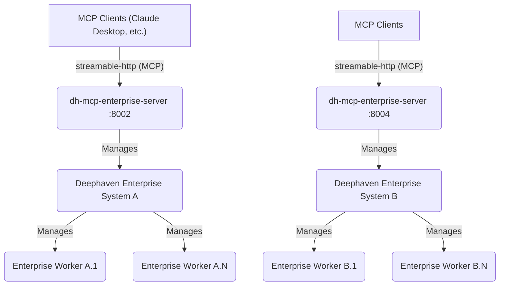
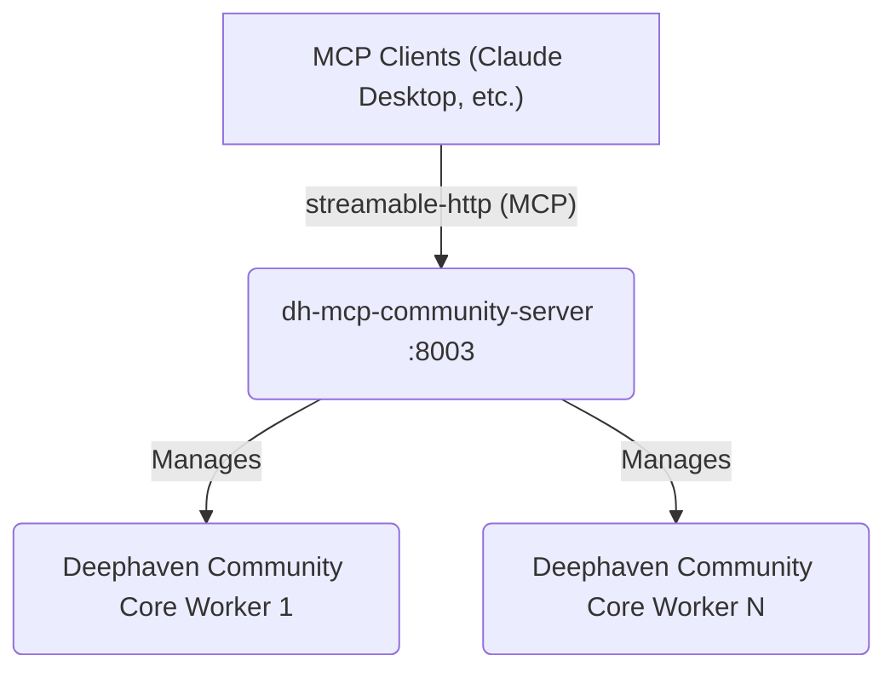
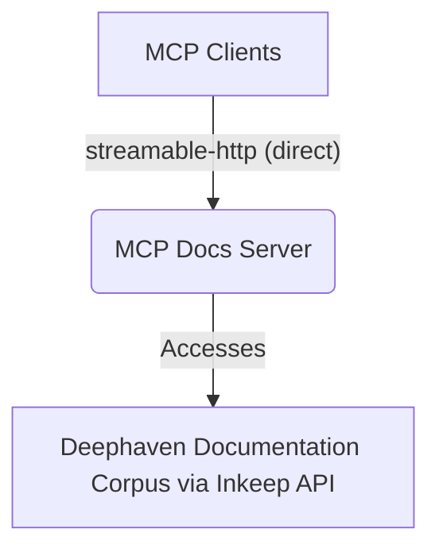

# deephaven-mcp

[](https://pypi.org/project/deephaven-mcp/)
[](https://github.com/deephaven/deephaven-mcp/blob/main/LICENSE)
[](https://github.com/deephaven/deephaven-mcp/actions/workflows/unit-tests.yml)

## Table of Contents

- [Overview](#overview)
- [Key Use Cases](#key-use-cases)
- [Quick Start](#quick-start)
  - [Community Core Quick Start](#community-core-quick-start)
  - [Enterprise Quick Start](#enterprise-quick-start)
- [Quick Upgrade](#quick-upgrade)
- [Deephaven MCP Components](#deephaven-mcp-components)
- [Available MCP Tools](#available-mcp-tools)
- [Architecture Diagrams](#architecture-diagrams)
- [Prerequisites](#prerequisites)
- [Installation & Initial Setup](#installation--initial-setup)
- [Configuration](#configuration)
  - [Configuring DHE (Enterprise) Server](#configuring-dhe-enterprise-server)
  - [Configuring DHC (Community) Server](#configuring-dhc-community-server)
  - [Environment Variables](#environment-variables)
  - [Browser Access to Created Sessions](#browser-access-to-created-sessions)
  - [Applying Configuration Changes](#applying-configuration-changes)
- [AI Tool Setup](#ai-tool-setup)
- [Troubleshooting](#troubleshooting)
- [Contributing](#contributing)
- [Community & Support](#community--support)
- [License](#license)

---

## Overview

**Supercharge your AI workflows with real-time data.** Deephaven MCP brings the power of [live dataframes](https://deephaven.io) directly to your favorite AI tools — [Claude Desktop](https://claude.ai/download), [Cursor](https://www.cursor.com/), [VS Code (GitHub Copilot)](https://code.visualstudio.com/docs/copilot/overview), [Windsurf](https://windsurf.com/), and more.

### Why Deephaven MCP?

Most data tools force you to choose: **fast** or **real-time**. With Deephaven's revolutionary live dataframes, you get both. Process streaming data at millisecond speeds while your AI assistant helps you build, query, and analyze — all through natural language.

**🚀 What makes this different:**

- **Live Data, Live Results**: Query streaming Kafka, real-time feeds, and batch data as easily as static CSV files
- **AI-Native Integration**: Your AI assistant understands your data pipeline and can help optimize, debug, and extend it
- **Enterprise Ready**: Battle-tested on Wall Street for over a decade, now available for your team
- **Zero Learning Curve**: Write queries as if working with static tables — real-time updates happen automatically

Deephaven MCP implements the [Model Context Protocol (MCP)](https://spec.modelcontextprotocol.io/) standard using [FastMCP](https://github.com/modelcontextprotocol/python-sdk) to provide seamless integration between [Deephaven Community Core](https://deephaven.io/community/) and [Deephaven Enterprise](https://deephaven.io/enterprise/) systems and your AI development workflow. Perfect for data scientists, engineers, analysts, business users, and anyone who wants to harness real-time data—regardless of programming experience. Let AI generate the code while you focus on insights.

---

## Key Use Cases

- **AI-Assisted Development**: Integrate Deephaven with LLM-powered development tools (e.g., [Claude Desktop](https://www.anthropic.com/claude), [GitHub Copilot](https://github.com/features/copilot)) for AI-assisted data exploration, code generation, and analysis.
- **Multi-Environment Management**: Programmatically manage and query multiple Deephaven Community Core and Enterprise deployments from a single interface.
- **Interactive Documentation**: Quickly find information and examples from Deephaven documentation using natural language queries.
- **Script Automation**: Execute Python or Groovy scripts across multiple Deephaven sessions for data processing workflows.
- **Schema Discovery**: Automatically retrieve and analyze table schemas from connected Deephaven instances.
- **Environment Monitoring**: Monitor session health, package versions, and system status across your Deephaven infrastructure.

---

## Quick Start

Choose the quickstart for your Deephaven deployment type:

---

### Community Core Quick Start

**Get up and running in 5 minutes!** This quickstart assumes you have a local Deephaven Community Core instance running on `localhost:10000`. If you don't have one, [download and start Deephaven Community Core](https://deephaven.io/core/docs/getting-started/quickstart/) first.

#### 1. Create Virtual Environment

**Using `uv` (recommended):**

Pick a suitable project directory for your venv.

```bash
name_of_your_venv=".venv"
uv venv $name_of_your_venv -p 3.11
```

**Using standard `venv`:**

```bash
python3.11 -m venv .venv
```

> Replace `3.11` / `python3.11` with any supported Python version (3.11 or higher).

#### 2. Install Deephaven MCP

For most users, installing with both Community + Enterprise support is the best default. The Deephaven MCP docs server is hosted by Deephaven and requires no installation.

**Using `uv` (recommended):**

```bash
uv pip install "deephaven-mcp[community,enterprise]"
```

**Using standard `pip`:**

```bash
.venv/bin/pip install "deephaven-mcp[community,enterprise]"
```

**Optional extras:**

| Extra | Use when |
|-------|----------|
| `[community]` | You want to create Community Core sessions using the Python launch method (no Docker required) |
| `[enterprise]` | You need to connect to Deephaven Enterprise (Core+) systems |
| `[test]` | You want to run the test suite |
| `[lint]` | You only need code quality tools (linting, formatting, type checking) |
| `[dev]` | You're developing/contributing to this project (includes everything) |

> For more details and additional installation methods, see [Installation & Initial Setup](#installation--initial-setup).

#### 3. Create Configuration File

For the Community server, create a file (e.g., `dhc.json`) anywhere on your system:

```json5
{
  // Community Core session configurations
  "community": {
    "sessions": {
      // "local" is a custom name - use any name you want for your sessions
      "local": {
        "host": "localhost",           // Server hostname or IP address
        "port": 10000,                 // Deephaven gRPC port (default: 10000)
        // Full authentication handler class name (can also use "PSK" shorthand)
        "auth_type": "io.deephaven.authentication.psk.PskAuthenticationHandler",
        "auth_token": "YOUR_PASSWORD_HERE"  // Must match your Deephaven server token
      }
    },
    // Optional: Enable MCP tools for creating/deleting sessions on-demand
    // Useful for temporary workspaces and dynamic testing environments
    "session_creation": {
      "defaults": {
        "launch_method": "python"     // "python" or "docker"
      }
    }
  }
}
```

> **Security Note**: Since this file contains authentication credentials, set restrictive permissions:
>
> ```sh
> chmod 600 dhc.json
> ```

> **Dynamic Sessions**: The `session_creation` section enables on-demand [Community Core](https://deephaven.io/community/) session creation. Requirements: `deephaven-server` (installed in any Python venv) for the python method, or [Docker](https://www.docker.com/get-started/) for the docker method. See [Community Session Creation Configuration](#community-session-creation-configuration) for details.

#### 4. Start the Community Server and Configure Your AI Tool

Start the Community MCP server in the background (logs go to `dh-mcp-community.log`):

```bash
dh-mcp-community-server --config /full/path/to/dhc.json --port 8003 >dh-mcp-community.log 2>&1 &
```

To check logs: `tail -f dh-mcp-community.log`

To stop the server: `pkill -f dh-mcp-community-server`

**For Claude Desktop**, open **Claude Desktop** → **Settings** → **Developer** → **Edit Config** and add:

```json
{
  "mcpServers": {
    "deephaven-community": {
      "command": "/full/path/to/your/.venv/bin/mcp-proxy",
      "args": ["--transport=streamablehttp", "http://127.0.0.1:8003/mcp"]
    },
    "deephaven-docs": {
      "command": "/full/path/to/your/.venv/bin/mcp-proxy",
      "args": ["--transport=streamablehttp", "https://deephaven-mcp-docs-prod.dhc-demo.deephaven.io/mcp"]
    }
  }
}
```

**For other tools**, see the [detailed setup instructions](#setup-instructions-by-tool) below.

#### 5. Try It Out

Restart your AI tool (or IDE) after starting the servers.

Confirm the setup is working by asking:

> "List my Deephaven sessions and show me the tables in the local session"

> "What Python packages are installed in my Deephaven environment?"

> "Execute this Python code in my Deephaven session: `t = empty_table(100).update('x=i', 'y=i*2')`"

**Need help?** Check the [Troubleshooting](#troubleshooting) section, ask the built-in docs server about Deephaven features, or join the [Deephaven Community Slack](https://deephaven.io/slack)!

---

### Enterprise Quick Start

**Get up and running in 5 minutes!** This quickstart assumes you have a Deephaven Enterprise system accessible at a known URL. Contact your Deephaven administrator for the `connection.json` URL and your credentials.

#### 1. Create Virtual Environment

**Using `uv` (recommended):**

Pick a suitable project directory for your venv.

```bash
name_of_your_venv=".venv"
uv venv $name_of_your_venv -p 3.11
```

**Using standard `venv`:**

```bash
python3.11 -m venv .venv
```

> Replace `3.11` / `python3.11` with any supported Python version (3.11 or higher).

#### 2. Install Deephaven MCP

**Using `uv` (recommended):**

```bash
uv pip install "deephaven-mcp[enterprise]"
```

**Using standard `pip`:**

```bash
.venv/bin/pip install "deephaven-mcp[enterprise]"
```

> Installing `[community,enterprise]` is also fine if you need both server types.

#### 3. Create Configuration File

Create a config file (e.g., `dhe.json`) for your enterprise system. Each enterprise server instance manages **one** DHE system:

**Password authentication:**

```json5
{
  "system_name": "prod",                                          // A short name for this system
  "connection_json_url": "https://dhe.example.com/iris/connection.json",  // From your administrator
  "auth_type": "password",
  "username": "your-username",
  "password_env_var": "DHE_PASSWORD"                              // Read password from environment
}
```

Set your password in the environment:

```bash
export DHE_PASSWORD="your-password-here"
```

**Private key authentication:**

```json5
{
  "system_name": "prod",
  "connection_json_url": "https://dhe.example.com/iris/connection.json",
  "auth_type": "private_key",
  "private_key_path": "/absolute/path/to/priv-mykeyname.base64.txt"  // Provided by your IT/security team
}
```

> **Security Note**: Restrict config file permissions: `chmod 600 dhe.json`

#### 4. Start the Enterprise Server and Configure Your AI Tool

Start the Enterprise MCP server in the background (logs go to `dh-mcp-enterprise-prod.log`):

```bash
dh-mcp-enterprise-server --config /full/path/to/dhe.json --port 8002 >dh-mcp-enterprise-prod.log 2>&1 &
```

To check logs: `tail -f dh-mcp-enterprise-prod.log`

To stop the server: `pkill -f dh-mcp-enterprise-server`

> **Multiple DHE systems**: Run a separate instance on a different port for each system, with a distinct log file per instance (e.g., `dh-mcp-enterprise-staging.log`).

**For Claude Desktop**, open **Claude Desktop** → **Settings** → **Developer** → **Edit Config** and add:

```json
{
  "mcpServers": {
    "deephaven-enterprise": {
      "command": "/full/path/to/your/.venv/bin/mcp-proxy",
      "args": ["--transport=streamablehttp", "http://127.0.0.1:8002/mcp"]
    },
    "deephaven-docs": {
      "command": "/full/path/to/your/.venv/bin/mcp-proxy",
      "args": ["--transport=streamablehttp", "https://deephaven-mcp-docs-prod.dhc-demo.deephaven.io/mcp"]
    }
  }
}
```

**For other tools**, see the [detailed setup instructions](#setup-instructions-by-tool) below.

#### 5. Try It Out

Restart your AI tool (or IDE) after starting the server.

Confirm the setup is working by asking:

> "What is the status of my Deephaven Enterprise system?"

> "List all persistent queries on my enterprise system"

> "Show me the tables available in my enterprise session"

**Need help?** Check the [Troubleshooting](#troubleshooting) section, ask the built-in docs server about Deephaven features, or join the [Deephaven Community Slack](https://deephaven.io/slack)!

---

## Quick Upgrade

**Already have `deephaven-mcp` installed?** Here's how to upgrade:

**Using `uv`:**

```bash
uv pip install --upgrade deephaven-mcp
```

**Using standard `pip`:**

```bash
.venv/bin/pip install --upgrade deephaven-mcp
```

**To upgrade with optional dependencies:**

```bash
# uv
uv pip install --upgrade "deephaven-mcp[community,enterprise]"

# pip
.venv/bin/pip install --upgrade "deephaven-mcp[community,enterprise]"
```

After upgrading, restart your AI tool for changes to take effect.

---

## Deephaven MCP Components

### Enterprise Server (`dh-mcp-enterprise-server`)

Manages ONE [Deephaven Enterprise](https://deephaven.io/enterprise/) system per server instance. Run multiple instances on different ports to connect to multiple DHE systems simultaneously.

**Key Capabilities:**

- **Enterprise System Status**: Check status of the configured DHE system
- **Enterprise Session Management**: Create and delete enterprise worker sessions
- **Persistent Query Management**: Full lifecycle management of enterprise persistent queries (PQs) - create, start, stop, restart, and delete
- **Catalog Discovery**: Browse the enterprise catalog at table and namespace levels
- **Table Discovery**: Lightweight table name listing and comprehensive schema retrieval
- **Table Operations**: Retrieve table schemas, metadata, and actual data with flexible formatting
- **Script Execution**: Run Python or Groovy scripts on Deephaven sessions
- **Package Management**: Query installed Python packages in session environments
- **Configuration Management**: Reload configuration and clear caches

---

### Community Server (`dh-mcp-community-server`)

Manages multiple [Deephaven Community Core](https://deephaven.io/community/) sessions in a single server instance.

**Key Capabilities:**

- **Session Management**: List, monitor, and get detailed status of all configured DHC sessions
- **Community Session Creation**: Dynamically launch new Community Core sessions via Docker or python with configurable resources
- **Table Discovery**: Lightweight table name listing and comprehensive schema retrieval
- **Table Operations**: Retrieve table schemas, metadata, and actual data with flexible formatting
- **Script Execution**: Run Python or Groovy scripts directly on Deephaven sessions
- **Package Management**: Query installed Python packages in session environments
- **Configuration Management**: Dynamically reload and refresh session configurations

---

## Available MCP Tools

### Enterprise Server Tools

*System:*

- `enterprise_systems_status` - Get status of the configured DHE system
- `mcp_reload` - Reload configuration and clear caches

*Enterprise Sessions:*

- `session_enterprise_create` - Create enterprise sessions
- `session_enterprise_delete` - Delete enterprise sessions

*Persistent Query (PQ) Management:*

- `pq_name_to_id` - Convert PQ name to canonical pq_id
- `pq_list` - List all persistent queries
- `pq_details` - Get detailed PQ information
- `pq_create` - Create new persistent queries
- `pq_modify` - Modify existing persistent query configuration
- `pq_start` - Start persistent queries (parallel execution with configurable concurrency)
- `pq_stop` - Stop running persistent queries (parallel execution with configurable concurrency)
- `pq_restart` - Restart persistent queries (parallel execution with configurable concurrency)
- `pq_delete` - Delete persistent queries (parallel execution with configurable concurrency)

**Parallel Batch Operations**: When operating on multiple PQs, `pq_start`, `pq_stop`, `pq_restart`, and `pq_delete` execute operations in parallel with a default concurrency limit of 20. This provides near-batch performance (~10x faster for large batches) while maintaining granular per-item error reporting for AI agents. The concurrency limit can be adjusted via the `max_concurrent` parameter to balance performance and server load.

*Catalog Discovery:*

- `catalog_tables_list` - List catalog tables
- `catalog_namespaces_list` - Browse catalog namespaces
- `catalog_tables_schema` - Get catalog table schemas
- `catalog_table_sample` - Sample catalog table data

*Session & Table Operations:*

- `sessions_list` - List all sessions
- `session_details` - Get detailed session information
- `session_tables_list` - List available tables
- `session_tables_schema` - Get table schema information
- `session_table_data` - Retrieve table data with formatting options
- `session_script_run` - Execute Python/Groovy scripts
- `session_pip_list` - Query installed packages

### Community Server Tools

*Community Sessions:*

- `session_community_create` - Dynamically launch Community Core sessions
- `session_community_delete` - Delete dynamically created sessions
- `session_community_credentials` - Retrieve session credentials

*Session & Table Operations:*

- `sessions_list` - List all sessions
- `session_details` - Get detailed session information
- `session_tables_list` - List available tables
- `session_tables_schema` - Get table schema information
- `session_table_data` - Retrieve table data with formatting options
- `session_script_run` - Execute Python/Groovy scripts
- `session_pip_list` - Query installed packages
- `mcp_reload` - Reload configuration and clear caches

> For detailed tool documentation with parameters and examples, see the [Developer & Contributor Guide](docs/DEVELOPER_GUIDE.md).

---

### Docs Server

Connects to Deephaven's documentation knowledge base via [Inkeep](https://inkeep.com/) AI to answer questions about Deephaven features, APIs, and usage patterns. Ask questions in natural language and get specific answers with code examples and explanations.

---

## Architecture Diagrams

### Enterprise Server Architecture


```mermaid
graph TD
    A["MCP Clients (Claude Desktop, etc.)"] --"streamable-http (MCP)"--> B("dh-mcp-enterprise-server :8002")
    C["MCP Clients"] --"streamable-http (MCP)"--> D("dh-mcp-enterprise-server :8004")
    B --"Manages"--> E("Deephaven Enterprise System A")
    D --"Manages"--> F("Deephaven Enterprise System B")
    E --"Manages"--> G("Enterprise Worker A.1")
    E --"Manages"--> H("Enterprise Worker A.N")
    F --"Manages"--> I("Enterprise Worker B.1")
    F --"Manages"--> J("Enterprise Worker B.N")
```

*Each enterprise server instance manages exactly one DHE system. Run multiple instances on different ports to connect to multiple DHE systems simultaneously.*

### Community Server Architecture


```mermaid
graph TD
    A["MCP Clients (Claude Desktop, etc.)"] --"streamable-http (MCP)"--> B("dh-mcp-community-server :8003")
    B --"Manages"--> C("Deephaven Community Core Worker 1")
    B --"Manages"--> D("Deephaven Community Core Worker N")
```

*One community server instance manages all configured DHC workers.*

### Docs Server Architecture


```mermaid
graph TD
    A["MCP Clients"] --"streamable-http (direct)"--> B("MCP Docs Server")
    B --"Accesses"--> E["Deephaven Documentation Corpus via Inkeep API"]
```

---

## Prerequisites

- **Python**: Version 3.11 or higher. ([Download Python](https://www.python.org/downloads/))
- **Docker (Optional)**: Required for Docker-based community session creation. ([Download Docker](https://www.docker.com/get-started/))
- **Access to Deephaven systems:** To use the MCP servers, you will need one or more of the following:
  - **[Deephaven Community Core](https://deephaven.io/community/) instance(s):** For development and personal use.
  - **[Deephaven Enterprise](https://deephaven.io/enterprise/) system(s):** For enterprise-level features and capabilities.
- **Choose your Python environment setup method:**
  - **Option A: [`uv`](https://docs.astral.sh/uv/) (Recommended)**: A very fast Python package installer and resolver. If you don't have it, you can install it via `pip install uv` or see the [uv installation guide](https://github.com/astral-sh/uv#installation).
  - **Option B: Standard Python `venv` and `pip`**: Uses Python's built-in [virtual environment (`venv`)](https://docs.python.org/3/library/venv.html) tools and [`pip`](https://pip.pypa.io/en/stable/getting-started/).
- **Configuration Files**: Each integration requires proper configuration files (specific locations detailed in each integration section)

---

## Installation & Initial Setup

> **Quick Path**: For a fast getting-started experience, see the [Quick Start](#quick-start) guide above. This section provides additional installation details and alternative methods.

The recommended way to install `deephaven-mcp` is from [PyPI](https://pypi.org/project/deephaven-mcp/), which provides the latest stable release.

### Installation Methods

#### Using `uv` (Fast, Recommended)

[`uv`](https://github.com/astral-sh/uv) is a high-performance Python package manager. For detailed [`uv`](https://github.com/astral-sh/uv) workflows and project-specific setup, see the [`uv` documentation](docs/UV.md).

**Install uv:**

```sh
pip install uv
```

**Create environment and install:**

```sh
# Create virtual environment with Python 3.11+, in a chosen project directory
name_of_your_venv=".venv"
uv venv $name_of_your_venv -p 3.11

# Install deephaven-mcp (choose your extras)
uv pip install deephaven-mcp                           # Basic
uv pip install "deephaven-mcp[community]"              # + Python session creation
uv pip install "deephaven-mcp[enterprise]"             # + Enterprise support
uv pip install "deephaven-mcp[community,enterprise]"   # Both
```

#### Using Standard `pip` and `venv`

**Create environment and install:**

```sh
# Create virtual environment
python3.11 -m venv .venv

# Install deephaven-mcp (choose your extras)
.venv/bin/pip install deephaven-mcp                           # Basic
.venv/bin/pip install "deephaven-mcp[community]"              # + Python session creation
.venv/bin/pip install "deephaven-mcp[enterprise]"             # + Enterprise support
.venv/bin/pip install "deephaven-mcp[community,enterprise]"   # Both
```

**Optional Dependency Reference:**

| Extra | Provides |
|-------|----------|
| `[community]` | Python-based Community Core session creation (no Docker) |
| `[enterprise]` | Deephaven Enterprise (Core+) system connectivity |
| `[test]` | Testing framework and utilities |
| `[lint]` | Code quality tools (linting, formatting, type checking) |
| `[dev]` | Full development environment (all of the above) |

---

## Configuration

This section is the full configuration reference for both the Enterprise and Community servers, including all supported fields, authentication options, session creation, environment variables, and security settings.

> **New users**: The Quick Start config examples cover the most common setups. Return here when you need to go beyond the basics.

### Configuring DHE (Enterprise) Server

The enterprise server (`dh-mcp-enterprise-server`) uses a **flat** JSON or JSON5 config file where fields sit at the top level (not nested under a system name). Each server instance manages exactly one DHE system.

**Config file location**: Pass via `--config` CLI flag or `DH_MCP_CONFIG_FILE` environment variable.

**File Format**: Supports standard JSON and JSON5 (comments and trailing commas allowed).

#### DHE Config Examples

**Password authentication:**

```json5
{
  "system_name": "prod",
  "connection_json_url": "https://dhe.example.com/iris/connection.json",
  "auth_type": "password",
  "username": "admin",
  "password_env_var": "DHE_PASSWORD"  // recommended: read from env var
}
```

**Private key authentication:**

```json5
{
  "system_name": "prod",
  "connection_json_url": "https://dhe.example.com/iris/connection.json",
  "auth_type": "private_key",
  // Proprietary keypair file from your IT team, typically named priv-<keyname>.base64.txt
  "private_key_path": "/absolute/path/to/priv-mykeyname.base64.txt"
}
```

**With session creation enabled:**

```json5
{
  "system_name": "prod",
  "connection_json_url": "https://dhe.example.com/iris/connection.json",
  "auth_type": "password",
  "username": "admin",
  "password_env_var": "DHE_PASSWORD",
  "session_creation": {
    "max_concurrent_sessions": 5,
    "defaults": {
      "heap_size_gb": 4,
      "programming_language": "Python"
    }
  }
}
```

#### DHE Configuration Fields

| Field | Type | Required | Description |
|-------|------|----------|-------------|
| `system_name` | string | Yes | Name for this enterprise system — appears in all session and PQ identifiers (e.g. `"enterprise:prod:my-pq"`) |
| `connection_json_url` | string | Yes | URL to the Enterprise server's `connection.json` file |
| `auth_type` | string | Yes | `"password"` or `"private_key"` |
| `username` | string | `auth_type="password"` | Username for password auth |
| `password` | string | `auth_type="password"` | Password (use `password_env_var` instead for security) |
| `password_env_var` | string | `auth_type="password"` | Environment variable containing the password (recommended) |
| `private_key_path` | string | `auth_type="private_key"` | Absolute path to the Deephaven private keypair file (proprietary format, typically named `priv-<keyname>.base64.txt`; provided by your IT/security team) |
| `connection_timeout` | int or float | No | Timeout in seconds for connecting to the system (default: 10.0) |
| `session_creation` | object | No | Session creation settings (limits and defaults) for `session_enterprise_create`. All fields are optional; defaults are used if omitted |
| `session_creation.max_concurrent_sessions` | integer | No | Max concurrent sessions (default: 5). Set to 0 to disable `session_enterprise_create` |
| `session_creation.defaults` | object | No | Default parameters applied to `session_enterprise_create` when the caller does not specify them |
| `session_creation.defaults.heap_size_gb` | int or float | No | Default JVM heap size in GB |
| `session_creation.defaults.auto_delete_timeout` | integer | No | Default auto-delete timeout in seconds |
| `session_creation.defaults.server` | string | No | Default target server name within the DHE system |
| `session_creation.defaults.engine` | string | No | Default execution engine name |
| `session_creation.defaults.extra_jvm_args` | array of strings | No | Default additional JVM arguments |
| `session_creation.defaults.extra_environment_vars` | array of strings | No | Default additional environment variables |
| `session_creation.defaults.admin_groups` | array of strings | No | Default groups with admin access |
| `session_creation.defaults.viewer_groups` | array of strings | No | Default groups with view-only access |
| `session_creation.defaults.timeout_seconds` | int or float | No | Default session timeout in seconds |
| `session_creation.defaults.session_arguments` | object | No | Default additional session arguments |
| `session_creation.defaults.programming_language` | string | No | Default language: `"Python"` or `"Groovy"` |

**Running multiple DHE instances:**

```bash
# Two DHE systems on different ports, each with its own log file
dh-mcp-enterprise-server --config /path/to/dhe_prod.json --port 8002 >dh-mcp-enterprise-prod.log 2>&1 &
dh-mcp-enterprise-server --config /path/to/dhe_staging.json --port 8004 >dh-mcp-enterprise-staging.log 2>&1 &
```

> **Security Note**: Config files may contain sensitive credentials. Restrict permissions with `chmod 600 /path/to/dhe_prod.json`.

---

### Configuring DHC (Community) Server

The community server (`dh-mcp-community-server`) uses a JSON or JSON5 config file with a `"community"` top-level key (and optional `"security"` key).

**Config file location**: Pass via `--config` CLI flag or `DH_MCP_CONFIG_FILE` environment variable.

**File Format**: Supports standard JSON and JSON5 (comments and trailing commas allowed).

#### Community Examples

**Minimal configuration (no connections):**

```json
{}
```

**Anonymous authentication (simplest):**

```json5
{
  "community": {
    "sessions": {
      // No authentication required - use only for local development!
      // When auth_type is omitted, defaults to "Anonymous"
      "my_local_server": {
        "host": "localhost",  // Deephaven server address
        "port": 10000          // Default Deephaven port (gRPC)
      }
    }
  }
}
```

**PSK authentication:**

```json5
{
  "community": {
    "sessions": {
      "psk_server": {
        "host": "localhost",
        "port": 10000,
        // Pre-Shared Key authentication (most common for production)
        // Can use "PSK" shorthand or full class name shown here
        "auth_type": "io.deephaven.authentication.psk.PskAuthenticationHandler",
        "auth_token": "your-shared-secret-key"  // Token configured on server
      }
    }
  }
}
```

**Basic authentication with environment variable:**

```json5
{
  "community": {
    "sessions": {
      "prod_session": {
        "host": "deephaven-prod.example.com",  // Remote server
        "port": 10000,
        "auth_type": "Basic",  // HTTP Basic authentication
        // More secure: read credentials from environment variable
        // Set in shell: export DH_AUTH_TOKEN="username:password"
        "auth_token_env_var": "DH_AUTH_TOKEN"  // Must be in "user:pass" format
      }
    }
  }
}
```

**TLS/SSL configuration:**

```json5
{
  "community": {
    "sessions": {
      "secure_tls_session": {
        "host": "secure.deephaven.example.com",
        "port": 443,  // Standard HTTPS port (use 10000 for non-TLS)
        "use_tls": true,  // Enable SSL/TLS encryption
        // Optional: Custom CA certificate for server verification
        "tls_root_certs": "/absolute/path/to/ca.pem",  // Must be absolute path!
        // Optional: Mutual TLS (mTLS) for client authentication
        "client_cert_chain": "/absolute/path/to/client-cert.pem",
        "client_private_key": "/absolute/path/to/client-key.pem"
      }
    }
  }
}
```

#### Community Configuration Fields

*All community session fields are optional. Default values are applied by the server if a field is omitted.*

> 💡 **See Examples Above:** For complete configuration examples, refer to [Community Examples](#community-examples).

| Field | Type | Required When | Description |
|-------|------|---------------|-------------|
| `host` | string | Optional | Hostname or IP address of the Deephaven Community Core session (e.g., `"localhost"`) |
| `port` | integer | Optional | Port number for the session connection (e.g., `10000`) |
| `auth_type` | string | Optional | Authentication type: `"PSK"` (shorthand), `"Anonymous"` (default), `"Basic"`, or full class names like `"io.deephaven.authentication.psk.PskAuthenticationHandler"` |
| `auth_token` | string | Optional | Authentication token. For `"Basic"` auth: `"username:password"` format. Mutually exclusive with `auth_token_env_var` |
| `auth_token_env_var` | string | Optional | Environment variable name containing the auth token (e.g., `"MY_AUTH_TOKEN"`). More secure than hardcoding tokens |
| `never_timeout` | boolean | Optional | If `true`, attempts to configure the session to never time out |
| `session_type` | string | Optional | Type of session to create: `"groovy"` or `"python"` |
| `use_tls` | boolean | Optional | Set to `true` if the connection requires TLS/SSL |
| `tls_root_certs` | string | Optional | Absolute path to PEM file with trusted root CA certificates for TLS verification |
| `client_cert_chain` | string | Optional | Absolute path to PEM file with client's TLS certificate chain (for mTLS) |
| `client_private_key` | string | Optional | Absolute path to PEM file with client's private key (for mTLS) |

#### Community Session Creation Configuration

The `session_creation` key configures dynamic creation of Deephaven Community Core sessions on-demand. The `session_community_create` and `session_community_delete` MCP tools are always registered on the Community server, but they require this key to be present in the config — if it is omitted, calls to these tools return an error.

**Requirements by launch method:**

- **Docker method** (`launch_method: "docker"`):
  - Requires [Docker](https://www.docker.com/get-started/) installed and running
  - Works with base `deephaven-mcp` installation (no additional packages needed)

- **Python method** (`launch_method: "python"`):
  - Requires `deephaven-server` installed in a Python environment
  - **Default venv**: Uses same venv as MCP server
  - **Custom venv**: Optionally specify a different venv via `python_venv_path` parameter
  - No Docker needed

| Field | Type | Required When | Description |
|-------|------|---------------|-------------|
| `session_creation` | object | Optional | Configuration for creating community sessions. If omitted, `session_community_create` and `session_community_delete` return an error when called |
| `session_creation.max_concurrent_sessions` | integer | Optional | Maximum concurrent dynamic sessions (default: 5). Set to 0 for no limit |
| `session_creation.defaults` | object | Optional | Default parameters for new sessions |
| `session_creation.defaults.launch_method` | string | Optional | How to launch sessions: `"docker"` or `"python"` (default: "docker") |
| `session_creation.defaults.auth_type` | string | Optional | Authentication type: `"PSK"` (default), `"Anonymous"`, or full class name `"io.deephaven.authentication.psk.PskAuthenticationHandler"`. Case-insensitive for shorthand. Basic auth not supported for dynamic sessions |
| `session_creation.defaults.auth_token` | string | Optional | Pre-shared key for PSK auth. If omitted with PSK auth, a secure token is auto-generated |
| `session_creation.defaults.auth_token_env_var` | string | Optional | Environment variable containing auth token. Mutually exclusive with `auth_token` |
| `session_creation.defaults.programming_language` | string | Optional | Programming language for Docker sessions: `"Python"` or `"Groovy"` (default: "Python"). Docker only. Mutually exclusive with `docker_image`. See examples below. |
| `session_creation.defaults.docker_image` | string | Optional | Custom Docker image to use. Docker only. Mutually exclusive with `programming_language`. If neither specified, defaults to Python image. See examples below. |
| `session_creation.defaults.docker_memory_limit_gb` | float | Optional | Container memory limit in GB (Docker only, default: no limit) |
| `session_creation.defaults.docker_cpu_limit` | float | Optional | Container CPU limit in cores (Docker only, default: no limit) |
| `session_creation.defaults.docker_volumes` | array | Optional | Volume mounts in format `["host:container:mode"]` (Docker only, default: []) |
| `session_creation.defaults.python_venv_path` | string | Optional | Path to custom Python venv directory (Python only). If provided, uses deephaven from that venv. If null (default), uses same venv as MCP server. Raises error if used with docker. |
| `session_creation.defaults.heap_size_gb` | float \| int | Optional | JVM heap size in gigabytes (e.g., 4 or 2.5, default: 4). Integer values use 'g' suffix (4 → `-Xmx4g`). Float values converted to MB (2.5 → `-Xmx2560m`) |
| `session_creation.defaults.extra_jvm_args` | array | Optional | Additional JVM arguments (e.g., `["-XX:+UseG1GC"]`, default: []) |
| `session_creation.defaults.environment_vars` | object | Optional | Environment variables as key-value pairs (default: {}) |
| `session_creation.defaults.startup_timeout_seconds` | float | Optional | Maximum time to wait for session startup (default: 60) |
| `session_creation.defaults.startup_check_interval_seconds` | float | Optional | Time between health checks during startup (default: 2) |
| `session_creation.defaults.startup_retries` | integer | Optional | Connection attempts per health check (default: 3) |

**Docker Image Configuration Examples:**

```json5
// CORRECT: Use programming_language for standard Deephaven images
{
  "session_creation": {
    "defaults": {
      "launch_method": "docker",
      "programming_language": "Python"  // Uses ghcr.io/deephaven/server:latest
    }
  }
}

// CORRECT: Use programming_language for Groovy
{
  "session_creation": {
    "defaults": {
      "launch_method": "docker",
      "programming_language": "Groovy"  // Uses ghcr.io/deephaven/server-slim:latest
    }
  }
}

// CORRECT: Use docker_image for custom images
{
  "session_creation": {
    "defaults": {
      "launch_method": "docker",
      "docker_image": "my-custom-deephaven:v1.0"  // Uses your custom image
    }
  }
}

// INCORRECT: Don't use both programming_language and docker_image together
{
  "session_creation": {
    "defaults": {
      "launch_method": "docker",
      "programming_language": "Python",  // Conflict!
      "docker_image": "custom:latest"     // Conflict!
    }
  }
}
```

> **📝 Session Lifecycle Notes**:
>
> **Automatic Cleanup:**
>
> - Sessions are automatically stopped and cleaned up when the MCP server shuts down
> - All ports are released and containers/processes are terminated gracefully
> - On restart, the MCP server detects and cleans up any orphaned resources from previous runs
>
> **Session Management:**
>
> - Auto-generated PSK tokens are logged at WARNING level for visibility (similar to [Jupyter](https://jupyter.org/) notebooks)
> - Created sessions use session IDs in format: `community:dynamic:{session_name}`
> - Only dynamically created sessions can be deleted via `session_community_delete` (pass the full `session_id` in `"community:dynamic:{session_name}"` format, not just the bare name)
> - Static configuration-based sessions cannot be deleted via MCP tools

### Security Configuration (Community Server)

The optional top-level `security` section in the community config controls the `session_community_credentials` tool.

> **SECURITY WARNING**: When credential retrieval is enabled, your AI assistant can see and access authentication tokens. Only enable if you understand the implications. **NEVER** enable when the MCP server is accessible over untrusted networks.

| Field | Type | Values | Description |
|-------|------|--------|-------------|
| `security.community.credential_retrieval_mode` | string | `"none"` (default), `"dynamic_only"`, `"static_only"`, `"all"` | Controls credential retrieval access |

**Mode Descriptions:**

- **`"none"`** (default): Credential retrieval disabled for all sessions (most secure)
- **`"dynamic_only"`**: Only dynamically created session credentials can be retrieved (recommended for development)
- **`"static_only"`**: Only static configuration-based session credentials can be retrieved
- **`"all"`**: Both dynamic and static session credentials can be retrieved

### Setting `DH_MCP_CONFIG_FILE`

Both servers accept the config file path via `--config` CLI flag or the `DH_MCP_CONFIG_FILE` environment variable. The CLI flag takes priority. You can start the servers from any shell and pass the environment variable directly:

```bash
DH_MCP_CONFIG_FILE=/path/to/dhc.json dh-mcp-community-server
DH_MCP_CONFIG_FILE=/path/to/dhe.json dh-mcp-enterprise-server
```

---

### Environment Variables

> **⚠️ Security Warning**: Environment variables containing sensitive information like API keys and authentication tokens should be handled securely and never committed to version control.

For the full reference of all supported environment variables — including credential variables, timeout tuning, and Docs Server configuration — see **[docs/ENV.md](docs/ENV.md)**.

The variables needed to get started are:

- **`DH_MCP_CONFIG_FILE`** *(required)*: Path to your server config file (DHE flat config or DHC community config)
  - Example: `DH_MCP_CONFIG_FILE=/path/to/your/dhc.json`
  - Overridden by the `--config` (or `-c`) CLI flag

- **`MCP_HOST`**: Host the server binds to (default: `127.0.0.1`)
  - Overridden by the `--host` CLI flag

- **`MCP_PORT`**: Port the server listens on (default: `8002` for enterprise, `8003` for community)
  - Overridden by the `--port` CLI flag

- **`PYTHONLOGLEVEL`**: Controls the verbosity of logging output
  - Values: `DEBUG`, `INFO`, `WARNING`, `ERROR`
  - Default: `INFO`
  - Example: `PYTHONLOGLEVEL=DEBUG`

- **Custom authentication variables**: Any environment variable specified in your config's `auth_token_env_var` or `password_env_var` field will be used to source authentication tokens
  - Example: If config specifies `"password_env_var": "DHE_PASSWORD"`, then set `DHE_PASSWORD=your-password`
  - Note: This is a more secure alternative to hardcoding credentials in configuration files

---

### Browser Access to Created Sessions

When you create a Deephaven session via the MCP tools, you may want to access it through a web browser. By default, authentication credentials are not returned through MCP tools for security.

### Viewing Credentials in Console

When a session is created with an auto-generated token, the connection information is logged to your console:

```text
====================================================================
🔑 Session 'my-analysis' Created - Browser Access Information:
   Port: 45123
   Base URL: http://localhost:45123
   Auth Token: abc123xyz789...
   Browser URL: http://localhost:45123/?psk=abc123xyz789

   To retrieve credentials via MCP tool, set security.community.credential_retrieval_mode
   in your deephaven_mcp.json configuration.
====================================================================
```

You can copy this URL directly into your browser.

### Retrieving Credentials via MCP Tool (Optional)

If you want AI agents to retrieve credentials programmatically, you can enable the `session_community_credentials` tool in your configuration:

1. **Edit your community config file:**

   ```json
   {
     "security": {
       "community": {
         "credential_retrieval_mode": "dynamic_only"
       }
     },
     "community": {
       "session_creation": {
         "defaults": {
           "launch_method": "docker",
           "heap_size_gb": 4
         }
       }
     }
   }
   ```

   See [Security Configuration (Community Server)](#security-configuration-community-server) for `credential_retrieval_mode` descriptions.

2. **Use the tool:**

   Ask your AI assistant: *"Get me the browser URL for session 'my-analysis'"*

   The AI will use `session_community_credentials` to retrieve the authenticated URL.

   > **🔒 SECURITY WARNING**
   >
   > This tool exposes sensitive credentials. Only enable credential retrieval if the MCP server is running locally and you understand the security implications. **NEVER** enable when accessible over untrusted networks.

---

### Applying Configuration Changes

After creating or modifying your MCP configuration, you must restart your IDE or AI assistant for the changes to take effect.

#### Restart and Verify

1. **Restart your tool** completely (Claude Desktop, VS Code, Cursor, etc.)
2. **Check MCP server status** in your tool's interface - you should see your configured servers listed
3. **Test the connection** by asking your AI assistant:

   ```text
   Are the Deephaven MCP servers working? Can you list any available sessions?
   ```

   Your AI assistant should connect to both servers and respond with information about Deephaven capabilities and available sessions.

If the servers don't appear or you encounter errors, see the [Troubleshooting](#troubleshooting) section.

---

## AI Tool Setup

This section explains how to connect Deephaven to your AI assistant or IDE. Both servers (`dh-mcp-enterprise-server` and `dh-mcp-community-server`) use **streamable-http** transport only — you start them separately and point your MCP client to their HTTP URLs.

### How It Works

1. Start the server(s) you need in a terminal (they run as persistent HTTP servers)
2. Configure your AI tool to connect to those servers by URL
3. Restart your AI tool if needed to pick up configuration changes

**Starting the servers in the background:**

Run each server as a background process, redirecting logs to a named file. Use a descriptive log file name for each server so logs don't collide when running multiple instances.

```bash
# Community server
dh-mcp-community-server --config /path/to/dhc.json --port 8003 >dh-mcp-community.log 2>&1 &

# Enterprise server (one instance per system, each on its own port)
dh-mcp-enterprise-server --config /path/to/dhe_prod.json --port 8002 >dh-mcp-enterprise-prod.log 2>&1 &
dh-mcp-enterprise-server --config /path/to/dhe_staging.json --port 8004 >dh-mcp-enterprise-staging.log 2>&1 &
```

**Stopping background servers:**

```bash
# By process name
pkill -f dh-mcp-community-server
pkill -f dh-mcp-enterprise-server

# Or stop a specific port (e.g., port 8002)
kill $(lsof -ti tcp:8002)
```

**Following logs in real time:**

```bash
tail -f dh-mcp-community.log
tail -f dh-mcp-enterprise-prod.log
```

### Setup Instructions by Tool

#### Claude Desktop

Claude Desktop only supports stdio transport. Use `mcp-proxy` (included in your venv) as a bridge to the HTTP servers. Open **Claude Desktop** → **Settings** → **Developer** → **Edit Config**:

```json
{
  "mcpServers": {
    "deephaven-community": {
      "command": "/full/path/to/your/.venv/bin/mcp-proxy",
      "args": ["--transport=streamablehttp", "http://127.0.0.1:8003/mcp"]
    },
    "deephaven-docs": {
      "command": "/full/path/to/your/.venv/bin/mcp-proxy",
      "args": ["--transport=streamablehttp", "https://deephaven-mcp-docs-prod.dhc-demo.deephaven.io/mcp"]
    }
  }
}
```

**Additional Resources:**

- [MCP User Quickstart Guide](https://modelcontextprotocol.io/quickstart/user)
- [MCP Troubleshooting guide](https://modelcontextprotocol.io/docs/concepts/transports#troubleshooting)
- [Claude Desktop MCP Troubleshooting guide](https://support.anthropic.com/en/articles/10949351-getting-started-with-local-mcp-servers-on-claude-desktop)

#### Cursor

Cursor supports HTTP MCP servers. Create or edit an MCP configuration file:

- **Project-specific**: `.cursor/mcp.json` in your project root
- **Global**: `~/.cursor/mcp.json` for all projects

```json
{
  "mcpServers": {
    "deephaven-community": {
      "type": "http",
      "url": "http://127.0.0.1:8003/mcp"
    },
    "deephaven-docs": {
      "type": "http",
      "url": "https://deephaven-mcp-docs-prod.dhc-demo.deephaven.io/mcp"
    }
  }
}
```

**Additional Resources:**

- [Cursor MCP documentation](https://docs.cursor.com/en/context/mcp)

#### VS Code (GitHub Copilot)

VS Code supports HTTP MCP servers natively. To add MCP servers to your workspace, run the **MCP: Add Server** command from the Command Palette (Cmd-Shift-P), then select **Workspace Settings** to create the `.vscode/mcp.json` file. Alternatively, create `.vscode/mcp.json` manually in your project root.

Configure your servers:

```json
{
  "servers": {
    "deephaven-community": {
      "type": "http",
      "url": "http://127.0.0.1:8003/mcp"
    },
    "deephaven-docs": {
      "type": "http",
      "url": "https://deephaven-mcp-docs-prod.dhc-demo.deephaven.io/mcp"
    }
  }
}
```

You will see the MCP servers listed in the Extensions sidebar under "MCP Servers".

**Additional Resources:**

- [VS Code MCP documentation](https://code.visualstudio.com/docs/copilot/chat/mcp-servers)
- [VS Code MCP Configuration format reference](https://code.visualstudio.com/docs/copilot/chat/mcp-servers#_configuration-format)
- [VS Code MCP Troubleshooting guide](https://code.visualstudio.com/docs/copilot/chat/mcp-servers#_troubleshoot-and-debug-mcp-servers)

#### Windsurf

Windsurf supports HTTP MCP servers natively. Go to **Windsurf Settings** > **Cascade** > **MCP Servers** > **Manage MCPs** > **View Raw Config** to open `~/.codeium/windsurf/mcp_config.json` for editing.

```json
{
  "mcpServers": {
    "deephaven-community": {
      "serverUrl": "http://127.0.0.1:8003/mcp"
    },
    "deephaven-docs": {
      "serverUrl": "https://deephaven-mcp-docs-prod.dhc-demo.deephaven.io/mcp"
    }
  }
}
```

**Additional Resources:**

- [Windsurf MCP documentation](https://docs.windsurf.com/windsurf/cascade/mcp)
- [Windsurf MCP Troubleshooting guide](https://docs.windsurf.com/troubleshooting/windsurf-common-issues)

---

## Troubleshooting

This section provides comprehensive guidance for diagnosing and resolving common issues with Deephaven MCP setup and operation. Issues are organized by category, starting with the most frequently encountered problems.

### Quick Fixes

Before diving into detailed troubleshooting, try these common solutions:

1. **Restart your IDE/AI assistant** after any configuration changes
2. **Check that all file paths are absolute** in your JSON configurations
3. **Verify your virtual environment is activated** when running commands
4. **Validate JSON syntax** using [https://jsonlint.com](https://jsonlint.com/) or your IDE's JSON validator

### Common Error Messages

| Error | Where You'll See This | Solution |
|-------|----------------------|----------|
| `spawn uv ENOENT` | IDE/AI assistant logs | Use full path to [`uv`](docs/UV.md) |
| `Connection failed` | MCP server logs | Check internet connection and server URLs |
| `Config not found` | MCP server startup | Verify full path to config file passed via `--config` or `DH_MCP_CONFIG_FILE` |
| `Permission denied` | Command execution | Ensure [`uv`](docs/UV.md) executable has proper permissions |
| `Python version error` | Virtual environment | Verify supported Python version is installed and accessible |
| `JSON parse error` | IDE/AI assistant logs | Fix JSON syntax errors in configuration files |
| `Module not found: deephaven_mcp` | MCP server logs | Ensure virtual environment is activated and dependencies installed |
| `Invalid session_id format` | MCP tool responses | Community: `community:config:{name}` or `community:dynamic:{name}`; Enterprise: `enterprise:{system_name}:{name}` |

### JSON Configuration Issues

**Most configuration problems stem from JSON syntax errors or incorrect paths:**

- **Invalid JSON Syntax:**
  - Missing or extra commas, brackets, or quotes
  - Use [JSON validator](https://jsonlint.com/) to check syntax
  - Common mistake: trailing comma in last object property

- **Incorrect File Paths:**
  - All paths in JSON configurations must be **absolute paths**
  - Use forward slashes `/` even on Windows in JSON
  - Verify files exist at the specified paths

- **Environment Variable Issues:**
  - `DH_MCP_CONFIG_FILE` must point to a valid config file
  - Environment variables in `env` block must use correct names
  - Sensitive values should use environment variables, not hardcoded strings

### LLM Tool Connection Issues

- **LLM Tool Can't Connect / Server Not Found:**
  - Verify the MCP server is running and listening on the expected port
  - Verify the URL in your MCP client config matches the server's host and port
  - Ensure `DH_MCP_CONFIG_FILE` or `--config` points to a valid config file
  - Ensure any [Deephaven Community Core](https://deephaven.io/community/) sessions you intend to use are running and network-accessible
  - Check for typos in server URLs or config paths
  - Set `PYTHONLOGLEVEL=DEBUG` to get more detailed logs from the MCP servers

### Network and Firewall Issues

- **Firewall or Network Issues:**
  - Ensure that there are no firewall rules (local or network) preventing:
    - The MCP servers from connecting to your Deephaven instances on their specified hosts and ports.
    - Your MCP client from reaching the server's HTTP endpoint (e.g., `http://127.0.0.1:8002/mcp`).
    - Your MCP client from reaching the Docs Server at `https://deephaven-mcp-docs-prod.dhc-demo.deephaven.io`.
  - Test basic network connectivity (e.g., using [`ping`](https://en.wikipedia.org/wiki/Ping_(networking_utility)) or [`curl`](https://curl.se/docs/manpage.html) from the relevant machine) if connections are failing.

### Command and Path Issues

- **`command not found` for [`uv`](docs/UV.md) (in LLM tool logs):**
  - Ensure [`uv`](docs/UV.md) is installed and its installation directory is in your system's `PATH` environment variable, accessible by the LLM tool.
- **`command not found` for `dh-mcp-enterprise-server` or `dh-mcp-community-server`:**
  - Ensure the package is installed in your virtual environment with `uv pip install "deephaven-mcp[community,enterprise]"`
  - If running directly, verify the venv is activated or use the full path to the executable.

### Virtual Environment and Dependency Issues

- **Virtual Environment Not Activated:**
  - Symptoms: `Module not found` errors, `command not found` for installed packages
  - Solution: Activate your virtual environment before running commands
  - Verify: Check that your prompt shows the environment name in parentheses

- **Dependency Installation Problems:**
  - **Missing Dependencies:** Reinstall with the correct extras: `uv pip install "deephaven-mcp[community,enterprise]"`
  - **Version Conflicts:** Check for conflicting package versions in your environment
  - **Platform-Specific Issues:** Some packages may require platform-specific compilation

- **Python Version Compatibility:**
  - Deephaven MCP requires Python 3.11 or higher
  - Check your Python version: `python --version`
  - Ensure your virtual environment uses the correct Python version

### Server and Environment Issues

- **Server Startup Failures:**
  - **Python Errors:** Check server logs for Python tracebacks and ensure dependencies are installed correctly
  - **Permission Issues:** Ensure the MCP server process has necessary file and network permissions
  - **Path Issues:** Verify all executable paths in configuration are correct and accessible

- **Runtime Issues:**
  - **Coroutine errors:** Restart the MCP server after making code changes
  - **Memory issues:** Monitor server resource usage, especially with large datasets
  - **Cache issues:** Clear Python cache files if experiencing persistent issues:

    ```bash
    find . -name "*.pyc" -delete
    ```

- **uv-Specific Issues:**
  - **Command failures:** Ensure `uv` is installed and `pyproject.toml` is properly configured
  - **Path issues:** Verify `uv` is in your system's `PATH` environment variable
  - **Project detection:** Run `uv` commands from the project root directory

### Deephaven Session Configuration Issues

- **Session Connection Failures:**
  - Verify your config file syntax and content - see [Configuring DHE (Enterprise) Server](#configuring-dhe-enterprise-server) or [Configuring DHC (Community) Server](#configuring-dhc-community-server)
  - Check the [Environment Variables](#environment-variables) section for required environment variables
  - Ensure target Deephaven instances are running and network-accessible
  - Check that the MCP server process has read permissions for the configuration file

- **Session ID Format Issues:**
  - Use the correct format: `{type}:{source}:{session_name}`
  - Examples: `community:config:my_session`, `community:dynamic:my_session`, `enterprise:prod:analytics`
  - Avoid special characters or spaces in session names

- **Authentication Problems:**
  - **Community sessions:** Verify connection URLs and authentication - see [Configuring DHC (Community) Server](#configuring-dhc-community-server)
  - **Enterprise sessions:** Check authentication tokens and key paths - see [Configuring DHE (Enterprise) Server](#configuring-dhe-enterprise-server)
  - **Environment variables:** Ensure sensitive credentials are properly set - see [Environment Variables](#environment-variables)
  - **Credential retrieval:** Check [Security Configuration (Community Server)](#security-configuration-community-server) for credential access settings

### Platform-Specific Issues

- **Windows-Specific:**
  - Use forward slashes `/` in JSON file paths, even on Windows
  - Executable paths should point to `.venv\Scripts\` instead of `.venv/bin/`
  - PowerShell execution policy may block script execution

- **macOS-Specific:**
  - Gatekeeper may block unsigned executables
  - File permissions may need adjustment: `chmod +x /path/to/executable`
  - Network security settings may block connections

- **Linux-Specific:**
  - Check firewall settings: `ufw status` or `iptables -L`
  - Verify user permissions for network binding
  - SELinux policies may restrict server operations

### Log Analysis and Debugging

**Log File Locations:**

- **Claude Desktop (macOS):** `~/Library/Logs/Claude/mcp-server-*.log`
- **VS Code/Copilot:** Check VS Code's Output panel and Developer Console
- **Cursor IDE:** Check the IDE's log panel and developer tools
- **Windsurf IDE:** Check the IDE's integrated terminal and log outputs

**What to Look For in Logs:**

- **Startup errors:** Python tracebacks, missing modules, permission denied
- **Connection errors:** Network timeouts, refused connections, DNS resolution failures
- **Configuration errors:** JSON parsing errors, invalid paths, missing environment variables
- **Runtime errors:** Unexpected exceptions, resource exhaustion, timeout errors

**Enabling Debug Logging:**

Set `PYTHONLOGLEVEL=DEBUG` in your shell before starting the server for detailed logging:

```bash
PYTHONLOGLEVEL=DEBUG dh-mcp-community-server --config /path/to/dhc.json
```

### When to Seek Help

If you've tried the above solutions and are still experiencing issues:

1. **Gather Information:**
   - Error messages from logs
   - Your configuration files (remove sensitive information)
   - System information (OS, Python version, package versions)
   - Steps to reproduce the issue

2. **Check Documentation:**
   - Review the [Developer Guide](docs/DEVELOPER_GUIDE.md) for advanced troubleshooting
   - Check the [GitHub Issues](https://github.com/deephaven/deephaven-mcp/issues) for similar problems

3. **Community Support:**
   - Post in [Deephaven Community Slack](https://deephaven.io/slack)
   - Create a GitHub issue with detailed information
   - Check [Deephaven Community Forums](https://github.com/deephaven/deephaven-core/discussions)

### IDE and AI Assistant Troubleshooting

For IDE and AI assistant troubleshooting, refer to the official documentation for each tool:

- **VS Code (GitHub Copilot)**: [VS Code MCP Troubleshooting guide](https://code.visualstudio.com/docs/copilot/chat/mcp-servers#_troubleshoot-and-debug-mcp-servers)
- **Cursor**: [Cursor MCP documentation](https://docs.cursor.com/en/context/mcp)
- **Claude Desktop**: [Claude Desktop MCP Troubleshooting guide](https://support.anthropic.com/en/articles/10949351-getting-started-with-local-mcp-servers-on-claude-desktop)
- **Windsurf**: [Windsurf MCP Troubleshooting guide](https://docs.windsurf.com/troubleshooting/windsurf-common-issues)

---

## Contributing

We warmly welcome contributions to Deephaven MCP! Whether it's bug reports, feature suggestions, documentation improvements, or code contributions, your help is valued.

**Where to Start:**

- **Reporting Issues**: Found a bug or have a feature request? Open an issue on GitHub: [https://github.com/deephaven/deephaven-mcp/issues](https://github.com/deephaven/deephaven-mcp/issues)
- **Contributing Guide**: See our [Contributing Guide](CONTRIBUTING.md) and [Code of Conduct](CODE_OF_CONDUCT.md) for guidelines on how to get involved.
- **Development Guide**: Looking to contribute code? See the [Developer & Contributor Guide](docs/DEVELOPER_GUIDE.md) for setup instructions, architecture details, and development workflows.

---

## Community & Support

- **GitHub Issues:** For bug reports and feature requests: [https://github.com/deephaven/deephaven-mcp/issues](https://github.com/deephaven/deephaven-mcp/issues)
- **Deephaven Community Slack:** Join the conversation and ask questions: [https://deephaven.io/slack](https://deephaven.io/slack)

**Additional Resources:**

- **Developer & Contributor Guide:** Detailed tool APIs, architecture, and development workflows — [docs/DEVELOPER_GUIDE.md](docs/DEVELOPER_GUIDE.md)
- **`uv` Workflow:** Using `uv` for project management — [docs/UV.md](docs/UV.md)
- **Deephaven Documentation:** [deephaven.io/docs](https://deephaven.io/docs/) | [Community Core Python API](https://deephaven.io/core/pydoc/) | [Enterprise Python API](https://docs.deephaven.io/pycoreplus/latest/worker/)

---

## License

This project is licensed under the [Apache 2.0 License](./LICENSE). See the [LICENSE](./LICENSE) file for details.
