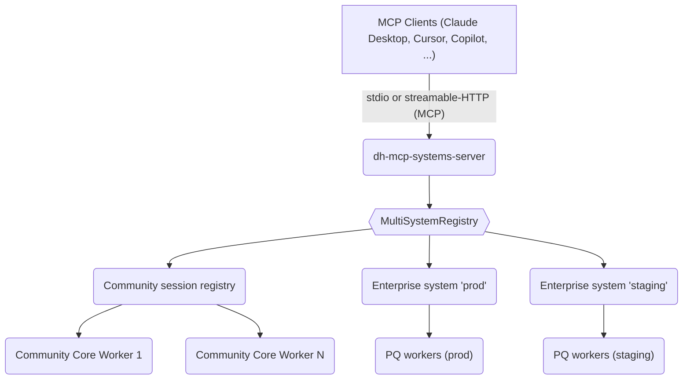
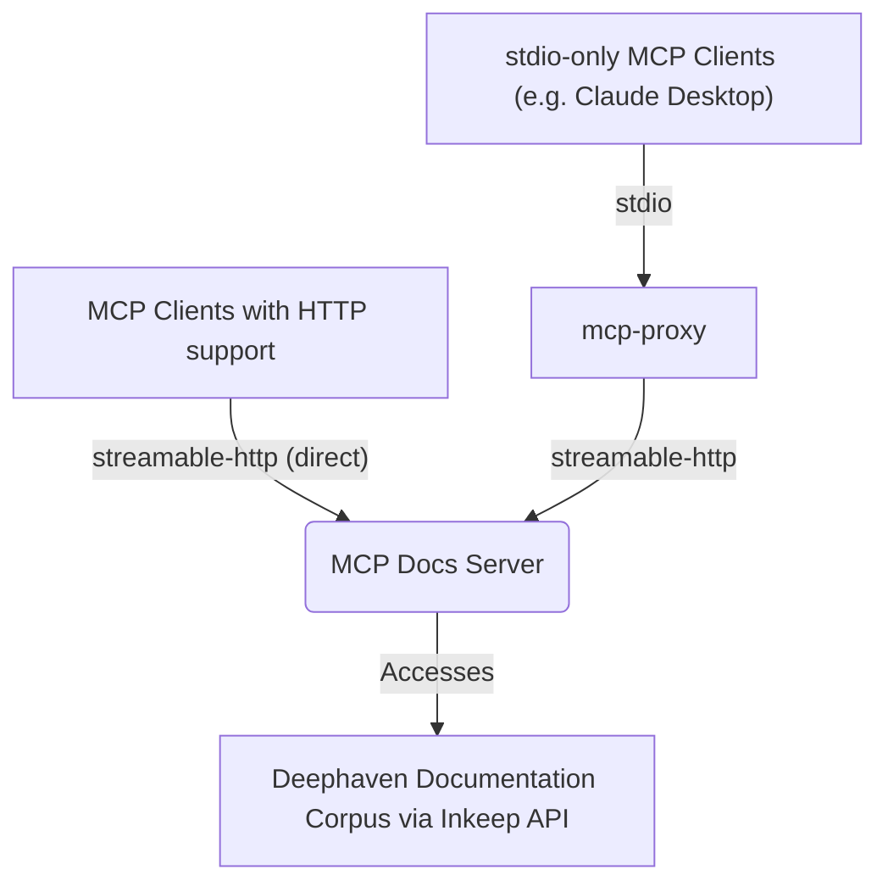

# deephaven-mcp

[](https://pypi.org/project/deephaven-mcp/)
[](https://github.com/deephaven/deephaven-mcp/blob/main/LICENSE)
[](https://github.com/deephaven/deephaven-mcp/actions/workflows/unit-tests.yml)

## Table of Contents

- [Overview](#overview)
- [Key Use Cases](#key-use-cases)
- [Quick Start](#quick-start)
  - [Community Core Quick Start](#community-core-quick-start)
  - [Enterprise Quick Start](#enterprise-quick-start)
- [Quick Upgrade](#quick-upgrade)
- [Deephaven MCP Components](#deephaven-mcp-components)
- [Available MCP Tools](#available-mcp-tools)
- [Architecture Diagrams](#architecture-diagrams)
- [Prerequisites](#prerequisites)
- [Installation & Initial Setup](#installation--initial-setup)
- [Configuration](#configuration)
- [AI Tool Setup](#ai-tool-setup)
- [Troubleshooting](#troubleshooting)
- [Contributing](#contributing)
- [Community & Support](#community--support)
- [License](#license)

---

## Overview

**Supercharge your AI workflows with real-time data.** Deephaven MCP brings the power of [live dataframes](https://deephaven.io) directly to your favorite AI tools — [Claude Desktop](https://claude.ai/download), [Cursor](https://www.cursor.com/), [VS Code (GitHub Copilot)](https://code.visualstudio.com/docs/copilot/overview), [Windsurf](https://windsurf.com/), and more.

### Why Deephaven MCP?

Most data tools force you to choose: **fast** or **real-time**. With Deephaven's revolutionary live dataframes, you get both. Process streaming data at millisecond speeds while your AI assistant helps you build, query, and analyze — all through natural language.

**🚀 What makes this different:**

- **Live Data, Live Results**: Query streaming Kafka, real-time feeds, and batch data as easily as static CSV files
- **AI-Native Integration**: Your AI assistant understands your data pipeline and can help optimize, debug, and extend it
- **Enterprise Ready**: Battle-tested on Wall Street for over a decade, now available for your team
- **Zero Learning Curve**: Write queries as if working with static tables — real-time updates happen automatically

Deephaven MCP implements the [Model Context Protocol (MCP)](https://spec.modelcontextprotocol.io/) standard using [FastMCP](https://github.com/modelcontextprotocol/python-sdk) to provide seamless integration between [Deephaven Community Core](https://deephaven.io/community/) and [Deephaven Enterprise](https://deephaven.io/enterprise/) systems and your AI development workflow. Perfect for data scientists, engineers, analysts, business users, and anyone who wants to harness real-time data—regardless of programming experience. Let AI generate the code while you focus on insights.

---

## Key Use Cases

- **AI-Assisted Development**: Integrate Deephaven with LLM-powered development tools (e.g., [Claude Desktop](https://www.anthropic.com/claude), [GitHub Copilot](https://github.com/features/copilot)) for AI-assisted data exploration, code generation, and analysis.
- **Multi-Environment Management**: Programmatically manage and query multiple Deephaven Community Core and Enterprise deployments from a single interface.
- **Interactive Documentation**: Quickly find information and examples from Deephaven documentation using natural language queries.
- **Script Automation**: Execute Python or Groovy scripts across multiple Deephaven sessions for data processing workflows.
- **Schema Discovery**: Automatically retrieve and analyze table schemas from connected Deephaven instances.
- **Environment Monitoring**: Monitor session health, package versions, and system status across your Deephaven infrastructure.

---

## Quick Start

Choose the quickstart for your Deephaven deployment type:

---

### Community Core Quick Start

**Get up and running in 5 minutes!** This quickstart assumes you have a local Deephaven Community Core instance running on `localhost:10000`. If you don't have one, [download and start Deephaven Community Core](https://deephaven.io/core/docs/getting-started/quickstart/) first.

#### 1. Install Deephaven MCP

Install with [`uv`](https://docs.astral.sh/uv/) (see [Prerequisites](#prerequisites) if you don't have it yet):

```bash
uv tool install --python-preference managed "deephaven-mcp[community]"
```

This places `dh-mcp-systems-server` and `dh-mcp-docs-server` on your PATH with no venv to manage. Use `"deephaven-mcp[community,enterprise]"` if you also need Deephaven Enterprise support. For full extras and the venv-based alternative, see [Installation & Initial Setup](#installation--initial-setup).

> **About `--python-preference managed`**: tells `uv` to download and use its own managed Python (under `~/.local/share/uv/python/`) instead of any Python on your system. You do not need to install Python yourself.

**For stdio-only AI tools** (e.g. Claude Desktop), also install [`mcp-proxy`](https://github.com/modelcontextprotocol/mcp-proxy) — it bridges a stdio-only client to HTTP MCP servers such as the hosted docs server:

```bash
uv tool install --python-preference managed mcp-proxy
```

#### 2. Create Configuration Directory

`dh-mcp-systems-server` reads a **directory tree** of small JSON files
(default `~/.deephaven/ai/config/` on POSIX, `%APPDATA%/Deephaven/ai/config/`
on Windows). A complete sample tree lives in
[`config-samples/ai/config/`](config-samples/ai/config/). For a minimal Community-only
setup, create a single per-session file:

```text
~/.deephaven/ai/config/
└── community/
    └── sessions/
        └── local.json   # filename stem == session name
```

```json5
// ~/.deephaven/ai/config/community/sessions/local.json
{
  "session_name": "local",        // must match the filename stem
  "host": "localhost",            // Server hostname or IP address
  "port": 10000,                  // Deephaven gRPC port (default: 10000)
  "auth": {
    "credentials": {
      "type": "psk",
      "token": "${env:DH_LOCAL_PSK}"   // export DH_LOCAL_PSK=your-token
    }
  }
}
```

For on-demand session creation, also add
`~/.deephaven/ai/config/community/settings.json` with a
`session_creation` block (see
[`docs/CONFIGURATION.md`](docs/CONFIGURATION.md)).

> **Security Note**: Lock down the configuration directory — the
> startup permission audit fails fast otherwise:
>
> ```sh
> chmod 700 ~/.deephaven/ai/config
> chmod 600 ~/.deephaven/ai/config/community/sessions/local.json
> ```

> **Dynamic Sessions**: The `session_creation` section enables on-demand [Community Core](https://deephaven.io/community/) session creation. Requirements: `deephaven-server` (installed in any Python venv) for the python method, or [Docker](https://www.docker.com/get-started/) for the docker method. See [`docs/CONFIGURATION.md`](docs/CONFIGURATION.md) for details.

#### 3. Start the Systems Server and Configure Your AI Tool

For desktop AI clients (Claude Desktop, Cursor, ...) the simplest
option is **stdio** — the client launches the server as a subprocess
and no port or PSK is involved. No background process is needed.

If you instead want to run the server as a long-lived HTTP service
(useful when sharing one server across several clients on the same
host), start it with `--transport http`:

```bash
export DH_MCP_PSK='your-shared-secret'    # referenced from server.json
dh-mcp-systems-server --transport http --port 8000 >dh-mcp-systems.log 2>&1 &
```

To check logs: `tail -f dh-mcp-systems.log`

To stop the server: `pkill -f dh-mcp-systems-server`

**For Claude Desktop**, open **Claude Desktop** → **Settings** → **Developer** → **Edit Config** and add (stdio variant; no separate process to start):

```json5
{
  "mcpServers": {
    "deephaven-systems": {
      "command": "dh-mcp-systems-server",
      "args": ["--transport", "stdio"]
    },
    "deephaven-docs": {
      "command": "mcp-proxy",
      "args": ["--transport=streamablehttp", "https://deephaven-mcp-docs-prod.dhc-demo.deephaven.io/mcp"]
    }
  }
}
```

> The default config directory is `~/.deephaven/ai/config/` (created in
> Step 2), so no `DH_MCP_DATA_DIR` is needed. To use a different location,
> add an `env` block setting `DH_MCP_DATA_DIR` to a data root that contains
> a `config/` subdirectory.

For an HTTP setup, replace the `deephaven-systems` stanza with one
that bridges through `mcp-proxy` and forwards the PSK header:

```json5
{
  "deephaven-systems": {
    "command": "mcp-proxy",
    "args": [
      "--transport=streamablehttp",
      "--header", "X-Deephaven-PSK=${DH_MCP_PSK}",
      "http://127.0.0.1:8000/mcp"
    ]
  }
}
```

> If `mcp-proxy` is reported missing, see [Setup Instructions by Tool](#setup-instructions-by-tool).

**For other tools**, see the [detailed setup instructions](#setup-instructions-by-tool) below.

#### 4. Try It Out

Restart your AI tool (or IDE) after starting the servers.

Confirm the setup is working by asking:

> "List my Deephaven sessions and show me the tables in the local session"

> "What Python packages are installed in my Deephaven environment?"

> "Execute this Python code in my Deephaven session: `t = empty_table(100).update('x=i', 'y=i*2')`"

**Need help?** Check the [Troubleshooting](#troubleshooting) section, ask the built-in docs server about Deephaven features, or join the [Deephaven Community Slack](https://deephaven.io/slack)!

---

### Enterprise Quick Start

**Get up and running in 5 minutes!** This quickstart assumes you have a Deephaven Enterprise system accessible at a known URL. Contact your Deephaven administrator for the `connection.json` URL and your credentials.

#### 1. Install Deephaven MCP

Install with [`uv`](https://docs.astral.sh/uv/) (see [Prerequisites](#prerequisites) if you don't have it yet):

```bash
uv tool install --python-preference managed "deephaven-mcp[enterprise]"
```

This places `dh-mcp-systems-server` and `dh-mcp-docs-server` on your PATH. Use `"deephaven-mcp[community,enterprise]"` if you also need Community Core support. For full extras and venv alternative, see [Installation & Initial Setup](#installation--initial-setup).

> **About `--python-preference managed`**: tells `uv` to download and use its own managed Python (under `~/.local/share/uv/python/`) instead of any Python on your system. You do not need to install Python yourself.

**For stdio-only AI tools** (e.g. Claude Desktop), also install [`mcp-proxy`](https://github.com/modelcontextprotocol/mcp-proxy) — it bridges a stdio-only client to HTTP MCP servers such as the hosted docs server:

```bash
uv tool install --python-preference managed mcp-proxy
```

#### 2. Create Configuration Directory

Create a per-system file under your configuration directory
(default `~/.deephaven/ai/config/`). Each enterprise system gets one
file under `enterprise/systems/`; the filename stem must equal
`system_name`. The systems server hosts every file it finds.

> **Server-stored credentials.** The systems server holds the
> credentials needed to talk to the Core+ controller, expressed as a
> discriminated `auth.credentials` block (`type: "password"` or
> `type: "private_key"`). Secret material uses templating —
> `${env:VAR}` reads from an environment variable, `${file:/path}`
> reads from a file. MCP clients themselves do **not** send
> per-request Deephaven credentials — HTTP-transport requests are
> gated by a single PSK in `server.json`.

**Password auth (with the secret read from an env var):**

```json5
// ~/.deephaven/ai/config/enterprise/systems/prod.json
{
  "system_name": "prod",                                          // must match the filename stem
  "connection_json_url": "https://dhe.example.com/iris/connection.json",
  "auth": {
    "credentials": {
      "type": "password",
      "username": "iris",
      "password": "${env:DH_PROD_PASSWORD}"   // export DH_PROD_PASSWORD=...
    }
  }
}
```

**Private-key auth:**

```json5
// ~/.deephaven/ai/config/enterprise/systems/prod.json
{
  "system_name": "prod",
  "connection_json_url": "https://dhe.example.com/iris/connection.json",
  "auth": {
    "credentials": {
      "type": "private_key",
      "key_text": "${file:/etc/deephaven/prod-key.pem}"
    }
  }
}
```

> **Security Note**: Lock down the configuration directory — the
> startup permission audit fails fast otherwise:
>
> ```sh
> chmod 700 ~/.deephaven/ai/config
> chmod 600 ~/.deephaven/ai/config/enterprise/systems/prod.json
> ```

#### 3. Start the Systems Server and Configure Your AI Tool

For desktop AI clients, the systems server runs as a stdio subprocess
launched by the client — no background process to start. For an
HTTP deployment:

```bash
export DH_MCP_PSK='your-shared-secret'
dh-mcp-systems-server --transport http --port 8000 >dh-mcp-systems.log 2>&1 &
```

To check logs: `tail -f dh-mcp-systems.log`

To stop the server: `pkill -f dh-mcp-systems-server`

> **Multiple DHE systems**: Drop one
> `~/.deephaven/ai/config/enterprise/systems/<name>.json` per system
> into the directory — the single `dh-mcp-systems-server` instance
> hosts them all.

**For Claude Desktop**, open **Claude Desktop** → **Settings** → **Developer** → **Edit Config** and add (stdio variant):

```json5
{
  "mcpServers": {
    "deephaven-systems": {
      "command": "dh-mcp-systems-server",
      "args": ["--transport", "stdio"]
    },
    "deephaven-docs": {
      "command": "mcp-proxy",
      "args": ["--transport=streamablehttp", "https://deephaven-mcp-docs-prod.dhc-demo.deephaven.io/mcp"]
    }
  }
}
```

> The default config directory is `~/.deephaven/ai/config/` (created in
> Step 2), so no `DH_MCP_DATA_DIR` is needed. To use a different location,
> add an `env` block setting `DH_MCP_DATA_DIR` to a data root that contains
> a `config/` subdirectory.

Or, for an HTTP-bridged setup, use:

```json5
{
  "deephaven-systems": {
    "command": "mcp-proxy",
    "args": [
      "--transport=streamablehttp",
      "--header", "X-Deephaven-PSK=${DH_MCP_PSK}",
      "http://127.0.0.1:8000/mcp"
    ]
  }
}
```

> If `mcp-proxy` is reported missing, see [Setup Instructions by Tool](#setup-instructions-by-tool).

**For other tools**, see the [detailed setup instructions](#setup-instructions-by-tool) below.

#### 4. Try It Out

Restart your AI tool (or IDE) after starting the server.

Confirm the setup is working by asking:

> "What is the status of my Deephaven Enterprise system?"

> "List all persistent queries on my enterprise system"

> "Show me the tables available in my enterprise session"

**Need help?** Check the [Troubleshooting](#troubleshooting) section, ask the built-in docs server about Deephaven features, or join the [Deephaven Community Slack](https://deephaven.io/slack)!

---

## Quick Upgrade

**Already have `deephaven-mcp` installed?** Here's how to upgrade:

**Using `uv tool` (recommended):**

```bash
uv tool upgrade deephaven-mcp
```

**Using `uv pip` (venv-based install):**

```bash
uv pip install --upgrade "deephaven-mcp[community,enterprise]"
```

**Using standard `pip` (venv-based install):**

```bash
.venv/bin/pip install --upgrade "deephaven-mcp[community,enterprise]"
```

After upgrading, restart your AI tool for changes to take effect.

---

## Deephaven MCP Components

### Local CLI (`dh-mcp`)

A thin local client for the systems server. The `dh-mcp` console
script auto-spawns a per-user background daemon on first use,
discovers it via a `daemon.json` registry under the runtime
directory, and dispatches MCP tool calls over loopback HTTP with a
random PSK. Beyond the raw `dh-mcp tool call` escape hatch, it offers
friendly noun-verb commands — `session`, `system`, `table`, `script`,
`catalog`, and `pq` — with typed flags, shaped output, and
`-o human|json|yaml` (e.g. `dh-mcp session list`,
`dh-mcp session open <id>`). Useful for shell scripting, tool
exploration, and local debugging without managing a server lifecycle
yourself. See [`docs/CLI.md`](docs/CLI.md) for the full reference.

### Systems Server (`dh-mcp-systems-server`)

A single multiplexed binary that hosts every configured Community
session **and** every Enterprise system in one process. Tools that
operate on a specific Enterprise system take a `system` argument; PQ
tools encode the system in the PQ id (form `<system>:<serial>`).

**Key Capabilities (Community side):**

- **Session Management**: List, monitor, and get detailed status of all configured DHC sessions
- **Community Session Creation**: Dynamically launch new Community Core sessions via Docker or python with configurable resources
- **Table Discovery**: Lightweight table name listing and comprehensive schema retrieval
- **Table Operations**: Retrieve table schemas, metadata, and actual data with flexible formatting
- **Script Execution**: Run Python or Groovy scripts directly on Deephaven sessions
- **Package Management**: Query installed Python packages in session environments

**Key Capabilities (Enterprise side):**

- **System Discovery**: List every configured Community session and Enterprise system (`list_systems`)
- **Enterprise System Status**: Check status of any configured DHE system (`enterprise_systems_status(system)`)
- **Enterprise Session Management**: Create and delete enterprise worker sessions per system
- **Persistent Query Management**: Full lifecycle management of enterprise PQs across systems — create, start, stop, restart, modify, delete
- **Catalog Discovery**: Browse the enterprise catalog at table and namespace levels

> Configuration changes require a server restart — the previous
> `mcp_reload` tool has been removed.

---

## Available MCP Tools

All tools below are exposed by the single multiplexed
`dh-mcp-systems-server`. Tools that operate on a specific Enterprise
system take a required `system` argument; PQ tools encode the system
in the PQ id (form `<system>:<serial>`).

*System discovery:*

- `list_systems` - List every configured Community session and Enterprise system as `(name, type)` pairs
- `enterprise_systems_status(system)` - Report a configured DHE system's health (liveness) and any discovery errors

*Community sessions:*

- `session_community_create` - Dynamically launch Community Core sessions
- `session_community_delete(session_id)` - Delete a dynamically created session
- `session_community_credentials(session_id)` - Retrieve session credentials (subject to `security.credential_retrieval_mode`)

*Enterprise sessions:*

- `session_enterprise_create(system, ...)` - Create a worker session in the named DHE system
- `session_enterprise_delete(session_id)` - Delete an enterprise session

*Persistent Query (PQ) Management:*

- `pq_name_to_id(system, name)` - Convert a PQ name to its canonical `pq_id`
- `pq_list(system)` - List all persistent queries in a system
- `pq_details(pq_id)` - Get detailed PQ information (`pq_id` = `<system>:<serial>`)
- `pq_create(system, ...)` - Create a new persistent query
- `pq_modify(pq_id, ...)` - Modify an existing PQ's configuration
- `pq_start(pq_ids)` - Start PQs (parallel execution with configurable concurrency)
- `pq_stop(pq_ids)` - Stop running PQs (parallel execution with configurable concurrency)
- `pq_restart(pq_ids)` - Restart PQs (parallel execution with configurable concurrency)
- `pq_delete(pq_ids)` - Delete PQs (parallel execution with configurable concurrency)

**Parallel Batch Operations**: When operating on multiple PQs, `pq_start`, `pq_stop`, `pq_restart`, and `pq_delete` execute operations in parallel with a default concurrency limit of 20. This provides near-batch performance (~10x faster for large batches) while maintaining granular per-item error reporting for AI agents. The concurrency limit can be adjusted via the `max_concurrent` parameter to balance performance and server load.

*Catalog discovery:*

- `catalog_tables_list(session_id, ...)` - List catalog tables
- `catalog_namespaces_list(session_id, ...)` - Browse catalog namespaces
- `catalog_tables_schema(session_id, ...)` - Get catalog table schemas
- `catalog_table_sample(session_id, ...)` - Sample catalog table data

*Session & table operations (any session, community or enterprise):*

- `sessions_list` - List all sessions
- `session_details(session_id)` - Get detailed session information
- `session_tables_list(session_id)` - List available tables
- `session_tables_schema(session_id, ...)` - Get table schema information
- `session_table_data(session_id, ...)` - Retrieve table data with formatting options
- `session_script_run(session_id, ...)` - Execute Python/Groovy scripts
- `session_pip_list(session_id)` - Query installed packages

> For each tool's full parameters, return shape, and examples, run `dh-mcp tool show <name>` (or `dh-mcp tool list` to enumerate them) — see [`docs/CLI.md`](docs/CLI.md). The authoritative detail is each tool's source docstring, which is also what the command surfaces live.

---

### Docs Server

Connects to Deephaven's documentation knowledge base via [Inkeep](https://inkeep.com/) AI to answer questions about Deephaven features, APIs, and usage patterns. Ask questions in natural language and get specific answers with code examples and explanations.

---

## Architecture Diagrams

### Systems Server Architecture


```mermaid
graph TD
    A["MCP Clients (Claude Desktop, Cursor, Copilot, ...)"] --"stdio or streamable-HTTP (MCP)"--> S("dh-mcp-systems-server")
    S --> R{{"MultiSystemRegistry"}}
    R --> C("Community session registry")
    R --> E1("Enterprise system 'prod'")
    R --> E2("Enterprise system 'staging'")
    C --> CW1("Community Core Worker 1")
    C --> CW2("Community Core Worker N")
    E1 --> EP("PQ workers (prod)")
    E2 --> ES("PQ workers (staging)")
```

*A single `dh-mcp-systems-server` process composes one community child registry (when `community/sessions/` is non-empty) and one enterprise child registry per file under `enterprise/systems/`. Tools route to the right child based on either a `system` argument or the parsed prefix of a session/PQ id.*

### Docs Server Architecture


```mermaid
graph TD
    A["MCP Clients with HTTP support"] --"streamable-http (direct)"--> B("MCP Docs Server")
    C["stdio-only MCP Clients (e.g. Claude Desktop)"] --"stdio"--> D["mcp-proxy"]
    D --"streamable-http"--> B
    B --"Accesses"--> E["Deephaven Documentation Corpus via Inkeep API"]
```

*The hosted Docs Server speaks streamable-HTTP. Clients with native HTTP MCP support connect directly; stdio-only clients (e.g. Claude Desktop) bridge through [`mcp-proxy`](https://github.com/modelcontextprotocol/mcp-proxy).*

---

## Prerequisites

- **[`uv`](https://docs.astral.sh/uv/) (Recommended)**: Used for `uv tool install`, which puts the server commands on your PATH with no venv to manage. Install it via `pip install uv` or the [uv installation guide](https://docs.astral.sh/uv/getting-started/installation/). After installing tools, you may need to run `uv tool update-shell` and open a new terminal so the uv tool bin directory is on your `PATH` (this directory — typically `~/.local/bin` on macOS/Linux or `%LOCALAPPDATA%\uv\bin\` on Windows — is not on the default shell `PATH` everywhere).
- **Python**: Version 3.12 or higher. uv downloads its own managed Python automatically via `--python-preference managed` — no separate Python installation required. ([Download Python](https://www.python.org/downloads/) only needed for non-uv workflows)
- **Docker (Optional)**: Required for Docker-based community session creation. ([Download Docker](https://www.docker.com/get-started/))
- **Access to Deephaven systems:** To use the MCP servers, you will need one or more of the following:
  - **[Deephaven Community Core](https://deephaven.io/community/) instance(s):** For development and personal use.
  - **[Deephaven Enterprise](https://deephaven.io/enterprise/) system(s):** For enterprise-level features and capabilities.
- **Configuration Files**: Each integration requires proper configuration files (specific locations detailed in each integration section)

---

## Installation & Initial Setup

> **Quick Path**: For a fast getting-started experience, see the [Quick Start](#quick-start) guide above. This section provides additional installation details and alternative methods.

The recommended way to install `deephaven-mcp` is from [PyPI](https://pypi.org/project/deephaven-mcp/), which provides the latest stable release.

### Installation Methods

#### Using `uv tool install` (Recommended)

[`uv`](https://github.com/astral-sh/uv) is a high-performance Python package manager. `uv tool install` places the server commands directly on your PATH in an isolated, managed environment — no venv to create or activate.

**Install uv** (if you don't have it):

```sh
pip install uv
```

Or see the [uv installation guide](https://docs.astral.sh/uv/getting-started/installation/) for other options.

**Install deephaven-mcp as a tool:**

```sh
uv tool install --python-preference managed "deephaven-mcp[community,enterprise]"
```

After this command, `dh-mcp-systems-server` and `dh-mcp-docs-server` are available on your PATH.

> **About `--python-preference managed`**: this flag tells `uv` to download and use its own managed Python interpreter (stored under `~/.local/share/uv/python/`) rather than any Python already on your system. The tool environment is unaffected if your system Python is upgraded, moved, or removed; `uv` picks the latest Python version compatible with the package's `requires-python`. Recommended for everyone — you do not need to install Python yourself.

**Where tools are installed:**

| Platform | Scripts (on PATH) | Tool environment |
|----------|-------------------|-----------------|
| macOS/Linux | `~/.local/bin/` | `~/.local/share/uv/tools/deephaven-mcp/` |
| Windows | `%LOCALAPPDATA%\uv\bin\` | `%APPDATA%\uv\tools\deephaven-mcp\` |

Run `uv tool dir` to find the tool environment root on your system.

**Choose your extras:**

| Extra | Provides |
|-------|----------|
| `[community]` | Python-based Community Core session creation (no Docker) |
| `[enterprise]` | Deephaven Enterprise (Core+) system connectivity |
| `[community,enterprise]` | Both (recommended default) |
| `[test]` | Testing framework and utilities |
| `[lint]` | Code quality tools (linting, formatting, type checking) |
| `[dev]` | Full development environment (all of the above) |

New to [`uv`](https://github.com/astral-sh/uv)? See the [`uv` crash course](docs/UV.md) for a quick orientation.

#### Alternative: Using `uv pip` or standard `pip` with a venv

If you prefer a manual venv (for example, when developing or testing):

```sh
# Create virtual environment with Python 3.12+
uv venv .venv -p 3.12

# Install deephaven-mcp
uv pip install "deephaven-mcp[community,enterprise]"
```

Or with standard pip:

```sh
python3.12 -m venv .venv
.venv/bin/pip install "deephaven-mcp[community,enterprise]"
```

When using a venv, use the full path to executables (e.g., `.venv/bin/dh-mcp-systems-server`).

---

## Configuration

`dh-mcp-systems-server` reads a directory tree of small JSON / JSON5
files. Resolution order: `--config-dir` flag, then
`$DH_MCP_DATA_DIR/config/`, then the platform default user-data
root's `config/` subdirectory (`~/.deephaven/ai/config/` on POSIX or
`%APPDATA%/Deephaven/ai/config/` on Windows). The Quick Start
sections above show minimal Community and Enterprise examples; this
section orients you to the rest of the tree.

```text
config_dir/
├── server.json                      # transport / host / port / PSK (HTTP only)
├── community/
│   ├── settings.json                # community-wide globals (optional)
│   └── sessions/
│       └── <name>.json              # one file per static session
└── enterprise/
    ├── settings.json                # enterprise-wide globals (optional)
    └── systems/
        └── <name>.json              # one file per enterprise system
```

Filename stems must equal the `session_name` / `system_name` field
inside each file. The startup permission audit requires the directory
to be locked down (POSIX strict, Windows best-effort) — see
[`docs/SECURITY.md`](docs/SECURITY.md).

**Full reference**:
[`docs/CONFIGURATION.md`](docs/CONFIGURATION.md) is the single source
of truth for the schema — every supported field, every authentication
type, the `${env:VAR}` / `${file:/path}` templating syntax, the
`session_creation` block for on-demand Community sessions, and the
`server.json` transport / PSK options.

**Working examples**:
[`config-samples/ai/config/`](config-samples/ai/config/) contains a complete,
copy-pasteable sample tree for both Community and Enterprise.

**Security**: [`docs/SECURITY.md`](docs/SECURITY.md) covers directory
permissions, PSK handling, and credential templating in detail.

---

## AI Tool Setup

This section explains how to connect Deephaven to your AI assistant or IDE. The single multiplexed `dh-mcp-systems-server` supports **stdio** (default; the AI client launches the server as a subprocess) and **streamable-HTTP** (loopback-only, gated by a PSK).

### How It Works

1. Decide whether to run the server as a stdio subprocess of the AI client (simplest) or as a long-lived HTTP service shared across clients on the same host.
2. Configure your AI tool's MCP block accordingly — stdio stanzas spawn the binary directly, HTTP stanzas point to `http://127.0.0.1:<port>/mcp` and inject the PSK via the `X-Deephaven-PSK` header.
3. Restart your AI tool if needed to pick up configuration changes.

**Starting an HTTP server in the background:**

Redirect logs to a named file so they don't get lost.

```bash
export DH_MCP_PSK='your-shared-secret'
dh-mcp-systems-server --transport http --port 8000 >dh-mcp-systems.log 2>&1 &
```

**Stopping a background server:**

```bash
# By process name
pkill -f dh-mcp-systems-server

# Or stop a specific port (e.g., port 8000)
kill $(lsof -ti tcp:8000)
```

**Following logs in real time:**

```bash
tail -f dh-mcp-systems.log
```

### Setup Instructions by Tool

#### Claude Desktop

Claude Desktop uses stdio transport. The simplest setup is to let it
launch `dh-mcp-systems-server` directly via stdio — no `mcp-proxy`,
no HTTP server, no PSK to manage.

Open **Claude Desktop** → **Settings** → **Developer** → **Edit Config** and add:

```json5
{
  "mcpServers": {
    "deephaven-systems": {
      "command": "dh-mcp-systems-server",
      "args": ["--transport", "stdio"]
    },
    "deephaven-docs": {
      "command": "mcp-proxy",
      "args": ["--transport=streamablehttp", "https://deephaven-mcp-docs-prod.dhc-demo.deephaven.io/mcp"]
    }
  }
}
```

> The systems server reads the default config directory
> `~/.deephaven/ai/config/`; add an `env` block setting `DH_MCP_DATA_DIR`
> only to point at a non-default data root (which must contain a `config/`
> subdirectory).

If you instead want to share a single HTTP-transport server across
several clients, install `mcp-proxy` (see
[Quick Start](#quick-start)) and bridge through it, forwarding the
PSK header on every request:

```json5
{
  "mcpServers": {
    "deephaven-systems": {
      "command": "mcp-proxy",
      "args": [
        "--transport=streamablehttp",
        "--header", "X-Deephaven-PSK=${DH_MCP_PSK}",
        "http://127.0.0.1:8000/mcp"
      ]
    }
  }
}
```

> If your AI tool reports that `mcp-proxy` or `dh-mcp-systems-server`
> is not found, locate it with `which <name>` (macOS/Linux) or
> `where <name>` / `Get-Command <name>` (Windows cmd.exe / PowerShell),
> and use the full path as the `command` value.

**Additional Resources:**

- [MCP User Quickstart Guide](https://modelcontextprotocol.io/quickstart/user)
- [MCP Troubleshooting guide](https://modelcontextprotocol.io/docs/concepts/transports#troubleshooting)
- [Claude Desktop MCP Troubleshooting guide](https://support.anthropic.com/en/articles/10949351-getting-started-with-local-mcp-servers-on-claude-desktop)

#### Cursor

Cursor supports HTTP MCP servers. Create or edit an MCP configuration file:

- **Project-specific**: `.cursor/mcp.json` in your project root
- **Global**: `~/.cursor/mcp.json` for all projects

```json5
{
  "mcpServers": {
    "deephaven-systems": {
      "type": "http",
      "url": "http://127.0.0.1:8000/mcp",
      "headers": { "X-Deephaven-PSK": "${DH_MCP_PSK}" }
    },
    "deephaven-docs": {
      "type": "http",
      "url": "https://deephaven-mcp-docs-prod.dhc-demo.deephaven.io/mcp"
    }
  }
}
```

**Additional Resources:**

- [Cursor MCP documentation](https://docs.cursor.com/en/context/mcp)

#### VS Code (GitHub Copilot)

VS Code supports HTTP MCP servers natively. To add MCP servers to your workspace, run the **MCP: Add Server** command from the Command Palette (Cmd-Shift-P), then select **Workspace Settings** to create the `.vscode/mcp.json` file. Alternatively, create `.vscode/mcp.json` manually in your project root.

Configure your servers:

```json5
{
  "servers": {
    "deephaven-systems": {
      "type": "http",
      "url": "http://127.0.0.1:8000/mcp",
      "headers": { "X-Deephaven-PSK": "${DH_MCP_PSK}" }
    },
    "deephaven-docs": {
      "type": "http",
      "url": "https://deephaven-mcp-docs-prod.dhc-demo.deephaven.io/mcp"
    }
  }
}
```

You will see the MCP servers listed in the Extensions sidebar under "MCP Servers".

**Additional Resources:**

- [VS Code MCP documentation](https://code.visualstudio.com/docs/copilot/chat/mcp-servers)
- [VS Code MCP Configuration format reference](https://code.visualstudio.com/docs/copilot/chat/mcp-servers#_configuration-format)
- [VS Code MCP Troubleshooting guide](https://code.visualstudio.com/docs/copilot/chat/mcp-servers#_troubleshoot-and-debug-mcp-servers)

#### Windsurf

Windsurf supports HTTP MCP servers natively. Go to **Windsurf Settings** > **Cascade** > **MCP Servers** > **Manage MCPs** > **View Raw Config** to open `~/.codeium/windsurf/mcp_config.json` for editing.

```json5
{
  "mcpServers": {
    "deephaven-systems": {
      "serverUrl": "http://127.0.0.1:8000/mcp",
      "headers": { "X-Deephaven-PSK": "${DH_MCP_PSK}" }
    },
    "deephaven-docs": {
      "serverUrl": "https://deephaven-mcp-docs-prod.dhc-demo.deephaven.io/mcp"
    }
  }
}
```

**Additional Resources:**

- [Windsurf MCP documentation](https://docs.windsurf.com/windsurf/cascade/mcp)
- [Windsurf MCP Troubleshooting guide](https://docs.windsurf.com/troubleshooting/windsurf-common-issues)

---

## Troubleshooting

This section provides comprehensive guidance for diagnosing and resolving common issues with Deephaven MCP setup and operation. Issues are organized by category, starting with the most frequently encountered problems.

### Quick Fixes

Before diving into detailed troubleshooting, try these common solutions:

1. **Restart your IDE/AI assistant** after any configuration changes
2. **Check that file paths are correct** in your JSON configurations (use absolute paths for venv-based installs)
3. **Verify your virtual environment is activated** when running commands (venv-based installs only — not needed with `uv tool install`)
4. **Validate JSON syntax** using [https://jsonlint.com](https://jsonlint.com/) or your IDE's JSON validator

### Common Error Messages

| Error | Where You'll See This | Solution |
|-------|----------------------|----------|
| `spawn mcp-proxy ENOENT` | AI tool logs | Run `uv tool install --python-preference managed mcp-proxy` first; if the tool still can't find it, locate it with `which mcp-proxy` (macOS/Linux) or `where mcp-proxy` / `Get-Command mcp-proxy` (Windows) and use the full path as the `command` |
| `Connection failed` | MCP server logs | Check internet connection and server URLs |
| `Config directory not found` / permissions audit failure | MCP server startup | Verify the directory passed via `--config-dir` (or derived from `DH_MCP_DATA_DIR`) exists and that every file is `chmod 600` and the directory is `chmod 700` (POSIX). |
| `Permission denied` | Command execution | Ensure executable has proper permissions; run `chmod +x` on the `mcp-proxy` path |
| `Python version error` | uv tool install | Deephaven MCP requires Python 3.12+; use `uv tool install --python-preference managed ...` |
| `JSON parse error` | IDE/AI assistant logs | Fix JSON syntax errors in configuration files |
| `Module not found: deephaven_mcp` | MCP server logs | Re-run `uv tool install --python-preference managed "deephaven-mcp[community,enterprise]"` |
| `Invalid session_id format` | MCP tool responses | Community: `community:community:{name}`; Enterprise: `enterprise:{system_name}:{name}` |
| `Invalid pq_id` | MCP tool responses | PQ ids are `<system>:<serial>` where `<serial>` is a positive integer. |
| `Enterprise system 'foo' is not configured` | MCP tool responses | The `system` argument does not match any file under `enterprise/systems/`. The error lists configured systems. |
| HTTP `401`/`403` from the server | HTTP transport | The `X-Deephaven-PSK` header is missing or does not match `server.json`. Restart the server after editing the PSK. |
| HTTP server refuses to start with a loopback error | systems-server startup | `--host` was set to a non-loopback address. The HTTP transport binds only to `127.0.0.1` / `::1` / `localhost`; terminate TLS at a reverse proxy on the same host instead. |

### JSON Configuration Issues

**Most configuration problems stem from JSON syntax errors or incorrect paths:**

- **Invalid JSON Syntax:**
  - Missing or extra commas, brackets, or quotes
  - Use [JSON validator](https://jsonlint.com/) to check syntax
  - Common mistake: trailing comma in last object property

- **Incorrect File Paths:**
  - Use **absolute paths** for venv-based installs; with `uv tool install`, the `command` is just the bare executable name (e.g. `dh-mcp-systems-server`)
  - Use forward slashes `/` even on Windows in JSON
  - Verify files exist at the specified paths

- **Environment Variable Issues:**
  - `DH_MCP_DATA_DIR` must point to a valid user-data root *directory* (under which `config/` and `runtime/` live), or be unset to use the platform default
  - Environment variables in `env` block must use correct names
  - Sensitive values should use environment variables, not hardcoded strings

### LLM Tool Connection Issues

- **LLM Tool Can't Connect / Server Not Found:**
  - Verify the MCP server is running and listening on the expected port (HTTP transport only)
  - Verify the URL in your MCP client config matches the server's host and port
  - Ensure `DH_MCP_DATA_DIR` or `--config-dir` points to a valid configuration source (or unset both to use the platform default)
  - For HTTP transport, ensure your client sends the `X-Deephaven-PSK` header with the value declared in `server.json`
  - Ensure any [Deephaven Community Core](https://deephaven.io/community/) sessions you intend to use are running and network-accessible
  - Check for typos in server URLs or config paths
  - Set `PYTHONLOGLEVEL=DEBUG` to get more detailed logs from the MCP server

### Network and Firewall Issues

- **Firewall or Network Issues:**
  - Ensure that there are no firewall rules (local or network) preventing:
    - The MCP server from connecting to your Deephaven instances on their specified hosts and ports.
    - Your MCP client from reaching the systems server's HTTP endpoint (e.g., `http://127.0.0.1:8000/mcp`).
    - Your MCP client from reaching the Docs Server at `https://deephaven-mcp-docs-prod.dhc-demo.deephaven.io`.
  - Test basic network connectivity (e.g., using [`ping`](https://en.wikipedia.org/wiki/Ping_(networking_utility)) or [`curl`](https://curl.se/docs/manpage.html) from the relevant machine) if connections are failing.

### Command and Path Issues

- **`command not found` for [`uv`](docs/UV.md) (in LLM tool logs):**
  - Ensure [`uv`](docs/UV.md) is installed and its installation directory is in your system's `PATH` environment variable, accessible by the LLM tool.
- **`command not found` for `dh-mcp-systems-server` or `dh-mcp-docs-server`:**
  - **If you used `uv tool install` (recommended):** Reinstall (or upgrade) with `uv tool install --python-preference managed "deephaven-mcp[community,enterprise]"` (or `uv tool upgrade deephaven-mcp`). Then make sure the uv tool bin directory is on your `PATH` — run `uv tool update-shell` and open a new shell, or locate the binary with `which dh-mcp-systems-server` (macOS/Linux) or `where dh-mcp-systems-server` / `Get-Command dh-mcp-systems-server` (Windows).
  - **If you used a virtual environment (alternative install):** Ensure the package is installed in the venv with `uv pip install "deephaven-mcp[community,enterprise]"`, and either activate the venv or use the full path to the executable (e.g. `.venv/bin/dh-mcp-systems-server`).

### Installation and Dependency Issues

- **`Module not found: deephaven_mcp` / commands missing after install:**
  - **`uv tool install` users:** Reinstall with `uv tool install --python-preference managed "deephaven-mcp[community,enterprise]"`. The tool install is self-contained — there is no user-managed venv to activate.
  - **Virtual environment users:** Make sure the venv is activated (your shell prompt should show its name) before running commands, or invoke commands via `uv run ...` / the full `.venv/bin/...` path.

- **Dependency Installation Problems:**
  - **Missing Dependencies (`uv tool install` users):** Re-run `uv tool install --python-preference managed "deephaven-mcp[community,enterprise]"` to refresh the isolated tool environment, or `uv tool upgrade deephaven-mcp` to pick up a newer release.
  - **Missing Dependencies (venv users):** Reinstall with the correct extras: `uv pip install "deephaven-mcp[community,enterprise]"`.
  - **Version Conflicts:** `uv tool install` runs in an isolated environment, so cross-package conflicts are rare; for venv installs, check for conflicting package versions in your environment.
  - **Platform-Specific Issues:** Some packages may require platform-specific compilation.

- **Python Version Compatibility:**
  - Deephaven MCP requires Python 3.12 or higher.
  - Check your Python version: `python --version`.
  - **`uv tool install` users:** Pass `--python-preference managed` (as the documented commands do) to let uv manage a compatible interpreter automatically; if you previously installed with a different Python, reinstall the tool.
  - **Virtual environment users:** Ensure your venv uses Python 3.12+ (e.g. `uv venv .venv -p 3.12`).

### Server and Environment Issues

- **Server Startup Failures:**
  - **Python Errors:** Check server logs for Python tracebacks and ensure dependencies are installed correctly
  - **Permission Issues:** Ensure the MCP server process has necessary file and network permissions
  - **Path Issues:** Verify all executable paths in configuration are correct and accessible

- **Runtime Issues:**
  - **Coroutine errors:** Restart the MCP server after making code changes
  - **Memory issues:** Monitor server resource usage, especially with large datasets
  - **Cache issues:** Clear Python cache files if experiencing persistent issues:

    ```bash
    find . -name "*.pyc" -delete
    ```

- **uv-Specific Issues:**
  - **Command failures:** Ensure `uv` is installed and `pyproject.toml` is properly configured
  - **Path issues:** Verify `uv` is in your system's `PATH` environment variable
  - **Project detection:** Run `uv` commands from the project root directory

### Deephaven Session Configuration Issues

- **Session Connection Failures:**
  - Verify your config file syntax and content — see [`docs/CONFIGURATION.md`](docs/CONFIGURATION.md)
  - Check [`docs/CONFIGURATION.md`](docs/CONFIGURATION.md) for any required environment variables referenced via `${env:VAR}` templating
  - Ensure target Deephaven instances are running and network-accessible
  - Check that the MCP server process has read permissions for every file under the configuration directory

- **Session ID Format Issues:**
  - Use the correct format: `{type}:{system}:{session_name}`
  - Examples: `community:community:my_session`, `enterprise:prod:analytics`
  - PQ ids use the simpler form `<system>:<serial>` (e.g. `prod:42`) and route to the right enterprise system automatically
  - Avoid special characters or spaces in session names

- **Authentication Problems:**
  - **Community sessions:** Verify connection URLs and the `auth.credentials` block — see [`docs/CONFIGURATION.md`](docs/CONFIGURATION.md)
  - **Enterprise sessions:** Check the per-system `auth.credentials` block (discriminated by `type`: `password` or `private_key`) — see [`docs/CONFIGURATION.md`](docs/CONFIGURATION.md)
  - **Templating:** Ensure any `${env:VAR}` / `${file:/path}` references resolve at startup — see [`docs/CONFIGURATION.md`](docs/CONFIGURATION.md)
  - **Security:** See [`docs/SECURITY.md`](docs/SECURITY.md) for credential handling and directory permissions

### Platform-Specific Notes

- **Windows:** use forward slashes `/` in JSON file paths; venv executables live under `.venv\Scripts\` rather than `.venv/bin/`.
- **macOS:** Gatekeeper may block unsigned executables on first run; allow them via System Settings or `xattr -d com.apple.quarantine <path>`.

### Log Analysis and Debugging

**Log File Locations:**

- **Claude Desktop:** macOS `~/Library/Logs/Claude/`, Windows `%APPDATA%\Claude\logs\` — `mcp.log` holds general MCP connection logging; `mcp-server-<name>.log` holds each server's stderr.
- **VS Code/Copilot:** Check VS Code's Output panel and Developer Console
- **Cursor IDE:** Check the IDE's log panel and developer tools
- **Windsurf IDE:** Check the IDE's integrated terminal and log outputs

**What to Look For in Logs:**

- **Startup errors:** Python tracebacks, missing modules, permission denied
- **Connection errors:** Network timeouts, refused connections, DNS resolution failures
- **Configuration errors:** JSON parsing errors, invalid paths, missing environment variables
- **Runtime errors:** Unexpected exceptions, resource exhaustion, timeout errors

**Enabling Debug Logging:**

Set `PYTHONLOGLEVEL=DEBUG` in your shell before starting the server for detailed logging:

```bash
PYTHONLOGLEVEL=DEBUG dh-mcp-systems-server --transport http --port 8000
```

### When to Seek Help

If you've tried the above solutions and are still experiencing issues:

1. **Gather Information:**
   - Error messages from logs
   - Your configuration files (remove sensitive information)
   - System information (OS, Python version, package versions)
   - Steps to reproduce the issue

2. **Check Documentation:**
   - Review the [Developer Guide](docs/DEVELOPER_GUIDE.md) for advanced troubleshooting
   - Check the [GitHub Issues](https://github.com/deephaven/deephaven-mcp/issues) for similar problems

3. **Community Support:**
   - Post in [Deephaven Community Slack](https://deephaven.io/slack)
   - Create a GitHub issue with detailed information
   - Check [Deephaven Community Forums](https://github.com/deephaven/deephaven-core/discussions)

### IDE and AI Assistant Troubleshooting

For IDE and AI assistant troubleshooting, refer to the official documentation for each tool:

- **VS Code (GitHub Copilot)**: [VS Code MCP Troubleshooting guide](https://code.visualstudio.com/docs/copilot/chat/mcp-servers#_troubleshoot-and-debug-mcp-servers)
- **Cursor**: [Cursor MCP documentation](https://docs.cursor.com/en/context/mcp)
- **Claude Desktop**: [Claude Desktop MCP Troubleshooting guide](https://support.anthropic.com/en/articles/10949351-getting-started-with-local-mcp-servers-on-claude-desktop)
- **Windsurf**: [Windsurf MCP Troubleshooting guide](https://docs.windsurf.com/troubleshooting/windsurf-common-issues)

---

## Contributing

We warmly welcome contributions to Deephaven MCP! Whether it's bug reports, feature suggestions, documentation improvements, or code contributions, your help is valued.

**Where to Start:**

- **Reporting Issues**: Found a bug or have a feature request? Open an issue on GitHub: [https://github.com/deephaven/deephaven-mcp/issues](https://github.com/deephaven/deephaven-mcp/issues)
- **Contributing Guide**: See our [Contributing Guide](CONTRIBUTING.md) and [Code of Conduct](CODE_OF_CONDUCT.md) for guidelines on how to get involved.
- **Development Guide**: Looking to contribute code? See the [Developer & Contributor Guide](docs/DEVELOPER_GUIDE.md) for setup instructions, architecture details, and development workflows.

---

## Community & Support

- **GitHub Issues:** For bug reports and feature requests: [https://github.com/deephaven/deephaven-mcp/issues](https://github.com/deephaven/deephaven-mcp/issues)
- **Deephaven Community Slack:** Join the conversation and ask questions: [https://deephaven.io/slack](https://deephaven.io/slack)

**Additional Resources:**

- **Developer & Contributor Guide:** Detailed tool APIs, architecture, and development workflows — [docs/DEVELOPER_GUIDE.md](docs/DEVELOPER_GUIDE.md)
- **`uv` crash course:** Quick orientation for developers new to `uv` — [docs/UV.md](docs/UV.md)
- **Deephaven Documentation:** [deephaven.io/docs](https://deephaven.io/docs/) | [Community Core Python API](https://deephaven.io/core/pydoc/) | [Enterprise Python API](https://docs.deephaven.io/pycoreplus/latest/worker/)

---

## License

This project is licensed under the [Apache 2.0 License](./LICENSE). See the [LICENSE](./LICENSE) file for details.
