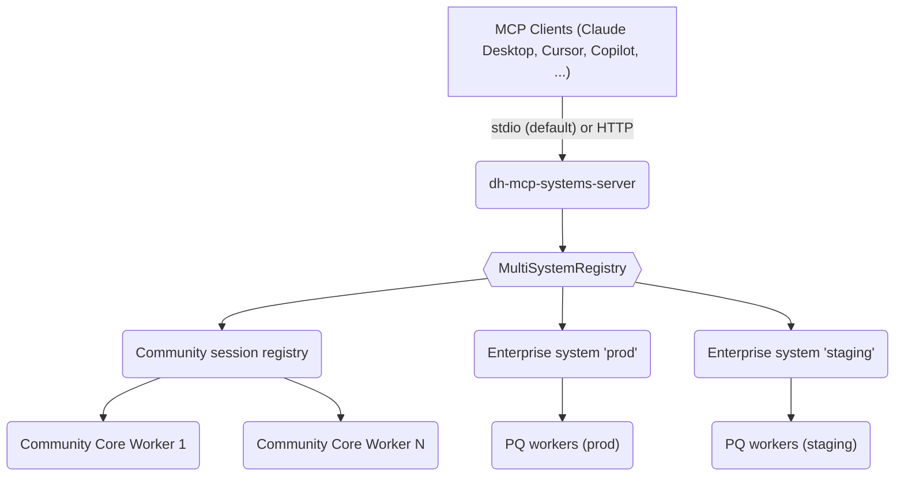
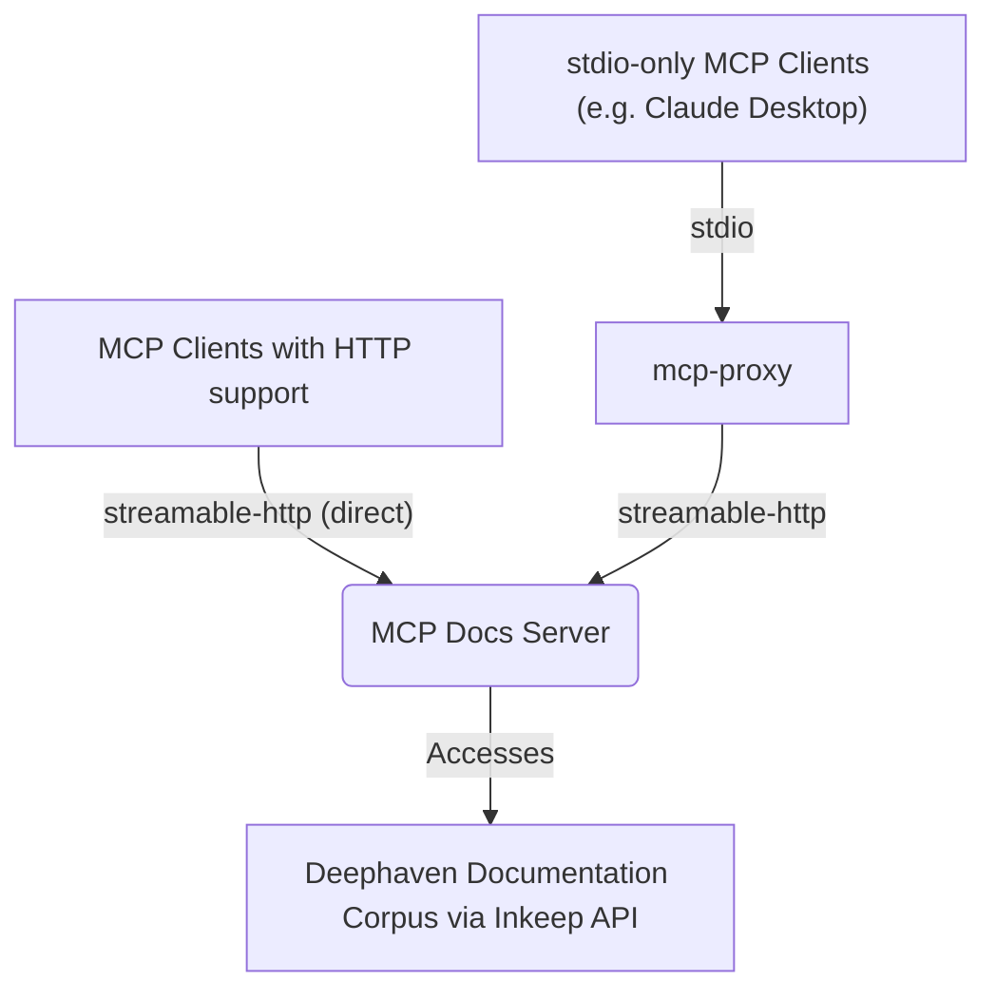

# deephaven-mcp

[](https://pypi.org/project/deephaven-mcp/)
[](https://github.com/deephaven/deephaven-mcp/blob/main/LICENSE)
[](https://github.com/deephaven/deephaven-mcp/actions/workflows/unit-tests.yml)

> **The `dhcli` command-line tool is under rapid development.** Command
> names, flags, and output shapes can change without notice, so an
> upgrade may break scripts written against them — pin a version if you
> need stability. AI agents need no such care: `dhcli` describes itself
> at runtime through `dhcli agents tree` and `--agents`, so an agent that
> reads that manifest adapts to the changes on its own.

## Table of Contents

- [Overview](#overview)
- [Key Use Cases](#key-use-cases)
- [Quick Start](#quick-start)
  - [Install Deephaven MCP](#install-deephaven-mcp)
  - [Community Core Quick Start](#community-core-quick-start)
  - [Enterprise Quick Start](#enterprise-quick-start)
- [Quick Upgrade](#quick-upgrade)
- [Deephaven MCP Components](#deephaven-mcp-components)
- [Available MCP Tools](#available-mcp-tools)
- [Architecture Diagrams](#architecture-diagrams)
- [Prerequisites](#prerequisites)
- [Installation & Initial Setup](#installation--initial-setup)
- [Configuration](#configuration)
- [AI Tool Setup](#ai-tool-setup)
- [Troubleshooting](#troubleshooting)
- [Contributing](#contributing)
- [Community & Support](#community--support)
- [License](#license)

---

## Overview

**Supercharge your AI workflows with real-time data.** Deephaven MCP brings the power of [live dataframes](https://deephaven.io) directly to your favorite AI tools — [Claude Desktop](https://claude.ai/download), [Cursor](https://www.cursor.com/), [VS Code (GitHub Copilot)](https://code.visualstudio.com/docs/copilot/overview), [Windsurf](https://windsurf.com/), and more.

### Why Deephaven MCP?

Most data tools force you to choose: **fast** or **real-time**. With Deephaven's revolutionary live dataframes, you get both. Process streaming data at millisecond speeds while your AI assistant helps you build, query, and analyze — all through natural language.

**What makes this different:**

- **Live Data, Live Results**: Query streaming Kafka, real-time feeds, and batch data as easily as static CSV files
- **AI-Native Integration**: Your AI assistant understands your data pipeline and can help optimize, debug, and extend it
- **Enterprise Ready**: Battle-tested on Wall Street for over a decade, now available for your team
- **Zero Learning Curve**: Write queries as if working with static tables — real-time updates happen automatically

Deephaven MCP implements the
[Model Context Protocol (MCP)](https://spec.modelcontextprotocol.io/)
standard using [FastMCP](https://github.com/modelcontextprotocol/python-sdk),
connecting [Deephaven Community Core](https://deephaven.io/community/) and
[Deephaven Enterprise](https://deephaven.io/enterprise/) to your AI
development workflow.

It is built for data scientists, engineers, analysts, and business users
alike — whatever your programming experience. Let AI generate the code
while you focus on insights.

---

## Key Use Cases

- **AI-Assisted Development**: Integrate Deephaven with LLM-powered development tools (e.g., [Claude Desktop](https://www.anthropic.com/claude), [GitHub Copilot](https://github.com/features/copilot)) for AI-assisted data exploration, code generation, and analysis.
- **Multi-Environment Management**: Programmatically manage and query multiple Deephaven Community Core and Enterprise deployments from a single interface.
- **Interactive Documentation**: Quickly find information and examples from Deephaven documentation using natural language queries.
- **Script Automation**: Execute Python or Groovy scripts across multiple Deephaven sessions for data processing workflows.
- **Schema Discovery**: Automatically retrieve and analyze table schemas from connected Deephaven instances.
- **Environment Monitoring**: Monitor session health, package versions, and system status across your Deephaven infrastructure.

---

## Quick Start

Deephaven MCP ships as a single package, and one `dh-mcp-systems-server` reads **one configuration directory tree**. That tree can hold a `community/` section, an `enterprise/` section, or **both at once** — the single server hosts everything it finds, simultaneously. Each section is optional; you are never locked into one deployment type.

The fastest on-ramp is the [Community Core quickstart](#community-core-quick-start) below. Once that works, [add Enterprise](#enterprise-quick-start) with one more command against the _same_ config tree — no second install, no second server. (If you only need Enterprise, start there instead; the steps stand alone.)

Install once (below), then configure whichever sections you need.

### Install Deephaven MCP

Install with [`uv`](https://docs.astral.sh/uv/) (see [Prerequisites](#prerequisites) if you don't have it yet):

```bash
uv tool install --python-preference managed "deephaven-mcp"
```

This places `dhcli`, `dh-mcp-systems-server`, and `dh-mcp-docs-server` on your PATH with no venv to manage. For the venv-based alternative, see [Installation & Initial Setup](#installation--initial-setup).

> **About `--python-preference managed`**: tells `uv` to download and use its own managed Python (under `~/.local/share/uv/python/`) instead of any Python on your system. You do not need to install Python yourself.

**For stdio-only AI tools** (e.g. Claude Desktop), also install [`mcp-proxy`](https://github.com/modelcontextprotocol/mcp-proxy) — it bridges a stdio-only client to HTTP MCP servers such as the hosted docs server:

```bash
uv tool install --python-preference managed mcp-proxy
```

---

### Community Core Quick Start

**Get up and running in 5 minutes!** All you need is
[`deephaven-mcp` installed](#install-deephaven-mcp) — you do **not** need
a running Deephaven server, because `dhcli` can start one for you.
Already running
[Deephaven Community Core](https://deephaven.io/core/docs/getting-started/quickstart/)?
You can point at it instead.

#### 1. Create Your Configuration

One command writes a working configuration:

```bash
dhcli config init
```

No prompts, nothing to edit by hand. You can now start a Deephaven worker
whenever you want one — no Docker, nothing else to install:

```bash
dhcli session create dev
```

See [Deephaven CLI (`dhcli`)](#deephaven-cli-dhcli) for what else `dhcli`
can do.

**Optional** — to use a Deephaven server you already run, add it:

```bash
dhcli config session add local --host localhost --port 10000 \
  --auth psk --token '${env:DH_LOCAL_PSK}'
```

The `${env:...}` form keeps your token out of the file, so set it in your
shell: `export DH_LOCAL_PSK='your-token'`. Use `--auth anonymous` if your
server needs no token.

To check your configuration at any time:

```bash
dhcli config validate
```

Exit code `0` means you are good to go. `dhcli config files` shows where
the files landed.

> **Where the files live**: `~/.deephaven/ai/config/` on POSIX,
> `%APPDATA%/Deephaven/ai/config/` on Windows. `dhcli config` sets the
> file permissions the server requires; if you hand-edit instead, apply
> `chmod 700` to the directory and `chmod 600` to every file. For every
> setting you can change, see
> [`docs/CONFIGURATION.md`](docs/CONFIGURATION.md) and the sample tree in
> [`config-samples/ai/config/`](config-samples/ai/config/).

#### 2. Check That It Works

Confirm the configuration is good before involving an AI tool. `dhcli` starts
its own background server, so there is nothing for you to launch:

```bash
dhcli config validate    # is the configuration itself well-formed?
dhcli session list       # can the server load it and see your session?
```

`config validate` checks the files alone. `session list` goes further: it
loads the tree and lists the sessions the server knows about. If your session
appears, both the configuration and the server are working, and anything that
goes wrong from here is in your AI-tool wiring. A bad configuration fails
immediately with an error naming the file and field.

#### 3. Connect Your AI Tool

Your AI tool starts the systems server for you and shuts it down when it
exits. There is no port to pick, no shared secret, and no background process
to manage.

**For Claude Desktop**, open **Claude Desktop** → **Settings** → **Developer** → **Edit Config** and add:

```json5
{
  mcpServers: {
    "deephaven-systems": {
      command: "dh-mcp-systems-server",
      args: ["--transport", "stdio"],
    },
    "deephaven-docs": {
      command: "mcp-proxy",
      args: [
        "--transport=streamablehttp",
        "https://deephaven-mcp-docs-prod.dhc-demo.deephaven.io/mcp",
      ],
    },
  },
}
```

The second entry, `deephaven-docs`, connects to Deephaven's hosted
documentation server so you can ask questions about Deephaven itself. Claude
Desktop reaches it through `mcp-proxy`, which you installed in
[Install Deephaven MCP](#install-deephaven-mcp).

> The default config directory is `~/.deephaven/ai/config/` (created in
> Step 1), so no `DH_AI_DATA_DIR` is needed. To use a different location,
> add an `env` block setting `DH_AI_DATA_DIR` to a data root that contains
> a `config/` subdirectory.

**Using something else?** See [Setup Instructions by Tool](#setup-instructions-by-tool)
for Cursor, VS Code, and Windsurf.

#### 4. Try It Out

Restart your AI tool (or IDE) so it picks up the new configuration.

Confirm the setup is working by asking:

> "List my Deephaven sessions and show me the tables in the local session"

> "What Python packages are installed in my Deephaven environment?"

> "Execute this Python code in my Deephaven session: `t = empty_table(100).update('x=i', 'y=i*2')`"

**Need help?** Check the [Troubleshooting](#troubleshooting) section, ask the hosted docs server about Deephaven features, or join the [Deephaven Community Slack](https://deephaven.io/slack)!

---

### Enterprise Quick Start

**Get up and running in 5 minutes!** You need
[`deephaven-mcp` installed](#install-deephaven-mcp) and a Deephaven
Enterprise system you can reach. Ask your Deephaven administrator for the
`connection.json` URL and your credentials.

> **Adding to an existing setup?** This is additive — not a separate
> install or a separate server. If you already ran the
> [Community Core quickstart](#community-core-quick-start), you are adding
> to the **same** config directory, and one `dh-mcp-systems-server` hosts
> your Community sessions and Enterprise systems together. If you skipped
> Community, this section stands alone.

#### 1. Create Your Configuration

One command declares your system. Each Enterprise system becomes one file
under `enterprise/systems/`.

**Password auth (with the secret read from an env var):**

```bash
dhcli config system add prod \
  --url https://dhe.example.com/iris/connection.json \
  --auth password --username iris --password '${env:DH_PROD_PASSWORD}'
```

**Private-key auth** — PEM text is multi-line, so reference the file:

```bash
dhcli config system add prod \
  --url https://dhe.example.com/iris/connection.json \
  --auth private_key --key '${file:/etc/deephaven/prod-key.pem}'
```

Omit any flag to be prompted for it on a terminal. Then verify:

```bash
export DH_PROD_PASSWORD='your-password'    # for the password-auth variant
dhcli config validate
```

Export the secret before running `validate` — it resolves `${env:...}`
references in your current shell. The name you pass becomes the filename,
so `prod` above creates `enterprise/systems/prod.json`. `community` is
reserved and cannot be used as a system name.

> **Multiple systems**: run `dhcli config system add <name> ...` once per
> system. List what you have declared with `dhcli config system list`,
> and remove one with `dhcli config system remove <name>`.

Community and Enterprise live side by side in the same tree — the one
server hosts both:

```text
~/.deephaven/ai/config/
├── community/
│   └── sessions/
│       └── local.json      # Community Core sessions
└── enterprise/
    └── systems/
        └── prod.json       # Enterprise systems — same tree, one server
```

A complete combined example ships in
[`config-samples/ai/config/`](config-samples/ai/config/) (both sections
populated); the [Configuration](#configuration) section below and
[`docs/CONFIGURATION.md`](docs/CONFIGURATION.md) cover the full tree.

#### 2. Check That It Works

Confirm the configuration is good before involving an AI tool. `dhcli` starts
its own background server, so there is nothing for you to launch:

```bash
dhcli config validate    # is the configuration itself well-formed?
dhcli system list        # which systems does the server serve?
```

`system list` returns every configured system as `{name, type}` pairs — the
`community` umbrella alongside each Enterprise system. Your `prod` entry
appearing there confirms both the configuration and the server are working.
A bad configuration fails immediately with an error naming the file and field.

To check that the system is actually reachable, not just configured:

```bash
dhcli system status --system prod --connect
```

#### 3. Connect Your AI Tool

Your AI tool starts the systems server for you and shuts it down when it
exits. There is no port to pick, no shared secret, and no background process
to manage.

**For Claude Desktop**, open **Claude Desktop** → **Settings** → **Developer** → **Edit Config** and add:

```json5
{
  mcpServers: {
    "deephaven-systems": {
      command: "dh-mcp-systems-server",
      args: ["--transport", "stdio"],
    },
    "deephaven-docs": {
      command: "mcp-proxy",
      args: [
        "--transport=streamablehttp",
        "https://deephaven-mcp-docs-prod.dhc-demo.deephaven.io/mcp",
      ],
    },
  },
}
```

The second entry, `deephaven-docs`, connects to Deephaven's hosted
documentation server so you can ask questions about Deephaven itself. Claude
Desktop reaches it through `mcp-proxy`, which you installed in
[Install Deephaven MCP](#install-deephaven-mcp).

> The default config directory is `~/.deephaven/ai/config/` (created in
> Step 1), so no `DH_AI_DATA_DIR` is needed. To use a different location,
> add an `env` block setting `DH_AI_DATA_DIR` to a data root that contains
> a `config/` subdirectory.

**Using something else?** See [Setup Instructions by Tool](#setup-instructions-by-tool)
for Cursor, VS Code, and Windsurf.

#### 4. Try It Out

Restart your AI tool (or IDE) so it picks up the new configuration.

Confirm the setup is working by asking:

> "What is the status of my Deephaven Enterprise system?"

> "List all persistent queries on my enterprise system"

> "Show me the tables available in my enterprise session"

**Need help?** Check the [Troubleshooting](#troubleshooting) section, ask the hosted docs server about Deephaven features, or join the [Deephaven Community Slack](https://deephaven.io/slack)!

---

## Quick Upgrade

**Already have `deephaven-mcp` installed?** Here's how to upgrade:

**Using `uv tool` (recommended):**

```bash
uv tool upgrade deephaven-mcp
```

**Using `uv pip` (venv-based install):**

```bash
uv pip install --upgrade "deephaven-mcp"
```

**Using standard `pip` (venv-based install):**

```bash
.venv/bin/pip install --upgrade "deephaven-mcp"
```

After upgrading, restart your AI tool for changes to take effect.

### Upgrading a v1 configuration to v2

v2 replaced the single v1 config file (named by the removed
`DH_MCP_CONFIG_FILE` variable) with a [configuration directory
tree](#configuration). If you are upgrading from v1, a bundled converter
rewrites your old file into the new tree — follow the
**[migration guide](docs/MIGRATION.md)**.

---

## Deephaven MCP Components

### Deephaven CLI (`dhcli`)

The Deephaven command-line tool, designed for humans and especially AI
agents. It inspects and operates Deephaven systems from the shell with
noun-verb commands, typed flags, and machine-first structured output.

- **Configure**: `dhcli config init`, `config session add`, `config system add`, `config validate` — author and check the configuration tree without hand-editing JSON.
- **Operate**: `session`, `system`, `table`, `catalog`, and `pq` verbs, e.g. `dhcli session list` or `dhcli session open <id>`.
- **Ask the docs**: `dhcli docs ask` queries the Deephaven documentation assistant.
- **Output modes**: `-o human|json|json-pretty|yaml`, defaulting to compact `json`.
- **For agents**: `dhcli agents tree` emits the command tree with one-line summaries as JSON, and `--full` the complete manifest with parameters, output schemas, and error codes — preferable to scraping `--help`.
- **Escape hatch**: `dhcli tool call` invokes any MCP tool directly.

It manages its own background server, so there is no lifecycle to run
yourself. See [`docs/CLI.md`](docs/CLI.md) for the full reference.

### Systems Server (`dh-mcp-systems-server`)

A single multiplexed binary that hosts every configured Community
session **and** every Enterprise system in one process. Tools that
operate on a specific Enterprise system take a `system` argument; PQ
tools encode the system in the PQ id (form
`enterprise:<system>:<serial>`).

**Key Capabilities (Community side):**

- **Session Management**: List, monitor, and get detailed status of all configured DHC sessions
- **Community Session Creation**: Dynamically launch new Community Core sessions via Docker or python with configurable resources
- **Table Discovery**: Lightweight table name listing and comprehensive schema retrieval
- **Table Operations**: Retrieve table schemas, metadata, and actual data with flexible formatting
- **Script Execution**: Run Python or Groovy scripts directly on Deephaven sessions
- **Package Management**: Query installed Python packages in session environments

**Key Capabilities (Enterprise side):**

- **System Discovery**: List every configured Community session and Enterprise system (`list_systems`)
- **Enterprise System Status**: Check status of any configured DHE system (`enterprise_systems_status(system)`)
- **Enterprise Session Management**: Create and delete enterprise worker sessions per system
- **Persistent Query Management**: Full lifecycle management of enterprise PQs across systems — create, start, stop, restart, modify, delete
- **Catalog Discovery**: Browse the enterprise catalog at table and namespace levels

> Configuration changes require a server restart — the previous
> `mcp_reload` tool has been removed.

### Docs Server (`dh-mcp-docs-server`)

Connects to Deephaven's documentation knowledge base via [Inkeep](https://inkeep.com/) AI to answer questions about Deephaven features, APIs, and usage patterns. Ask questions in natural language and get specific answers with code examples and explanations.

**Deephaven hosts a public instance — you do not run this server yourself.** Point your AI tool at the hosted endpoint:

```text
https://deephaven-mcp-docs-prod.dhc-demo.deephaven.io/mcp
```

It speaks streamable-HTTP only; stdio-only clients (e.g. [Claude Desktop](https://claude.ai/download)) bridge through [`mcp-proxy`](https://github.com/modelcontextprotocol/mcp-proxy). See [AI Tool Setup](#ai-tool-setup) for the per-client `deephaven-docs` configuration. (The `dh-mcp-docs-server` binary is the same server, available if you ever want to self-host.)

---

## Available MCP Tools

All tools below are exposed by the single multiplexed
`dh-mcp-systems-server`. Tools that operate on a specific Enterprise
system take a required `system` argument; PQ tools encode the system
in the PQ id (form `enterprise:<system>:<serial>`).

_System discovery:_

- `list_systems` - List every configured Community session and Enterprise system as `(name, type)` pairs
- `enterprise_systems_status(system)` - Report a configured DHE system's health (liveness) and any discovery errors

_Community sessions:_

- `session_community_create` - Dynamically launch Community Core sessions
- `session_community_delete(id)` - Delete a dynamically created session
- `session_community_credentials(id)` - Retrieve session credentials (subject to `security.credential_retrieval_mode`)

_Enterprise sessions:_

- `session_enterprise_create(system, ...)` - Create a worker session in the named DHE system
- `session_enterprise_delete(id)` - Delete a dynamically created enterprise session and the PQ backing it

_Persistent Query (PQ) Management:_

- `pq_name_to_id(system, name)` - Convert a PQ name to its canonical `id`
- `pq_list(system)` - List all persistent queries in a system
- `pq_details(id)` - Get detailed PQ information (`id` = `enterprise:<system>:<serial>`)
- `pq_create(system, ...)` - Create a new persistent query
- `pq_modify(id, ...)` - Modify an existing PQ's configuration
- `pq_start(ids)` - Start PQs (parallel execution with configurable concurrency)
- `pq_stop(ids)` - Stop running PQs (parallel execution with configurable concurrency)
- `pq_restart(ids)` - Restart PQs (parallel execution with configurable concurrency)
- `pq_delete(ids)` - Delete PQs (parallel execution with configurable concurrency)

**Parallel Batch Operations**: `pq_start`, `pq_stop`, `pq_restart`, and `pq_delete` accept a list of ids and operate on them in parallel, reporting success or failure per item rather than failing the whole batch. The concurrency cap is operator-configurable via `pq_tools.default_max_concurrent` in `enterprise/settings.json` — see [`docs/CONFIGURATION.md`](docs/CONFIGURATION.md).

_Catalog discovery:_

- `catalog_tables_list(system, ...)` - List catalog tables
- `catalog_namespaces_list(system, ...)` - Browse catalog namespaces

_Session & table operations (any session, community or enterprise):_

- `sessions_list` - List all sessions
- `session_details(id)` - Get detailed session information
- `session_tables_list(id)` - List available tables
- `session_table_schema(id, ...)` - Get one table's schema
- `session_table_data(id, ...)` - Retrieve table data with formatting options
- `session_script_run(id, ...)` - Execute Python/Groovy scripts
- `session_pip_list(id)` - Query installed packages

> For each tool's full parameters, return shape, and examples, run `dhcli tool show <name>` (or `dhcli tool list` to enumerate them) — see [`docs/CLI.md`](docs/CLI.md). The authoritative detail is each tool's source docstring, which is also what the command surfaces live.

---

## Architecture Diagrams

### Systems Server Architecture


```mermaid
graph TD
    A["MCP Clients (Claude Desktop, Cursor, Copilot, ...)"] --"stdio (default) or HTTP"--> S("dh-mcp-systems-server")
    S --> R{{"MultiSystemRegistry"}}
    R --> C("Community session registry")
    R --> E1("Enterprise system 'prod'")
    R --> E2("Enterprise system 'staging'")
    C --> CW1("Community Core Worker 1")
    C --> CW2("Community Core Worker N")
    E1 --> EP("PQ workers (prod)")
    E2 --> ES("PQ workers (staging)")
```

_A single `dh-mcp-systems-server` process composes one community child registry (when `community/sessions/` is non-empty) and one enterprise child registry per file under `enterprise/systems/`. Tools route to the right child based on either a `system` argument or the parsed prefix of a session/PQ id._

### Docs Server Architecture


```mermaid
graph TD
    A["MCP Clients with HTTP support"] --"streamable-http (direct)"--> B("MCP Docs Server")
    C["stdio-only MCP Clients (e.g. Claude Desktop)"] --"stdio"--> D["mcp-proxy"]
    D --"streamable-http"--> B
    B --"Accesses"--> E["Deephaven Documentation Corpus via Inkeep API"]
```

_The hosted Docs Server speaks streamable-HTTP. Clients with native HTTP MCP support connect directly; stdio-only clients (e.g. Claude Desktop) bridge through [`mcp-proxy`](https://github.com/modelcontextprotocol/mcp-proxy)._

---

## Prerequisites

- **[`uv`](https://docs.astral.sh/uv/) (Recommended)**: Used for `uv tool install`, which puts the server commands on your PATH with no venv to manage.
  - Install it with `pip install uv`, or see the [uv installation guide](https://docs.astral.sh/uv/getting-started/installation/).
  - If the commands are not found afterwards, run `uv tool update-shell` and open a new terminal. The uv tool bin directory — typically `~/.local/bin` on macOS/Linux, `%LOCALAPPDATA%\uv\bin\` on Windows — is not on the default `PATH` everywhere.
- **Python**: Version 3.12 or higher. uv downloads its own managed Python automatically via `--python-preference managed` — no separate Python installation required. ([Download Python](https://www.python.org/downloads/) only needed for non-uv workflows)
- **Docker (Optional)**: Required for Docker-based community session creation. ([Download Docker](https://www.docker.com/get-started/))
- **Access to Deephaven systems:** To use the MCP servers, you will need one or more of the following:
  - **[Deephaven Community Core](https://deephaven.io/community/) instance(s):** For development and personal use.
  - **[Deephaven Enterprise](https://deephaven.io/enterprise/) system(s):** For enterprise-level features and capabilities.
- **Configuration Files**: Each integration requires proper configuration files (specific locations detailed in each integration section)

---

## Installation & Initial Setup

> **Quick Path**: For a fast getting-started experience, see the [Quick Start](#quick-start) guide above. This section provides additional installation details and alternative methods.

The recommended way to install `deephaven-mcp` is from [PyPI](https://pypi.org/project/deephaven-mcp/), which provides the latest stable release.

### Installation Methods

#### Using `uv tool install` (Recommended)

[`uv`](https://github.com/astral-sh/uv) is a high-performance Python package manager. `uv tool install` places the server commands directly on your PATH in an isolated, managed environment — no venv to create or activate.

**Install uv** (if you don't have it):

```sh
pip install uv
```

Or see the [uv installation guide](https://docs.astral.sh/uv/getting-started/installation/) for other options.

**Install deephaven-mcp as a tool:**

```sh
uv tool install --python-preference managed "deephaven-mcp"
```

After this command, `dhcli`, `dh-mcp-systems-server`, and `dh-mcp-docs-server` are available on your PATH. Both Community Core and Enterprise (Core+) support are always included.

> **About `--python-preference managed`**: `uv` downloads and uses its own
> Python (under `~/.local/share/uv/python/`) instead of any Python on your
> system, so upgrading or removing your system Python cannot break the
> install. Recommended for everyone — you do not need to install Python
> yourself.

**Where tools are installed:**

| Platform    | Scripts (on PATH)        | Tool environment                         |
| ----------- | ------------------------ | ---------------------------------------- |
| macOS/Linux | `~/.local/bin/`          | `~/.local/share/uv/tools/deephaven-mcp/` |
| Windows     | `%LOCALAPPDATA%\uv\bin\` | `%APPDATA%\uv\tools\deephaven-mcp\`      |

Run `uv tool dir` to find the tool environment root on your system.

Community Core session creation and Enterprise (Core+) connectivity are part of the base install — no extras are required for either. The optional extras cover development tooling only:

| Extra    | Provides                                                |
| -------- | ------------------------------------------------------- |
| `[test]` | Testing framework and utilities                         |
| `[lint]` | Code quality tools (linting, formatting, type checking) |
| `[dev]`  | Full development environment (all of the above)         |

New to [`uv`](https://github.com/astral-sh/uv)? See the [`uv` crash course](docs/UV.md) for a quick orientation.

#### Alternative: Using `uv pip` or standard `pip` with a venv

If you prefer a manual venv (for example, when developing or testing):

```sh
# Create virtual environment with Python 3.12+
uv venv .venv -p 3.12

# Install deephaven-mcp
uv pip install "deephaven-mcp"
```

Or with standard pip:

```sh
python3.12 -m venv .venv
.venv/bin/pip install "deephaven-mcp"
```

When using a venv, use the full path to executables (e.g., `.venv/bin/dh-mcp-systems-server`).

#### Alternative: Standalone binaries (no Python required)

If you do not have Python (or `uv`), download a prebuilt **standalone
binary** — a single executable that embeds its own Python interpreter and
every dependency, and runs fully offline.

Get the archive for your platform from the
[GitHub Releases page](https://github.com/deephaven/deephaven-mcp/releases),
then follow [`docs/STANDALONE_BINARIES.md`](docs/STANDALONE_BINARIES.md)
for the install steps.

---

## Configuration

`dh-mcp-systems-server` reads a directory tree of small JSON / JSON5
files. Resolution order: `--config-dir` flag, then
`$DH_AI_DATA_DIR/config/`, then the platform default user-data
root's `config/` subdirectory (`~/.deephaven/ai/config/` on POSIX or
`%APPDATA%/Deephaven/ai/config/` on Windows). The Quick Start
sections above show minimal Community and Enterprise examples; this
section orients you to the rest of the tree.

```text
config_dir/
├── server.json                      # transport / host / port / PSK (HTTP only)
├── community/
│   ├── settings.json                # community-wide globals (optional)
│   └── sessions/
│       └── <name>.json              # one file per static session
└── enterprise/
    ├── settings.json                # enterprise-wide globals (optional)
    └── systems/
        └── <name>.json              # one file per enterprise system
```

Each filename **is** the session or system name — `local.json` declares
the session `local`. Names may use letters, digits, `_`, and `-`, but no
dots.

**Full reference**:
[`docs/CONFIGURATION.md`](docs/CONFIGURATION.md) is the single source
of truth for the schema — every supported field, every authentication
type, the `${env:VAR}` / `${file:/path}` templating syntax, the
`session_creation` block for on-demand Community sessions, and the
`server.json` transport / PSK options.

**Authoring and inspection**: the `dhcli config` verbs read and write this
tree for you — `init` (writes a working baseline), `session add` / `system add`,
`set` / `unset` / `get` / `keys`, `edit`, `files`, `show`, and `validate`.
Every change is schema-validated before an atomic write, so an invalid
file never lands on disk. See [`docs/CLI.md`](docs/CLI.md).

**Working examples**:
[`config-samples/ai/config/`](config-samples/ai/config/) contains a complete,
copy-pasteable sample tree for both Community and Enterprise.

**Security**: the server requires the configuration directory to be locked
down, which the `dhcli config` verbs handle for you.
[`docs/SECURITY.md`](docs/SECURITY.md) covers those permissions, PSK
handling, and credential templating in detail.

---

## AI Tool Setup

This section explains how to connect Deephaven to your AI assistant or IDE.

### How It Works

You add two entries to your AI tool's MCP configuration:

- **`deephaven-systems`** — your own Deephaven sessions and systems. Your AI
  tool runs `dh-mcp-systems-server` for you and stops it on exit, so you never
  start, stop, or monitor it yourself.
- **`deephaven-docs`** — Deephaven's hosted documentation server, for questions
  about Deephaven itself. This one is remote, so tools that can speak HTTP
  connect straight to it and tools that cannot (Claude Desktop) go through
  `mcp-proxy`.

Then restart your AI tool so it reads the new configuration. Find your tool
below for the exact file and format.

### Setup Instructions by Tool

#### Claude Desktop

Claude Desktop launches `dh-mcp-systems-server` itself. It cannot speak HTTP,
so it reaches the hosted docs server through `mcp-proxy`.

Open **Claude Desktop** → **Settings** → **Developer** → **Edit Config** and add:

```json5
{
  mcpServers: {
    "deephaven-systems": {
      command: "dh-mcp-systems-server",
      args: ["--transport", "stdio"],
    },
    "deephaven-docs": {
      command: "mcp-proxy",
      args: [
        "--transport=streamablehttp",
        "https://deephaven-mcp-docs-prod.dhc-demo.deephaven.io/mcp",
      ],
    },
  },
}
```

> The systems server reads the default config directory
> `~/.deephaven/ai/config/`; add an `env` block setting `DH_AI_DATA_DIR`
> only to point at a non-default data root (which must contain a `config/`
> subdirectory).

> If your AI tool reports that `mcp-proxy` or `dh-mcp-systems-server`
> is not found, locate it with `which <name>` (macOS/Linux) or
> `where <name>` / `Get-Command <name>` (Windows cmd.exe / PowerShell),
> and use the full path as the `command` value.

**Additional Resources:**

- [MCP User Quickstart Guide](https://modelcontextprotocol.io/quickstart/user)
- [MCP Troubleshooting guide](https://modelcontextprotocol.io/docs/concepts/transports#troubleshooting)
- [Claude Desktop MCP Troubleshooting guide](https://support.anthropic.com/en/articles/10949351-getting-started-with-local-mcp-servers-on-claude-desktop)

#### Cursor

Create or edit an MCP configuration file:

- **Project-specific**: `.cursor/mcp.json` in your project root
- **Global**: `~/.cursor/mcp.json` for all projects

```json5
{
  mcpServers: {
    "deephaven-systems": {
      type: "stdio",
      command: "dh-mcp-systems-server",
      args: ["--transport", "stdio"],
    },
    "deephaven-docs": {
      url: "https://deephaven-mcp-docs-prod.dhc-demo.deephaven.io/mcp",
    },
  },
}
```

**Additional Resources:**

- [Cursor MCP documentation](https://cursor.com/docs/mcp)

#### VS Code (GitHub Copilot)

Run the **MCP: Add Server** command from the Command Palette (Cmd-Shift-P) and
select **Workspace Settings** to create `.vscode/mcp.json`, or create that file
manually in your project root.

Configure your servers:

```json5
{
  servers: {
    "deephaven-systems": {
      command: "dh-mcp-systems-server",
      args: ["--transport", "stdio"],
    },
    "deephaven-docs": {
      type: "http",
      url: "https://deephaven-mcp-docs-prod.dhc-demo.deephaven.io/mcp",
    },
  },
}
```

You will see the MCP servers listed in the Extensions sidebar under "MCP Servers".

**Additional Resources:**

- [VS Code MCP documentation](https://code.visualstudio.com/docs/copilot/customization/mcp-servers)
- [VS Code MCP configuration reference](https://code.visualstudio.com/docs/agents/reference/mcp-configuration)
- [VS Code MCP Troubleshooting guide](https://code.visualstudio.com/docs/copilot/customization/mcp-servers#_troubleshoot-and-debug-mcp-servers)

#### Windsurf

Go to **Windsurf Settings** > **Cascade** > **MCP Servers** > **Manage MCPs** > **View Raw Config** to open `~/.codeium/windsurf/mcp_config.json` for editing.

```json5
{
  mcpServers: {
    "deephaven-systems": {
      command: "dh-mcp-systems-server",
      args: ["--transport", "stdio"],
    },
    "deephaven-docs": {
      serverUrl: "https://deephaven-mcp-docs-prod.dhc-demo.deephaven.io/mcp",
    },
  },
}
```

**Additional Resources:**

- [Windsurf MCP documentation](https://docs.windsurf.com/windsurf/cascade/mcp)
- [Windsurf MCP Troubleshooting guide](https://docs.windsurf.com/troubleshooting/windsurf-common-issues)

### Advanced: Share One Server Over HTTP

**Most people should skip this.** The setups above are simpler and are what we
recommend. Use HTTP only when you want several AI tools on one machine to share
a single server process.

The HTTP transport requires a shared secret (a PSK) and accepts connections only
from your own machine. The PSK has to come from `server.json`, so add that file,
reading the value from an environment variable to keep the secret out of it:

```json5
// ~/.deephaven/ai/config/server.json
{
  psk: "${env:DH_MCP_PSK}",
}
```

Then export that variable and start the server:

```bash
export DH_MCP_PSK='your-shared-secret'
dh-mcp-systems-server --transport http --port 8000
```

Point your AI tool at the running server, sending the PSK on every request.
Cursor and Windsurf both resolve `${env:NAME}` inside `headers`:

```json5
{
  mcpServers: {
    "deephaven-systems": {
      url: "http://127.0.0.1:8000/mcp",
      headers: { "X-Deephaven-PSK": "${env:DH_MCP_PSK}" },
    },
  },
}
```

Because you started this server yourself, you manage its lifecycle yourself —
unlike the stdio setups above, where your AI tool does it for you.

> The `psk` value must match on both sides, and the server must be restarted
> after you change it. The bind address is always loopback; see
> [`docs/CONFIGURATION.md`](docs/CONFIGURATION.md) for every `server.json`
> field and [`docs/SECURITY.md`](docs/SECURITY.md) for the trust boundary.

---

## Troubleshooting

This section provides comprehensive guidance for diagnosing and resolving common issues with Deephaven MCP setup and operation. Issues are organized by category, starting with the most frequently encountered problems.

### Start Here: Diagnose with `dhcli`

The CLI answers most "is it my config or my AI tool?" questions without
involving your AI client at all:

```bash
dhcli config validate    # is the configuration valid? exit 0 = yes
dhcli config files       # which files exist, and which one is broken?
dhcli daemon status      # is the background server running?
dhcli daemon logs -n 50  # what did it say?
```

`config files` works even when the configuration is broken or empty, so it
is the right first command when `validate` fails — it names the offending
file and its first validation error. If `validate` passes but your AI tool
still cannot connect, the problem is in the AI-tool wiring, not the
configuration.

To test whether something is actually reachable rather than merely configured:

```bash
dhcli session list                 # can the server see your sessions?
dhcli system status --connect      # are your Enterprise systems live?
dhcli docs status                  # is the hosted docs server reachable?
```

### Quick Fixes

Before diving into detailed troubleshooting, try these common solutions:

1. **Restart your IDE/AI assistant** after any configuration changes
2. **Validate your Deephaven configuration** with `dhcli config validate` — it reports the exact file and field at fault
3. **Check that file paths are correct** in your JSON configurations (use absolute paths for venv-based installs)
4. **Verify your virtual environment is activated** when running commands (venv-based installs only — not needed with `uv tool install`)
5. **Validate your AI tool's own JSON config** using [https://jsonlint.com](https://jsonlint.com/) or your IDE's JSON validator

### Common Error Messages

| Error                                                    | Where You'll See This                                            | Solution                                                                                                                                                                                                                                           |
| -------------------------------------------------------- | ---------------------------------------------------------------- | -------------------------------------------------------------------------------------------------------------------------------------------------------------------------------------------------------------------------------------------------- |
| `spawn mcp-proxy ENOENT`                                 | AI tool logs                                                     | Run `uv tool install --python-preference managed mcp-proxy` first; if the tool still can't find it, locate it with `which mcp-proxy` (macOS/Linux) or `where mcp-proxy` / `Get-Command mcp-proxy` (Windows) and use the full path as the `command` |
| `Connection failed`                                      | MCP server logs                                                  | Check internet connection and server URLs                                                                                                                                                                                                          |
| `Config directory not found` / permissions audit failure | MCP server startup                                               | Verify the directory passed via `--config-dir` (or derived from `DH_AI_DATA_DIR`) exists and that every file is `chmod 600` and the directory is `chmod 700` (POSIX).                                                                              |
| `Permission denied`                                      | Command execution                                                | Ensure executable has proper permissions; run `chmod +x` on the `mcp-proxy` path                                                                                                                                                                   |
| `Python version error`                                   | uv tool install                                                  | Deephaven MCP requires Python 3.12+; use `uv tool install --python-preference managed ...`                                                                                                                                                         |
| `JSON parse error`                                       | IDE/AI assistant logs                                            | Fix JSON syntax errors in configuration files                                                                                                                                                                                                      |
| `Module not found: deephaven_mcp`                        | MCP server logs                                                  | Re-run `uv tool install --python-preference managed "deephaven-mcp"`                                                                                                                                                                               |
| `Invalid id format`                                      | MCP tool responses                                               | Community: `community:community:{name}`; Enterprise: `enterprise:{system_name}:{name}`                                                                                                                                                             |
| `Invalid id`                                             | MCP tool responses                                               | PQ ids are `enterprise:<system>:<serial>` where `<serial>` is a non-negative integer.                                                                                                                                                              |
| `Enterprise system 'foo' is not configured`              | MCP tool responses                                               | The `system` argument does not match any file under `enterprise/systems/`. The error lists configured systems.                                                                                                                                     |
| HTTP `401`/`403` from the server                         | [Advanced HTTP setup](#advanced-share-one-server-over-http) only | The `X-Deephaven-PSK` header is missing or does not match `server.json`. Restart the server after editing the PSK.                                                                                                                                 |
| HTTP server refuses to start with a loopback error       | [Advanced HTTP setup](#advanced-share-one-server-over-http) only | `--host` was set to a non-loopback address. The HTTP transport binds only to `127.0.0.1` / `::1` / `localhost`; terminate TLS at a reverse proxy on the same host instead.                                                                         |
| `config_invalid`                                         | `dhcli` commands                                                 | A file under the configuration directory failed validation. Run `dhcli config files` to find which one; the message names the file and field. An unresolved `${env:VAR}` reference counts — export the variable in the shell you are running from. |

> **For scripts and AI agents**: `dhcli` failures print a structured
> `{error, error_code, exit_code, command}` object in the JSON output
> modes. Branch on the stable `error_code`, not the message text; run
> `dhcli agents errors` for the full registry of codes and their meanings.

### JSON Configuration Issues

**Most configuration problems stem from JSON syntax errors or incorrect paths:**

- **Invalid JSON Syntax:**
  - Missing or extra commas, brackets, or quotes
  - Use [JSON validator](https://jsonlint.com/) to check syntax
  - Common mistake: trailing comma in last object property

- **Incorrect File Paths:**
  - Use **absolute paths** for venv-based installs; with `uv tool install`, the `command` is just the bare executable name (e.g. `dh-mcp-systems-server`)
  - Use forward slashes `/` even on Windows in JSON
  - Verify files exist at the specified paths

- **Environment Variable Issues:**
  - `DH_AI_DATA_DIR` must point to a valid user-data root _directory_ (under which `config/` and `runtime/` live), or be unset to use the platform default
  - Environment variables in `env` block must use correct names
  - Sensitive values should use environment variables, not hardcoded strings

### LLM Tool Connection Issues

- **LLM Tool Can't Connect / Server Not Found:**
  - Confirm `dh-mcp-systems-server` is on your `PATH` — your AI tool runs it by
    name, so if `which dh-mcp-systems-server` finds nothing, the tool cannot
    either. Use the full path as the `command` value.
  - Check your AI tool's own MCP log for the failure; the server writes its
    startup errors there.
  - Ensure `DH_AI_DATA_DIR` or `--config-dir` points to a valid configuration source (or unset both to use the platform default)
  - Ensure any [Deephaven Community Core](https://deephaven.io/community/) sessions you intend to use are running and network-accessible
  - Set `PYTHONLOGLEVEL=DEBUG` to get more detailed logs from the MCP server
- **Only if you set up the [Advanced HTTP path](#advanced-share-one-server-over-http):**
  - Verify the server is running and listening on the expected port
  - Verify the URL in your MCP client config matches the server's host and port
  - Ensure your client sends the `X-Deephaven-PSK` header with the value declared in `server.json`

### Network and Firewall Issues

- **Firewall or Network Issues:**
  - Ensure that there are no firewall rules (local or network) preventing:
    - The MCP server from connecting to your Deephaven instances on their specified hosts and ports.
    - Your MCP client from reaching the systems server's HTTP endpoint (e.g., `http://127.0.0.1:8000/mcp`) — only if you set up the [Advanced HTTP path](#advanced-share-one-server-over-http).
    - Your MCP client from reaching the Docs Server at `https://deephaven-mcp-docs-prod.dhc-demo.deephaven.io`.
  - Test basic network connectivity (e.g., using [`ping`](<https://en.wikipedia.org/wiki/Ping_(networking_utility)>) or [`curl`](https://curl.se/docs/manpage.html) from the relevant machine) if connections are failing.

### Command and Path Issues

- **`command not found` for [`uv`](docs/UV.md) (in LLM tool logs):**
  - Ensure [`uv`](docs/UV.md) is installed and its installation directory is in your system's `PATH` environment variable, accessible by the LLM tool.
- **`command not found` for `dhcli`, `dh-mcp-systems-server`, or `dh-mcp-docs-server`:**
  - **If you used `uv tool install` (recommended):**
    - Reinstall or upgrade: `uv tool install --python-preference managed "deephaven-mcp"` (or `uv tool upgrade deephaven-mcp`).
    - Put the uv tool bin directory on your `PATH`: run `uv tool update-shell`, then open a new shell.
    - Still missing? Locate the binary with `which dh-mcp-systems-server` (macOS/Linux) or `where dh-mcp-systems-server` / `Get-Command dh-mcp-systems-server` (Windows).
  - **If you used a virtual environment (alternative install):** Ensure the package is installed in the venv with `uv pip install "deephaven-mcp"`, and either activate the venv or use the full path to the executable (e.g. `.venv/bin/dh-mcp-systems-server`).

### Installation and Dependency Issues

- **`Module not found: deephaven_mcp` / commands missing after install:**
  - **`uv tool install` users:** Reinstall with `uv tool install --python-preference managed "deephaven-mcp"`. The tool install is self-contained — there is no user-managed venv to activate.
  - **Virtual environment users:** Make sure the venv is activated (your shell prompt should show its name) before running commands, or invoke commands via `uv run ...` / the full `.venv/bin/...` path.

- **Dependency Installation Problems:**
  - **Missing Dependencies (`uv tool install` users):** Re-run `uv tool install --python-preference managed "deephaven-mcp"` to refresh the isolated tool environment, or `uv tool upgrade deephaven-mcp` to pick up a newer release.
  - **Missing Dependencies (venv users):** Reinstall with `uv pip install "deephaven-mcp"`.
  - **Version Conflicts:** `uv tool install` runs in an isolated environment, so cross-package conflicts are rare; for venv installs, check for conflicting package versions in your environment.
  - **Platform-Specific Issues:** Some packages may require platform-specific compilation.

- **Python Version Compatibility:**
  - Deephaven MCP requires Python 3.12 or higher.
  - Check your Python version: `python --version`.
  - **`uv tool install` users:** Pass `--python-preference managed` (as the documented commands do) to let uv manage a compatible interpreter automatically; if you previously installed with a different Python, reinstall the tool.
  - **Virtual environment users:** Ensure your venv uses Python 3.12+ (e.g. `uv venv .venv -p 3.12`).

### Server and Environment Issues

- **Server Startup Failures:**
  - **Python Errors:** Check server logs for Python tracebacks and ensure dependencies are installed correctly
  - **Permission Issues:** Ensure the MCP server process has necessary file and network permissions
  - **Path Issues:** Verify all executable paths in configuration are correct and accessible

- **Runtime Issues:**
  - **Coroutine errors:** Restart the MCP server after making code changes
  - **Memory issues:** Monitor server resource usage, especially with large datasets
  - **Cache issues:** Clear Python cache files if experiencing persistent issues:

    ```bash
    find . -name "*.pyc" -delete
    ```

- **uv-Specific Issues:**
  - **Command failures:** Ensure `uv` is installed and `pyproject.toml` is properly configured
  - **Path issues:** Verify `uv` is in your system's `PATH` environment variable
  - **Project detection:** Run `uv` commands from the project root directory

### Deephaven Session Configuration Issues

- **Session Connection Failures:**
  - Verify your config file syntax and content — see [`docs/CONFIGURATION.md`](docs/CONFIGURATION.md)
  - Check [`docs/CONFIGURATION.md`](docs/CONFIGURATION.md) for any required environment variables referenced via `${env:VAR}` templating
  - Ensure target Deephaven instances are running and network-accessible
  - Check that the MCP server process has read permissions for every file under the configuration directory

- **Id Format Issues:**
  - Use the correct format: `{type}:{system}:{name}`
  - Community: `community:community:<session_name>` (the `SessionId` is the session name itself, e.g. `community:community:my_session`)
  - Enterprise: `enterprise:<system_name>:<pq_serial>` (the `SessionId` is the PQ serial as a decimal string, e.g. `enterprise:prod:42`); use `pq_name_to_id` to resolve a PQ name to its serial
  - Avoid special characters or spaces in session names (the community session name must match `[A-Za-z0-9][A-Za-z0-9_-]*` since it doubles as the `SessionId`). Dots are not allowed — a name becomes one segment of a dot-separated configuration path, so rename using `-` or `_`

- **Authentication Problems:**
  - **Community sessions:** Verify connection URLs and the `auth.credentials` block — see [`docs/CONFIGURATION.md`](docs/CONFIGURATION.md)
  - **Enterprise sessions:** Check the per-system `auth.credentials` block (discriminated by `type`: `password` or `private_key`) — see [`docs/CONFIGURATION.md`](docs/CONFIGURATION.md)
  - **Templating:** Ensure any `${env:VAR}` / `${file:/path}` references resolve at startup — see [`docs/CONFIGURATION.md`](docs/CONFIGURATION.md)
  - **Security:** See [`docs/SECURITY.md`](docs/SECURITY.md) for credential handling and directory permissions

### Platform-Specific Notes

- **Windows:** use forward slashes `/` in JSON file paths; venv executables live under `.venv\Scripts\` rather than `.venv/bin/`.
- **macOS:** Gatekeeper may block unsigned executables on first run; allow them via System Settings or `xattr -d com.apple.quarantine <path>`.

### Log Analysis and Debugging

**Log File Locations:**

- **`dhcli` daemon:** run `dhcli daemon logs` to read it, or `dhcli daemon logs --path` to print its location.
- **Claude Desktop:** macOS `~/Library/Logs/Claude/`, Windows `%APPDATA%\Claude\logs\` — `mcp.log` holds general MCP connection logging; `mcp-server-<name>.log` holds each server's stderr.
- **VS Code/Copilot:** Check VS Code's Output panel and Developer Console
- **Cursor IDE:** Check the IDE's log panel and developer tools
- **Windsurf IDE:** Check the IDE's integrated terminal and log outputs

**What to Look For in Logs:**

- **Startup errors:** Python tracebacks, missing modules, permission denied
- **Connection errors:** Network timeouts, refused connections, DNS resolution failures
- **Configuration errors:** JSON parsing errors, invalid paths, missing environment variables
- **Runtime errors:** Unexpected exceptions, resource exhaustion, timeout errors

**Enabling Debug Logging:**

Set `PYTHONLOGLEVEL=DEBUG` for detailed logging. For the `dhcli` daemon, set it
in your shell and restart the daemon, then read the log:

```bash
export PYTHONLOGLEVEL=DEBUG
dhcli daemon restart
dhcli daemon logs -n 100
```

When your AI tool launches the server, add the variable to the `env` block of
your `deephaven-systems` stanza instead, then check your AI tool's MCP log.

### When to Seek Help

If you've tried the above solutions and are still experiencing issues:

1. **Gather Information:**
   - Error messages from logs
   - Your configuration files (remove sensitive information)
   - System information (OS, Python version, package versions)
   - Steps to reproduce the issue

2. **Check Documentation:**
   - Review [`docs/CONFIGURATION.md`](docs/CONFIGURATION.md) for the full configuration schema and [`docs/CLI.md`](docs/CLI.md) for CLI diagnostics
   - Check the [GitHub Issues](https://github.com/deephaven/deephaven-mcp/issues) for similar problems

3. **Community Support:**
   - Post in [Deephaven Community Slack](https://deephaven.io/slack)
   - Create a GitHub issue with detailed information
   - Check [Deephaven Community Forums](https://github.com/deephaven/deephaven-core/discussions)

### IDE and AI Assistant Troubleshooting

For IDE and AI assistant troubleshooting, refer to the official documentation for each tool:

- **VS Code (GitHub Copilot)**: [VS Code MCP Troubleshooting guide](https://code.visualstudio.com/docs/copilot/chat/mcp-servers#_troubleshoot-and-debug-mcp-servers)
- **Cursor**: [Cursor MCP documentation](https://docs.cursor.com/en/context/mcp)
- **Claude Desktop**: [Claude Desktop MCP Troubleshooting guide](https://support.anthropic.com/en/articles/10949351-getting-started-with-local-mcp-servers-on-claude-desktop)
- **Windsurf**: [Windsurf MCP Troubleshooting guide](https://docs.windsurf.com/troubleshooting/windsurf-common-issues)

---

## Contributing

We warmly welcome contributions to Deephaven MCP! Whether it's bug reports, feature suggestions, documentation improvements, or code contributions, your help is valued.

**Where to Start:**

- **Reporting Issues**: Found a bug or have a feature request? Open an issue on GitHub: [https://github.com/deephaven/deephaven-mcp/issues](https://github.com/deephaven/deephaven-mcp/issues)
- **Contributing Guide**: See our [Contributing Guide](CONTRIBUTING.md) and [Code of Conduct](CODE_OF_CONDUCT.md) for guidelines on how to get involved.
- **Development Guide**: Looking to contribute code? See the [Developer & Contributor Guide](docs/DEVELOPER_GUIDE.md) for setup instructions, architecture details, and development workflows.

---

## Community & Support

- **GitHub Issues:** For bug reports and feature requests: [https://github.com/deephaven/deephaven-mcp/issues](https://github.com/deephaven/deephaven-mcp/issues)
- **Deephaven Community Slack:** Join the conversation and ask questions: [https://deephaven.io/slack](https://deephaven.io/slack)

**Additional Resources:**

- **Developer & Contributor Guide:** Architecture, testing, and development workflows — [docs/DEVELOPER_GUIDE.md](docs/DEVELOPER_GUIDE.md)
- **`uv` crash course:** Quick orientation for developers new to `uv` — [docs/UV.md](docs/UV.md)
- **Deephaven Documentation:** [deephaven.io/docs](https://deephaven.io/docs/) | [Community Core Python API](https://deephaven.io/core/pydoc/) | [Enterprise Python API](https://docs.deephaven.io/pycoreplus/latest/worker/)

---

## License

This project is licensed under the [Apache 2.0 License](./LICENSE). See the [LICENSE](./LICENSE) file for details.
