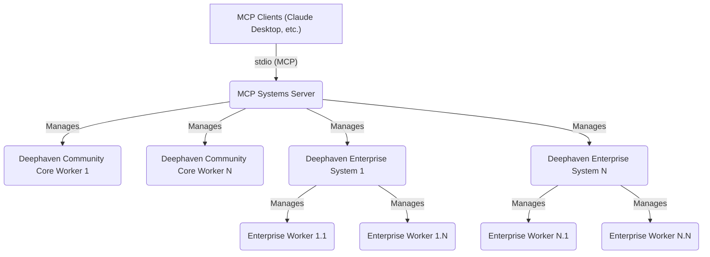
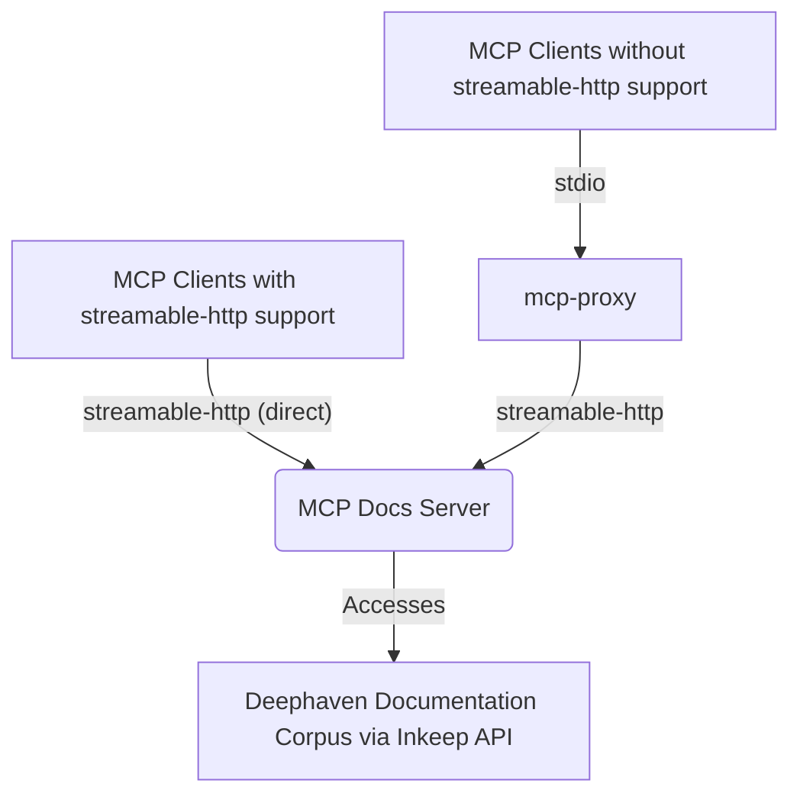

# Deephaven MCP

> **You are reading the [Developer & Contributor Guide](DEVELOPER_GUIDE.md) for Deephaven MCP.**

> **Project repository:** [https://github.com/deephaven/deephaven-mcp](https://github.com/deephaven/deephaven-mcp)

> **Note:** This document contains low-level technical details for contributors working on the [deephaven-mcp](https://github.com/deephaven/deephaven-mcp) project. **End users seeking high-level usage and onboarding information should refer to the main documentation in the [`../README.md`](../README.md).**

This repository houses the Python-based [Model Context Protocol (MCP)](https://modelcontextprotocol.io/) servers for Deephaven:

1. **Deephaven MCP Systems Server**: Orchestrates Deephaven Community Core sessions and Enterprise systems.
2. **Deephaven MCP Docs Server**: Provides conversational Q&A about Deephaven documentation.

> **Requirements**: [Python](https://www.python.org/) 3.11 or later is required to run these servers.

---

## Table of Contents

- [Deephaven MCP](#deephaven-mcp)
  - [Table of Contents](#table-of-contents)
  - [Introduction](#introduction)
    - [About This Project](#about-this-project)
    - [Key Features](#key-features)
    - [System Architecture](#system-architecture)
  - [Prerequisites](#prerequisites)
    - [Required for All Users](#required-for-all-users)
    - [Systems Server Prerequisites](#systems-server-prerequisites)
    - [Docs Server Prerequisites (Only If Using Docs Server)](#docs-server-prerequisites-only-if-using-docs-server)
    - [Development Prerequisites (Contributors Only)](#development-prerequisites-contributors-only)
  - [Optional Dependencies](#optional-dependencies)
    - [Quick Verification Checklist](#quick-verification-checklist)
  - [Quick Start Guide](#quick-start-guide)
    - [Systems Server Quick Start](#systems-server-quick-start)
    - [Docs Server Quick Start](#docs-server-quick-start)
  - [Command Line Entry Points](#command-line-entry-points)
  - [MCP Server Implementations](#mcp-server-implementations)
    - [Systems Server](#systems-server)
      - [Systems Server Overview](#systems-server-overview)
        - [Core Configuration File (`deephaven_mcp.json`)](#core-configuration-file-deephaven_mcpjson)
          - [Environment Variables](#environment-variables)
          - [File Structure Overview](#file-structure-overview)
      - [Systems Sessions Configuration](#systems-sessions-configuration)
    - [Security Configuration](#security-configuration)
      - [Community Session Credential Retrieval](#community-session-credential-retrieval)
      - [Community Session Creation Configuration](#community-session-creation-configuration)
      - [Enterprise Server Configuration](#enterprise-server-configuration)
      - [Running the Systems Server](#running-the-systems-server)
        - [Systems Server CLI Arguments](#systems-server-cli-arguments)
      - [Using the Systems Server](#using-the-systems-server)
      - [Session ID Format and Terminology](#session-id-format-and-terminology)
      - [Systems Server Tools](#systems-server-tools)
      - [Error Handling](#error-handling)
      - [MCP Tools](#mcp-tools)
    - [System Tools](#system-tools)
      - [`mcp_reload`](#mcp_reload)
      - [`enterprise_systems_status`](#enterprise_systems_status)
      - [Enterprise Session Tools](#enterprise-session-tools)
        - [`session_enterprise_create`](#session_enterprise_create)
        - [`session_enterprise_delete`](#session_enterprise_delete)
      - [Community Session Tools](#community-session-tools)
        - [`session_community_create`](#session_community_create)
        - [`session_community_delete`](#session_community_delete)
        - [`session_community_credentials`](#session_community_credentials)
      - [General Session Tools](#general-session-tools)
        - [`sessions_list`](#sessions_list)
        - [`session_details`](#session_details)
        - [`catalog_tables_list`](#catalog_tables_list)
        - [`catalog_namespaces_list`](#catalog_namespaces_list)
        - [`catalog_tables_schema`](#catalog_tables_schema)
        - [`catalog_table_sample`](#catalog_table_sample)
    - [Session Data Tools](#session-data-tools)
      - [`session_tables_schema`](#session_tables_schema)
        - [`session_script_run`](#session_script_run)
        - [`session_pip_list`](#session_pip_list)
        - [`session_table_data`](#session_table_data)
        - [`session_tables_list`](#session_tables_list)
      - [Systems Server Test Components](#systems-server-test-components)
        - [Systems Test Server](#systems-test-server)
        - [Systems Test Client](#systems-test-client)
    - [Docs Server](#docs-server)
      - [Docs Server Overview](#docs-server-overview)
      - [Docs Server Configuration](#docs-server-configuration)
        - [Docs Server Environment Variables](#docs-server-environment-variables)
        - [Example Configuration](#example-configuration)
      - [Running the Docs Server](#running-the-docs-server)
        - [Docs Server CLI Arguments](#docs-server-cli-arguments)
        - [Streamable-HTTP Transport Mode (Default)](#streamable-http-transport-mode-default)
        - [SSE Transport Mode](#sse-transport-mode)
        - [stdio Transport Mode](#stdio-transport-mode)
      - [Docs Server Tools](#docs-server-tools)
        - [`docs_chat`](#docs_chat)
      - [Docs Server HTTP Endpoints](#docs-server-http-endpoints)
      - [Docs Server Test Components](#docs-server-test-components)
        - [Docs Test Client](#docs-test-client)
  - [Integration Methods](#integration-methods)
    - [MCP Inspector](#mcp-inspector)
      - [MCP Inspector with Systems Server](#mcp-inspector-with-systems-server)
      - [MCP Inspector with Docs Server](#mcp-inspector-with-docs-server)
    - [Claude Desktop](#claude-desktop)
      - [Configuration](#configuration)
      - [Claude Desktop Log Locations](#claude-desktop-log-locations)
    - [mcp-proxy](#mcp-proxy)
      - [mcp-proxy with Systems Server](#mcp-proxy-with-systems-server)
      - [mcp-proxy with Docs Server](#mcp-proxy-with-docs-server)
    - [Programmatic API](#programmatic-api)
      - [Systems Server Example](#systems-server-example)
      - [Docs Server Example](#docs-server-example)
  - [Development](#development)
    - [Development Workflow](#development-workflow)
    - [Advanced Development Techniques](#advanced-development-techniques)
    - [Development Commands](#development-commands)
      - [Code Quality \& Pre-commit Checks](#code-quality--pre-commit-checks)
    - [Project Structure](#project-structure)
      - [Key Module Details](#key-module-details)
      - [Script References](#script-references)
    - [Dependencies](#dependencies)
    - [Versioning](#versioning)
    - [Docker Compose](#docker-compose)
    - [Performance Testing](#performance-testing)
      - [MCP Docs Server Stress Testing](#mcp-docs-server-stress-testing)
      - [HTTP Transport Stress Testing](#http-transport-stress-testing)
      - [Usage Example](#usage-example)
      - [Arguments](#arguments)
  - [Testing](#testing)
    - [Unit Tests](#unit-tests)
    - [Integration Tests](#integration-tests)
      - [Integration Test Prerequisites](#integration-test-prerequisites)
      - [Running Integration Tests](#running-integration-tests)
      - [Running Specific Test Classes](#running-specific-test-classes)
      - [Troubleshooting Integration Tests](#troubleshooting-integration-tests)
  - [Troubleshooting](#troubleshooting)
    - [Common Issues](#common-issues)
    - [Common Errors \& Solutions](#common-errors--solutions)
  - [Resources](#resources)
    - [Documentation](#documentation)
    - [Deephaven API Reference](#deephaven-api-reference)
    - [Tools \& Related Projects](#tools--related-projects)
    - [Contributing](#contributing)
    - [Community \& Support](#community--support)
  - [License](#license)

---

## Introduction

### About This Project

The [deephaven-mcp](https://github.com/deephaven/deephaven-mcp) project provides Python implementations of two [Model Context Protocol (MCP)](https://modelcontextprotocol.io/) servers:

1. **Deephaven MCP Systems Server**:
   - Enables orchestration, inspection, and management of Deephaven Community Core worker nodes via the MCP protocol
   - Built with [FastMCP](https://github.com/jlowin/fastmcp)
   - Exposes tools for reloading configuration, listing sessions, inspecting table schemas, and running scripts
   - Maintains [PyDeephaven](https://github.com/deephaven/deephaven-core/tree/main/py) client sessions to each configured worker, with sophisticated session management.
   - The Systems Server orchestrates multiple Deephaven Community Core worker nodes, providing a unified interface for managing workers, their sessions, and data through the Model Context Protocol (MCP). It includes sophisticated session management with automatic caching, concurrent access safety, and lifecycle management.

2. **Deephaven MCP Docs Server**:
   - Offers an agentic, LLM-powered API for Deephaven documentation Q&A and chat
   - Uses [Inkeep](https://inkeep.com/)/[OpenAI](https://openai.com/) APIs for its LLM capabilities
   - Designed for integration with orchestration frameworks

Both servers are designed for integration with MCP-compatible tools like the [MCP Inspector](https://github.com/modelcontextprotocol/inspector) and [Claude Desktop](https://claude.ai).

### Key Features

**Systems Server Features:**

- **MCP Server:** Implements the MCP protocol for Deephaven Community Core and Enterprise systems
- **stdio Transport:** Designed for stdio-based MCP clients like Claude Desktop (typical usage)
- **Multiple Transports:** Also supports streamable-http and SSE for advanced use cases
- **Configurable:** Loads worker configuration from a JSON file or environment variable
- **Async Lifecycle:** Uses FastMCP's async lifespan for robust startup and shutdown handling
- **Lazy Loading:** Sessions are created on-demand to improve startup performance and resilience

**Docs Server Features:**

- **MCP-compatible server** for documentation Q&A and chat
- **Multiple Transports:** Supports streamable-http (default), SSE, and stdio for flexible integration
- **HTTP-first Design:** Optimized for streamable-http transport with stateless operation
- **LLM-powered:** Uses Inkeep/OpenAI APIs for conversational documentation assistance
- **FastMCP backend:** Built on FastMCP framework, deployable locally or via Docker
- **Single tool:** `docs_chat` for conversational documentation assistance
- **Extensible:** Python-based for adding new tools or extending context

### System Architecture

**Systems Server Architecture:**



**Typical Usage:**
Most users connect to the Systems Server via stdio transport (the default for tools like Claude Desktop). The Systems Server manages both Deephaven Community Core workers and Deephaven Enterprise systems. Each enterprise system can manage multiple enterprise workers, providing comprehensive session management, table operations, and script execution across your entire Deephaven infrastructure.

**Docs Server Architecture:**



**Transport Options:**

- **Direct streamable-http**: Modern MCP clients that support streamable-http can connect directly for optimal performance and scalability
- **Proxy-based streamable-http**: Clients without native streamable-http support can use mcp-proxy to bridge stdio to streamable-http

The MCP Docs Server processes natural language questions about Deephaven documentation using LLM capabilities via the Inkeep API.

## Prerequisites

Before using the Deephaven MCP servers, ensure you have the following prerequisites installed and configured:

### Required for All Users

**Python 3.11 or Later**

- **Requirement**: [Python](https://www.python.org/) 3.11+ is required to run both MCP servers
- **Installation**: Download from [python.org](https://www.python.org/downloads/) or use your system's package manager
- **Verification**: Run `python --version` to confirm Python 3.11 or later is installed

**Configuration File**

- **Requirement**: A JSON configuration file (typically named `deephaven_mcp.json`) for the Systems Server
- **Location**: Can be placed anywhere on your system, specified via the `DH_MCP_CONFIG_FILE` environment variable
- **Details**: See [Core Configuration File](#core-configuration-file-deephaven_mcpjson) for complete schema and examples

### Systems Server Prerequisites

**For Static Community Sessions**

- **Requirement**: Access to running Deephaven Community Core instance(s)
- **Configuration**: Connection details (host, port, auth) specified in `deephaven_mcp.json`
- **More Info**: See [Systems Sessions Configuration](#systems-sessions-configuration)

**For Dynamic Community Sessions (Optional)**

Choose **one** of the following launch methods for dynamically creating Deephaven sessions:

- **Docker Launch Method**:
  - **Requirement**: [Docker](https://www.docker.com/get-started/) installed and running
  - **Installation**: No additional Python packages required beyond base `deephaven-mcp`
  - **Verification**: Run `docker ps` to confirm Docker daemon is accessible
  - **Best For**: Production, isolated environments, cross-platform consistency

- **Python Launch Method**:
  - **Requirement**: `deephaven-server` Python package
  - **Installation**: `pip install deephaven-server` (in MCP venv or a custom venv)
  - **Verification**: Run `deephaven server --help` to confirm the command is available
  - **Best For**: Development environments, faster startup, no Docker dependency
  - **Custom Venv**: Use `python_venv_path` config parameter to specify a different Python environment

**For Enterprise Systems (Optional)**

- **Requirement**: Deephaven Enterprise (Core+) system(s) with accessible connection.json URL
- **Installation**: `pip install "deephaven-mcp[enterprise]"` (installs `deephaven-coreplus-client` from PyPI)
- **Configuration**: Enterprise system details specified in `deephaven_mcp.json`
- **More Info**: See [Enterprise Server Configuration](#enterprise-server-configuration) and [Development Workflow](#development-workflow)

### Docs Server Prerequisites (Only If Using Docs Server)

> **Note**: These prerequisites are only required if you plan to develop the MCP Docs Server. Most users only need the Systems Server and can skip this section.

**Inkeep API Key**

- **Requirement**: Valid API key from [Inkeep](https://inkeep.com/) for documentation Q&A
- **Configuration**: Set via `INKEEP_API_KEY` environment variable (required)
- **Obtaining**: Contact Inkeep or visit [inkeep.com](https://inkeep.com/) to obtain an API key

### Development Prerequisites (Contributors Only)

**Development Tools**

- **Required**: Git, Python 3.11+, virtual environment tool (`venv` or `uv`)
- **Recommended**: [`uv`](https://github.com/astral-sh/uv) for faster package management
- **Installation**: See [UV.md](UV.md) for project-specific uv setup and workflows, or the [uv installation guide](https://github.com/astral-sh/uv#installation) for general installation

**Testing Requirements**

- **Unit Tests**: Development dependencies installed via `pip install -e ".[dev]"`
- **Integration Tests**:
  - Docker must be installed and running (for Docker integration tests)
  - `deephaven-server` package installed (for python integration tests)
- **More Info**: See [Testing](#testing) section

## Optional Dependencies

The `deephaven-mcp` package provides optional dependency groups (extras) to tailor the installation to your specific needs:

| Extra | Purpose | Install Command |
|-------|---------|-----------------|
| `[community]` | Python-based Community Core session creation (no Docker required) | `pip install "deephaven-mcp[community]"` |
| `[enterprise]` | Connect to Deephaven Enterprise (Core+) systems | `pip install "deephaven-mcp[enterprise]"` |
| `[test]` | Run unit and integration tests | `pip install "deephaven-mcp[test]"` |
| `[lint]` | Code quality tools (linting, formatting, type checking) | `pip install "deephaven-mcp[lint]"` |
| `[dev]` | Full development environment with all features | `pip install "deephaven-mcp[dev]"` |

**Common Installation Patterns:**

```bash
# Basic installation (connect to existing instances)
pip install deephaven-mcp

# With python session creation for Community Core
pip install "deephaven-mcp[community]"

# With Enterprise support
pip install "deephaven-mcp[enterprise]"

# Both Community + Enterprise
pip install "deephaven-mcp[community,enterprise]"

# Full development environment (includes all features)
pip install -e ".[dev]"
```

### Quick Verification Checklist

Before proceeding with the Quick Start Guide, verify your setup:

- ✅ Python 3.11+ installed: `python --version`
- ✅ Configuration file created (for Systems Server): `deephaven_mcp.json`
- ✅ Environment variable set (for Systems Server): `export DH_MCP_CONFIG_FILE=/path/to/deephaven_mcp.json`
- ✅ Inkeep API key set (for Docs Server): `export INKEEP_API_KEY=your-key`
- ✅ Docker running (for docker launch method): `docker ps`
- ✅ OR deephaven-server installed (for python launch method): `deephaven server --help`

## Quick Start Guide

### Systems Server Quick Start

1. **Set up worker configuration:**
   Create a JSON configuration file for your Deephaven MCP:

   ```json5
   {
     "community": {
       "sessions": {
         // Connect to a local Deephaven Community instance
         "local_session": {
           "host": "localhost",  // Deephaven server address
           "port": 10000         // Default Deephaven port
         }
       }
     }
   }
   ```

   Save this as `deephaven_mcp.json` in your project directory.

   > **Dynamic Community Session Creation (Optional):** To enable on-demand creation of Deephaven Community sessions, add session creation configuration. Choose your launch method:
   >
   > - **Docker (default):** Requires Docker installed and running. No additional Python packages needed.
   >
   >   ```json
   >   "community": {
   >     "session_creation": {
   >       "max_concurrent_sessions": 5,
   >       "defaults": {"launch_method": "docker"}
   >     }
   >   }
   >   ```
   >
   > - **Python:** Faster startup, no Docker needed. Install `deephaven-server` in your Python environment.
   >
   >   ```json
   >   "community": {
   >     "session_creation": {
   >       "max_concurrent_sessions": 5,
   >       "defaults": {
   >         "launch_method": "python",
   >         "python_venv_path": null  // Optional: null uses MCP venv, or specify "/path/to/custom/venv"
   >       }
   >     }
   >   }
   >   ```
   >
   > See [Community Session Creation Configuration](#community-session-creation-configuration) for all options.

2. **Start a test Deephaven server in one terminal:**

   ```sh
   # For anonymous authentication (no MCP auth needed)
   uv run scripts/run_deephaven_test_server.py --table-group simple
   
   # OR for PSK authentication (if your MCP config uses auth tokens)
   uv run scripts/run_deephaven_test_server.py --table-group simple --auth-token Deephaven123
   ```

   > This script is located at [`../scripts/run_deephaven_test_server.py`](../scripts/run_deephaven_test_server.py) and creates a local Deephaven server with test data. Use the `--auth-token` parameter if your MCP configuration requires PSK authentication.

3. **Run the Systems Server:**

   ```sh
   DH_MCP_CONFIG_FILE=deephaven_mcp.json uv run dh-mcp-systems-server --transport sse
   ```

4. **Test with the MCP Inspector:**

   ```sh
   npx @modelcontextprotocol/inspector@latest
   ```

   Connect to `http://localhost:8000/mcp` (for streamable-http) or `http://localhost:8000/sse` (for SSE) in the Inspector UI.

### Docs Server Quick Start

1. **Set up Inkeep API key:**

   ```sh
   export INKEEP_API_KEY=your-inkeep-api-key  # Get from https://inkeep.com
   ```

2. **Run the Docs Server:**

   ```sh
   uv run dh-mcp-docs-server --transport streamable-http
   ```

3. **Test with the MCP Inspector:**

   ```sh
   npx @modelcontextprotocol/inspector@latest
   ```

   Connect to `http://localhost:8001/mcp` (for streamable-http) or `http://localhost:8001/sse` (for SSE) in the Inspector UI and test the `docs_chat` tool.

## Command Line Entry Points

This package registers the following console entry points for easy command-line access:

| Command | Description | Source |
|---------|-------------|--------|
| `dh-mcp-systems-server` | Start the Systems Server | `deephaven_mcp.mcp_systems_server:main` |
| `dh-mcp-docs-server` | Start the Docs Server | `deephaven_mcp.mcp_docs_server:main` |

These commands are automatically available in your PATH after installing the package.

## MCP Server Implementations

### Systems Server

#### Systems Server Overview

The Deephaven MCP Systems Server is an [MCP](https://github.com/modelcontextprotocol/spec)-compatible server (built with [FastMCP](https://github.com/jlowin/fastmcp)) that provides tools for interacting with Deephaven Community Core instances.

Key architectural features include:

- **Efficient Session Management**: Implements a sophisticated session caching system using [PyDeephaven](https://github.com/deephaven/deephaven-core/tree/main/py) that automatically reuses existing connections when possible and manages session lifecycles.
- **Concurrent Access Safety**: Uses [asyncio](https://docs.python.org/3/library/asyncio.html) Lock mechanisms to ensure thread-safe operations during configuration reloads and session management.
- **Automatic Resource Cleanup**: Gracefully handles session termination and cleanup during server shutdown or reload operations.
- **On-Demand Session Creation**: Sessions to worker nodes are created only when needed and cached for future use.
- **Async-First Design**: Built around [asyncio](https://docs.python.org/3/library/asyncio.html) for high-concurrency performance and non-blocking operations.
- **Configurable Session Behavior**: Supports worker configuration options such as `never_timeout` to control session persistence and lifecycle management.

##### Core Configuration File (`deephaven_mcp.json`)

The Deephaven MCP Systems Server relies on a JSON or JSON5 configuration file (conventionally named `deephaven_mcp.json`, though any name can be used) to define the Deephaven instances it can connect to and manage. This configuration is crucial for the server to operate correctly.

**File Format**: The configuration file supports both standard JSON and JSON5 formats:

- Single-line comments: `// This is a comment`
- Multi-line comments: `/* This is a multi-line comment */`
- Trailing commas are also supported

This allows you to add documentation directly in your configuration file to explain connection details, authentication choices, or other configuration decisions.

###### Environment Variables

The Systems Server's behavior, particularly how it finds its configuration, can be controlled by the following environment variables:

| Variable             | Required | Description                                                                                                                                                              | Where Used              |
|----------------------|----------|--------------------------------------------------------------------------------------------------------------------------------------------------------------------------|-------------------------|
| `DH_MCP_CONFIG_FILE` | Yes      | Path to the `deephaven_mcp.json` configuration file. The MCP Systems Server discovers the location of this file via this environment variable. You must set this variable to the absolute path of your configuration file before starting the server. If this variable is not set, the server will fail to start, logging an error. <br><br>Example: <br>`export DH_MCP_CONFIG_FILE="/home/user/project/config/deephaven_mcp.json"` <br>`# Now run the server` <br>`uv run dh-mcp-systems-server --transport sse`                                 | MCP Server, Test Client |
| `PYTHONLOGLEVEL`     | No       | Sets the Python logging level for the server (e.g., `DEBUG`, `INFO`, `WARNING`, `ERROR`).                                                                                    | Server (optional)       |

> Environment variables can also be loaded from `.env` files using [python-dotenv](https://github.com/theskumar/python-dotenv) if it's integrated into the project's startup mechanism.

###### File Structure Overview

The `deephaven_mcp.json` file is a JSON object that can contain two primary top-level keys: `"community"` and `"enterprise"`. Both are optional.

- `"community"`: If present, its value must be an object containing a `"sessions"` key that maps user-defined session names to their specific configurations for Deephaven Community Core instances. Details for these configurations are below.
- `"enterprise"`: If present, its value must be an object containing a `"systems"` key that maps user-defined system names to their specific configurations for Deephaven Enterprise instances. Details for these configurations are provided in a subsequent section.

If both keys are absent, or if the `deephaven_mcp.json` file itself is an empty JSON object (e.g., `{}`), it signifies that no sessions of either type are configured. This is a valid state.

#### Systems Sessions Configuration

This section details the configuration for individual sessions listed under the `"community"` → `"sessions"` key in the `deephaven_mcp.json` file.

**Systems Session Configuration Fields:**

All fields within a session's configuration object are optional. If a field is omitted, the server or client library may use default behaviors or the corresponding feature might be disabled.

- `host` (string): Hostname or IP address of the Deephaven Community Core worker (e.g., `"localhost"`).
- `port` (integer): Port number for the worker connection (e.g., `10000`).
- `auth_type` (string): Authentication method. Common values include:
  - `"Anonymous"`: For connections requiring no authentication (default if omitted).
  - `"PSK"` or `"io.deephaven.authentication.psk.PskAuthenticationHandler"`: For Pre-Shared Key authentication. Both the shorthand `"PSK"` and full Java class name are accepted. See the `auth_token` field below for token configuration.
  - `"Basic"`: For username/password authentication. The `auth_token` must be in `"username:password"` format.
  - Custom authenticator strings: Full Java class names for custom authentication handlers.
- `auth_token` (string, optional): The authentication token. For `"Basic"` auth, this must be in `"username:password"` format. For custom authenticators, this should conform to the specific requirements of that authenticator. Ignored when `auth_type` is `"Anonymous"`. Use this OR `auth_token_env_var`, but not both.
- `auth_token_env_var` (string, optional): The name of an environment variable from which to read the authentication token. Use this OR `auth_token`, but not both. If specified, the token will be sourced from this environment variable.
- `never_timeout` (boolean): If `true`, the MCP server attempts to configure the session to this worker to prevent timeouts. Server-side settings might still enforce timeouts.
- `session_type` (string): Specifies the programming language for the session (e.g., `"python"`, `"groovy"`).
- `use_tls` (boolean): Set to `true` if the connection to the worker requires TLS/SSL encryption.
- `tls_root_certs` (string, optional): Absolute path to a PEM file containing trusted root CA certificates for TLS verification. If omitted, system CAs might be used, or verification behavior depends on the client library.
- `client_cert_chain` (string, optional): Absolute path to a PEM file containing the client's TLS certificate chain. Used for client-side certificate authentication (mTLS).
- `client_private_key` (string, optional): Absolute path to a PEM file containing the client's private key, corresponding to the `client_cert_chain`. Used for mTLS.

**Example `deephaven_mcp.json` (standard JSON):**

```json
{
  "community": {
    "sessions": {
      "my_local_deephaven": {
        "host": "localhost",
        "port": 10000,
        "session_type": "python"
      },
      "psk_authenticated_session": {
        "host": "localhost",
        "port": 10001,
        "auth_type": "io.deephaven.authentication.psk.PskAuthenticationHandler",
        "auth_token": "your-shared-secret-key",
        "session_type": "python"
      },
      "basic_auth_worker": {
        "host": "secure.deephaven.example.com",
        "port": 10002,
        "auth_type": "Basic",
        "auth_token_env_var": "MY_BASIC_AUTH_ENV_VAR",
        "never_timeout": true,
        "session_type": "groovy",
        "use_tls": true,
        "tls_root_certs": "/path/to/trusted_cas.pem",
        "client_cert_chain": "/path/to/client_cert_and_chain.pem",
        "client_private_key": "/path/to/client_private_key.pem"
      }
    }
  }
}
```

**Example with JSON5 (JSON with Comments):**

```json5
{
  /* Community Core session configurations */
  "community": {
    "sessions": {
      // Local development environment - no authentication
      "my_local_deephaven": {
        "host": "localhost",
        "port": 10000,
        "session_type": "python"
      },
      // Staging environment with PSK authentication
      "psk_authenticated_session": {
        "host": "localhost",
        "port": 10001,
        "auth_type": "io.deephaven.authentication.psk.PskAuthenticationHandler",
        "auth_token": "your-shared-secret-key",  // Consider using auth_token_env_var instead
        "session_type": "python"
      },
      /* Production environment with full TLS and mTLS
       * Uses Basic auth with credentials from environment variable
       * Never times out for long-running operations
       */
      "basic_auth_worker": {
        "host": "secure.deephaven.example.com",
        "port": 10002,
        "auth_type": "Basic",
        "auth_token_env_var": "MY_BASIC_AUTH_ENV_VAR",  // More secure than hardcoding
        "never_timeout": true,
        "session_type": "groovy",
        "use_tls": true,
        "tls_root_certs": "/path/to/trusted_cas.pem",
        "client_cert_chain": "/path/to/client_cert_and_chain.pem",
        "client_private_key": "/path/to/client_private_key.pem",
      },  // Trailing comma supported in JSON5
    }
  }
}
```

### Security Configuration

The top-level `security` section in `deephaven_mcp.json` contains security-related settings for all session types. This section makes security decisions explicit and easy to audit.

#### Community Session Credential Retrieval

The `session_community_credentials` MCP tool allows programmatic retrieval of authentication credentials for community sessions. This is **disabled by default** for security.

**Configuration:** `security.community.credential_retrieval_mode`

Controls which community session credentials can be retrieved via the MCP tool. This setting applies to:

- **Static sessions**: Pre-configured in `community.sessions`
- **Dynamic sessions**: Created on-demand via `session_community_create`

**Valid modes:**

- **`"none"`** (default): Credential retrieval disabled for all sessions
  - Most secure option
  - Tool returns error with instructions to enable
  
- **`"dynamic_only"`**: Only auto-generated tokens (dynamic sessions)
  - Allows retrieval for sessions created via `session_community_create`
  - Denies retrieval for pre-configured static sessions
  - **Recommended**: Users typically need dynamic tokens but already have static credentials
  
- **`"static_only"`**: Only pre-configured tokens (static sessions)
  - Allows retrieval for sessions from `community.sessions`
  - Denies retrieval for dynamically created sessions
  - **Rare use case**: Static credentials are already in your config file
  
- **`"all"`**: Both dynamic and static session credentials
  - Maximum convenience, minimum security
  - Only enable if you fully understand the security implications

**Security Considerations:**

- Credentials are returned in plain text
- All retrieval attempts are logged for audit
- Consider: Do AI agents really need access to credentials you already have?
- Recommendation: Use `"dynamic_only"` if needed, `"none"` otherwise

**Example Configuration:**

```json
{
  "security": {
    "community": {
      "credential_retrieval_mode": "dynamic_only"
    }
  },
  "community": {
    "sessions": { /* static sessions */ },
    "session_creation": { /* dynamic session config */ }
  }
}
```

#### Community Session Creation Configuration

This section details the configuration for dynamically creating Deephaven Community sessions on demand via the `session_community_create` MCP tool. Configuration is specified under the `"community"` → `"session_creation"` key in `deephaven_mcp.json`.

**Session Creation Configuration Fields:**

All fields are optional. If the `session_creation` key is omitted entirely, dynamic session creation is not available.

- **`max_concurrent_sessions`** (integer, optional):
  - Maximum number of concurrent dynamically created sessions.
  - Set to 0 to disable dynamic session creation entirely.
  - Used for resource management and safety.

- **`defaults`** (object, optional): Default parameters for creating new community sessions. All fields are optional:
  - `launch_method` (string): Method to launch sessions (`"docker"` or `"python"`).
  - `programming_language` (string): Programming language for Docker sessions (`"Python"` or `"Groovy"`). Docker only. Mutually exclusive with `docker_image`.
  - `auth_type` (string): Default authentication type for dynamically created sessions. Supported values: `"PSK"` (default), `"Anonymous"`, or full class name `"io.deephaven.authentication.psk.PskAuthenticationHandler"`. Case-insensitive for shorthand. Note: Basic auth is not supported for dynamic sessions (requires database setup).
  - `auth_token` (string): Default authentication token. Use this OR `auth_token_env_var`, but not both.
  - `auth_token_env_var` (string): Environment variable for auth token. Use this OR `auth_token`, but not both.
  - `docker_image` (string): Docker image to use for docker launch method. Mutually exclusive with `programming_language`.
  - `docker_memory_limit_gb` (float): Memory limit in GB for docker containers.
  - `docker_cpu_limit` (float): CPU limit for docker containers.
  - `docker_volumes` (list[string]): Volume mounts for docker containers (format: `["host:container:mode"]`).
  - `python_venv_path` (string | null): Path to custom Python venv directory (python only). If null (default), uses same venv as MCP server. If path provided, uses deephaven-server from that venv.
  - `heap_size_gb` (float | int): JVM heap size in GB (e.g., 4 or 2.5). Integer values use 'g' suffix (4 → `-Xmx4g`). Float values converted to MB (2.5 → `-Xmx2560m`).
  - `extra_jvm_args` (list[string]): Additional JVM arguments.
  - `environment_vars` (object): Environment variables for the session (key-value pairs).
  - `startup_timeout_seconds` (number): Timeout for session startup.
  - `startup_check_interval_seconds` (number): Interval between startup health checks.
  - `startup_retries` (integer): Number of startup retry attempts.

**Launch Method Requirements:**

The `launch_method` parameter determines how Deephaven Community sessions are started. Each method has specific prerequisites:

- **`"docker"` (Docker launch method)**:
  - **Requirement**: [Docker](https://www.docker.com/get-started/) must be installed and running on the host system
  - **Installation**: Works with the base `deephaven-mcp` installation (no additional Python packages required)
  - **Benefits**: Isolated environments, easy cleanup, consistent across platforms
  - **Considerations**: Requires Docker daemon, higher resource overhead
  - **Verification**: Run `docker ps` to confirm Docker is accessible

- **`"python"` (Python launch method)**:
  - **Requirement**: The `deephaven-server` Python package must be installed
  - **Installation**: Install with `pip install deephaven-server` in MCP venv or custom venv
  - **Benefits**: No Docker dependency, lighter resource footprint, faster startup
  - **Custom Venv Support**: Use `python_venv_path` parameter to specify a different Python environment
    - If `null` (default): Uses same venv as MCP server
    - If path provided: Uses deephaven-server from that venv
  - **Verification**: Run `deephaven server --help` to confirm the command is available

> **💡 Tip**: For development environments, the python method is often faster and simpler. For production or isolated environments, the docker method provides better consistency and isolation.

**MCP Tool: `session_community_credentials`**

When `credential_retrieval_enabled` is `true`, this tool retrieves connection credentials for both static and dynamic Community sessions.

**Arguments:**

- `session_id` (string): Full session ID
  - For static sessions: `"community:config:session-name"`
  - For dynamic sessions: `"community:dynamic:session-name"`

**Returns:**

- `connection_url` (string): Base URL without authentication
- `connection_url_with_auth` (string): Full URL with auth token for browser
- `auth_token` (string): Raw authentication token
- `auth_type` (string): Authentication type (e.g., `"io.deephaven.authentication.psk.PskAuthenticationHandler"`, `"Anonymous"`)

**Example Usage (via AI agent):**

```text
User: "Get me the browser URL for my-analysis session"
AI: [calls session_community_credentials with session_id="community:dynamic:my-analysis"]
AI: "Here's your browser URL: http://localhost:45123/?psk=abc123..."

User: "What's the URL for my static local-dev session?"
AI: [calls session_community_credentials with session_id="community:config:local-dev"]
AI: "Here's the URL: http://localhost:10000/?psk=your-token"
```

**Security Notes:**

- All credential retrievals are logged for audit
- Credentials are returned in plain text
- Only use for legitimate browser access needs
- Consider security implications before enabling

**Alternative: Console Logging**

If `credential_retrieval_mode` is `"none"` (default), credentials are still accessible via console output. When a session is created with an auto-generated token, connection information is logged:

```text
======================================================================
🔑 Session 'my-analysis' Created - Browser Access Information:
   Port: 45123
   Base URL: http://localhost:45123
   Auth Token: abc123xyz789...
   Browser URL: http://localhost:45123/?psk=abc123xyz789

   To retrieve credentials via MCP tool, set security.community.credential_retrieval_mode
   in your deephaven_mcp.json configuration.
======================================================================
```

This is similar to how Jupyter displays tokens when starting a notebook server.

**Example Configuration:**

```json
{
  "security": {
    "community": {
      "credential_retrieval_mode": "dynamic_only"
    }
  },
  "community": {
    "session_creation": {
      "max_concurrent_sessions": 5,
      "defaults": {
        "launch_method": "docker",
        "auth_type": "PSK",
        "heap_size_gb": 4,
        "extra_jvm_args": ["-XX:+UseG1GC"],
        "docker_image": "ghcr.io/deephaven/server:latest",
        "docker_memory_limit_gb": 8.0
      }
    }
  }
}
```

#### Enterprise Server Configuration

The `deephaven_mcp.json` file can also optionally include a top-level key named `"enterprise"` to configure connections to Deephaven Enterprise instances. This key holds a dictionary where each entry maps a custom system name (e.g., `"prod_cluster"`, `"data_science_env"`) to its specific configuration object.

If the `"enterprise"` key is present, it must be a dictionary. Each individual enterprise system configuration within this dictionary supports the following fields:

- `connection_json_url` (string, **required**): The URL pointing to the `connection.json` file of the Deephaven Enterprise server. This file provides necessary connection details for the client. For standard HTTPS port 443, no port is needed (e.g., `"https://enterprise.example.com/iris/connection.json"`). For non-standard ports, include the port number explicitly (e.g., `"https://enterprise.example.com:8123/iris/connection.json"`)
- `auth_type` (string, **required**): Specifies the authentication method to use. Must be one of the following values:
  - `"password"`: Authenticate using a username and password.
  - `"private_key"`: Authenticate using a private key (e.g., for service accounts or specific SAML/OAuth setups requiring a private key).
    Only configuration keys relevant to the selected `auth_type` (and the general `connection_json_url`) should be included. Extraneous keys will be ignored by the application but will generate a warning message in the logs, indicating which keys are unexpected for the chosen authentication method.

- Conditional Authentication Fields (required based on `auth_type`):
  - If `auth_type` is `"password"`:
    - `username` (string, **required**): The username for authentication.
    - And either `password` (string): The password itself.
    - **OR** `password_env_var` (string): The name of an environment variable that holds the password. Using an environment variable is recommended. If the `password` field is used directly, its value will be redacted in application logs.
  - If `auth_type` is `"private_key"`:
    - `private_key_path` (string, **required**): The absolute file system path to the private key file (e.g., a `.pem` file).

- Optional Connection Settings:
  - `connection_timeout` (integer | float, **optional, default: 10.0**): Timeout in seconds for establishing connection to the Enterprise system.

- Optional Worker Creation Configuration:
  - `session_creation` (object, **optional**): Configuration for creating enterprise workers on this system. If omitted, worker creation tools will not be available for this system.
    - `max_concurrent_sessions` (integer, **optional, default: 5**): Maximum number of concurrent sessions that can be created on this system. Set to 0 to disable session creation. Used for resource management and safety.
    - `defaults` (object, **optional**): Default values for worker creation parameters. All fields are optional - if omitted, Deephaven server defaults are used.
      - `heap_size_gb` (float | int, **optional**): Default JVM heap size in gigabytes for new workers (e.g., 4 or 2.5). Enterprise library handles conversion internally.
      - `programming_language` (string, **optional**): Default programming language for new workers ("Python" or "Groovy", default: "Python"). Creates configuration_transformer internally.
      - `auto_delete_timeout` (integer, **optional**): Default auto-deletion timeout in seconds for idle workers (API default: 600).
      - `server` (string, **optional**): Default target server/environment name where workers will be created.
      - `engine` (string, **optional**): Default engine type for new workers (API default: "DeephavenCommunity").
      - `extra_jvm_args` (array, **optional**): Default additional JVM arguments for new workers (e.g., ["-XX:+UseG1GC"]).
      - `extra_environment_vars` (array, **optional**): Default environment variables for new workers (format: ["NAME=value"]).
      - `admin_groups` (array, **optional**): Default user groups with administrative permissions for new workers.
      - `viewer_groups` (array, **optional**): Default user groups with read-only access to new workers.
      - `timeout_seconds` (float, **optional**): Default worker startup timeout in seconds (API default: 60).
      - `session_arguments` (object, **optional**): Default arguments for pydeephaven.Session constructor (passed as-is, no validation of contents).

**Example `deephaven_mcp.json` with Enterprise Systems and Worker Creation:**

```json5
{
  // Community Core session for local development
  "community": {
    "sessions": {
      "local_dev": {
        "host": "localhost",
        "port": 10000
      }
    }
  },
  /* ====================================
   * Enterprise Systems Configuration
   * ==================================== */
  "enterprise": {
    "systems": {
      // Staging environment - password authentication
      "staging_env": {
        "connection_json_url": "https://staging.internal/iris/connection.json",
        "auth_type": "password",
        "username": "test_user",
        "password_env_var": "STAGING_PASSWORD",  // Read password from environment
        "session_creation": {
          "max_concurrent_sessions": 3,  // Limit for staging environment
          "defaults": {
            "heap_size_gb": 4.0,  // Moderate heap for testing
            "programming_language": "Python",  // Default to Python
            "auto_delete_timeout": 1800,  // Auto-delete after 30 minutes
          }
        }
      },
      // Analytics system - private key authentication (SAML)
      "analytics_private_key_auth": {
        "connection_json_url": "https://analytics.dept.com/iris/connection.json",
        "auth_type": "private_key",
        "private_key_path": "/secure/keys/analytics_service_account.pem",
        "session_creation": {
          "max_concurrent_sessions": 5,  // Higher limit for production
          "defaults": {
            "heap_size_gb": 8.0,  // Larger heap for production workloads
            "programming_language": "Groovy",  // Groovy for this system
            "auto_delete_timeout": 3600,  // Auto-delete after 1 hour
            "server": "gpu-server-1",  // Route to GPU-enabled server
            "engine": "DeephavenCommunity",  // Engine type
            // JVM tuning for performance
            "extra_jvm_args": ["-XX:+UseG1GC", "-XX:MaxGCPauseMillis=200"],
            // Custom environment for analytics workflows
            "extra_environment_vars": ["PYTHONPATH=/custom/libs", "LOG_LEVEL=DEBUG"],
            // Access control lists
            "admin_groups": ["deephaven-admins", "data-team-leads"],
            "viewer_groups": ["analysts", "data-scientists"],
            "timeout_seconds": 120.0,  // Session startup timeout
            // Custom arguments passed to pydeephaven.Session
            "session_arguments": {"custom_setting": "example_value"}
          }
        }
      }
    }
  }
}
```

This structure allows for flexible configuration of multiple Deephaven Enterprise instances alongside Community sessions within a single `deephaven_mcp.json` file.

**Security Considerations:**

The `deephaven_mcp.json` file can contain sensitive credentials (`auth_token`, paths to private keys). Protect this file with strict filesystem permissions (e.g., `chmod 600 path/to/your/deephaven_mcp.json` on Unix-like systems).

**File Paths:**

Ensure any file paths specified in the configuration (e.g., for TLS certificates) are absolute and accessible by the user/process running the MCP Systems Server.

#### Running the Systems Server

Follow these steps to start the Systems Server:

1. **Start a Deephaven Core worker**:

      ```sh
      # For anonymous authentication (no MCP auth needed)
      uv run scripts/run_deephaven_test_server.py --table-group simple
      
      # OR for PSK authentication (if your MCP config uses auth tokens)
      uv run scripts/run_deephaven_test_server.py --table-group simple --auth-token Deephaven123
      ```

      This script is located at [`../scripts/run_deephaven_test_server.py`](../scripts/run_deephaven_test_server.py).

2. **Start the MCP Systems Server**:

   ```sh
   DH_MCP_CONFIG_FILE=/path/to/deephaven_mcp.json uv run dh-mcp-systems-server
   ```

   The Systems Server uses stdio transport by default (suitable for Claude Desktop and similar tools).

##### Systems Server CLI Arguments

| Argument | Description | Default |
|----------|-------------|---------|
| `-t, --transport` | Transport type (`stdio`, `sse`, or `streamable-http`) | `stdio` |
| `-h, --help` | Show help message | - |

> **Note:** When using HTTP transports (streamable-http or SSE), the server binds to port 8000 by default. This can be modified by setting the `PORT` environment variable.

- **stdio Transport (Default):**

    ```sh
    DH_MCP_CONFIG_FILE=/path/to/deephaven_mcp.json uv run dh-mcp-systems-server
    # or explicitly
    DH_MCP_CONFIG_FILE=/path/to/deephaven_mcp.json uv run dh-mcp-systems-server --transport stdio
    ```

- **SSE Transport (for web/Inspector):**

    ```sh
    # Default port (8000)
    DH_MCP_CONFIG_FILE=/path/to/deephaven_mcp.json uv run dh-mcp-systems-server --transport sse
    
    # Custom port (8001)
    PORT=8001 DH_MCP_CONFIG_FILE=/path/to/deephaven_mcp.json uv run dh-mcp-systems-server --transport sse
    # or
    uv run dh-mcp-systems-server --transport sse --port 8001
    ```

- **Streamable-HTTP Transport (advanced use):**

    ```sh
    # Default port (8000)
    DH_MCP_CONFIG_FILE=/path/to/deephaven_mcp.json uv run dh-mcp-systems-server --transport streamable-http
    
    # Custom port (8001)
    PORT=8001 DH_MCP_CONFIG_FILE=/path/to/deephaven_mcp.json uv run dh-mcp-systems-server --transport streamable-http
    # or
    uv run dh-mcp-systems-server --transport streamable-http --port 8001
    ```

#### Using the Systems Server

Once running, you can interact with the Systems Server in several ways:

- Connect using [MCP Inspector](#mcp-inspector-with-systems-server)
- Use with [Claude Desktop](#claude-desktop)
- Run the [Systems Test Client](#systems-test-client) script
- Build your own MCP client application

#### Session ID Format and Terminology

The Systems Server uses a consistent session identifier format across all MCP tools:

**Session ID Format**: `{type}:{source}:{session_name}`

Where:

- `type`: Either `"community"` or `"enterprise"`
- `source`: The configuration key name (worker name for community, system name for enterprise)
- `session_name`: The specific session name within that source

**Examples**:

- `"community:local_dev:my_session"` - A community session named "my_session" on the "local_dev" worker
- `"enterprise:staging_env:analytics_session"` - An enterprise session named "analytics_session" on the "staging_env" system

**Terminology Clarification**:

- **Worker**: A Deephaven Community Core instance (configured under `"community"` → `"sessions"`)
- **System**: A Deephaven Enterprise instance/factory (configured under `"enterprise"` → `"systems"`)
- **Session**: A specific connection/session within a worker or system
- **Session ID**: The fully qualified identifier used by MCP tools to reference a specific session

All MCP tools that interact with Deephaven instances use the `session_id` parameter with this format, replacing the older `session_name` parameter from previous versions.

#### Systems Server Tools

The Systems Server exposes the following MCP tools, each designed for a specific aspect of Deephaven worker management:

All Systems Server tools return responses with a consistent format:

- Success: `{ "success": true, ... }` with additional fields depending on the tool
- Error: `{ "success": false, "error": "Error description", "isError": true }`

#### Error Handling

All Systems Server tools use a consistent error response format when encountering problems:

```json
{
  "success": false,
  "error": "Human-readable error description",
  "isError": true
}
```

This consistent format makes error handling and response parsing more predictable across all tools.

#### MCP Tools

The Systems Server provides 18 MCP tools organized into four categories:

**Quick Reference:**

| Tool | Category | Purpose | Enterprise Only |
|------|----------|---------|-----------------|
| [`mcp_reload`](#mcp_reload) | System | Reload configuration and clear sessions | No |
| [`enterprise_systems_status`](#enterprise_systems_status) | System | Check status of enterprise systems | No |
| [`sessions_list`](#sessions_list) | Session Management | List all active sessions | No |
| [`session_details`](#session_details) | Session Management | Get detailed session information | No |
| [`session_community_create`](#session_community_create) | Session Management | Create new community session | No |
| [`session_community_delete`](#session_community_delete) | Session Management | Delete community session | No |
| [`session_community_credentials`](#session_community_credentials) | Session Management | Get community session credentials | No |
| [`session_enterprise_create`](#session_enterprise_create) | Session Management | Create new enterprise session | Yes |
| [`session_enterprise_delete`](#session_enterprise_delete) | Session Management | Delete enterprise session | Yes |
| [`catalog_tables_list`](#catalog_tables_list) | Catalog Tools | List catalog table entries | Yes |
| [`catalog_namespaces_list`](#catalog_namespaces_list) | Catalog Tools | List catalog namespaces | Yes |
| [`catalog_tables_schema`](#catalog_tables_schema) | Catalog Tools | Get catalog table schemas | Yes |
| [`catalog_table_sample`](#catalog_table_sample) | Catalog Tools | Sample catalog table data | Yes |
| [`session_tables_schema`](#session_tables_schema) | Data Tools | Get table schemas from session | No |
| [`session_tables_list`](#session_tables_list) | Data Tools | List table names in session | No |
| [`session_table_data`](#session_table_data) | Data Tools | Retrieve table data | No |
| [`session_script_run`](#session_script_run) | Data Tools | Execute Python script | No |
| [`session_pip_list`](#session_pip_list) | Data Tools | List installed pip packages | No |

---

### System Tools

#### `mcp_reload`

**Purpose**: Atomically reload configuration and clear all active session cache.

**Parameters**: None

**Returns**:

```json
{
  "success": true
}
```

On error:

```json
{
  "success": false,
  "error": "Error message",
  "isError": true
}
```

**Description**: This tool reloads the Deephaven session configuration from the file specified in `DH_MCP_CONFIG_FILE` and clears all active session objects. It uses dependency injection via the Context to access the config manager, session registry, and a coroutine-safe reload lock. The operation is protected by the provided lock to prevent concurrent reloads. All sessions will be automatically recreated with the new configuration on next access.

#### `enterprise_systems_status`

**Purpose**: List all enterprise (Core+) systems/factories with their status and configuration details (redacted).

**Parameters**:

- `attempt_to_connect` (optional, boolean): If True, actively attempts to connect to each system to verify its status. Default is False (only checks existing connections for faster response).

**Returns**:

```json
{
  "success": true,
  "systems": [
    {
      "name": "staging_env",
      "status": "ONLINE",
      "detail": "System is healthy and ready for operational use",
      "is_alive": true,
      "config": {
        "connection_json_url": "https://staging.internal/iris/connection.json",
        "auth_type": "password",
        "username": "test_user"
      }
    }
  ]
}
```

On error:

```json
{
  "success": false,
  "error": "Error message",
  "isError": true
}
```

**Description**: This tool provides comprehensive status information about all configured enterprise systems. Status values include "ONLINE", "OFFLINE", "UNAUTHORIZED", "MISCONFIGURED", or "UNKNOWN". Sensitive configuration fields are redacted for security.

#### Enterprise Session Tools

##### `session_enterprise_create`

**Purpose**: Create a new enterprise session on a specified enterprise system.

**Parameters**:

- `system_name` (required, string): Name of the enterprise system to create the session on
- `session_name` (optional, string): Custom name for the session. If not provided, an auto-generated name will be used
- `heap_size_gb` (optional, float | int): JVM heap size in gigabytes for the session (e.g., 4 or 2.5). Enterprise library handles conversion internally
- `programming_language` (optional, string): Programming language for the session ("Python" or "Groovy")
- `auto_delete_timeout` (optional, integer): Auto-deletion timeout in seconds for idle sessions
- `server` (optional, string): Target server/environment name where the session will be created
- `engine` (optional, string): Engine type for the session (e.g., "DeephavenCommunity")
- `extra_jvm_args` (optional, array): Additional JVM arguments for the session
- `extra_environment_vars` (optional, array): Environment variables for the session in format ["NAME=value"]
- `admin_groups` (optional, array): User groups with administrative permissions for the session
- `viewer_groups` (optional, array): User groups with read-only access to the session
- `timeout_seconds` (optional, float): Session startup timeout in seconds
- `session_arguments` (optional, object): Additional arguments for pydeephaven.Session constructor

**Returns**:

```json
{
  "success": true,
  "session_id": "enterprise:prod-system:analytics-worker-001",
  "system_name": "prod-system",
  "session_name": "analytics-worker-001",
  "programming_language": "Python"
}
```

On error:

```json
{
  "success": false,
  "error": "Error message",
  "isError": true
}
```

**Description**: This tool creates a new enterprise session on the specified enterprise system and registers it in the session registry for future use. The session is configured with either provided parameters or defaults from the enterprise system configuration. Parameter resolution follows the priority: tool parameter → config default → API default.

##### `session_enterprise_delete`

**Purpose**: Delete an enterprise session by terminating it and removing it from the session registry.

**Parameters**:

- `system_name` (required, string): Name of the enterprise system containing the session
- `session_name` (required, string): Name of the session to delete

**Returns**:

```json
{
  "success": true,
  "system_name": "prod-system", 
  "session_name": "analytics-worker-001",
  "message": "Session deleted successfully"
}
```

On error:

```json
{
  "success": false,
  "error": "Error message",
  "isError": true
}
```

**Description**: This tool permanently terminates an enterprise session and removes it from the session registry. The session cannot be recovered after deletion. Use with caution as any unsaved work in the session will be lost.

#### Persistent Query (PQ) Management Tools

Persistent Queries (PQs) are recipes for creating and managing long-running worker sessions in Deephaven Enterprise. Unlike ephemeral sessions created via `session_enterprise_create`, PQs can be configured to run on schedules, restart automatically on failure, and persist across server restarts.

**Key Concepts:**

- **PQ Definition**: A configuration specifying how to create a worker session (heap size, JVM args, schedule, etc.)
- **PQ Serial**: Immutable unique identifier for a PQ (recommended for all operations)
- **PQ Name**: Human-readable name (can change, less reliable than serial)
- **PQ States**: UNINITIALIZED, RUNNING, STOPPED, FAILED, COMPLETED, etc.
- **Session Integration**: Running PQs create sessions accessible via standard session tools using `session_id` format `enterprise:{system_name}:{pq_name}`

##### `pq_list`

**Purpose**: List all persistent queries on an enterprise system.

**Parameters**:

- `system_name` (required, string): Name of the enterprise system

**Returns**:

```json
{
  "success": true,
  "system_name": "prod_cluster",
  "pqs": [
    {
      "serial": 12345,
      "name": "analytics_worker",
      "state": "RUNNING",
      "heap_size_gb": 8.0,
      "session_id": "enterprise:prod_cluster:analytics_worker"
    }
  ]
}
```

**Description**: Returns a list of all PQs with their current states. Running PQs include a `session_id` field that can be used with session data tools.

##### `pq_details`

**Purpose**: Get detailed information about a specific persistent query.

**Parameters**:

- `system_name` (required, string): Name of the enterprise system
- `pq_identifier` (required, string | int): PQ name (string) or serial number (integer)

**Returns**:

```json
{
  "success": true,
  "serial": 12345,
  "name": "analytics_worker",
  "state": "RUNNING",
  "session_id": "enterprise:prod:analytics_worker",
  "worker_host": "worker-01.example.com",
  "worker_port": 10000,
  "config": {
    "heap_size_gb": 8.0,
    "engine": "DeephavenCommunity"
  }
}
```

**Description**: Returns comprehensive PQ details including configuration, state, and worker connection information. Use the `session_id` with session tools to interact with the running PQ session.

##### `pq_create`

**Purpose**: Create a new persistent query.

**Parameters**:

- `system_name` (required, string): Name of the enterprise system
- `pq_name` (required, string): Human-readable name for the PQ
- `heap_size_gb` (required, float | int): JVM heap size in GB
- `programming_language` (optional, string): "Python" or "Groovy"
- `auto_delete_timeout` (optional, int): Seconds of inactivity before auto-deletion (default: 600)
- `server` (optional, string): Specific server to run on
- `engine` (optional, string): Worker engine type (default: "DeephavenCommunity")
- `extra_jvm_args` (optional, list[string]): Additional JVM arguments
- `extra_environment_vars` (optional, list[string]): Environment variables as ["KEY=value", ...]
- `admin_groups` (optional, list[string]): Groups with admin access
- `viewer_groups` (optional, list[string]): Groups with viewer access

**Returns**:

```json
{
  "success": true,
  "serial": 12345,
  "pq_name": "analytics_worker",
  "state": "UNINITIALIZED",
  "message": "PQ created successfully"
}
```

**Description**: Creates a new PQ in UNINITIALIZED state. Use `pq_start` to run it.

##### `pq_delete`

**Purpose**: Permanently delete a persistent query.

**Parameters**:

- `system_name` (required, string): Name of the enterprise system
- `pq_identifier` (required, string | int): PQ name or serial number

**Returns**:

```json
{
  "success": true,
  "message": "PQ deleted successfully"
}
```

**Description**: Permanently removes the PQ from the controller. If running, it will be stopped first. This operation cannot be undone.

##### `pq_modify`

**Purpose**: Modify an existing persistent query configuration.

**Parameters**:

- `pq_id` (required, string): PQ identifier in format "enterprise:system_name:serial_or_name"
- `restart` (optional, bool): Restart PQ after modification to apply changes (default: false)
- `pq_name` (optional, string): New name for the PQ
- `heap_size_gb` (optional, float | int): JVM heap size in GB
- `script_body` (optional, string): Inline script code (mutually exclusive with script_path)
- `script_path` (optional, string): Path to script file (mutually exclusive with script_body)
- `programming_language` (optional, string): "Python" or "Groovy"
- `configuration_type` (optional, string): Query type ("Script", "RunAndDone", etc.)
- `enabled` (optional, bool): Whether query is enabled
- `schedule` (optional, list[string]): Scheduling configuration
- `server` (optional, string): Specific server to run on
- `engine` (optional, string): Engine type (e.g., "DeephavenCommunity")
- `jvm_profile` (optional, string): Named JVM profile
- `extra_jvm_args` (optional, list[string]): Additional JVM arguments
- `extra_class_path` (optional, list[string]): Additional classpath entries
- `python_virtual_environment` (optional, string): Named Python virtual environment
- `extra_environment_vars` (optional, list[string]): Additional environment variables
- `init_timeout_nanos` (optional, int): Initialization timeout in nanoseconds
- `auto_delete_timeout` (optional, int): Auto-deletion timeout in seconds
- `admin_groups` (optional, list[string]): User groups with admin access
- `viewer_groups` (optional, list[string]): User groups with viewer access
- `restart_users` (optional, string): Who can restart ("RU_ADMIN", "RU_ADMIN_AND_VIEWERS", etc.)

**Returns**:

```json
{
  "success": true,
  "pq_id": "enterprise:prod:12345",
  "serial": 12345,
  "name": "analytics_worker",
  "restarted": false,
  "message": "PQ 'analytics_worker' modified successfully"
}
```

**Description**: Updates a PQ's configuration by merging provided parameters with the current config. Only specified (non-None) parameters are updated - all others remain unchanged. Changes can be applied to PQs in any state.

**Important Notes**:
- At least one parameter must be provided (returns error if no changes specified)
- List parameters (extra_jvm_args, schedule, etc.) completely replace existing values
- `restart=true` restarts the PQ immediately to apply changes
- `restart=false` saves changes but requires manual restart to take effect
- Some changes (heap size, script content, JVM args) require restart to apply
- Can modify RUNNING PQs but `restart=true` will disrupt active sessions
- Use `pq_details` first to see current configuration before modifying

##### `pq_start`

**Purpose**: Start a persistent query.

**Parameters**:

- `system_name` (required, string): Name of the enterprise system
- `pq_identifier` (required, string | int): PQ name or serial number
- `wait` (optional, bool): Wait for PQ to reach RUNNING state (default: true)
- `timeout_seconds` (optional, int): Max seconds to wait if wait=true (default: 120)

**Returns**:

```json
{
  "success": true,
  "serial": 12345,
  "state": "RUNNING",
  "session_id": "enterprise:prod:analytics_worker",
  "message": "PQ started successfully"
}
```

**Description**: Starts a stopped or newly created PQ. When started successfully, a `session_id` is returned that can be used with session data tools.

##### `pq_stop`

**Purpose**: Stop a running persistent query.

**Parameters**:

- `system_name` (required, string): Name of the enterprise system
- `pq_identifier` (required, string | int): PQ name or serial number
- `wait` (optional, bool): Wait for PQ to reach terminal state (default: true)
- `timeout_seconds` (optional, int): Max seconds to wait if wait=true (default: 120)

**Returns**:

```json
{
  "success": true,
  "serial": 12345,
  "state": "STOPPED",
  "message": "PQ stopped successfully"
}
```

**Description**: Gracefully stops a running PQ. The PQ definition is preserved and can be restarted later with `pq_start` or `pq_restart`.

##### `pq_restart`

**Purpose**: Restart a persistent query.

**Parameters**:

- `system_name` (required, string): Name of the enterprise system
- `pq_identifier` (required, string | int): PQ name or serial number

**Returns**:

```json
{
  "success": true,
  "serial": 12345,
  "message": "PQ restart initiated"
}
```

**Description**: Restarts a stopped or failed PQ using its original configuration. More efficient than deleting and recreating.

**Workflow Examples**:

1. **Create and start a new PQ:**

   ```text
   pq_create → pq_start → use session_id with session tools
   ```

2. **Manage existing PQ:**

   ```text
   pq_list → pq_details → pq_stop → pq_restart
   ```

3. **Query running PQ data:**

   ```text
   pq_details → get session_id → session_tables_list → session_table_data
   ```

#### Community Session Tools

##### `session_community_create`

**Purpose**: Create a new dynamically launched Deephaven Community session via Docker or python.

**Parameters**:

- `session_name` (required, string): Unique name for the session
- `launch_method` (optional, string): How to launch the session: `"docker"` or `"python"` (default: from config or "docker")
- `programming_language` (optional, string): Programming language for Docker sessions: `"Python"` or `"Groovy"` (default: from config or "Python"). Docker only. Mutually exclusive with `docker_image`. Automatically selects Docker image: Python → ghcr.io/deephaven/server:latest, Groovy → ghcr.io/deephaven/server-slim:latest. Raises error if used with python launch method.
- `auth_type` (optional, string): Authentication type: `"PSK"` or `"Anonymous"` (case-insensitive shorthand), or full class name `"io.deephaven.authentication.psk.PskAuthenticationHandler"` (default: `"io.deephaven.authentication.psk.PskAuthenticationHandler"`). Note: Basic auth is not supported for dynamic sessions.
- `auth_token` (optional, string): Pre-shared key for PSK authentication. If omitted with PSK auth, a secure token is auto-generated
- `docker_image` (optional, string): Custom Docker image to use (Docker only). Mutually exclusive with `programming_language`. If neither specified, defaults to Python image. Raises error if used with python launch method.
- `docker_memory_limit_gb` (optional, float): Container memory limit in GB (Docker only)
- `docker_cpu_limit` (optional, float): Container CPU limit in cores (Docker only)
- `docker_volumes` (optional, array): Volume mounts in format `["host:container:mode"]` (Docker only)
- `python_venv_path` (optional, string): Path to custom Python venv directory (Python only). If provided, uses deephaven from that venv. If null (default), uses same venv as MCP server. Raises error if used with docker.
- `heap_size_gb` (optional, float | int): JVM heap size in gigabytes (e.g., 4 or 2.5, default: from config or 4). Integer values use 'g' suffix (4 → `-Xmx4g`). Float values converted to MB (2.5 → `-Xmx2560m`)
- `extra_jvm_args` (optional, array): Additional JVM arguments
- `environment_vars` (optional, object): Environment variables as key-value pairs

**Note**: Startup parameters (`startup_timeout_seconds`, `startup_check_interval_seconds`, `startup_retries`) are configured via `deephaven_mcp.json` defaults only and are not exposed as tool parameters.

**Returns**:

```json
{
  "success": true,
  "session_id": "community:dynamic:my-session",
  "session_name": "my-session",
  "connection_url": "http://localhost:45123",
  "connection_url_with_auth": "http://localhost:45123/?psk=abc123...",
  "auth_type": "PSK",
  "auth_token": "abc123...",
  "launch_method": "docker",
  "port": 45123,
  "container_id": "a1b2c3d4..."
}
```

On error:

```json
{
  "success": false,
  "error": "Session limit reached: 5/5 sessions active",
  "isError": true
}
```

**Description**: This tool dynamically creates a new Deephaven Community session by launching it via Docker or python-based Deephaven. The session is registered in the MCP server and will be automatically cleaned up when the MCP server shuts down. Auto-generated PSK tokens are logged at WARNING level for visibility. Parameter resolution follows the priority: tool parameter → config default → hardcoded default.

##### `session_community_delete`

**Purpose**: Delete a dynamically created Deephaven Community session.

**Parameters**:

- `session_name` (required, string): Name of the session to delete (must be a dynamically created session)

**Returns**:

```json
{
  "success": true,
  "session_id": "community:dynamic:my-session",
  "session_name": "my-session"
}
```

On error:

```json
{
  "success": false,
  "error": "Session 'community:dynamic:nonexistent' not found",
  "isError": true
}
```

**Description**: This tool deletes a community session that was created via `session_community_create`. It stops the underlying Docker container or python process and removes the session from the registry. Only dynamically created sessions (source='dynamic') can be deleted - static sessions from configuration cannot be deleted. This operation is irreversible.

##### `session_community_credentials`

**Purpose**: Retrieve authentication credentials for a community session.

**Parameters**:

- `session_id` (required, string): The session ID in format `community:{source}:{session_name}`

**Returns**:

```json
{
  "success": true,
  "session_id": "community:dynamic:my-session",
  "auth_type": "PSK",
  "auth_token": "your-secure-token-123",
  "connection_url": "http://localhost:45123",
  "browser_url": "http://localhost:45123/?psk=your-secure-token-123"
}
```

On error:

```json
{
  "success": false,
  "error": "Credential retrieval is disabled. Set security.community.credential_retrieval_mode in config.",
  "isError": true
}
```

**Description**: This tool retrieves connection credentials for community sessions, allowing AI agents or users to obtain the authentication token and connection URLs needed to access a session via browser or API. This functionality is **disabled by default** for security and must be explicitly enabled via the `security.community.credential_retrieval_mode` configuration setting. The retrieval mode can be set to allow credentials for dynamic sessions only (`"dynamic_only"`), static sessions only (`"static_only"`), all sessions (`"all"`), or none (`"none"`, the default).

**Security Note**: When enabled, this tool provides access to authentication credentials. Use appropriate access controls and consider the security implications for your environment.

#### General Session Tools

##### `sessions_list`

**Purpose**: List all sessions (community and enterprise) with basic metadata.

**Parameters**: None

**Returns**:

```json
{
  "success": true,
  "sessions": [
    {
      "session_id": "community:local_dev:session_name",
      "type": "community",
      "source": "local_dev",
      "session_name": "session_name"
    },
    {
      "session_id": "enterprise:staging_env:analytics_session",
      "type": "enterprise",
      "source": "staging_env",
      "session_name": "analytics_session"
    }
  ]
}
```

On error:

```json
{
  "success": false,
  "error": "Error message",
  "isError": true
}
```

**Description**: This is a lightweight operation that doesn't connect to sessions or check their status. For detailed information about a specific session, use `session_details`.

##### `session_details`

**Purpose**: Get detailed information about a specific session.

**Parameters**:

- `session_id` (required, string): The session identifier (fully qualified name) to get details for.
- `attempt_to_connect` (optional, boolean): Whether to attempt connecting to the session to verify its status. Defaults to False for faster response.

**Returns**:

```json
{
  "success": true,
  "session": {
    "session_id": "community:local_dev:session_name",
    "type": "community",
    "source": "local_dev",
    "session_name": "session_name",
    "available": true,
    "programming_language": "python",
    "deephaven_core_version": "0.36.1",
    "deephaven_enterprise_version": null
  }
}
```

On error:

```json
{
  "success": false,
  "error": "Error message",
  "isError": true
}
```

**Description**: This tool provides comprehensive status information about a specific session. It supports two operational modes: quick status check (default) or active connection verification.

##### `catalog_tables_list`

**Purpose**: Retrieve catalog table entries from a Deephaven Enterprise (Core+) session with optional filtering.

**Parameters**:

- `session_id` (required, string): ID of the Deephaven enterprise session to query.
- `max_rows` (optional, integer): Maximum number of catalog entries to return. Defaults to 10000. Set to null to retrieve entire catalog (use with caution for large deployments).
- `filters` (optional, list[string]): List of Deephaven where clause expressions to filter catalog results. Multiple filters are combined with AND logic. Use backticks (`) for string literals.
- `format` (optional, string): Output format for catalog data. Options: "optimize-rendering" (default), "optimize-accuracy", "optimize-cost", "optimize-speed", or explicit formats: "json-row", "json-column", "csv", "markdown-table", "markdown-kv", "yaml", "xml".

**Returns**:

```json
{
  "success": true,
  "session_id": "enterprise:prod:analytics",
  "format": "json-row",
  "row_count": 150,
  "is_complete": true,
  "columns": [
    {"name": "Namespace", "type": "string"},
    {"name": "TableName", "type": "string"},
    {"name": "Size", "type": "int64"}
  ],
  "data": [
    {"Namespace": "market_data", "TableName": "daily_prices", "Size": 1000000},
    {"Namespace": "market_data", "TableName": "live_trades", "Size": 5000000}
  ]
}
```

On error:

```json
{
  "success": false,
  "error": "Error message",
  "isError": true
}
```

**Filter Examples**:

```python
# Exact namespace match
filters=["Namespace = `market_data`"]

# Table name contains (case-sensitive)
filters=["TableName.contains(`price`)"]

# Table name contains (case-insensitive)
filters=["TableName.toLowerCase().contains(`price`)"]

# Multiple filters (AND logic)
filters=["Namespace = `market_data`", "TableName.contains(`daily`)"]

# Exclude test tables
filters=["Namespace not in `test`, `staging`"]

# Regex pattern matching
filters=["TableName.matches(`.*_daily_.*`)"]
```

**Description**: This tool retrieves catalog table entries from an enterprise session, which contains metadata about all accessible tables including names, namespaces, and other descriptive information. Only works with Deephaven Enterprise (Core+) sessions. The catalog enables discovery of available data sources before querying specific tables.

**Important Notes**:

- String literals in filters MUST use backticks (`), not single (') or double (") quotes
- Filters are case-sensitive by default; use `.toLowerCase()` for case-insensitive matching
- Multiple filters in the list are combined with AND logic
- For complete filter syntax, see: <https://deephaven.io/core/docs/how-to-guides/use-filters/>

##### `catalog_namespaces_list`

**Purpose**: Retrieve distinct namespaces from a Deephaven Enterprise (Core+) catalog for efficient data domain discovery.

**Parameters**:

- `session_id` (required, string): ID of the Deephaven enterprise session to query.
- `max_rows` (optional, integer): Maximum number of namespaces to return. Defaults to 1000. Set to null to retrieve all namespaces (use with caution).
- `filters` (optional, list[string]): List of Deephaven where clause expressions to filter the catalog before extracting namespaces. Use backticks (`) for string literals.
- `format` (optional, string): Output format for namespace data. Options: "optimize-rendering" (default), "optimize-accuracy", "optimize-cost", "optimize-speed", or explicit formats: "json-row", "json-column", "csv", "markdown-table", "markdown-kv", "yaml", "xml".

**Returns**:

- `success` (boolean): True if namespaces were retrieved successfully
- `session_id` (string): The session ID (on success)
- `format` (string): Actual format used (on success)
- `row_count` (integer): Number of namespaces returned (on success)
- `is_complete` (boolean): True if all namespaces returned, False if truncated (on success)
- `columns` (list): Schema information with single column: `{"name": "Namespace", "type": "string"}`
- `data` (list/dict/string): Namespace data in requested format (on success)
- `error` (string): Error message (on failure)
- `isError` (boolean): True (on failure only)

**Example Usage**:

```json
{
  "session_id": "enterprise:prod:analytics"
}
```

**Description**: This tool retrieves the distinct list of namespaces from an enterprise catalog, enabling efficient discovery of data domains before drilling down into specific tables. This is typically the first step in exploring an enterprise data catalog. Much faster than retrieving the full catalog when you just need to know what data domains exist.

**Important Notes**:

- Returns only distinct namespace values (one column: "Namespace")
- Filters are applied to the full catalog before extracting namespaces
- Default max_rows of 1000 is lighter than catalog_tables (10000)
- Ideal for top-down data exploration: namespaces → tables → schemas → data

##### `catalog_tables_schema`

**Purpose**: Retrieve full metadata schemas for catalog tables in a Deephaven Enterprise (Core+) session with flexible filtering.

**Parameters**:

- `session_id` (required, string): ID of the Deephaven enterprise session to query.
- `namespace` (optional, string): Filter to tables in this specific namespace. If None, searches all namespaces.
- `table_names` (optional, list[string]): List of specific table names to retrieve schemas for. If None, retrieves schemas for all tables (up to max_tables limit).
- `filters` (optional, list[string]): List of Deephaven where clause expressions to filter the catalog. Multiple filters are combined with AND logic. Use backticks (`) for string literals.
- `max_tables` (optional, integer): Maximum number of table schemas to retrieve. Defaults to 100 for safety. Set to null to retrieve all matching schemas (use with extreme caution for large catalogs).

**Returns**:

```json
{
  "success": true,
  "schemas": [
    {
      "success": true,
      "namespace": "market_data",
      "table": "daily_prices",
      "format": "json-row",
      "data": [
        {"Name": "Date", "DataType": "LocalDate", "IsPartitioning": false},
        {"Name": "Price", "DataType": "double", "IsPartitioning": false}
      ],
      "meta_columns": [
        {"name": "Name", "type": "string"},
        {"name": "DataType", "type": "string"},
        {"name": "IsPartitioning", "type": "bool"}
      ],
      "row_count": 2
    },
    {
      "success": false,
      "namespace": "market_data",
      "table": "missing_table",
      "error": "Table not found in catalog",
      "isError": true
    }
  ],
  "count": 2,
  "is_complete": true
}
```

On complete failure:

```json
{
  "success": false,
  "error": "Error message",
  "isError": true
}
```

**Example Usage**:

```python
# Get schemas for all tables in a namespace (up to 100)
catalog_schemas(session_id="enterprise:prod:analytics", namespace="market_data")

# Get schemas for specific tables in a namespace
catalog_schemas(
    session_id="enterprise:prod:analytics",
    namespace="market_data",
    table_names=["daily_prices", "quotes"]
)

# Filter-based discovery across namespaces
catalog_schemas(
    session_id="enterprise:prod:analytics",
    filters=["TableName.contains(`price`)"]
)

# Get all schemas (requires explicit None, use with caution)
catalog_schemas(
    session_id="enterprise:prod:analytics",
    max_tables=None
)
```

**Description**: This tool retrieves FULL metadata schemas for tables in the enterprise catalog. The metadata includes all column properties (Name, DataType, IsPartitioning, ComponentType, etc.), not just simplified name/type pairs. Essential for understanding the complete structure of catalog tables before loading them with `db.live_table()` or `db.historical_table()`. Only works with Deephaven Enterprise (Core+) sessions. The tool supports flexible filtering by namespace, specific table names, or custom filter expressions.

**Response Fields** (per table):

- `format`: Always "json-row" - indicates data is a list of dicts
- `data`: Full metadata rows with all column properties
- `meta_columns`: Schema of the metadata table itself (describes what fields are in `data`)
- `row_count`: Number of columns in the catalog table (equals length of `data`)
- `namespace`: Catalog namespace (only in catalog schemas, not session schemas)
- `count`: Total number of table schemas returned (top-level field)
- `is_complete`: Whether all matching tables were retrieved or truncated by max_tables

**Performance Considerations**:

- Default max_tables=100 is safe for most use cases
- Fetching schemas for 1000+ tables can take significant time (several minutes)
- Use namespace or filters to narrow down the search space
- Specify exact table_names when you know what you need for fastest results
- Each schema fetch requires a separate query to the catalog

**Important Notes**:

- Individual table failures don't stop processing of other tables (similar to `table_schemas`)
- Returns both `namespace` and `table` fields for each schema result
- String literals in filters MUST use backticks (`), not quotes
- Filters are applied at the catalog level before fetching schemas
- Use `catalog_tables_list` first to discover available tables, then use this tool to get their schemas

##### `catalog_table_sample`

**Purpose**: Retrieve sample data from a catalog table in a Deephaven Enterprise (Core+) session for previewing contents.

**Parameters**:

- `session_id` (required, string): ID of the Deephaven enterprise session to query.
- `namespace` (required, string): The catalog namespace containing the table.
- `table_name` (required, string): Name of the catalog table to sample.
- `max_rows` (optional, integer): Maximum number of rows to retrieve. Defaults to 100. Set to null to retrieve entire table (use with caution for large tables).
- `head` (optional, boolean): If True (default), retrieve from beginning. If False, retrieve from end (most recent rows for time-series data).
- `format` (optional, string): Output format. Options: "optimize-rendering" (default), "optimize-accuracy", "optimize-cost", "optimize-speed", or explicit formats: "json-row", "json-column", "csv", "markdown-table", "markdown-kv", "yaml", "xml".

**Returns**:

```json
{
  "success": true,
  "namespace": "market_data",
  "table_name": "daily_prices",
  "format": "markdown-table",
  "schema": [
    {"name": "Date", "type": "date32[day]"},
    {"name": "Symbol", "type": "string"},
    {"name": "Price", "type": "double"}
  ],
  "row_count": 100,
  "is_complete": false,
  "data": "| Date | Symbol | Price |\n| --- | --- | --- |\n| 2024-01-01 | AAPL | 150.25 |\n..."
}
```

On error:

```json
{
  "success": false,
  "error": "Error message",
  "isError": true
}
```

**Description**: This tool retrieves sample data from catalog tables for previewing contents before loading the full table. It attempts to load the table using `historical_table` first, then falls back to `live_table` if needed. The tool enforces a 50MB response limit to prevent memory issues. Only works with Deephaven Enterprise (Core+) sessions.

**Use Cases**:

- Preview catalog table contents before loading full tables
- Verify table structure and data format
- Sample recent data from time-series tables (use `head=false`)
- Quick data exploration without loading entire tables

**Performance Considerations**:

- Default max_rows=100 is safe for previewing
- Use `optimize-rendering` (default) for best table display in AI interfaces
- Use `optimize-cost` (csv) for large samples to minimize token usage
- Response size limit: 50MB maximum to prevent memory issues

**Important Notes**:

- Only works with enterprise (Core+) sessions
- Requires valid namespace and table_name from the catalog
- Check `is_complete` field to know if sample represents entire table
- Combine with `catalog_tables_schema` to understand table structure first
- Use `catalog_tables_list` to discover available tables and namespaces

---

### Session Data Tools

#### `session_tables_schema`

**Purpose**: Retrieve full metadata schemas for one or more tables from a Deephaven session.

**Parameters**:

- `session_id` (required, string): ID of the Deephaven session to query.
- `table_names` (optional, list[string]): List of table names to retrieve schemas for. If None, all available tables will be queried.

**Returns**:

```json
{
  "success": true,
  "count": 2,
  "schemas": [
    {
      "success": true,
      "table": "table_name",
      "format": "json-row",
      "data": [
        {"Name": "column1", "DataType": "int", "IsPartitioning": false},
        {"Name": "column2", "DataType": "java.lang.String", "IsPartitioning": false}
      ],
      "meta_columns": [
        {"name": "Name", "type": "string"},
        {"name": "DataType", "type": "string"},
        {"name": "IsPartitioning", "type": "bool"}
      ],
      "row_count": 2
    },
    {
      "success": false,
      "table": "missing_table",
      "error": "Table not found",
      "isError": true
    }
  ]
}
```

On complete failure (e.g., session not available):

```json
{
  "success": false,
  "error": "Failed to connect to session: ...",
  "isError": true
}
```

**Description**: This tool returns the FULL metadata schemas for the specified tables in the given Deephaven session. The metadata includes all column properties (Name, DataType, IsPartitioning, ComponentType, etc.), not just simplified name/type pairs. If no table_names are provided, schemas for all tables in the session are returned. The tool maintains the ability to report individual table successes/failures while providing an overall operation status.

**Response Fields**:

- `format`: Always "json-row" - indicates data is a list of dicts
- `data`: Full metadata rows with all column properties
- `meta_columns`: Schema of the metadata table itself (describes what fields are in `data`)
- `row_count`: Number of columns in the original table (equals length of `data`)
- `count`: Total number of table schemas returned (top-level field)

##### `session_script_run`

**Purpose**: Execute a script on a specified Deephaven session.

**Parameters**:

- `session_id` (required, string): ID of the Deephaven session on which to execute the script.
- `script` (optional, string): The Python script to execute.
- `script_path` (optional, string): Path to a Python script file to execute.

**Note**: Exactly one of `script` or `script_path` must be provided.

**Returns**:

```json
{
  "success": true
}
```

On error:

```json
{
  "success": false,
  "error": "Error message",
  "isError": true
}
```

**Description**: This tool executes a Python script on the specified Deephaven session. The script can be provided either as a string or as a file path. The tool only returns success status and does not include stdout or created tables in the response.

##### `session_pip_list`

**Purpose**: Retrieve installed pip packages from a specified Deephaven session.

**Parameters**:

- `session_id` (required, string): ID of the Deephaven session to query.

**Returns**:

```json
{
  "success": true,
  "result": [
    {"package": "numpy", "version": "1.25.0"},
    {"package": "pandas", "version": "2.1.0"},
    {"package": "deephaven-core", "version": "0.36.1"}
  ]
}
```

On error:

```json
{
  "success": false,
  "error": "Error message",
  "isError": true
}
```

**Description**: This tool queries the specified Deephaven session for information about installed pip packages using importlib.metadata. It executes a query on the session to retrieve package names and versions for all installed Python packages available in that session's environment.

##### `session_table_data`

**Purpose**: Retrieve table data from a specified Deephaven session with flexible formatting options optimized for AI agent consumption.

**Parameters**:

- `session_id` (required, string): ID of the Deephaven session to query.
- `table_name` (required, string): Name of the table to retrieve data from.
- `max_rows` (optional, int): Maximum number of rows to retrieve. Defaults to 1000. Set to None for entire table.
- `head` (optional, boolean): If True (default), retrieve from beginning. If False, retrieve from end.
- `format` (optional, string): Output format. See Format Options below. Defaults to "optimize-rendering".

**Format Options**:

Different formats have different tradeoffs for AI agent comprehension and token usage. Based on empirical research ([source](https://www.improvingagents.com/blog/best-input-data-format-for-llms)), format accuracy ranges from 61% (markdown-kv) to 44% (csv).

**Optimization Strategies:**

- `"optimize-rendering"` (default): Always use markdown-table (best for AI agent table display, ~55% accuracy)
- `"optimize-accuracy"`: Always use markdown-kv (highest comprehension at ~61%, more tokens)
- `"optimize-cost"`: Always use csv (fewest tokens, ~44% accuracy, may be harder to parse)
- `"optimize-speed"`: Always use json-column (fastest conversion, ~50% accuracy)

**Explicit Formats:**

- `"json-row"`: Array of row objects `[{col1: val1}, ...]`
- `"json-column"`: Column-oriented object `{col1: [val1, val2], ...}`
- `"csv"`: Comma-separated values string
- `"markdown-table"`: Markdown table format (pipe-delimited)
- `"markdown-kv"`: Markdown key-value pairs per record
- `"yaml"`: YAML format
- `"xml"`: XML format

**When to Use Each Format:**

- **Table Display**: Use `optimize-rendering` (default, best for displaying tables in AI interfaces)
- **Better Comprehension**: Use `optimize-accuracy` or explicit `markdown-kv` (uses more tokens)
- **Large Tables**: Use `optimize-cost` or explicit `csv` (fewer tokens)
- **Fastest Response**: Use `optimize-speed` or explicit `json-column`
- **Legacy Systems**: Use `xml` for enterprise integrations
- **Structured Data**: Use `yaml` for configuration-like tables

**Returns**:

```json
{
  "success": true,
  "table_name": "my_table",
  "format": "markdown-kv",
  "schema": [
    {"name": "col1", "type": "int64"},
    {"name": "col2", "type": "string"}
  ],
  "row_count": 100,
  "is_complete": true,
  "data": "## Record 1\ncol1: 1\ncol2: a\n\n## Record 2\ncol1: 2\ncol2: b\n..."
}
```

On error:

```json
{
  "success": false,
  "error": "Error message",
  "isError": true
}
```

**Description**: This tool retrieves actual table data with flexible output formatting. Different formats have different tradeoffs between AI agent comprehension and token usage. The tool enforces a 50MB response limit to prevent memory issues. The `is_complete` field indicates whether the entire table was retrieved or truncated by `max_rows`. The `format` field in the response shows the actual format used (important when using optimization strategies, as they resolve to specific formats).

##### `session_tables_list`

**Purpose**: Retrieve the names of all tables in a Deephaven session (lightweight operation).

**Parameters**:

- `session_id` (required, string): ID of the Deephaven session to query.

**Returns**:

```json
{
  "success": true,
  "session_id": "community:localhost:10000",
  "table_names": ["table1", "table2", "table3"],
  "count": 3
}
```

On error:

```json
{
  "success": false,
  "error": "Error message",
  "isError": true
}
```

**Description**: This tool provides a lightweight way to discover what tables exist in a session without fetching their schemas. It's much faster than `session_tables_schema` when you only need table names. Works with both Community and Enterprise sessions. Use this for quick table discovery, then follow up with `session_tables_schema` for specific tables you're interested in.

**Note**: The `get_table_meta` tool has been merged into `session_tables_schema`. Use `session_tables_schema` with a single table name for equivalent functionality with full metadata.

#### Systems Server Test Components

##### Systems Test Server

For development and testing the MCP Community server, you often need a running Deephaven Community Core server. A script is provided for this:

```sh
uv run scripts/run_deephaven_test_server.py --table-group {simple|financial|all} [--auth-token TOKEN]
```

**Arguments:**

- `--table-group {simple|financial|all}` (**required**): Which demo tables to create
- `--host HOST` (default: `localhost`): Host to bind to
- `--port PORT` (default: `10000`): Port to listen on
- `--auth-token TOKEN` (optional): Authentication token for PSK auth. If omitted, uses anonymous auth.

##### Systems Test Client

A Python script ([`../scripts/mcp_community_test_client.py`](../scripts/mcp_community_test_client.py)) is available for exercising the Community MCP tools and validating server functionality without setting up a full MCP Inspector deployment. The script connects to a running server, lists all available tools, and demonstrates calling each tool with appropriate arguments.

```sh
uv run scripts/mcp_community_test_client.py --transport {sse|stdio|streamable-http} [OPTIONS]
```

**Key Arguments:**

- `--transport`: Choose `streamable-http` (default), `sse`, or `stdio`
- `--env`: Pass environment variables as `KEY=VALUE` (e.g., `DH_MCP_CONFIG_FILE=/path/to/config.json`). Can be repeated for multiple variables
- `--url`: URL for HTTP server (default: `http://localhost:8000/mcp` for streamable-http, `http://localhost:8000/sse` for SSE)
- `--stdio-cmd`: Command to launch stdio server (default: `uv run dh-mcp-systems-server --transport stdio`)

**Example Usage:**

```sh
# Connect to running streamable-http server (default)
uv run scripts/mcp_community_test_client.py --transport streamable-http --url http://localhost:8000/mcp

# Connect to running SSE server
uv run scripts/mcp_community_test_client.py --transport sse --url http://localhost:8000/sse

# Launch stdio server with environment variables (useful for CI/CD or agent integration)
uv run scripts/mcp_community_test_client.py --transport stdio --env DH_MCP_CONFIG_FILE=/absolute/path/to/config.json
```

> ⚠️ **Prerequisites:**
>
> - You must have a test Deephaven server running (see [Running the Systems Server](#running-the-systems-server))
> - The MCP Community server must be running (or use `--stdio-cmd` for the client to launch it)
> - For troubleshooting connection issues, see [Common Errors & Solutions](#common-errors--solutions)

> 💡 **Tips:**
>
> - Use stdio mode in CI/CD pipelines and HTTP modes (streamable-http, SSE) for interactive development
> - Streamable-http (default) provides optimal performance and scalability
> - SSE mode is useful for interactive testing with MCP Inspector
> - Environment variables can be set in your shell or passed via `--env` parameter
> - For multiple environment variables, use `--env` multiple times: `--env VAR1=value1 --env VAR2=value2`

---

### Docs Server

#### Docs Server Overview

The Deephaven MCP Docs Server is a specialized MCP server that provides a single tool for conversational chat about Deephaven documentation.

- **Primary LLM**: Uses the [Inkeep](https://inkeep.com/) `inkeep-context-expert` model with domain-specific knowledge of Deephaven documentation
- **Fallback Mechanism**: Automatically falls back to [OpenAI](https://openai.com/) if the Inkeep API is unavailable or returns an error
- **System Prompting**: Uses a specialized system prompt that instructs the model to answer with reference to Deephaven documentation
- **Error Resilience**: Implements robust error handling with custom `OpenAIClientError` for detailed diagnostics
- **Conversational Context**: Maintains conversation history for multi-turn Q&A sessions
- **Health Monitoring**: Provides a dedicated `/health` endpoint for operational monitoring

The server helps users learn and troubleshoot Deephaven through natural language conversation about features, APIs, and concepts.

The MCP Docs Server acts as a bridge between users (or client applications) and the Deephaven documentation.


Users or API clients send natural language questions or documentation queries over HTTP using the Model Context Protocol (MCP). These requests are received by the server, which is built on FastAPI and powered by a large language model (LLM) via the Inkeep API.

#### Docs Server Configuration

The MCP Docs Server requires an Inkeep API key for accessing documentation and generating responses. An OpenAI API key can also be used as an optional backup.

##### Docs Server Environment Variables

- **`INKEEP_API_KEY`**: (Required) Your Inkeep API key for accessing the documentation assistant. This is the primary API used by the `docs_chat` tool and must be set.
- **`OPENAI_API_KEY`**: (Optional) Your OpenAI API key as a fallback option. If provided, the system will attempt to use OpenAI's services if the Inkeep API call fails, providing redundancy.
- **`PYTHONLOGLEVEL`**: (Optional) Set to 'DEBUG', 'INFO', 'WARNING', etc. to control logging verbosity. Useful for troubleshooting issues.
- **`PORT`**: (Optional) Port for the MCP HTTP server (powered by [Uvicorn](https://www.uvicorn.org/)) when using streamable-http or SSE transport modes (default: `8001`). This setting only affects the server when running in HTTP-based modes and has no effect on stdio mode. It controls which port the `/health` endpoint and HTTP connections will be available on.

##### Example Configuration

```sh
# Required for accessing Deephaven documentation knowledge base
export INKEEP_API_KEY=your-inkeep-api-key

# Optional for using OpenAI as a fallback
export OPENAI_API_KEY=your-openai-api-key

# Optional for detailed logging
export PYTHONLOGLEVEL=DEBUG
```

> **Security Note:** Always store API keys in environment variables or secure configuration files, never hardcode them in application code.

#### Running the Docs Server

Ensure `INKEEP_API_KEY` is set before running the Docs Server.

##### Docs Server CLI Arguments

| Argument | Description | Default |
|----------|-------------|---------|
| `-t, --transport` | Transport type (`streamable-http`, `sse`, or `stdio`) | `streamable-http` |
| `-p, --port` | Port for HTTP server (overrides PORT env var) | `8001` |
| `-h, --help` | Show help message | - |

##### Streamable-HTTP Transport Mode (Default)

```sh
# Default port (8000)
INKEEP_API_KEY=your-api-key uv run dh-mcp-docs-server --transport streamable-http

# Custom port (8001)
INKEEP_API_KEY=your-api-key uv run dh-mcp-docs-server --transport streamable-http --port 8001
# or
PORT=8001 INKEEP_API_KEY=your-api-key uv run dh-mcp-docs-server --transport streamable-http
```

##### SSE Transport Mode

```sh
# Default port (8000)
INKEEP_API_KEY=your-api-key uv run dh-mcp-docs-server --transport sse

# Custom port (8001)
INKEEP_API_KEY=your-api-key uv run dh-mcp-docs-server --transport sse --port 8001
# or
PORT=8001 INKEEP_API_KEY=your-api-key uv run dh-mcp-docs-server --transport sse
```

##### stdio Transport Mode

```sh
INKEEP_API_KEY=your-api-key uv run dh-mcp-docs-server --transport stdio
```

> **Note:** The streamable-http transport (default) provides stateless streaming HTTP for optimal performance and scalability. SSE transport is useful for interactive testing with tools like MCP Inspector, while stdio transport is better for integration with LLM platforms like Claude.

#### Docs Server Tools

The Deephaven MCP Docs Server exposes a single MCP-compatible tool:

##### `docs_chat`

- **Purpose**: Interact with the Deephaven documentation assistant using conversational natural language queries
- **Parameters**:
  - `prompt` (required): Query or question about Deephaven or its documentation as a natural language string
  - `history` (optional): Previous conversation history for context (list of messages with 'role' and 'content' keys)

    ```python
    [
        {"role": "user", "content": "How do I install Deephaven?"},
        {"role": "assistant", "content": "To install Deephaven, ..."}
    ]
    ```

  - `deephaven_core_version` (optional): The version of Deephaven Community Core installed for the relevant worker. Providing this enables the documentation assistant to tailor its answers for greater accuracy.
  - `deephaven_enterprise_version` (optional): The version of Deephaven Core+ (Enterprise) installed for the relevant worker. Providing this enables the documentation assistant to tailor its answers for greater accuracy.
  - `programming_language` (optional): Programming language context for the user's question (e.g., "python", "groovy"). If provided, the assistant tailors its answer for this language.
- **Returns**:
  
  ```json
  {
    "success": true,
    "response": "Assistant's response message"
  }
  ```

  On error:

  ```json
  {
    "success": false,
    "error": "Error message",
    "isError": true
  }
  ```

- **Error Handling**: If the underlying LLM API call fails, a structured error response is returned. Common errors include:
  - Invalid or missing API keys
  - Network connectivity issues
  - Rate limiting from the LLM provider
  - Invalid message format in history
  All errors are logged and returned in the structured format for consistent error handling
- **Usage Notes**:
  - This tool is asynchronous and should be awaited when used programmatically
  - For multi-turn conversations, providing conversation history improves contextual understanding
  - Providing Deephaven version arguments for a worker will result in more accurate and context-specific answers.
  - Providing the `programming_language` argument will tailor the assistant's answer for that language (e.g., "python", "groovy").
  - Powered by Inkeep's LLM API service for retrieving documentation-specific responses

**Example (programmatic use):**

```python
from deephaven_mcp.mcp_docs_server._mcp import docs_chat

async def get_docs_answer():
    response = await docs_chat(
        prompt="How do I filter tables in Deephaven?",
        history=[
            {"role": "user", "content": "How do I create a table?"},
            {"role": "assistant", "content": "To create a table in Deephaven..."},
        ],
        deephaven_core_version="1.2.3",
        deephaven_enterprise_version="4.5.6",
        programming_language="python",
    )
    return response
```

#### Docs Server HTTP Endpoints

**Example Usage:**

```sh
curl http://localhost:8001/health
# Response: {"status": "ok"}
```

**`/health` (GET)**

- **Purpose**: Health check endpoint for liveness and readiness probes in deployment environments
- **Parameters**: None
- **Returns**: JSON response `{"status": "ok"}` with HTTP 200 status code
- **Usage**: Used by load balancers, orchestrators, or monitoring tools to verify the server is running
- **Implementation**: Defined using `@mcp_server.custom_route("/health", methods=["GET"])` decorator in the source code
- **Availability**: Only available when using HTTP-based transports (streamable-http or SSE). Not available in stdio mode
- **Authentication**: No authentication or parameters required
- **Deployment**: Intended for use as a liveness or readiness probe in Kubernetes, Cloud Run, or similar environments
- **Note**: This endpoint is only available in the Docs Server, not in the Systems Server

#### Docs Server Test Components

##### Docs Test Client

A Python script is provided for testing the MCP Docs tool and validating server functionality without setting up a full MCP Inspector deployment. The script connects to the docs server, demonstrates calling the `docs_chat` tool with your query, and displays the response.

**Script Location**: [`../scripts/mcp_docs_test_client.py`](../scripts/mcp_docs_test_client.py)

**Arguments:**

- `--transport`: Choose `streamable-http`, `sse`, or `stdio` (default: `streamable-http`)
- `--env`: Pass environment variables as `KEY=VALUE` (can be repeated; for stdio mode)
- `--url`: URL for HTTP server (default: `http://localhost:8001/mcp` for streamable-http, `http://localhost:8001/sse` for SSE)
- `--stdio-cmd`: Command to launch stdio server (default: `uv run dh-mcp-docs-server --transport stdio`)
- `--prompt`: Prompt/question to send to the docs_chat tool (required)
- `--history`: Optional chat history (JSON string) for multi-turn conversations

**Example Usage:**

```sh
# Connect to a running streamable-http server (default)
uv run scripts/mcp_docs_test_client.py --prompt "What is Deephaven?"

# Connect to a running SSE server
uv run scripts/mcp_docs_test_client.py --transport sse --prompt "What is Deephaven?"

# Launch a new stdio server with environment variables set
uv run scripts/mcp_docs_test_client.py --transport stdio \
  --prompt "How do I create a table?" \
  --env INKEEP_API_KEY=your-inkeep-api-key \
  --env OPENAI_API_KEY=your-openai-api-key

# Multi-turn conversation with history (using JSON string for previous messages)
uv run scripts/mcp_docs_test_client.py --prompt "How do I filter this table?" \
  --history '[{"role":"user","content":"How do I create a table?"},{"role":"assistant","content":"To create a table in Deephaven..."}]'
```

> ⚠️ **Prerequisites:**
>
> - For the Docs Server test client, you need a valid [Inkeep API key](https://inkeep.com/) (required)
> - An [OpenAI API key](https://openai.com/) is optional but recommended as a fallback
> - For troubleshooting API issues, see [Common Errors & Solutions](#common-errors--solutions)

> 💡 **Tips:**
>
> - Replace placeholder API keys with your actual keys
> - For multi-turn conversations, the history parameter accepts properly formatted JSON
> - Use `jq` to format complex history objects: `echo '$HISTORY' | jq -c .`

---

## Integration Methods

### MCP Inspector

The [MCP Inspector](https://github.com/modelcontextprotocol/inspector) is a web-based tool for interactively exploring and testing MCP servers. It provides an intuitive UI for discovering available tools, invoking them, and inspecting responses.

#### MCP Inspector with Systems Server

1. **Start a Deephaven Community Core worker** (in one terminal):

   ```sh
   # For anonymous authentication (no MCP auth needed)
   uv run scripts/run_deephaven_test_server.py --table-group simple
   
   # OR for PSK authentication (if your MCP config uses auth tokens)
   uv run scripts/run_deephaven_test_server.py --table-group simple --auth-token Deephaven123
   ```

2. **Start the MCP Systems server** (in another terminal):

   ```sh
   # Using streamable-http (default)
   DH_MCP_CONFIG_FILE=/path/to/deephaven_mcp.json uv run dh-mcp-systems-server --transport streamable-http
   
   # Or using SSE
   DH_MCP_CONFIG_FILE=/path/to/deephaven_mcp.json uv run dh-mcp-systems-server --transport sse
   ```

3. **Start the MCP Inspector** (in a third terminal):

   ```sh
   npx @modelcontextprotocol/inspector@latest
   ```

4. **Connect to the MCP server**:
   - Open the Inspector in your browser (URL shown in terminal, typically `http://localhost:6274`)
   - In the Inspector UI, select "Connect" and enter the server URL (e.g., `http://localhost:8000/mcp` for streamable-http or `http://localhost:8000/sse` for SSE)
   - Explore and invoke tools like `refresh`, `enterprise_systems_status`, `list_sessions`, `table_schemas` and `run_script`

#### MCP Inspector with Docs Server

1. **Start the MCP Docs server** (in a terminal):

   ```sh
   # Using streamable-http (default)
   INKEEP_API_KEY=your-api-key uv run dh-mcp-docs-server --transport streamable-http
   
   # Or using SSE for interactive testing
   INKEEP_API_KEY=your-api-key uv run dh-mcp-docs-server --transport sse
   ```

2. **Start the MCP Inspector** (in another terminal):

   ```sh
   npx @modelcontextprotocol/inspector@latest
   ```

3. **Connect to the MCP server**:
   - Open the Inspector in your browser (URL shown in terminal, typically `http://localhost:6274`)
   - In the Inspector UI, select "Connect" and enter the server URL (e.g., `http://localhost:8001/mcp` for streamable-http or `http://localhost:8001/sse` for SSE)
   - Explore and invoke the `docs_chat` tool to ask questions about Deephaven documentation

### Claude Desktop

Claude Desktop is very useful for debugging and interactively exploring MCP servers. The configuration file format described in this documentation is also used by most AI Agents that support MCP, making it easy to reuse your setup across different tools.

#### Configuration

1. **Open Claude Desktop.**
2. **Navigate to `Settings > Developer > Edit Config`.**
3. **Edit the `claude_desktop_config.json` file.**
4. **Add your MCP server under the `mcpServers` section.**
   - We recommend using the `stdio` transport for best results.
   - Example configuration with full path (recommended):

     ```json
     {
       "mcpServers": {
         "mcp-community": {
           "command": "uv",
           "args": [
             "--directory",
             "/path/to/deephaven-mcp/mcp-community",
             "run",
             "dh-mcp-systems-server"
           ],
           "env": {
             "DH_MCP_CONFIG_FILE": "/path/to/deephaven_mcp.json"
           }
         },
         "mcp-docs": {
           "command": "uv",
           "args": [
             "--directory",
             "/path/to/deephaven-mcp/mcp-community",
             "run",
             "dh-mcp-docs-server"
           ],
           "env": {
             "INKEEP_API_KEY": "your-inkeep-api-key"
           }
         }
       }
     }
     ```

5. **Save the configuration and restart Claude Desktop if needed.**

#### Claude Desktop Log Locations

For troubleshooting Claude Desktop MCP integration, log files are located at:

- **macOS:** `~/Library/Logs/Claude`
- **Windows:** `%APPDATA%\Claude\logs`

- `mcp.log` contains general logging about MCP connections and connection failures
- Files named `mcp-server-SERVERNAME.log` contain error (stderr) logs from each configured server

### mcp-proxy

[mcp-proxy](https://github.com/modelcontextprotocol/mcp-proxy) enables MCP clients that only support stdio to connect to servers using HTTP-based transports (streamable-http or SSE). This is essential for tools like Claude Desktop that don't natively support streamable-http but can benefit from the performance advantages of the streamable-http transport. The `mcp-proxy` utility is included as a dependency in this project.

**Use Cases:**

- **Claude Desktop Integration**: Bridge stdio-only Claude Desktop to streamable-http servers for optimal performance
- **Legacy Client Support**: Enable older MCP clients to use modern streamable-http transport
- **Development Testing**: Test streamable-http servers with stdio-based tooling

#### mcp-proxy with Systems Server

1. Ensure the MCP Systems Server is running in HTTP mode:

   ```sh
   # Using streamable-http (default)
   DH_MCP_CONFIG_FILE=/path/to/deephaven_mcp.json uv run dh-mcp-systems-server --transport streamable-http
   
   # Or using SSE
   DH_MCP_CONFIG_FILE=/path/to/deephaven_mcp.json uv run dh-mcp-systems-server --transport sse
   ```

2. Run `mcp-proxy` to connect to your running MCP server:

   ```sh
   # For streamable-http (default)
   mcp-proxy --transport=streamablehttp http://localhost:8000/mcp
   
   # For SSE
   mcp-proxy http://localhost:8000/sse
   ```

   (Replace URL if your server runs elsewhere)

3. Configure your client (e.g., Claude Desktop) to use the stdio interface provided by `mcp-proxy`

#### mcp-proxy with Docs Server

1. Ensure the MCP Docs Server is running in HTTP mode:

   ```sh
   # Using streamable-http (default)
   INKEEP_API_KEY=your-api-key uv run dh-mcp-docs-server --transport streamable-http
   
   # Or using SSE
   INKEEP_API_KEY=your-api-key uv run dh-mcp-docs-server --transport sse
   ```

2. Run `mcp-proxy`:

   ```sh
   # For streamable-http (default)
   mcp-proxy --transport=streamablehttp http://localhost:8001/mcp
   
   # For SSE
   mcp-proxy http://localhost:8001/sse
   ```

3. Configure your client (e.g., Claude Desktop) to use the stdio interface provided by `mcp-proxy`

### Programmatic API

Both servers can be used programmatically within Python applications:

#### Systems Server Example

```python
# Import the server components
from deephaven_mcp.mcp_systems_server import mcp_server, run_server

# Use the MCP tools directly (all tools are async)
from deephaven_mcp.mcp_systems_server._mcp import mcp_reload, enterprise_systems_status, sessions_list, session_details, session_tables_schema, session_script_run, session_pip_list

# Example: Get status of all enterprise systems
result = enterprise_systems_status(context)  # Requires MCP context

# Or start the server with a specific transport
run_server(transport="streamable-http")  # Starts streamable-http server (default)
run_server(transport="sse")  # Starts SSE server
```

#### Docs Server Example

```python
# Import the server components
from deephaven_mcp.mcp_docs_server import mcp_server, run_server

# Use the docs_chat tool directly (asynchronous)
from deephaven_mcp.mcp_docs_server._mcp import docs_chat

# Example: Get documentation answer
async def get_answer():
    response = await docs_chat(
        prompt="How do I filter tables in Deephaven?",
        history=[{"role": "user", "content": "Hello"}],
        programming_language="python",
    )
    return response

# Or start the server with a specific transport
run_server(transport="streamable-http")  # Starts streamable-http server (default)
run_server(transport="sse")  # Starts SSE server
run_server(transport="stdio")  # Starts stdio server
```

Both servers expose their tools through FastMCP, following the Model Context Protocol.

---

## Development

<div align="center">

🛠️ *Guidelines and tools for developers working on the MCP servers* 💻

</div>

### Development Workflow

1. **Set up your environment**:

   ```sh
   # Clone the repository
   git clone https://github.com/deephaven/deephaven-mcp.git
   cd deephaven-mcp/mcp-community
   ```

2. **Create a virtual environment**:

   ```sh
   uv venv .venv -p 3.11 # Or your desired Python version e.g., 3.12, 3.13
   ```

3. **Install dependencies with uv (editable mode for development)**:

   ```sh
   uv pip install -e ".[dev]"
   ```

   The `[dev]` extra installs everything: all tests, linting tools, Community Core support, and Enterprise (Core+) support.

   > **Tip:** Regenerate the entire environment in one line:
   >
   > ```sh
   > rm -rf .venv && uv venv -p 3.12 && uv pip install -e ".[dev]"
   > ```

   > [`uv`](https://github.com/astral-sh/uv) is a fast Python package installer and resolver, but you can also use regular `pip install -e ".[dev]"` if preferred.

4. **Run the test server** (in one terminal):

   ```sh
   # For anonymous authentication (no MCP auth needed)
   uv run scripts/run_deephaven_test_server.py --table-group simple
   
   # OR for PSK authentication (if your MCP config uses auth tokens)
   uv run scripts/run_deephaven_test_server.py --table-group simple --auth-token Deephaven123
   ```

5. **Run the MCP Community server** (in another terminal):

   ```sh
   DH_MCP_CONFIG_FILE=/path/to/deephaven_mcp.json uv run dh-mcp-systems-server --transport sse
   ```

6. **Use the MCP Inspector or test client** to validate your changes.

### Advanced Development Techniques

- **Run the server directly (development mode):**

  ```sh
  PYTHONPATH=src uv run mcp dev src/deephaven_mcp/community/_mcp.py:mcp_server
  ```

  This command starts the MCP server for local development with advanced debugging capabilities. You can specify different entrypoints as needed.

- **Interactive Tools:**
  Use the Inspector or the test client for interactive tool calls and debugging during development.

- **Code Style & Linting:**

  ```sh
  # Sort imports with isort
  uv run isort . --skip _version.py --skip .venv
  
  # Format code with black
  uv run black . --exclude '(_version.py|.venv)'
  
  # Lint code with ruff
  uv run ruff check src --fix --exclude _version.py --exclude .venv
  ```
  
  > The project follows Python best practices using [isort](https://pycqa.github.io/isort/), [black](https://black.readthedocs.io/), and [ruff](https://beta.ruff.rs/docs/) for code quality.

- **Type Checking:**

  ```sh
  # Run static type checking with mypy
  uv run mypy src/
  ```
  
  > [mypy](https://mypy.readthedocs.io/) provides static type checking for Python code.

### Development Commands

#### Code Quality & Pre-commit Checks

To help maintain a consistent and high-quality codebase, the [`bin/precommit.sh`](../bin/precommit.sh) script is provided. This script will:

| Tool         | Purpose                                        | How to Run (manual)                | What is Enforced |
|--------------|------------------------------------------------|-------------------------------------|------------------|
| isort        | Sort Python imports                            | `uv run isort . --skip _version.py --skip .venv` | Import order, grouping |
| black        | Format Python code                             | `uv run black . --exclude '(_version.py\|.venv)'` | PEP 8 formatting |
| ruff         | Lint code, autofix common issues               | `uv run ruff check src --fix --exclude _version.py --exclude .venv` | Linting, best practices |
| mypy         | Static type checking                           | `uv run mypy src/`                  | Type correctness |
| pydocstyle   | Docstring style/linting                        | `uv run pydocstyle src`             | PEP 257 docstrings |
| markdownlint | Lint and format markdown documentation         | `npx --yes markdownlint-cli2 --fix` | Markdown style, consistency |

The script will run all of these tools in order. If any step fails, the script will stop and print an error. Fix the reported issues and rerun the script until it completes successfully. Only commit code that passes all code quality checks.

**Docstring policy:**

- All public modules, classes, and functions must have clear, PEP 257-compliant docstrings (unless explicitly ignored in config)
- Docstrings should start with a summary line, use proper formatting, and describe parameters, return values, and exceptions where relevant
- `pydocstyle` is configured in `pyproject.toml` (see `[tool.pydocstyle]`)
- Test files are excluded from docstring checks by default (see `match` pattern)

**Markdown documentation policy:**

- All markdown files (`.md`) must pass markdownlint checks
- Configuration is defined in `.markdownlint-cli2.jsonc` at the project root
- Run with `--fix` flag to automatically correct formatting issues
- Some rules are disabled for practical reasons (e.g., line length for URLs, table alignment)

You may also configure this script as a git pre-commit hook or run it in your CI pipeline to enforce code quality for all contributors.

```sh
# Run all code style, lint, and docstring checks
bin/precommit.sh

# Run tests with pytest
uv run pytest  # Runs all unit and integration tests

# Run code style and lint checks individually
uv run isort . --skip _version.py --skip .venv
uv run black . --exclude '(_version.py|.venv)'
uv run ruff check src --fix --exclude _version.py --exclude .venv
uv run mypy src/
uv run pydocstyle src

uv run isort . --check-only --diff --skip _version.py --skip .venv

# Format code (fixes in place)

uv run black . --exclude '(_version.py|.venv)'

# Check formatting only (no changes)

uv run black . --check

# Run pylint

uv run pylint src tests

```

### Project Structure

The codebase is organized as follows:

```text

deephaven-mcp/
├── src/
│   └── deephaven_mcp/      # Main Python package
│       ├── client/             # Core+ client components
│       ├── config/             # Configuration models and validators
│       ├── mcp_docs_server/    # Source for the Docs MCP server
│       ├── mcp_systems_server/ # Source for the Systems MCP server
│       ├── resource_manager/   # Resource (session, etc.) management
│       ├── sessions/           # Session management components
│       ├── __init__.py
│       ├── _exceptions.py      # Custom exception classes
│       ├── _logging.py         # Logging configuration
│       ├── _monkeypatch.py     # Runtime patches
│       ├── _version.py         # Version information
│       ├── io.py               # I/O utilities
│       ├── openai.py           # OpenAI client integration
│       └── queries.py          # Query management
├── tests/                    # Unit and integration tests
│   ├── client/
│   ├── config/
│   ├── mcp_docs_server/
│   ├── mcp_systems_server/
│   ├── openai_tests/
│   ├── package/
│   ├── queries/
│   ├── resource_manager/
│   ├── sessions/
│   ├── testio/
│   ├── utils/
│   └── ...                   # Individual test files and other directories
├── scripts/                  # Standalone utility and test scripts
├── docs/                     # Project documentation
├── ops/                      # Operations (Docker, Terraform)
├── .github/                  # GitHub Actions workflows
├── bin/                      # Executable scripts (e.g., precommit.sh)
├── pyproject.toml            # Project definition and dependencies
├── README.md                 # Main project README
├── LICENSE
└── CONTRIBUTING.md

```

- **`src/`**: Contains the main `deephaven_mcp` Python package source code.
- **`tests/`**: Contains all unit and integration tests, with a structure that mirrors the `src/` directory.
- **`scripts/`**: Holds utility scripts for tasks like running test servers or clients.
- **`docs/`**: All project documentation, including this developer guide.
- **`ops/`**: Contains operational configurations for deployment, infrastructure-as-code (Terraform), and containerization (Docker). This directory includes:
  - `docker/`: Dockerfiles and Docker Compose configurations for each service
  - `terraform/`: Terraform modules for cloud infrastructure (GCP resources, registries, etc.)
  - `run_terraform.sh`: Unified helper script for workspace-aware Terraform operations
  - `README.md`: Comprehensive guide for infrastructure and deployment operations
- **`bin/`**: Executable helper scripts, often used for CI/CD or local development hooks.

#### Key Module Details

**MCP Systems Server (`mcp_systems_server/`)**:

- Implements the MCP protocol for Deephaven Community Core and Enterprise workers
- Provides tools for worker management, session orchestration, and script execution
- Supports multiple transport modes (streamable-http, SSE, stdio)
- Built with FastMCP for robust async lifecycle management

**MCP Docs Server (`mcp_docs_server/`)**:

- Provides LLM-powered documentation Q&A capabilities
- Integrates with Inkeep and OpenAI APIs for conversational assistance
- Supports streamable-http (default), SSE, and stdio transports for flexible deployment
- Includes rate limiting and query management features

**Resource Manager (`resource_manager/`)**:

- Unified API for managing lifecycle of sessions, factories, and other resources
- Automatic caching, liveness checking, and cleanup for Community/Enterprise sessions
- Registry pattern for centralized resource management
- Coroutine-safe operations with asyncio.Lock protection
- Secure async loading of certificates and credentials using aiofiles

**Configuration (`config/`):**

- Pydantic-based configuration models and validators
- Support for Community and Enterprise session configurations
- Environment variable integration with security redaction
- Comprehensive validation with detailed error messages

**Client (`client/`):**

- Core+ client components for Enterprise Deephaven connections
- Authentication handlers (API key, password, SAML private key)
- Protocol buffer integration and session factory management
- TLS/SSL support with custom certificate handling

**Core Utilities**:

- **`openai.py`**: OpenAI client integration with async support and rate limiting
- **`queries.py`**: Query management and execution framework
- **`io.py`**: I/O utilities for file operations and data handling
- **`_exceptions.py`**: Custom exception classes for MCP-specific errors
- **`_logging.py`**: Centralized logging configuration with sensitive data redaction

#### Script References

The project includes several utility scripts to help with development and testing:

| Script | Purpose | Usage |
|--------|---------|-------|
| [`../scripts/run_deephaven_test_server.py`](../scripts/run_deephaven_test_server.py) | Starts a local Deephaven server for testing | `uv run scripts/run_deephaven_test_server.py --table-group simple [--auth-token TOKEN]` |
| [`../scripts/mcp_community_test_client.py`](../scripts/mcp_community_test_client.py) | Tests the Systems Server tools | `uv run scripts/mcp_community_test_client.py --transport sse` |
| [`../scripts/mcp_docs_test_client.py`](../scripts/mcp_docs_test_client.py) | Tests the Docs Server chat functionality | `uv run scripts/mcp_docs_test_client.py --prompt "What is Deephaven?"` |
| [`../scripts/mcp_docs_stress_test.py`](../scripts/mcp_docs_stress_test.py) | Comprehensive stress test for docs server (validates timeout fixes) | `uv run scripts/mcp_docs_stress_test.py` |
| [`../scripts/mcp_docs_stress_http.py`](../scripts/mcp_docs_stress_http.py) | Stress tests HTTP endpoints (streamable-http or SSE) | `uv run scripts/mcp_docs_stress_http.py --url "http://localhost:8001/mcp"` |
| [`../scripts/mcp_docs_stress_sse_cancel_queries.py`](../scripts/mcp_docs_stress_sse_cancel_queries.py) | Stress tests SSE with query cancellation | `uv run scripts/mcp_docs_stress_sse_cancel_queries.py --url http://localhost:8000/sse --runs 10` |
| [`../scripts/mcp_docs_stress_sse_user_queries.py`](../scripts/mcp_docs_stress_sse_user_queries.py) | Stress tests SSE with user-defined queries | `uv run scripts/mcp_docs_stress_sse_user_queries.py --url http://localhost:8000/sse` |
| [`../bin/precommit.sh`](../bin/precommit.sh) | Runs pre-commit code quality checks | `bin/precommit.sh` |

### Dependencies

All dependencies are managed in the [pyproject.toml](../pyproject.toml) file, which includes:

- Core runtime dependencies for async I/O, MCP protocol, Deephaven integration, and LLM APIs
- Development dependencies for testing, code quality, and CI

These dependencies are automatically installed when using `pip install -e .` or [uv](https://github.com/astral-sh/uv) `pip install -e .`. For the complete list, refer to the `dependencies` and `optional-dependencies` sections in [pyproject.toml](../pyproject.toml).

### Versioning

This package uses [setuptools-scm](https://github.com/pypa/setuptools_scm) for dynamic versioning based on git tags. Version information is automatically generated during the build process and stored in `src/deephaven_mcp/_version.py`. This file should not be manually edited or tracked in version control.

### Docker Compose

A [Docker Compose](https://docs.docker.com/compose/) configuration for the MCP Docs server is provided at [`ops/docker/mcp-docs/docker-compose.yml`](../ops/docker/mcp-docs/docker-compose.yml):

```sh
# Start the MCP Docs server
docker compose -f ops/docker/mcp-docs/docker-compose.yml up --build

# View logs
docker compose -f ops/docker/mcp-docs/docker-compose.yml logs -f

# Stop services
docker compose -f ops/docker/mcp-docs/docker-compose.yml down
```

> **Note:** The build context is the repo root, so all code/assets are accessible to the Dockerfile. Other services may have their own Compose files under the `docker/` directory.

### Performance Testing

Multiple scripts are provided for comprehensive performance testing of the MCP servers under various conditions and transport methods.

#### MCP Docs Server Stress Testing

The [`../scripts/mcp_docs_stress_test.py`](../scripts/mcp_docs_stress_test.py) script provides comprehensive stress testing of the MCP docs server to validate performance, stability, and error handling under concurrent load. This script was specifically created to validate fixes for "Truncated response body" timeout errors that occurred during high-volume usage.

**Key Features:**

- Tests concurrent requests against the `docs_chat` tool
- Validates timeout fixes and connection management
- Measures response times, throughput, and success rates
- Generates detailed performance metrics and error reports
- Uses the same dependency injection pattern as production
- Includes proper resource cleanup to prevent connection leaks

**Usage:**

```sh
# Ensure INKEEP_API_KEY is set (via .env file or environment)
echo "INKEEP_API_KEY=your-api-key-here" > .env

# Run the stress test (100 concurrent requests by default)
uv run scripts/mcp_docs_stress_test.py
```

**Expected Results:**

- 100% success rate (no timeout errors)
- Response times: 15-180 seconds per request
- Throughput: 0.5-2.0 requests/second
- Detailed JSON results saved to `stress_test_results.json`

**Troubleshooting:**

- Ensure `INKEEP_API_KEY` is properly set in your `.env` file
- Run from the project root directory
- Check network connectivity if requests fail
- Review the JSON results file for detailed error analysis

#### HTTP Transport Stress Testing

A script is also provided for stress testing the HTTP transports (streamable-http and SSE) for production deployments. This is useful for validating the stability and performance of production or staging deployments under load. The script uses [aiohttp](https://docs.aiohttp.org/) for asynchronous HTTP requests and [aiolimiter](https://github.com/mjpieters/aiolimiter) for rate limiting.

#### Usage Example

The [`../scripts/mcp_docs_stress_http.py`](../scripts/mcp_docs_stress_http.py) script can be used to stress test HTTP endpoints:

```sh
uv run scripts/mcp_docs_stress_http.py \
    --concurrency 10 \
    --requests-per-conn 100 \
    --url "http://localhost:8001/mcp" \
    --max-errors 5 \
    --rps 10 \
    --max-response-time 2
```

#### Arguments

- `--concurrency`: Number of concurrent connections (default: 100)
- `--requests-per-conn`: Number of requests per connection (default: 100)
- `--sse-url`: Target SSE endpoint URL
- `--max-errors`: Maximum number of errors before stopping the test (default: 5)
- `--rps`: Requests per second limit per connection (default: 0, no limit)
- `--max-response-time`: Maximum allowed response time in seconds (default: 1)

The script will create multiple concurrent connections and send requests to the specified SSE endpoint, reporting errors and response times. It will print "PASSED" if the test completes without exceeding the error threshold, or "FAILED" with the reason if the error threshold is reached.

---

## Testing

### Unit Tests

Unit tests are fast and require no external dependencies. They run automatically on every commit.

Run all unit tests:

```sh
uv run pytest tests/ -v
```

Run tests for a specific module:

```sh
uv run pytest tests/resource_manager/ -v
```

### Integration Tests

Integration tests launch real Docker containers and python processes to verify end-to-end functionality with actual Deephaven instances.

#### Integration Test Prerequisites

- **Docker** must be installed and running
- **Development dependencies** must be installed: `uv pip install -e ".[dev]"`
  - This includes `deephaven-server` which provides the `deephaven server` command needed for python integration tests

#### Running Integration Tests

```sh
uv run pytest -m integration
```

#### Running Specific Test Classes

```sh
# Docker integration tests only
uv run pytest tests/resource_manager/test_launcher_integration.py::TestDockerLauncherIntegration -m integration

# Python integration tests only
uv run pytest tests/resource_manager/test_launcher_integration.py::TestPythonLauncherIntegration -m integration

# Orphan cleanup integration tests
uv run pytest tests/resource_manager/test_launcher_integration.py::TestOrphanCleanupIntegration -m integration

# Instance tracker integration tests
uv run pytest tests/resource_manager/test_launcher_integration.py::TestInstanceTrackerIntegration -m integration
```

#### Troubleshooting Integration Tests

**Problem:** Tests fail and you need to see Deephaven subprocess output

**Solution:** Enable DEBUG logging to see all subprocess output:

```sh
uv run pytest -m integration --log-cli-level=DEBUG -v
```

Or use `-s` to see output directly in the terminal:

```sh
uv run pytest -m integration -s
```

**Problem:** Docker tests fail with connection errors

**Solution:** Ensure Docker daemon is running:

```sh
docker ps
```

**Problem:** Python integration tests are skipped

**Solution:** The python tests require `deephaven-server` which is included in dev dependencies. Reinstall:

```sh
uv pip install -e ".[dev]"
```

---

## Troubleshooting

<div align="center">

🔍 *Common issues and their solutions to help you quickly resolve problems* 🔧

</div>

### Common Issues

1. **Worker Configuration Errors**:
   - The worker configuration must be valid JSON with no comments
   - All required fields must be present for each worker
   - Unknown fields in the configuration will cause validation errors
   - Check error messages for specific validation issues

2. **API Key Issues**:
   - Ensure your Inkeep API key is valid and active
   - Verify the API key is properly set in environment variables
   - Check for typos in key names or values

3. **HTTP Transport Connection Failures**:
   - Verify the server is running on the expected port (default: 8000)
   - Check for firewall or network issues
   - Ensure the client is using the correct URL and transport mode
   - For streamable-http (default): Connect to `http://localhost:8000/mcp`
   - For SSE: Connect to `http://localhost:8000/sse`

4. **Deephaven Worker Connectivity**:
   - Confirm the Deephaven server is running and accessible
   - Verify that the worker configuration has the correct host/port
   - Check for authentication issues if using secured connections

5. **Environment Variable Problems**:
   - Make sure `DH_MCP_CONFIG_FILE` points to a valid, readable file
   - The value should be an absolute path for reliability across different working directories
   - When using `.env` files, verify they're properly loaded (the application uses `python-dotenv`)

6. **Debug with Logging**:
   - Set `PYTHONLOGLEVEL=DEBUG` for more detailed logs
   - For HTTP modes (streamable-http, SSE), logs appear in the terminal
   - For stdio mode, logs are sent to stderr, which may require redirection
   - The server automatically redacts sensitive fields (auth_token, binary credentials) in logs

### Common Errors & Solutions

1. **Config File Not Found:**
   - Ensure `DH_MCP_CONFIG_FILE` points to a valid JSON file with absolute path
   - Example error: `FileNotFoundError: No such file or directory: ...`
   - Fix: Verify the file path and permissions

2. **Invalid JSON/Schema in Config:**
   - Double-check your Deephaven MCP config file for syntax errors or unsupported fields
   - Use a JSON validator if unsure about the format
   - Common errors: missing commas, unquoted keys, trailing commas

3. **Port Already in Use:**
   - Change the port in your config or ensure no other process is using it
   - Example error: `OSError: [Errno 98] Address already in use`
   - Fix: Use a different port or stop the process using the current port

4. **Connection Timeouts:**
   - Check that Deephaven workers are running and reachable
   - Verify network connectivity between MCP server and workers
   - If using TLS, ensure certificates are valid and trusted

5. **Transport Issues:**
   - Verify you are using the correct transport and URL/command
   - For streamable-http (default) and SSE, ensure ports are open and not firewalled
   - For stdio, check the command path and environment variables
   - Default transport is now `streamable-http` - update any hardcoded `sse` references

6. **Missing Dependencies:**
   - Ensure all Python dependencies are installed (`uv pip install ".[dev]"`)
   - Java must be installed and in PATH for running Deephaven test servers

7. **Session Errors:**
   - Review logs for session cache or connection errors
   - Try refreshing the session with the `refresh` tool

8. **Development-Specific Issues:**
   - **Test Execution**: Always use `uv run pytest` instead of `pytest` for consistency
   - **Code Quality**: Run [`bin/precommit.sh`](../bin/precommit.sh) before committing to catch style and lint issues
   - **Virtual Environment**: Ensure you're using the correct virtual environment with `uv` or `pip+venv`
   - **IDE Configuration**: Use absolute paths in IDE configurations for MCP server integration
   - **Module Import Errors**: If encountering import errors, verify the package is installed in development mode: `uv pip install -e ".[dev]"`
   - **Resource Manager Issues**: Check async safety and ensure proper session lifecycle management
   - **Performance Testing**: Use the stress test scripts in [`scripts/`](../scripts/) to identify bottlenecks or connection issues

---

## Resources

<div align="center">

📖 *Additional documentation, references, and tools to support your work* 📚

</div>

### Documentation

- [Model Context Protocol (MCP) Specification](https://github.com/modelcontextprotocol/spec)
- [Deephaven Documentation](https://deephaven.io/docs/)
- [Inkeep API Documentation](https://inkeep.com/docs)

### Deephaven API Reference

- [Deephaven Python Client API](https://docs.deephaven.io/core/client-api/python/): Main Python client documentation
- [Table API Reference](https://docs.deephaven.io/core/client-api/python/table/): For working with Deephaven tables
- [Query API Reference](https://docs.deephaven.io/core/client-api/python/query/): For formulating Deephaven queries
- [Formula API Reference](https://docs.deephaven.io/core/client-api/python/formula/): For creating Deephaven formulas
- [Session API Reference](https://docs.deephaven.io/core/client-api/python/session/): For managing Deephaven sessions

### Tools & Related Projects

- [MCP Inspector](https://github.com/modelcontextprotocol/inspector) - Interactive UI for exploring MCP servers
- [MCP Proxy](https://github.com/modelcontextprotocol/mcp-proxy) - Bridge from HTTP transports to stdio transport
- [FastMCP](https://github.com/jlowin/fastmcp) - Python library for building MCP servers
- [FastMCP Tutorial](https://www.firecrawl.dev/blog/fastmcp-tutorial-building-mcp-servers-python) - Guide to building MCP servers with Python
- [Claude Desktop](https://claude.ai/download) - Anthropic's desktop app with MCP support
- [autogen-ext](https://github.com/jlowin/autogen-ext) - Extensions for AutoGen including MCP support
- [Model Context Protocol (MCP)](https://github.com/modelcontextprotocol) - Main MCP organization with specs and tools
- [PyArrow](https://arrow.apache.org/docs/python/) - Python library for Apache Arrow (used for table data formatting)

### Contributing

- [Contributing Guidelines](../CONTRIBUTING.md) - Guide for making contributions to the project
- [GitHub Issues](https://github.com/deephaven/deephaven-mcp/issues) - Report bugs or request features
- [Pull Requests](https://github.com/deephaven/deephaven-mcp/pulls) - View open changes and contribute your own

### Community & Support

- [Deephaven Community Slack](https://deephaven.io/slack) - Join the community for questions, discussions, and support
- [Deephaven Community Forums](https://github.com/deephaven/deephaven-core/discussions) - GitHub discussions for Deephaven Core

## License

This project is licensed under the Apache License 2.0. See the [LICENSE](../LICENSE) file for details.
