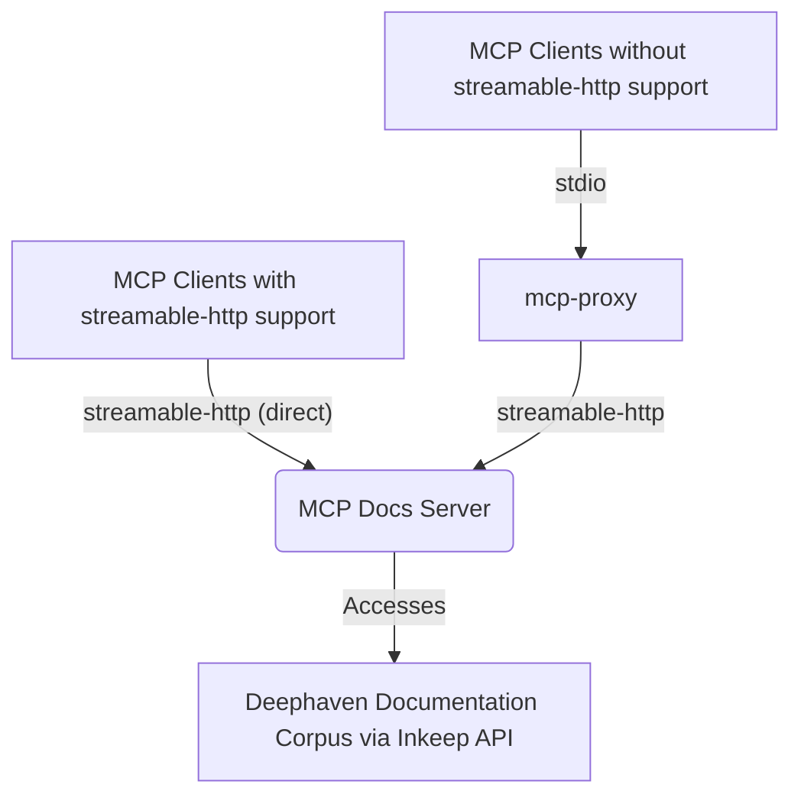

# Deephaven MCP

> **You are reading the [Developer & Contributor Guide](DEVELOPER_GUIDE.md) for Deephaven MCP.**

> **Project repository:** [https://github.com/deephaven/deephaven-mcp](https://github.com/deephaven/deephaven-mcp)

> **Note:** This document contains low-level technical details for contributors working on the [deephaven-mcp](https://github.com/deephaven/deephaven-mcp) project. **End users seeking high-level usage and onboarding information should refer to the main documentation in the [`../README.md`](../README.md).**

This repository houses the Python-based Model Context Protocol (MCP) servers for Deephaven:
1. **Deephaven MCP Systems Server**: Orchestrates Deephaven Community Core worker nodes.
2. **Deephaven MCP Docs Server**: Provides conversational Q&A about Deephaven documentation.

> **Requirements**: [Python](https://www.python.org/) 3.11 or later is required to run these servers.

---

## Table of Contents

- [Deephaven MCP](#deephaven-mcp)
  - [Table of Contents](#table-of-contents)
  - [Introduction](#introduction)
    - [About This Project](#about-this-project)
    - [Key Features](#key-features)
    - [System Architecture](#system-architecture)
  - [Quick Start Guide](#quick-start-guide)
    - [Systems Server Quick Start](#systems-server-quick-start)
    - [Docs Server Quick Start](#docs-server-quick-start)
  - [Command Line Entry Points](#command-line-entry-points)
  - [MCP Server Implementations](#mcp-server-implementations)
    - [Systems Server](#systems-server)
      - [Systems Server Overview](#systems-server-overview)
        - [Core Configuration File (`deephaven_mcp.json`)](#core-configuration-file-deephaven_mcpjson)
          - [Environment Variables](#environment-variables)
          - [File Structure Overview](#file-structure-overview)
      - [Systems Sessions Configuration](#systems-sessions-configuration)
      - [Enterprise Server Configuration](#enterprise-server-configuration)
      - [Running the Systems Server](#running-the-systems-server)
        - [CLI Arguments](#cli-arguments)
      - [Using the Systems Server](#using-the-systems-server)
      - [Systems Server Tools](#systems-server-tools)
      - [Error Handling](#error-handling)
      - [MCP Tools](#mcp-tools)
        - [`refresh`](#refresh)
        - [`enterprise_systems_status`](#enterprise_systems_status)
        - [`list_sessions`](#list_sessions)
        - [`get_session_details`](#get_session_details)
        - [`table_schemas`](#table_schemas)
        - [`run_script`](#run_script)
        - [`pip_packages`](#pip_packages)
      - [Systems Server Test Components](#systems-server-test-components)
        - [Test Server](#test-server)
        - [Test Client](#test-client)
    - [Docs Server](#docs-server)
      - [Docs Server Overview](#docs-server-overview)
      - [Docs Server Configuration](#docs-server-configuration)
        - [Environment Variables](#environment-variables-1)
        - [Example Configuration](#example-configuration)
      - [Running the Docs Server](#running-the-docs-server)
        - [CLI Arguments](#cli-arguments-1)
        - [SSE Transport Mode](#sse-transport-mode)
        - [stdio Transport Mode](#stdio-transport-mode)
      - [Docs Server Tools](#docs-server-tools)
        - [`docs_chat`](#docs_chat)
      - [Docs Server HTTP Endpoints](#docs-server-http-endpoints)
      - [Docs Server Test Components](#docs-server-test-components)
        - [Test Client](#test-client-1)
  - [Integration Methods](#integration-methods)
    - [MCP Inspector](#mcp-inspector)
      - [With Systems Server](#with-systems-server)
      - [With Docs Server](#with-docs-server)
    - [Claude Desktop](#claude-desktop)
      - [Configuration](#configuration)
      - [Claude Desktop Log Locations](#claude-desktop-log-locations)
    - [mcp-proxy](#mcp-proxy)
      - [With Systems Server](#with-systems-server-1)
      - [With Docs Server](#with-docs-server-1)
    - [Programmatic API](#programmatic-api)
      - [Systems Server Example](#systems-server-example)
      - [Docs Server Example](#docs-server-example)
  - [Development](#development)
    - [Development Workflow](#development-workflow)
    - [Core Plus Client Development Setup](#core-plus-client-development-setup)
    - [Advanced Development Techniques](#advanced-development-techniques)
    - [Development Commands](#development-commands)
      - [Code Quality \& Pre-commit Checks](#code-quality--pre-commit-checks)
    - [Project Structure](#project-structure)
      - [Script References](#script-references)
    - [Dependencies](#dependencies)
    - [Versioning](#versioning)
    - [Docker Compose](#docker-compose)
    - [Performance Testing](#performance-testing)
      - [Usage Example](#usage-example)
      - [Arguments](#arguments)
  - [Troubleshooting](#troubleshooting)
    - [Common Issues](#common-issues)
    - [Common Errors \& Solutions](#common-errors--solutions)
  - [Resources](#resources)
    - [Documentation](#documentation)
    - [Deephaven API Reference](#deephaven-api-reference)
    - [Tools \& Related Projects](#tools--related-projects)
    - [Contributing](#contributing)
  - [License](#license)

---

## Introduction

### About This Project

The [deephaven-mcp](https://github.com/deephaven/deephaven-mcp) project provides Python implementations of two Model Context Protocol (MCP) servers:

1. **Deephaven MCP Systems Server**:
   * Enables orchestration, inspection, and management of Deephaven Community Core worker nodes via the MCP protocol
   * Built with [FastMCP](https://github.com/jlowin/fastmcp)
   * Exposes tools for refreshing configuration, listing workers, inspecting table schemas, and running scripts
   * Maintains [PyDeephaven](https://github.com/deephaven/deephaven-core/tree/main/py) client sessions to each configured worker, with sophisticated session management.
   * The Systems Server orchestrates multiple Deephaven Community Core worker nodes, providing a unified interface for managing workers, their sessions, and data through the Model Context Protocol (MCP). It includes sophisticated session management with automatic caching, concurrent access safety, and lifecycle management.

2. **Deephaven MCP Docs Server**:
   * Offers an agentic, LLM-powered API for Deephaven documentation Q&A and chat
   * Uses [Inkeep](https://inkeep.com/)/[OpenAI](https://openai.com/) APIs for its LLM capabilities
   * Designed for integration with orchestration frameworks

Both servers are designed for integration with MCP-compatible tools like the [MCP Inspector](https://github.com/modelcontextprotocol/inspector) and [Claude Desktop](https://claude.ai).

### Key Features

**Systems Server Features:**
* **MCP Server:** Implements the MCP protocol for Deephaven Community Core and Enterprise systems
* **stdio Transport:** Designed for stdio-based MCP clients like Claude Desktop (typical usage)
* **Multiple Transports:** Also supports streamable-http and SSE for advanced use cases
* **Configurable:** Loads worker configuration from a JSON file or environment variable
* **Async Lifecycle:** Uses FastMCP's async lifespan for robust startup and shutdown handling
* **Lazy Loading:** Sessions are created on-demand to improve startup performance and resilience

**Docs Server Features:**
* **MCP-compatible server** for documentation Q&A and chat
* **Multiple Transports:** Supports streamable-http (default), SSE, and stdio for flexible integration
* **HTTP-first Design:** Optimized for streamable-http transport with stateless operation
* **LLM-powered:** Uses Inkeep/OpenAI APIs for conversational documentation assistance
* **FastMCP backend:** Built on FastMCP framework, deployable locally or via Docker
* **Single tool:** `docs_chat` for conversational documentation assistance
* **Extensible:** Python-based for adding new tools or extending context

### System Architecture

**Systems Server Architecture:**

```mermaid
graph TD
    A[MCP Clients (Claude Desktop, etc.)] -- stdio (MCP) --> B(MCP Systems Server);
    B -- Manages --> C(Deephaven Community Core Worker 1);
    B -- Manages --> D(Deephaven Community Core Worker N);
    B -- Manages --> E(Deephaven Enterprise System 1);
    B -- Manages --> F(Deephaven Enterprise System N);
    E -- Manages --> G(Enterprise Worker 1.1);
    E -- Manages --> H(Enterprise Worker 1.N);
    F -- Manages --> I(Enterprise Worker N.1);
    F -- Manages --> J(Enterprise Worker N.N);
```

**Typical Usage:**
Most users connect to the Systems Server via stdio transport (the default for tools like Claude Desktop). The Systems Server manages both Deephaven Community Core workers and Deephaven Enterprise systems. Each enterprise system can manage multiple enterprise workers, providing comprehensive session management, table operations, and script execution across your entire Deephaven infrastructure.

**Docs Server Architecture:**



**Transport Options:**
- **Direct streamable-http**: Modern MCP clients that support streamable-http can connect directly for optimal performance and scalability
- **Proxy-based streamable-http**: Clients without native streamable-http support can use mcp-proxy to bridge stdio to streamable-http

The MCP Docs Server processes natural language questions about Deephaven documentation using LLM capabilities via the Inkeep API.

## Quick Start Guide

### Systems Server Quick Start

1. **Set up worker configuration:**
   Create a JSON configuration file for your Deephaven MCP:
   ```json
   {
     "community": {
       "sessions": {
         "local_session": {
           "host": "localhost",
           "port": 10000
         }
       }
     }
   }
   ```
   Save this as `deephaven_mcp.json` in your project directory.

2. **Start a test Deephaven server in one terminal:**
   ```bash
   uv run scripts/run_deephaven_test_server.py --table-group simple
   ```
   
   > This script is located at [`../scripts/run_deephaven_test_server.py`](../scripts/run_deephaven_test_server.py) and creates a local Deephaven server with test data.

3. **Run the Systems Server:**
   ```sh
   DH_MCP_CONFIG_FILE=deephaven_mcp.json uv run dh-mcp-systems-server --transport sse
   ```

4. **Test with the MCP Inspector:**
   ```sh
   npx @modelcontextprotocol/inspector@latest
   ```
   Connect to `http://localhost:8000/mcp` (for streamable-http) or `http://localhost:8000/sse` (for SSE) in the Inspector UI.

### Docs Server Quick Start

1. **Set up Inkeep API key:**
   ```sh
   export INKEEP_API_KEY=your-inkeep-api-key  # Get from https://inkeep.com
   ```
   
2. **Run the Docs Server:**
   ```sh
   uv run dh-mcp-docs-server --transport streamable-http
   ```

3. **Test with the MCP Inspector:**
   ```sh
   npx @modelcontextprotocol/inspector@latest
   ```
   Connect to `http://localhost:8001/mcp` (for streamable-http) or `http://localhost:8001/sse` (for SSE) in the Inspector UI and test the `docs_chat` tool.

## Command Line Entry Points

This package registers the following console entry points for easy command-line access:

| Command | Description | Source |
|---------|-------------|--------|
| `dh-mcp-systems-server` | Start the Systems Server | `deephaven_mcp.mcp_systems_server:main` |
| `dh-mcp-docs-server` | Start the Docs Server | `deephaven_mcp.mcp_docs_server:main` |

These commands are automatically available in your PATH after installing the package.

## MCP Server Implementations

### Systems Server

#### Systems Server Overview

The Deephaven MCP Systems Server is an [MCP](https://github.com/modelcontextprotocol/spec)-compatible server (built with [FastMCP](https://github.com/jlowin/fastmcp)) that provides tools for interacting with Deephaven Community Core instances.

Key architectural features include:

- **Efficient Session Management**: Implements a sophisticated session caching system using [PyDeephaven](https://github.com/deephaven/deephaven-core/tree/main/py) that automatically reuses existing connections when possible and manages session lifecycles.
- **Concurrent Access Safety**: Uses [asyncio](https://docs.python.org/3/library/asyncio.html) Lock mechanisms to ensure thread-safe operations during configuration refreshes and session management.
- **Automatic Resource Cleanup**: Gracefully handles session termination and cleanup during server shutdown or refresh operations.
- **On-Demand Session Creation**: Sessions to worker nodes are created only when needed and cached for future use.
- **Async-First Design**: Built around [asyncio](https://docs.python.org/3/library/asyncio.html) for high-concurrency performance and non-blocking operations.
- **Configurable Session Behavior**: Supports worker configuration options such as `never_timeout` to control session persistence and lifecycle management.

##### Core Configuration File (`deephaven_mcp.json`)

The Deephaven MCP Systems Server relies on a JSON configuration file (conventionally named `deephaven_mcp.json`, though any name can be used) to define the Deephaven instances it can connect to and manage. This configuration is crucial for the server to operate correctly.

###### Environment Variables

The Systems Server's behavior, particularly how it finds its configuration, can be controlled by the following environment variables:

| Variable             | Required | Description                                                                                                                                                              | Where Used              |
|----------------------|----------|--------------------------------------------------------------------------------------------------------------------------------------------------------------------------|-------------------------|
| `DH_MCP_CONFIG_FILE` | Yes      | Path to the `deephaven_mcp.json` configuration file. The MCP Systems Server discovers the location of this file via this environment variable. You must set this variable to the absolute path of your configuration file before starting the server. If this variable is not set, the server will fail to start, logging an error. <br><br>Example: <br>`export DH_MCP_CONFIG_FILE="/home/user/project/config/deephaven_mcp.json"` <br>`# Now run the server` <br>`uv run dh-mcp-systems-server --transport sse`                                 | MCP Server, Test Client |
| `PYTHONLOGLEVEL`     | No       | Sets the Python logging level for the server (e.g., `DEBUG`, `INFO`, `WARNING`, `ERROR`).                                                                                    | Server (optional)       |

> Environment variables can also be loaded from `.env` files using [python-dotenv](https://github.com/theskumar/python-dotenv) if it's integrated into the project's startup mechanism.

###### File Structure Overview

The `deephaven_mcp.json` file is a JSON object that can contain two primary top-level keys: `"community"` and `"enterprise"`. Both are optional.

*   `"community"`: If present, its value must be an object containing a `"sessions"` key that maps user-defined session names to their specific configurations for Deephaven Community Core instances. Details for these configurations are below.
*   `"enterprise"`: If present, its value must be an object containing a `"systems"` key that maps user-defined system names to their specific configurations for Deephaven Enterprise instances. Details for these configurations are provided in a subsequent section.

If both keys are absent, or if the `deephaven_mcp.json` file itself is an empty JSON object (e.g., `{}`), it signifies that no sessions of either type are configured. This is a valid state.

#### Systems Sessions Configuration

This section details the configuration for individual sessions listed under the `"community"` → `"sessions"` key in the `deephaven_mcp.json` file.

**Systems Session Configuration Fields:**

All fields within a session's configuration object are optional. If a field is omitted, the server or client library may use default behaviors or the corresponding feature might be disabled.

*   `host` (string): Hostname or IP address of the Deephaven Community Core worker (e.g., `"localhost"`).
*   `port` (integer): Port number for the worker connection (e.g., `10000`).
*   `auth_type` (string): Authentication method. Supported values include:
    *   `"token"`: For token-based authentication (e.g., Deephaven's PSK). The actual token value (pre-shared key or bearer token) is supplied via `auth_token` or `auth_token_env_var`.
    *   `"basic"`: For username/password based HTTP Basic authentication. The password (or combined `username:password`) is supplied via `auth_token` or `auth_token_env_var`. Consult the Deephaven server's authentication guide for specifics.
    *   `"anonymous"`: For connections requiring no authentication.
*   `auth_token` (string, optional): The direct authentication token or password. Use this OR `auth_token_env_var`, but not both. Required if `auth_type` is `"token"` or `"basic"` and `auth_token_env_var` is not specified.
*   `auth_token_env_var` (string, optional): The name of an environment variable from which to read the authentication token. Use this OR `auth_token`, but not both. If specified, the token will be sourced from this environment variable.
*   `never_timeout` (boolean): If `true`, the MCP server attempts to configure the session to this worker to prevent timeouts. Server-side settings might still enforce timeouts.
*   `session_type` (string): Specifies the programming language for the session (e.g., `"python"`, `"groovy"`).
*   `use_tls` (boolean): Set to `true` if the connection to the worker requires TLS/SSL encryption.
*   `tls_root_certs` (string, optional): Absolute path to a PEM file containing trusted root CA certificates for TLS verification. If omitted, system CAs might be used, or verification behavior depends on the client library.
*   `client_cert_chain` (string, optional): Absolute path to a PEM file containing the client's TLS certificate chain. Used for client-side certificate authentication (mTLS).
*   `client_private_key` (string, optional): Absolute path to a PEM file containing the client's private key, corresponding to the `client_cert_chain`. Used for mTLS.

**Example `deephaven_mcp.json`:**

```json
{
  "community": {
    "sessions": {
      "my_local_deephaven": {
        "host": "localhost",
        "port": 10000,
        "session_type": "python"
      },
      "secure_remote_worker": {
        "host": "secure.deephaven.example.com",
        "port": 10001,
        "auth_type": "token",
        "auth_token_env_var": "MY_REMOTE_TOKEN_ENV_VAR",
        "never_timeout": true,
        "session_type": "groovy",
        "use_tls": true,
        "tls_root_certs": "/path/to/trusted_cas.pem",
        "client_cert_chain": "/path/to/client_cert_and_chain.pem",
        "client_private_key": "/path/to/client_private_key.pem"
      }
    }
  }
}
```

#### Enterprise Server Configuration

The `deephaven_mcp.json` file can also optionally include a top-level key named `"enterprise"` to configure connections to Deephaven Enterprise instances. This key holds a dictionary where each entry maps a custom system name (e.g., `"prod_cluster"`, `"data_science_env"`) to its specific configuration object.

If the `"enterprise"` key is present, it must be a dictionary. Each individual enterprise system configuration within this dictionary supports the following fields:

*   `connection_json_url` (string, **required**): The URL pointing to the `connection.json` file of the Deephaven Enterprise server. This file provides necessary connection details for the client.
    *   Example: `"https://enterprise.example.com/iris/connection.json"`
*   `auth_type` (string, **required**): Specifies the authentication method to use. Must be one of the following values:
    *   `"password"`: Authenticate using a username and password.
    *   `"private_key"`: Authenticate using a private key (e.g., for service accounts or specific SAML/OAuth setups requiring a private key).
    Only configuration keys relevant to the selected `auth_type` (and the general `connection_json_url`) should be included. Extraneous keys will be ignored by the application but will generate a warning message in the logs, indicating which keys are unexpected for the chosen authentication method.

*   Conditional Authentication Fields (required based on `auth_type`):
    *   If `auth_type` is `"password"`:
        *   `username` (string, **required**): The username for authentication.
        *   And either `password` (string): The password itself.
        *   **OR** `password_env_var` (string): The name of an environment variable that holds the password. Using an environment variable is recommended. If the `password` field is used directly, its value will be redacted in application logs.
    *   If `auth_type` is `"private_key"`:
        *   `private_key_path` (string, **required**): The absolute file system path to the private key file (e.g., a `.pem` file).

**Example `deephaven_mcp.json` with Enterprise Systems:**

```json
{
  "community": {
    "sessions": {
      "local_dev": {
        "host": "localhost",
        "port": 10000
      }
    }
  },
  "enterprise": {
    "systems": {
      "staging_env": {
        "connection_json_url": "https://staging.internal/iris/connection.json",
        "auth_type": "password",
        "username": "test_user",
        "password_env_var": "STAGING_PASSWORD"
      },
      "analytics_private_key_auth": {
        "connection_json_url": "https://analytics.dept.com/iris/connection.json",
        "auth_type": "private_key",
        "private_key_path": "/secure/keys/analytics_service_account.pem"
      }
    }
  }
}
```

This structure allows for flexible configuration of multiple Deephaven Enterprise instances alongside Community sessions within a single `deephaven_mcp.json` file.


**Security Considerations:**

The `deephaven_mcp.json` file can contain sensitive credentials (`auth_token`, paths to private keys). Protect this file with strict filesystem permissions (e.g., `chmod 600 path/to/your/deephaven_mcp.json` on Unix-like systems).

**File Paths:**

Ensure any file paths specified in the configuration (e.g., for TLS certificates) are absolute and accessible by the user/process running the MCP Systems Server.

#### Running the Systems Server

Follow these steps to start the Systems Server:

1. **Start a Deephaven Core worker**:
      ```sh
      uv run scripts/run_deephaven_test_server.py --table-group simple
      ```
      This script is located at [`../scripts/run_deephaven_test_server.py`](../scripts/run_deephaven_test_server.py).

2. **Start the MCP Systems Server**:
   ```sh
   DH_MCP_CONFIG_FILE=/path/to/deephaven_mcp.json uv run dh-mcp-systems-server
   ```

   The Systems Server uses stdio transport by default (suitable for Claude Desktop and similar tools).

##### CLI Arguments

| Argument | Description | Default |
|----------|-------------|---------|
| `-t, --transport` | Transport type (`stdio`, `sse`, or `streamable-http`) | `stdio` |
| `-h, --help` | Show help message | - |

> **Note:** When using HTTP transports (streamable-http or SSE), the server binds to port 8000 by default. This can be modified by setting the `PORT` environment variable.

*   **stdio Transport (Default):**
    ```sh
    DH_MCP_CONFIG_FILE=/path/to/deephaven_mcp.json uv run dh-mcp-systems-server
    # or explicitly
    DH_MCP_CONFIG_FILE=/path/to/deephaven_mcp.json uv run dh-mcp-systems-server --transport stdio
    ```

*   **SSE Transport (for web/Inspector):**
    ```sh
    # Default port (8000)
    DH_MCP_CONFIG_FILE=/path/to/deephaven_mcp.json uv run dh-mcp-systems-server --transport sse
    
    # Custom port (8001)
    PORT=8001 DH_MCP_CONFIG_FILE=/path/to/deephaven_mcp.json uv run dh-mcp-systems-server --transport sse
    # or
    uv run dh-mcp-systems-server --transport sse --port 8001
    ```

*   **Streamable-HTTP Transport (advanced use):**
    ```sh
    # Default port (8000)
    DH_MCP_CONFIG_FILE=/path/to/deephaven_mcp.json uv run dh-mcp-systems-server --transport streamable-http
    
    # Custom port (8001)
    PORT=8001 DH_MCP_CONFIG_FILE=/path/to/deephaven_mcp.json uv run dh-mcp-systems-server --transport streamable-http
    # or
    uv run dh-mcp-systems-server --transport streamable-http --port 8001
    ```

#### Using the Systems Server

Once running, you can interact with the Systems Server in several ways:

- Connect using [MCP Inspector](#with-systems-server)
- Use with [Claude Desktop](#claude-desktop)
- Run the [Test Client](#test-client) script
- Build your own MCP client application

#### Session ID Format and Terminology

The Systems Server uses a consistent session identifier format across all MCP tools:

**Session ID Format**: `{type}:{source}:{session_name}`

Where:
- `type`: Either `"community"` or `"enterprise"`
- `source`: The configuration key name (worker name for community, system name for enterprise)
- `session_name`: The specific session name within that source

**Examples**:
- `"community:local_dev:my_session"` - A community session named "my_session" on the "local_dev" worker
- `"enterprise:staging_env:analytics_session"` - An enterprise session named "analytics_session" on the "staging_env" system

**Terminology Clarification**:
- **Worker**: A Deephaven Community Core instance (configured under `"community"` → `"sessions"`)
- **System**: A Deephaven Enterprise instance/factory (configured under `"enterprise"` → `"systems"`)
- **Session**: A specific connection/session within a worker or system
- **Session ID**: The fully qualified identifier used by MCP tools to reference a specific session

All MCP tools that interact with Deephaven instances use the `session_id` parameter with this format, replacing the older `worker_name` parameter from previous versions.

#### Systems Server Tools

The Systems Server exposes the following MCP tools, each designed for a specific aspect of Deephaven worker management:

All Systems Server tools return responses with a consistent format:
- Success: `{ "success": true, ... }` with additional fields depending on the tool
- Error: `{ "success": false, "error": "Error description", "isError": true }`

#### Error Handling

All Systems Server tools use a consistent error response format when encountering problems:

```json
{
  "success": false,
  "error": "Human-readable error description",
  "isError": true
}
```

This consistent format makes error handling and response parsing more predictable across all tools.

#### MCP Tools

The Systems Server provides the following MCP tools:

##### `refresh`

**Purpose**: Atomically reload configuration and clear all active session cache.

**Parameters**: None

**Returns**: 
```json
{
  "success": true
}
```

On error:
```json
{
  "success": false,
  "error": "Error message",
  "isError": true
}
```

**Description**: This tool reloads the Deephaven worker configuration from the file specified in `DH_MCP_CONFIG_FILE` and clears all active session objects for all workers. It uses dependency injection via the Context to access the config manager, session registry, and a coroutine-safe refresh lock. The operation is protected by the provided lock to prevent concurrent refreshes.

##### `enterprise_systems_status`

**Purpose**: List all enterprise (CorePlus) systems/factories with their status and configuration details (redacted).

**Parameters**:
- `attempt_to_connect` (optional, boolean): If True, actively attempts to connect to each system to verify its status. Default is False (only checks existing connections for faster response).

**Returns**:
```json
{
  "success": true,
  "systems": [
    {
      "name": "staging_env",
      "status": "ONLINE",
      "detail": "System is healthy and ready for operational use",
      "is_alive": true,
      "config": {
        "connection_json_url": "https://staging.internal/iris/connection.json",
        "auth_type": "password",
        "username": "test_user"
      }
    }
  ]
}
```

On error:
```json
{
  "success": false,
  "error": "Error message",
  "isError": true
}
```

**Description**: This tool provides comprehensive status information about all configured enterprise systems. Status values include "ONLINE", "OFFLINE", "UNAUTHORIZED", "MISCONFIGURED", or "UNKNOWN". Sensitive configuration fields are redacted for security.

##### `list_sessions`

**Purpose**: List all sessions (community and enterprise) with basic metadata.

**Parameters**: None

**Returns**:
```json
{
  "success": true,
  "sessions": [
    {
      "session_id": "community:local_dev:session_name",
      "type": "community",
      "source": "local_dev",
      "session_name": "session_name"
    },
    {
      "session_id": "enterprise:staging_env:analytics_session",
      "type": "enterprise",
      "source": "staging_env",
      "session_name": "analytics_session"
    }
  ]
}
```

On error:
```json
{
  "success": false,
  "error": "Error message",
  "isError": true
}
```

**Description**: This is a lightweight operation that doesn't connect to sessions or check their status. For detailed information about a specific session, use `get_session_details`.

##### `get_session_details`

**Purpose**: Get detailed information about a specific session.

**Parameters**:
- `session_id` (required, string): The session identifier (fully qualified name) to get details for.
- `attempt_to_connect` (optional, boolean): Whether to attempt connecting to the session to verify its status. Defaults to False for faster response.

**Returns**:
```json
{
  "success": true,
  "session": {
    "session_id": "community:local_dev:session_name",
    "type": "community",
    "source": "local_dev",
    "session_name": "session_name",
    "available": true,
    "programming_language": "python",
    "deephaven_core_version": "0.36.1",
    "deephaven_enterprise_version": null
  }
}
```

On error:
```json
{
  "success": false,
  "error": "Error message",
  "isError": true
}
```

**Description**: This tool provides comprehensive status information about a specific session. It supports two operational modes: quick status check (default) or active connection verification.

##### `table_schemas`

**Purpose**: Retrieve schemas for one or more tables from a Deephaven session.

**Parameters**:
- `session_id` (required, string): ID of the Deephaven session to query.
- `table_names` (optional, list[string]): List of table names to retrieve schemas for. If None, all available tables will be queried.

**Returns**:
```json
{
  "success": true,
  "schemas": [
    {
      "success": true,
      "table": "table_name",
      "schema": [
        {"name": "column1", "type": "int"},
        {"name": "column2", "type": "string"}
      ],
      "error": null,
      "isError": false
    },
    {
      "success": false,
      "table": "missing_table",
      "schema": null,
      "error": "Table not found",
      "isError": true
    }
  ]
}
```

On complete failure (e.g., session not available):
```json
{
  "success": false,
  "error": "Failed to connect to session: ...",
  "isError": true
}
```

**Description**: This tool returns the column schemas for the specified tables in the given Deephaven session. If no table_names are provided, schemas for all tables in the session are returned. The tool maintains the ability to report individual table successes/failures while providing an overall operation status.

##### `run_script`

**Purpose**: Execute a script on a specified Deephaven session.

**Parameters**:
- `session_id` (required, string): ID of the Deephaven session on which to execute the script.
- `script` (optional, string): The Python script to execute.
- `script_path` (optional, string): Path to a Python script file to execute.

**Note**: Exactly one of `script` or `script_path` must be provided.

**Returns**:
```json
{
  "success": true
}
```

On error:
```json
{
  "success": false,
  "error": "Error message",
  "isError": true
}
```

**Description**: This tool executes a Python script on the specified Deephaven session. The script can be provided either as a string or as a file path. The tool only returns success status and does not include stdout or created tables in the response.

##### `pip_packages`

**Purpose**: Retrieve installed pip packages from a specified Deephaven session.

**Parameters**:
- `session_id` (required, string): ID of the Deephaven session to query.

**Returns**:
```json
{
  "success": true,
  "result": [
    {"package": "numpy", "version": "1.25.0"},
    {"package": "pandas", "version": "2.1.0"},
    {"package": "deephaven-core", "version": "0.36.1"}
  ]
}
```

On error:
```json
{
  "success": false,
  "error": "Error message",
  "isError": true
}
```

**Description**: This tool queries the specified Deephaven session for information about installed pip packages using importlib.metadata. It executes a query on the session to retrieve package names and versions for all installed Python packages available in that session's environment.

#### Systems Server Test Components

##### Test Server

For development and testing the MCP Community server, you often need a running Deephaven Community Core server. A script is provided for this:

```sh
uv run scripts/run_deephaven_test_server.py --table-group {simple|financial|all}
```

**Arguments:**
* `--table-group {simple|financial|all}` (**required**): Which demo tables to create
* `--host HOST` (default: `localhost`): Host to bind to
* `--port PORT` (default: `10000`): Port to listen on

##### Test Client

A Python script ([`../scripts/mcp_community_test_client.py`](../scripts/mcp_community_test_client.py)) is available for exercising the Community MCP tools and validating server functionality without setting up a full MCP Inspector deployment. The script connects to a running server, lists all available tools, and demonstrates calling each tool with appropriate arguments.

```sh
uv run scripts/mcp_community_test_client.py --transport {sse|stdio|streamable-http} [OPTIONS]
```

**Key Arguments:**
* `--transport`: Choose `streamable-http` (default), `sse`, or `stdio`
* `--env`: Pass environment variables as `KEY=VALUE` (e.g., `DH_MCP_CONFIG_FILE=/path/to/config.json`). Can be repeated for multiple variables
* `--url`: URL for HTTP server (default: `http://localhost:8000/mcp` for streamable-http, `http://localhost:8000/sse` for SSE)
* `--stdio-cmd`: Command to launch stdio server (default: `uv run dh-mcp-systems-server --transport stdio`)

**Example Usage:**
```sh
# Connect to running streamable-http server (default)
uv run scripts/mcp_community_test_client.py --transport streamable-http --url http://localhost:8000/mcp

# Connect to running SSE server
uv run scripts/mcp_community_test_client.py --transport sse --url http://localhost:8000/sse

# Launch stdio server with environment variables (useful for CI/CD or agent integration)
uv run scripts/mcp_community_test_client.py --transport stdio --env DH_MCP_CONFIG_FILE=/absolute/path/to/config.json
```

> ⚠️ **Prerequisites:** 
> - You must have a test Deephaven server running (see [Running the Systems Server](#running-the-systems-server))
> - The MCP Community server must be running (or use `--stdio-cmd` for the client to launch it)
> - For troubleshooting connection issues, see [Common Errors & Solutions](#common-errors--solutions)

> 💡 **Tips:** 
> - Use stdio mode in CI/CD pipelines and HTTP modes (streamable-http, SSE) for interactive development
> - Streamable-http (default) provides optimal performance and scalability
> - SSE mode is useful for interactive testing with MCP Inspector
> - Environment variables can be set in your shell or passed via `--env` parameter
> - For multiple environment variables, use `--env` multiple times: `--env VAR1=value1 --env VAR2=value2`

---

### Docs Server

#### Docs Server Overview

The Deephaven MCP Docs Server is a specialized MCP server that provides a single tool for conversational chat about Deephaven documentation.

- **Primary LLM**: Uses the [Inkeep](https://inkeep.com/) `inkeep-context-expert` model with domain-specific knowledge of Deephaven documentation
- **Fallback Mechanism**: Automatically falls back to [OpenAI](https://openai.com/) if the Inkeep API is unavailable or returns an error
- **System Prompting**: Uses a specialized system prompt that instructs the model to answer with reference to Deephaven documentation
- **Error Resilience**: Implements robust error handling with custom `OpenAIClientError` for detailed diagnostics
- **Conversational Context**: Maintains conversation history for multi-turn Q&A sessions
- **Health Monitoring**: Provides a dedicated `/health` endpoint for operational monitoring

The server helps users learn and troubleshoot Deephaven through natural language conversation about features, APIs, and concepts.

The MCP Docs Server acts as a bridge between users (or client applications) and the Deephaven documentation.

```
+--------------------+
|  User/Client/API   |
+---------+----------+
          |
      HTTP/MCP
          |
+---------v----------+
|   MCP Docs Server  |
|   (FastAPI, LLM)   |
+---------+----------+
          |
  [Deephaven Docs]
```

Users or API clients send natural language questions or documentation queries over HTTP using the Model Context Protocol (MCP). These requests are received by the server, which is built on FastAPI and powered by a large language model (LLM) via the Inkeep API.

#### Docs Server Configuration

The MCP Docs Server requires an Inkeep API key for accessing documentation and generating responses. An OpenAI API key can also be used as an optional backup.

##### Environment Variables

- **`INKEEP_API_KEY`**: (Required) Your Inkeep API key for accessing the documentation assistant. This is the primary API used by the `docs_chat` tool and must be set.
- **`OPENAI_API_KEY`**: (Optional) Your OpenAI API key as a fallback option. If provided, the system will attempt to use OpenAI's services if the Inkeep API call fails, providing redundancy.
- **`PYTHONLOGLEVEL`**: (Optional) Set to 'DEBUG', 'INFO', 'WARNING', etc. to control logging verbosity. Useful for troubleshooting issues.
- **`PORT`**: (Optional) Port for the MCP HTTP server (powered by [Uvicorn](https://www.uvicorn.org/)) when using streamable-http or SSE transport modes (default: `8001`). This setting only affects the server when running in HTTP-based modes and has no effect on stdio mode. It controls which port the `/health` endpoint and HTTP connections will be available on.

##### Example Configuration

```sh
# Required for accessing Deephaven documentation knowledge base
export INKEEP_API_KEY=your-inkeep-api-key

# Optional for using OpenAI as a fallback
export OPENAI_API_KEY=your-openai-api-key

# Optional for detailed logging
export PYTHONLOGLEVEL=DEBUG
```

> **Security Note:** Always store API keys in environment variables or secure configuration files, never hardcode them in application code.

#### Running the Docs Server

Ensure `INKEEP_API_KEY` is set before running the Docs Server.

##### CLI Arguments

| Argument | Description | Default |
|----------|-------------|---------|
| `-t, --transport` | Transport type (`streamable-http`, `sse`, or `stdio`) | `streamable-http` |
| `-p, --port` | Port for HTTP server (overrides PORT env var) | `8001` |
| `-h, --help` | Show help message | - |

##### Streamable-HTTP Transport Mode (Default)

```sh
# Default port (8000)
INKEEP_API_KEY=your-api-key uv run dh-mcp-docs-server --transport streamable-http

# Custom port (8001)
INKEEP_API_KEY=your-api-key uv run dh-mcp-docs-server --transport streamable-http --port 8001
# or
PORT=8001 INKEEP_API_KEY=your-api-key uv run dh-mcp-docs-server --transport streamable-http
```

##### SSE Transport Mode

```sh
# Default port (8000)
INKEEP_API_KEY=your-api-key uv run dh-mcp-docs-server --transport sse

# Custom port (8001)
INKEEP_API_KEY=your-api-key uv run dh-mcp-docs-server --transport sse --port 8001
# or
PORT=8001 INKEEP_API_KEY=your-api-key uv run dh-mcp-docs-server --transport sse
```

##### stdio Transport Mode

```sh
INKEEP_API_KEY=your-api-key uv run dh-mcp-docs-server --transport stdio
```

> **Note:** The streamable-http transport (default) provides stateless streaming HTTP for optimal performance and scalability. SSE transport is useful for interactive testing with tools like MCP Inspector, while stdio transport is better for integration with LLM platforms like Claude.

#### Docs Server Tools

The Deephaven MCP Docs Server exposes a single MCP-compatible tool:

##### `docs_chat`

- **Purpose**: Interact with the Deephaven documentation assistant using conversational natural language queries
- **Parameters**:
  - `prompt` (required): Query or question about Deephaven or its documentation as a natural language string
  - `history` (optional): Previous conversation history for context (list of messages with 'role' and 'content' keys)
    ```python
    [
        {"role": "user", "content": "How do I install Deephaven?"},
        {"role": "assistant", "content": "To install Deephaven, ..."}
    ]
    ```
  - `deephaven_core_version` (optional): The version of Deephaven Community Core installed for the relevant worker. Providing this enables the documentation assistant to tailor its answers for greater accuracy.
  - `deephaven_enterprise_version` (optional): The version of Deephaven Core+ (Enterprise) installed for the relevant worker. Providing this enables the documentation assistant to tailor its answers for greater accuracy.
  - `programming_language` (optional): Programming language context for the user's question (e.g., "python", "groovy"). If provided, the assistant tailors its answer for this language.
- **Returns**: String containing the assistant's response message
- **Error Handling**: If the underlying LLM API call fails, an `OpenAIClientError` is raised with a descriptive error message. Common errors include:
    - Invalid or missing API keys
    - Network connectivity issues
    - Rate limiting from the LLM provider
    - Invalid message format in history
  All errors are logged and propagated with meaningful context
- **Usage Notes**:
  - This tool is asynchronous and should be awaited when used programmatically
  - For multi-turn conversations, providing conversation history improves contextual understanding
  - Providing Deephaven version arguments for a worker will result in more accurate and context-specific answers.
  - Providing the `programming_language` argument will tailor the assistant's answer for that language (e.g., "python", "groovy").
  - Powered by Inkeep's LLM API service for retrieving documentation-specific responses

**Example (programmatic use):**
```python
from deephaven_mcp.mcp_docs_server._mcp import docs_chat

async def get_docs_answer():
    response = await docs_chat(
        prompt="How do I filter tables in Deephaven?",
        history=[
            {"role": "user", "content": "How do I create a table?"},
            {"role": "assistant", "content": "To create a table in Deephaven..."},
        ],
        deephaven_core_version="1.2.3",
        deephaven_enterprise_version="4.5.6",
        programming_language="python",
    )
    return response
```

#### Docs Server HTTP Endpoints

**Example Usage:**
```bash
curl http://localhost:8001/health
# Response: {"status": "ok"}
```

**`/health` (GET)**
- **Purpose**: Health check endpoint for liveness and readiness probes in deployment environments
- **Parameters**: None
- **Returns**: JSON response `{"status": "ok"}` with HTTP 200 status code
- **Usage**: Used by load balancers, orchestrators, or monitoring tools to verify the server is running
- **Implementation**: Defined using `@mcp_server.custom_route("/health", methods=["GET"])` decorator in the source code
- **Availability**: Only available when using HTTP-based transports (streamable-http or SSE). Not available in stdio mode
- **Authentication**: No authentication or parameters required
- **Deployment**: Intended for use as a liveness or readiness probe in Kubernetes, Cloud Run, or similar environments
- **Note**: This endpoint is only available in the Docs Server, not in the Systems Server

#### Docs Server Test Components

##### Test Client

A Python script is provided for testing the MCP Docs tool and validating server functionality without setting up a full MCP Inspector deployment. The script connects to the docs server, demonstrates calling the `docs_chat` tool with your query, and displays the response.

**Script Location**: [`../scripts/mcp_docs_test_client.py`](../scripts/mcp_docs_test_client.py)

**Arguments:**
- `--transport`: Choose `streamable-http`, `sse`, or `stdio` (default: `streamable-http`)
- `--env`: Pass environment variables as `KEY=VALUE` (can be repeated; for stdio mode)
- `--url`: URL for HTTP server (default: `http://localhost:8001/mcp` for streamable-http, `http://localhost:8001/sse` for SSE)
- `--stdio-cmd`: Command to launch stdio server (default: `uv run dh-mcp-docs-server --transport stdio`)
- `--prompt`: Prompt/question to send to the docs_chat tool (required)
- `--history`: Optional chat history (JSON string) for multi-turn conversations

**Example Usage:**
```sh
# Connect to a running streamable-http server (default)
uv run scripts/mcp_docs_test_client.py --prompt "What is Deephaven?"

# Connect to a running SSE server
uv run scripts/mcp_docs_test_client.py --transport sse --prompt "What is Deephaven?"

# Launch a new stdio server with environment variables set
uv run scripts/mcp_docs_test_client.py --transport stdio \
  --prompt "How do I create a table?" \
  --env INKEEP_API_KEY=your-inkeep-api-key \
  --env OPENAI_API_KEY=your-openai-api-key

# Multi-turn conversation with history (using JSON string for previous messages)
uv run scripts/mcp_docs_test_client.py --prompt "How do I filter this table?" \
  --history '[{"role":"user","content":"How do I create a table?"},{"role":"assistant","content":"To create a table in Deephaven..."}]'
```

> ⚠️ **Prerequisites:** 
> - For the Docs Server test client, you need a valid [Inkeep API key](https://inkeep.com/) (required)
> - An [OpenAI API key](https://openai.com/) is optional but recommended as a fallback
> - For troubleshooting API issues, see [Common Errors & Solutions](#common-errors--solutions)

> 💡 **Tips:** 
> - Replace placeholder API keys with your actual keys
> - For multi-turn conversations, the history parameter accepts properly formatted JSON
> - Use `jq` to format complex history objects: `echo '$HISTORY' | jq -c .`

---

## Integration Methods

### MCP Inspector

The [MCP Inspector](https://github.com/modelcontextprotocol/inspector) is a web-based tool for interactively exploring and testing MCP servers. It provides an intuitive UI for discovering available tools, invoking them, and inspecting responses.

#### With Systems Server

1. **Start a Deephaven Community Core worker** (in one terminal):
   ```sh
   uv run scripts/run_deephaven_test_server.py --table-group simple
   ```

2. **Start the MCP Systems server** (in another terminal):
   ```sh
   # Using streamable-http (default)
   DH_MCP_CONFIG_FILE=/path/to/deephaven_mcp.json uv run dh-mcp-systems-server --transport streamable-http
   
   # Or using SSE
   DH_MCP_CONFIG_FILE=/path/to/deephaven_mcp.json uv run dh-mcp-systems-server --transport sse
   ```

3. **Start the MCP Inspector** (in a third terminal):
   ```sh
   npx @modelcontextprotocol/inspector@latest
   ```

4. **Connect to the MCP server**:
   - Open the Inspector in your browser (URL shown in terminal, typically `http://localhost:6274`)
   - In the Inspector UI, select "Connect" and enter the server URL (e.g., `http://localhost:8000/mcp` for streamable-http or `http://localhost:8000/sse` for SSE)
   - Explore and invoke tools like `refresh`, `enterprise_systems_status`, `list_sessions`, `table_schemas` and `run_script`

#### With Docs Server

1. **Start the MCP Docs server** (in a terminal):
   ```sh
   # Using streamable-http (default)
   INKEEP_API_KEY=your-api-key uv run dh-mcp-docs-server --transport streamable-http
   
   # Or using SSE for interactive testing
   INKEEP_API_KEY=your-api-key uv run dh-mcp-docs-server --transport sse
   ```

2. **Start the MCP Inspector** (in another terminal):
   ```sh
   npx @modelcontextprotocol/inspector@latest
   ```

3. **Connect to the MCP server**:
   - Open the Inspector in your browser (URL shown in terminal, typically `http://localhost:6274`)
   - In the Inspector UI, select "Connect" and enter the server URL (e.g., `http://localhost:8001/mcp` for streamable-http or `http://localhost:8001/sse` for SSE)
   - Explore and invoke the `docs_chat` tool to ask questions about Deephaven documentation

### Claude Desktop

Claude Desktop is very useful for debugging and interactively exploring MCP servers. The configuration file format described in this documentation is also used by most AI Agents that support MCP, making it easy to reuse your setup across different tools.

#### Configuration

1. **Open Claude Desktop.**
2. **Navigate to `Settings > Developer > Edit Config`.**
3. **Edit the `claude_desktop_config.json` file.**
4. **Add your MCP server under the `mcpServers` section.**
   - We recommend using the `stdio` transport for best results.
   - Example configuration with full path (recommended):
     ```json
     {
       "mcpServers": {
         "mcp-community": {
           "command": "uv",
           "args": [
             "--directory",
             "/path/to/deephaven-mcp/mcp-community",
             "run",
             "dh-mcp-systems-server"
           ],
           "env": {
             "DH_MCP_CONFIG_FILE": "/path/to/deephaven_mcp.json"
           }
         },
         "mcp-docs": {
           "command": "uv",
           "args": [
             "--directory",
             "/path/to/deephaven-mcp/mcp-community",
             "run",
             "dh-mcp-docs-server"
           ],
           "env": {
             "INKEEP_API_KEY": "your-inkeep-api-key"
           }
         }
       }
     }
     ```
5. **Save the configuration and restart Claude Desktop if needed.**

#### Claude Desktop Log Locations

For troubleshooting Claude Desktop MCP integration, log files are located at:
- **macOS:** `~/Library/Logs/Claude`
- **Windows:** `%APPDATA%\Claude\logs`

- `mcp.log` contains general logging about MCP connections and connection failures
- Files named `mcp-server-SERVERNAME.log` contain error (stderr) logs from each configured server

### mcp-proxy

[mcp-proxy](https://github.com/modelcontextprotocol/mcp-proxy) enables MCP clients that only support stdio to connect to servers using HTTP-based transports (streamable-http or SSE). This is essential for tools like Claude Desktop that don't natively support streamable-http but can benefit from the performance advantages of the streamable-http transport. The `mcp-proxy` utility is included as a dependency in this project.

**Use Cases:**
- **Claude Desktop Integration**: Bridge stdio-only Claude Desktop to streamable-http servers for optimal performance
- **Legacy Client Support**: Enable older MCP clients to use modern streamable-http transport
- **Development Testing**: Test streamable-http servers with stdio-based tooling

#### With Systems Server

1. Ensure the MCP Systems Server is running in HTTP mode:
   ```sh
   # Using streamable-http (default)
   DH_MCP_CONFIG_FILE=/path/to/deephaven_mcp.json uv run dh-mcp-systems-server --transport streamable-http
   
   # Or using SSE
   DH_MCP_CONFIG_FILE=/path/to/deephaven_mcp.json uv run dh-mcp-systems-server --transport sse
   ```

2. Run `mcp-proxy` to connect to your running MCP server:
   ```sh
   # For streamable-http (default)
   mcp-proxy --transport=streamablehttp http://localhost:8000/mcp
   
   # For SSE
   mcp-proxy http://localhost:8000/sse
   ```
   (Replace URL if your server runs elsewhere)

3. Configure your client (e.g., Claude Desktop) to use the stdio interface provided by `mcp-proxy`

#### With Docs Server

1. Ensure the MCP Docs Server is running in HTTP mode:
   ```sh
   # Using streamable-http (default)
   INKEEP_API_KEY=your-api-key uv run dh-mcp-docs-server --transport streamable-http
   
   # Or using SSE
   INKEEP_API_KEY=your-api-key uv run dh-mcp-docs-server --transport sse
   ```

2. Run `mcp-proxy`:
   ```sh
   # For streamable-http (default)
   mcp-proxy --transport=streamablehttp http://localhost:8001/mcp
   
   # For SSE
   mcp-proxy http://localhost:8001/sse
   ```

3. Configure your client (e.g., Claude Desktop) to use the stdio interface provided by `mcp-proxy`

### Programmatic API

Both servers can be used programmatically within Python applications:

#### Systems Server Example

```python
# Import the server components
from deephaven_mcp.mcp_systems_server import mcp_server, run_server

# Use the MCP tools directly (synchronous)
from deephaven_mcp.mcp_systems_server._mcp import refresh, enterprise_systems_status, list_sessions, get_session_details, table_schemas, run_script, pip_packages

# Example: Get status of all enterprise systems
result = enterprise_systems_status(context)  # Requires MCP context

# Or start the server with a specific transport
run_server(transport="streamable-http")  # Starts streamable-http server (default)
run_server(transport="sse")  # Starts SSE server
```

#### Docs Server Example

```python
# Import the server components
from deephaven_mcp.mcp_docs_server import mcp_server, run_server

# Use the docs_chat tool directly (asynchronous)
from deephaven_mcp.mcp_docs_server._mcp import docs_chat

# Example: Get documentation answer
async def get_answer():
    response = await docs_chat(
        prompt="How do I filter tables in Deephaven?",
        history=[{"role": "user", "content": "Hello"}],
        programming_language="python",
    )
    return response

# Or start the server with a specific transport
run_server(transport="streamable-http")  # Starts streamable-http server (default)
run_server(transport="sse")  # Starts SSE server
run_server(transport="stdio")  # Starts stdio server
```

Both servers expose their tools through FastMCP, following the Model Context Protocol.

---

## Development

<div align="center">

🛠️ *Guidelines and tools for developers working on the MCP servers* 💻

</div>

### Development Workflow

1. **Set up your environment**:
   ```sh
   # Clone the repository
   git clone https://github.com/deephaven/deephaven-mcp.git
   cd deephaven-mcp/mcp-community
   
   # Create a virtual environment
   uv venv .venv -p 3.9 # Or your desired Python version e.g., 3.10, 3.11
   
   # Activate the virtual environment
   # On macOS/Linux: source .venv/bin/activate
   # On Windows (PowerShell): .venv\Scripts\Activate.ps1
   # On Windows (CMD): .venv\Scripts\activate.bat
   
   # Install dependencies with uv (editable mode for development)
   uv pip install -e ".[dev]"
   ```
   
   > [`uv`](https://github.com/astral-sh/uv) is a fast Python package installer and resolver, but you can also use regular `pip install -e .` if preferred.

2. **Run the test server** (in one terminal):
   ```sh
   uv run scripts/run_deephaven_test_server.py --table-group simple
   ```

3. **Run the MCP Community server** (in another terminal):
   ```sh
   DH_MCP_CONFIG_FILE=/path/to/deephaven_mcp.json uv run dh-mcp-systems-server --transport sse
   ```

4. **Use the MCP Inspector or test client** to validate your changes.


### Core Plus Client Development Setup

These steps outline how to set up a development environment specifically for working with the Deephaven Core Plus client wheel:

1.  **Create a Python 3.12 virtual environment:**
    ```sh
    uv venv .venv -p 3.12
    ```
    *Ensure Python 3.9 to 3.12 is used, as per potential Core Plus client requirements.*

2.  **Install the Core Plus client wheel:**
    Run the management script to download and install the client wheel into your venv.
    ```sh
    ./bin/dev_manage_coreplus_client.sh install
    ```
    *This script is used because the `deephaven-coreplus-client` wheel is not available on PyPI and needs to be fetched from a specific location. The script also, crucially, manages `grpcio` dependency versioning by ensuring that if `grpcio` is already installed, its version is pinned during the client installation to prevent conflicts, and it uses binary-only installs to avoid build issues.*

3.  **Install project development and Core Plus dependencies:**
    Install the main project's development dependencies along with the `coreplus` extra.
    ```sh
    uv pip install -e ".[dev,coreplus]"
    ```
    *This ensures your environment has all necessary tools for general `deephaven-mcp` development, plus the packages specified in the `coreplus` extra.*

After these steps, your virtual environment will be configured for Core Plus client development.

> **Tip:** You can generate or regenerate the entire Core Plus development environment in one line:
> ```sh
> rm -rf .venv && uv venv -p 3.12 && ./bin/dev_manage_coreplus_client.sh install && uv pip install ".[dev,coreplus]"
> ```
> This will remove any existing virtual environment, create a new one, install the Core Plus client, and set up all project dependencies in a single command.

### Advanced Development Techniques

- **Run the server directly (development mode):**
  ```sh
  PYTHONPATH=src uv run mcp dev src/deephaven_mcp/community/_mcp.py:mcp_server
  ```
  This command starts the MCP server for local development with advanced debugging capabilities. You can specify different entrypoints as needed.

- **Interactive Tools:**
  Use the Inspector or the test client for interactive tool calls and debugging during development.

- **Code Style & Linting:**
  ```sh
  # Sort imports with isort
  uv run isort . --skip _version.py --skip .venv
  
  # Format code with black
  uv run black . --exclude '(_version.py|.venv)'
  
  # Lint code with ruff
  uv run ruff check src --fix --exclude _version.py --exclude .venv
  ```
  
  > The project follows Python best practices using [isort](https://pycqa.github.io/isort/), [black](https://black.readthedocs.io/), and [ruff](https://beta.ruff.rs/docs/) for code quality.

- **Type Checking:**
  ```sh
  # Run static type checking with mypy
  uv run mypy src/
  ```
  
  > [mypy](https://mypy.readthedocs.io/) provides static type checking for Python code.

- **Pre-commit Hooks:**
  For automatic linting and formatting before each commit using [pre-commit](https://pre-commit.com/):
  ```sh
  uv pip install pre-commit
  pre-commit install
  ```
  
  > This sets up Git hooks that automatically run code formatters and linters before each commit.

### Development Commands

#### Code Quality & Pre-commit Checks

To help maintain a consistent and high-quality codebase, the [`bin/precommit.sh`](../bin/precommit.sh) script is provided. This script will:

| Tool         | Purpose                                        | How to Run (manual)                | What is Enforced |
|--------------|------------------------------------------------|-------------------------------------|------------------|
| isort        | Sort Python imports                            | `uv run isort . --skip _version.py --skip .venv` | Import order, grouping |
| black        | Format Python code                             | `uv run black . --exclude '(_version.py|.venv)'` | PEP 8 formatting |
| ruff         | Lint code, autofix common issues               | `uv run ruff check src --fix --exclude _version.py --exclude .venv` | Linting, best practices |
| mypy         | Static type checking                           | `uv run mypy src/`                  | Type correctness |
| pydocstyle   | Docstring style/linting                        | `uv run pydocstyle src`             | PEP 257 docstrings |

The script will run all of these tools (plus tests) in order. If any step fails, the script will stop and print an error. Fix the reported issues and rerun the script until it completes successfully. Only commit code that passes all pre-commit checks.

**Docstring policy:**
- All public modules, classes, and functions must have clear, PEP 257-compliant docstrings (unless explicitly ignored in config)
- Docstrings should start with a summary line, use proper formatting, and describe parameters, return values, and exceptions where relevant
- `pydocstyle` is configured in `pyproject.toml` (see `[tool.pydocstyle]`)
- Test files are excluded from docstring checks by default (see `match` pattern)

You may also configure this script as a git pre-commit hook or run it in your CI pipeline to enforce code quality for all contributors.

```sh
# Run all code style, lint, and docstring checks
bin/precommit.sh

# Run tests with pytest
uv run pytest  # Runs all unit and integration tests

# Run code style and lint checks individually
uv run isort . --skip _version.py --skip .venv
uv run black . --exclude '(_version.py|.venv)'
uv run ruff check src --fix --exclude _version.py --exclude .venv
uv run mypy src/
uv run pydocstyle src
```

uv run isort . --check-only --diff --skip _version.py --skip .venv

# Format code (fixes in place)
uv run black . --exclude '(_version.py|.venv)'
# Check formatting only (no changes)
uv run black . --check

# Run pylint
uv run pylint src tests
```

### Project Structure

The codebase is organized as follows:

```
deephaven-mcp/
├── src/
│   └── deephaven_mcp/      # Main Python package
│       ├── client/             # Core Plus client components
│       ├── config/             # Configuration models and validators
│       ├── mcp_docs_server/    # Source for the Docs MCP server
│       ├── mcp_systems_server/ # Source for the Systems MCP server
│       ├── resource_manager/   # Resource (session, etc.) management
│       ├── sessions/           # Session management components
│       ├── __init__.py
│       ├── _exceptions.py      # Custom exception classes
│       ├── _logging.py         # Logging configuration
│       ├── _monkeypatch.py     # Runtime patches
│       ├── _version.py         # Version information
│       ├── io.py               # I/O utilities
│       ├── openai.py           # OpenAI client integration
│       └── queries.py          # Query management
├── tests/                    # Unit and integration tests
│   ├── client/
│   ├── config/
│   ├── mcp_docs_server/
│   ├── mcp_systems_server/
│   ├── openai_tests/
│   ├── package/
│   ├── queries/
│   ├── resource_manager/
│   ├── sessions/
│   ├── testio/
│   ├── utils/
│   └── ...                   # Individual test files and other directories
├── scripts/                  # Standalone utility and test scripts
├── docs/                     # Project documentation
├── ops/                      # Operations (Docker, Terraform)
├── .github/                  # GitHub Actions workflows
├── bin/                      # Executable scripts (e.g., pre-commit)
├── pyproject.toml            # Project definition and dependencies
├── README.md                 # Main project README
├── LICENSE
└── CONTRIBUTING.md
```

- **`src/`**: Contains the main `deephaven_mcp` Python package source code.
- **`tests/`**: Contains all unit and integration tests, with a structure that mirrors the `src/` directory.
- **`scripts/`**: Holds utility scripts for tasks like running test servers or clients.
- **`docs/`**: All project documentation, including this developer guide.
- **`ops/`**: Contains operational configurations for deployment, infrastructure-as-code (Terraform), and containerization (Docker). This directory includes:
  - `docker/`: Dockerfiles and Docker Compose configurations for each service
  - `terraform/`: Terraform modules for cloud infrastructure (GCP resources, registries, etc.)
  - `run_terraform.sh`: Unified helper script for workspace-aware Terraform operations
  - `README.md`: Comprehensive guide for infrastructure and deployment operations
- **`bin/`**: Executable helper scripts, often used for CI/CD or local development hooks.

#### Key Module Details

**MCP Systems Server (`mcp_systems_server/`)**:
- Implements the MCP protocol for Deephaven Community Core and Enterprise workers
- Provides tools for worker management, session orchestration, and script execution
- Supports multiple transport modes (streamable-http, SSE, stdio)
- Built with FastMCP for robust async lifecycle management

**MCP Docs Server (`mcp_docs_server/`)**:
- Provides LLM-powered documentation Q&A capabilities
- Integrates with Inkeep and OpenAI APIs for conversational assistance
- Supports streamable-http (default), SSE, and stdio transports for flexible deployment
- Includes rate limiting and query management features

**Resource Manager (`resource_manager/`)**:
- Unified API for managing lifecycle of sessions, factories, and other resources
- Automatic caching, liveness checking, and cleanup for Community/Enterprise sessions
- Registry pattern for centralized resource management
- Coroutine-safe operations with asyncio.Lock protection
- Secure async loading of certificates and credentials using aiofiles

**Configuration (`config/`)**:
- Pydantic-based configuration models and validators
- Support for Community and Enterprise session configurations
- Environment variable integration with security redaction
- Comprehensive validation with detailed error messages

**Client (`client/`)**:
- Core Plus client components for Enterprise Deephaven connections
- Authentication handlers (API key, password, SAML private key)
- Protocol buffer integration and session factory management
- TLS/SSL support with custom certificate handling

**Core Utilities**:
- **`openai.py`**: OpenAI client integration with async support and rate limiting
- **`queries.py`**: Query management and execution framework
- **`io.py`**: I/O utilities for file operations and data handling
- **`_exceptions.py`**: Custom exception classes for MCP-specific errors
- **`_logging.py`**: Centralized logging configuration with sensitive data redaction

#### Script References

The project includes several utility scripts to help with development and testing:

| Script | Purpose | Usage |
|--------|---------|-------|
| [`../scripts/run_deephaven_test_server.py`](../scripts/run_deephaven_test_server.py) | Starts a local Deephaven server for testing | `uv run scripts/run_deephaven_test_server.py --table-group simple` |
| [`../scripts/mcp_community_test_client.py`](../scripts/mcp_community_test_client.py) | Tests the Systems Server tools | `uv run scripts/mcp_community_test_client.py --transport sse` |
| [`../scripts/mcp_docs_test_client.py`](../scripts/mcp_docs_test_client.py) | Tests the Docs Server chat functionality | `uv run scripts/mcp_docs_test_client.py --prompt "What is Deephaven?"` |
| [`../scripts/mcp_docs_stress_test.py`](../scripts/mcp_docs_stress_test.py) | Comprehensive stress test for docs server (validates timeout fixes) | `uv run scripts/mcp_docs_stress_test.py` |
| [`../scripts/mcp_docs_stress_http.py`](../scripts/mcp_docs_stress_http.py) | Stress tests HTTP endpoints (streamable-http or SSE) | `uv run scripts/mcp_docs_stress_http.py --url "http://localhost:8001/mcp"` |
| [`../scripts/mcp_docs_stress_sse_cancel_queries.py`](../scripts/mcp_docs_stress_sse_cancel_queries.py) | Stress tests SSE with query cancellation | `uv run scripts/mcp_docs_stress_sse_cancel_queries.py --url http://localhost:8000/sse --runs 10` |
| [`../scripts/mcp_docs_stress_sse_user_queries.py`](../scripts/mcp_docs_stress_sse_user_queries.py) | Stress tests SSE with user-defined queries | `uv run scripts/mcp_docs_stress_sse_user_queries.py --url http://localhost:8000/sse` |
| [`../bin/precommit.sh`](../bin/precommit.sh) | Runs pre-commit code quality checks | `bin/precommit.sh` |

### Dependencies

All dependencies are managed in the [pyproject.toml](../pyproject.toml) file, which includes:

- Core runtime dependencies for async I/O, MCP protocol, Deephaven integration, and LLM APIs
- Development dependencies for testing, code quality, and CI

These dependencies are automatically installed when using `pip install -e .` or [uv](https://github.com/astral-sh/uv) `pip install -e .`. For the complete list, refer to the `dependencies` and `optional-dependencies` sections in [pyproject.toml](../pyproject.toml).

### Versioning

This package uses [setuptools-scm](https://github.com/pypa/setuptools_scm) for dynamic versioning based on git tags. Version information is automatically generated during the build process and stored in `src/deephaven_mcp/_version.py`. This file should not be manually edited or tracked in version control.

### Docker Compose

A [Docker Compose](https://docs.docker.com/compose/) configuration for the MCP Docs server is provided at [`ops/docker/mcp-docs/docker-compose.yml`](../ops/docker/mcp-docs/docker-compose.yml):

```sh
# Start the MCP Docs server
docker compose -f ops/docker/mcp-docs/docker-compose.yml up --build

# View logs
docker compose -f ops/docker/mcp-docs/docker-compose.yml logs -f

# Stop services
docker compose -f ops/docker/mcp-docs/docker-compose.yml down
```

> **Note:** The build context is the repo root, so all code/assets are accessible to the Dockerfile. Other services may have their own Compose files under the `docker/` directory.

### Performance Testing

Multiple scripts are provided for comprehensive performance testing of the MCP servers under various conditions and transport methods.

#### MCP Docs Server Stress Testing

The [`../scripts/mcp_docs_stress_test.py`](../scripts/mcp_docs_stress_test.py) script provides comprehensive stress testing of the MCP docs server to validate performance, stability, and error handling under concurrent load. This script was specifically created to validate fixes for "Truncated response body" timeout errors that occurred during high-volume usage.

**Key Features:**
- Tests concurrent requests against the `docs_chat` tool
- Validates timeout fixes and connection management
- Measures response times, throughput, and success rates
- Generates detailed performance metrics and error reports
- Uses the same dependency injection pattern as production
- Includes proper resource cleanup to prevent connection leaks

**Usage:**
```sh
# Ensure INKEEP_API_KEY is set (via .env file or environment)
echo "INKEEP_API_KEY=your-api-key-here" > .env

# Run the stress test (100 concurrent requests by default)
uv run scripts/mcp_docs_stress_test.py
```

**Expected Results:**
- 100% success rate (no timeout errors)
- Response times: 15-180 seconds per request
- Throughput: 0.5-2.0 requests/second
- Detailed JSON results saved to `stress_test_results.json`

**Troubleshooting:**
- Ensure `INKEEP_API_KEY` is properly set in your `.env` file
- Run from the project root directory
- Check network connectivity if requests fail
- Review the JSON results file for detailed error analysis

#### HTTP Transport Stress Testing

A script is also provided for stress testing the HTTP transports (streamable-http and SSE) for production deployments. This is useful for validating the stability and performance of production or staging deployments under load. The script uses [aiohttp](https://docs.aiohttp.org/) for asynchronous HTTP requests and [aiolimiter](https://github.com/mjpieters/aiolimiter) for rate limiting.

#### Usage Example

The [`../scripts/mcp_docs_stress_http.py`](../scripts/mcp_docs_stress_http.py) script can be used to stress test HTTP endpoints:

```sh
uv run scripts/mcp_docs_stress_http.py \
    --concurrency 10 \
    --requests-per-conn 100 \
    --url "http://localhost:8001/mcp" \
    --max-errors 5 \
    --rps 10 \
    --max-response-time 2
```

#### Arguments

- `--concurrency`: Number of concurrent connections (default: 100)
- `--requests-per-conn`: Number of requests per connection (default: 100)
- `--sse-url`: Target SSE endpoint URL
- `--max-errors`: Maximum number of errors before stopping the test (default: 5)
- `--rps`: Requests per second limit per connection (default: 0, no limit)
- `--max-response-time`: Maximum allowed response time in seconds (default: 1)

The script will create multiple concurrent connections and send requests to the specified SSE endpoint, reporting errors and response times. It will print "PASSED" if the test completes without exceeding the error threshold, or "FAILED" with the reason if the error threshold is reached.

---

## Troubleshooting

<div align="center">

🔍 *Common issues and their solutions to help you quickly resolve problems* 🔧

</div>

### Common Issues

1. **Worker Configuration Errors**:
   - The worker configuration must be valid JSON with no comments
   - All required fields must be present for each worker
   - Unknown fields in the configuration will cause validation errors
   - Check error messages for specific validation issues

2. **API Key Issues**:
   - Ensure your Inkeep API key is valid and active
   - Verify the API key is properly set in environment variables
   - Check for typos in key names or values

3. **HTTP Transport Connection Failures**:
   - Verify the server is running on the expected port (default: 8000)
   - Check for firewall or network issues
   - Ensure the client is using the correct URL and transport mode
   - For streamable-http (default): Connect to `http://localhost:8000/mcp`
   - For SSE: Connect to `http://localhost:8000/sse`

4. **Deephaven Worker Connectivity**:
   - Confirm the Deephaven server is running and accessible
   - Verify that the worker configuration has the correct host/port
   - Check for authentication issues if using secured connections

5. **Environment Variable Problems**:
   - Make sure `DH_MCP_CONFIG_FILE` points to a valid, readable file
   - The value should be an absolute path for reliability across different working directories
   - When using `.env` files, verify they're properly loaded (the application uses `python-dotenv`)

6. **Debug with Logging**:
   - Set `PYTHONLOGLEVEL=DEBUG` for more detailed logs
   - For HTTP modes (streamable-http, SSE), logs appear in the terminal
   - For stdio mode, logs are sent to stderr, which may require redirection
   - The server automatically redacts sensitive fields (auth_token, binary credentials) in logs

### Common Errors & Solutions

1. **Config File Not Found:**
   - Ensure `DH_MCP_CONFIG_FILE` points to a valid JSON file with absolute path
   - Example error: `FileNotFoundError: No such file or directory: ...`
   - Fix: Verify the file path and permissions

2. **Invalid JSON/Schema in Config:**
   - Double-check your Deephaven MCP config file for syntax errors or unsupported fields
   - Use a JSON validator if unsure about the format
   - Common errors: missing commas, unquoted keys, trailing commas

3. **Port Already in Use:**
   - Change the port in your config or ensure no other process is using it
   - Example error: `OSError: [Errno 98] Address already in use`
   - Fix: Use a different port or stop the process using the current port

4. **Connection Timeouts:**
   - Check that Deephaven workers are running and reachable
   - Verify network connectivity between MCP server and workers
   - If using TLS, ensure certificates are valid and trusted

5. **Transport Issues:**
   - Verify you are using the correct transport and URL/command
   - For streamable-http (default) and SSE, ensure ports are open and not firewalled
   - For stdio, check the command path and environment variables
   - Default transport is now `streamable-http` - update any hardcoded `sse` references

6. **Missing Dependencies:**
   - Ensure all Python dependencies are installed (`uv pip install ".[dev]"`)
   - Java must be installed and in PATH for running Deephaven test servers

7. **Session Errors:**
   - Review logs for session cache or connection errors
   - Try refreshing the session with the `refresh` tool

8. **Development-Specific Issues:**
   - **Test Execution**: Always use `uv run pytest` instead of `pytest` for consistency
   - **Code Quality**: Run [`bin/precommit.sh`](../bin/precommit.sh) before committing to catch style and lint issues
   - **Virtual Environment**: Ensure you're using the correct virtual environment with `uv` or `pip+venv`
   - **IDE Configuration**: Use absolute paths in IDE configurations for MCP server integration
   - **Module Import Errors**: If encountering import errors, verify the package is installed in development mode: `uv pip install -e ".[dev]"`
   - **Resource Manager Issues**: Check async safety and ensure proper session lifecycle management
   - **Performance Testing**: Use the stress test scripts in [`scripts/`](../scripts/) to identify bottlenecks or connection issues

---

## Resources

<div align="center">

📖 *Additional documentation, references, and tools to support your work* 📚

</div>

### Documentation

- [Model Context Protocol (MCP) Specification](https://github.com/modelcontextprotocol/spec)
- [Deephaven Documentation](https://deephaven.io/docs/)
- [Inkeep API Documentation](https://inkeep.com/docs)

### Deephaven API Reference

- [Deephaven Python Client API](https://docs.deephaven.io/core/client-api/python/): Main Python client documentation
- [Table API Reference](https://docs.deephaven.io/core/client-api/python/table/): For working with Deephaven tables
- [Query API Reference](https://docs.deephaven.io/core/client-api/python/query/): For formulating Deephaven queries
- [Formula API Reference](https://docs.deephaven.io/core/client-api/python/formula/): For creating Deephaven formulas
- [Session API Reference](https://docs.deephaven.io/core/client-api/python/session/): For managing Deephaven sessions

### Tools & Related Projects

- [MCP Inspector](https://github.com/modelcontextprotocol/inspector) - Interactive UI for exploring MCP servers
- [MCP Proxy](https://github.com/modelcontextprotocol/mcp-proxy) - Bridge from HTTP transports to stdio transport
- [FastMCP](https://github.com/jlowin/fastmcp) - Python library for building MCP servers
- [FastMCP Tutorial](https://www.firecrawl.dev/blog/fastmcp-tutorial-building-mcp-servers-python) - Guide to building MCP servers with Python
- [autogen-ext](https://github.com/jlowin/autogen-ext) - Extensions for AutoGen including MCP support
- [Model Context Protocol (MCP)](https://github.com/modelcontextprotocol) - Main MCP organization with specs and tools

### Contributing

- [Contributing Guidelines](../CONTRIBUTING.md) - Guide for making contributions to the project
- [GitHub Issues](https://github.com/deephaven/deephaven-mcp/issues) - Report bugs or request features
- [Pull Requests](https://github.com/deephaven/deephaven-mcp/pulls) - View open changes and contribute your own

## License

This project is licensed under the Apache License 2.0. See the [LICENSE](../LICENSE) file for details.
