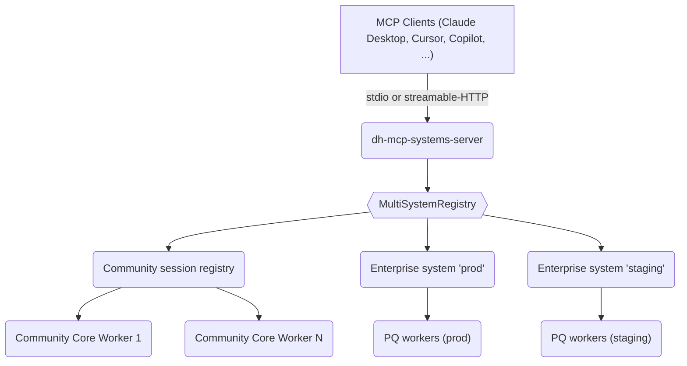
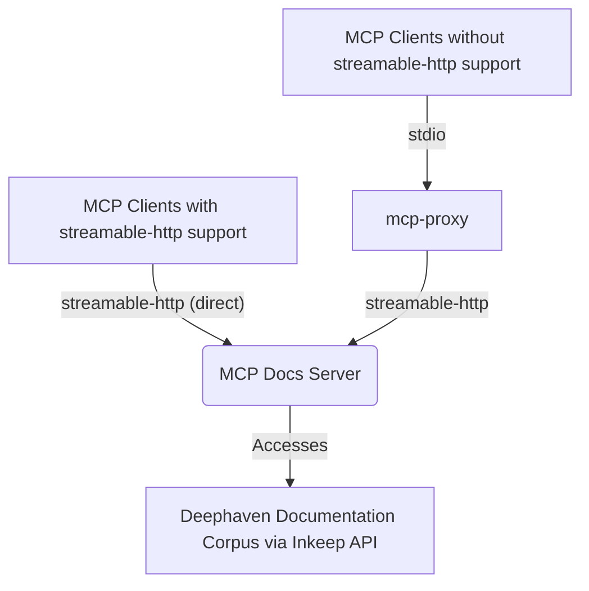

# Deephaven MCP — Developer & Contributor Guide

> **Project repository:** [https://github.com/deephaven/deephaven-mcp](https://github.com/deephaven/deephaven-mcp)

> **Note:** This document contains low-level technical details for contributors working on the [deephaven-mcp](https://github.com/deephaven/deephaven-mcp) project. **End users seeking high-level usage and onboarding information should refer to the main documentation in the [`../README.md`](../README.md).**

This repository houses the Python-based [Model Context Protocol (MCP)](https://modelcontextprotocol.io/) servers for Deephaven:

1. **Deephaven MCP Systems Server**: A single multiplexed server providing tools for interacting with Deephaven Community Core and Enterprise instances.
2. **Deephaven MCP Docs Server**: Provides conversational Q&A about Deephaven documentation.

> **Requirements**: [Python](https://www.python.org/) 3.12 or later is required to run these servers.

---

## Table of Contents

- [Introduction](#introduction)
  - [About This Project](#about-this-project)
  - [Key Features](#key-features)
  - [System Architecture](#system-architecture)
- [Prerequisites](#prerequisites)
  - [Development Prerequisites (Contributors Only)](#development-prerequisites-contributors-only)
- [Quick Start Guide](#quick-start-guide)
- [Command Line Entry Points](#command-line-entry-points)
- [HTTP Transport Security](#http-transport-security)
  - [Loopback-only enforcement](#loopback-only-enforcement)
  - [Health-check endpoint](#health-check-endpoint)
- [MCP Server Implementations](#mcp-server-implementations)
  - [Systems Server](#systems-server)
  - [Concepts and conventions](#concepts-and-conventions)
  - [Test components](#test-components)
  - [Docs Server](#docs-server)
- [Integration Methods](#integration-methods)
  - [MCP Inspector](#mcp-inspector)
  - [Claude Desktop](#claude-desktop)
  - [mcp-proxy](#mcp-proxy)
  - [Programmatic API](#programmatic-api)
- [Development](#development)
  - [Development Workflow](#development-workflow)
  - [Contributing workflow](#contributing-workflow)
  - [Advanced Development Techniques](#advanced-development-techniques)
  - [Development Commands](#development-commands)
  - [Project Structure](#project-structure)
  - [Dependencies](#dependencies)
  - [Versioning](#versioning)
  - [Standalone Binaries (PyApp)](#standalone-binaries-pyapp)
  - [Docker Compose](#docker-compose)
  - [Performance Testing](#performance-testing)
- [Testing](#testing)
  - [Unit Tests](#unit-tests)
  - [Integration Tests](#integration-tests)
- [Troubleshooting](#troubleshooting)
  - [Development-specific issues](#development-specific-issues)
- [Resources](#resources)
  - [Documentation](#documentation)
  - [Deephaven API Reference](#deephaven-api-reference)
  - [Tools & Related Projects](#tools--related-projects)
  - [Contributing](#contributing)
  - [Community & Support](#community--support)
- [License](#license)

---

## Introduction

### About This Project

The [deephaven-mcp](https://github.com/deephaven/deephaven-mcp) project provides Python implementations of two [Model Context Protocol (MCP)](https://modelcontextprotocol.io/) servers:

1. **Deephaven MCP Systems Server** (`dh-mcp-systems-server`):  <!-- markdownlint-disable-line MD029 -->
   - A single multiplexed binary that hosts every configured Community session **and** every Enterprise (Core+) system in one process.
   - Built with [FastMCP](https://github.com/modelcontextprotocol/python-sdk) (bundled as `mcp.server.fastmcp`).
   - Supports `--transport stdio` (default; AI clients launch it as a subprocess) and `--transport http` (streamable-HTTP, loopback-only, gated by a Pre-Shared Key).
   - Exposes the union of community + enterprise tools: session/table/script tools, dynamic community session creation, persistent-query lifecycle management, catalog discovery, and a `list_systems` discovery tool.
   - Maintains [PyDeephaven](https://github.com/deephaven/deephaven-core/tree/main/py) client sessions per configured worker (community side) and a `CorePlusSessionFactoryManager` per configured Enterprise system, with automatic caching, concurrent access safety, and lifecycle management.

2. **Deephaven MCP Docs Server**:
   - Offers an agentic, LLM-powered API for Deephaven documentation Q&A and chat
   - Uses the [Inkeep](https://inkeep.com/) LLM API (an OpenAI-compatible endpoint) for its LLM capabilities
   - HTTP-only (streamable-http)
   - Designed for integration with orchestration frameworks

Both servers are designed for integration with MCP-compatible tools like the [MCP Inspector](https://github.com/modelcontextprotocol/inspector) and [Claude Desktop](https://claude.ai).

### Key Features

**Systems Server Features:**

- **MCP Server:** Implements the MCP protocol for Deephaven Community Core and Enterprise systems
- **Two transports:** `stdio` (default; AI-client subprocess) and `http` (streamable-HTTP; loopback-only, gated by a Pre-Shared Key)
- **Configurable:** Loads worker configuration from a directory tree of JSON5 files.
- **Async Lifecycle:** Uses FastMCP's async lifespan for robust startup and shutdown handling
- **Lazy Loading:** Sessions are created on-demand to improve startup performance and resilience

**Docs Server Features:**

- **MCP-compatible server** for documentation Q&A and chat
- **HTTP-only:** Uses streamable-http transport exclusively
- **LLM-powered:** Uses the Inkeep LLM API (OpenAI-compatible) for conversational documentation assistance
- **FastMCP backend:** Built on FastMCP framework, deployable locally or via Docker
- **Single tool:** `docs_chat` for conversational documentation assistance
- **Extensible:** Python-based for adding new tools or extending context

### System Architecture

**Systems Server Architecture:**

*One multiplexed `dh-mcp-systems-server` process composes one
community child registry (when `community/sessions/` is non-empty)
and one enterprise child registry per file under `enterprise/systems/`.
Tools that operate on a specific enterprise system take a `system`
argument; PQ tools encode the system in the PQ id (`<system>:<serial>`).*


```mermaid
graph TD
    A["MCP Clients (Claude Desktop, Cursor, Copilot, ...)"] --"stdio or streamable-HTTP"--> S("dh-mcp-systems-server")
    S --> R{{"MultiSystemRegistry"}}
    R --> CR("Community session registry")
    R --> E1("Enterprise system 'prod'")
    R --> E2("Enterprise system 'staging'")
    CR --> CW1("Community Core Worker 1")
    CR --> CW2("Community Core Worker N")
    E1 --> EP("PQ workers (prod)")
    E2 --> ES("PQ workers (staging)")
```

**Typical Usage:** A single `dh-mcp-systems-server` process exposes
every configured Community session and Enterprise system through one
stdio or streamable-HTTP MCP transport. AI clients call `list_systems`
to discover what's configured and route subsequent calls via the
`system` / `id` arguments.

**Docs Server Architecture:**


```mermaid
graph TD
    A["MCP Clients with streamable-http support"] --"streamable-http (direct)"--> B("MCP Docs Server")
    C["MCP Clients without streamable-http support"] --"stdio"--> D["mcp-proxy"]
    D --"streamable-http"--> B
    B --"Accesses"--> E["Deephaven Documentation Corpus via Inkeep API"]
```

**Transport:**

The Docs Server uses **streamable-http exclusively**. Clients without native streamable-http support can use [mcp-proxy](#mcp-proxy) to bridge stdio to streamable-http. (The systems server, by contrast, supports both stdio and streamable-HTTP natively.)

The MCP Docs Server processes natural language questions about Deephaven documentation using LLM capabilities via the Inkeep API.

## Prerequisites

End-user prerequisites — Python 3.12+, the configuration directory, Docker for docker-launched sessions, and the Inkeep key for a self-hosted docs server — are covered in the [README Prerequisites](../README.md#prerequisites) and [Configuration](../README.md#configuration) sections. Only contributor-specific prerequisites follow.

### Development Prerequisites (Contributors Only)

**Development Tools**

- **Required**: Git, Python 3.12+, virtual environment tool (`venv` or `uv`)
- **Recommended**: [`uv`](https://github.com/astral-sh/uv) for faster package management
- **Installation**: See the [uv installation guide](https://github.com/astral-sh/uv#installation), or [`docs/UV.md`](UV.md) for a quick orientation if you are new to `uv`

**Testing Requirements**

- **Unit Tests**: Development dependencies installed via `pip install -e ".[dev]"`
- **Integration Tests**:
  - Docker must be installed and running (for Docker integration tests)
  - `deephaven-server` package installed (for python integration tests)
- **More Info**: See [Testing](#testing) section

## Quick Start Guide

End-user quick starts (stdio and HTTP, per deployment type) live in the README: [Community Core Quick Start](../README.md#community-core-quick-start) and [Enterprise Quick Start](../README.md#enterprise-quick-start). To build and run the servers from a checkout, see [Development](#development); to spin up a local Deephaven server with demo tables, see [test server](#test-server).

## Command Line Entry Points

This package registers the following console entry points for easy command-line access:

| Command | Description | Source |
|---------|-------------|--------|
| `dhcli` | The Deephaven command-line tool for humans and AI agents; its runtime commands are currently backed by the Systems Server via a per-user background daemon. See [`docs/CLI.md`](CLI.md). | `deephaven_mcp.cli._main:main` |
| `dh-mcp-systems-server` | Start the multiplexed Systems Server (hosts every configured Community session and Enterprise system in one process). Supports `--transport stdio` (default) or `--transport http`. | `deephaven_mcp.mcp_systems_server.server:main` |
| `dh-mcp-docs-server` | Start the Docs Server | `deephaven_mcp.mcp_docs_server.main:main` |

These commands are automatically available in your PATH after installing the package.

## HTTP Transport Security

> **See also: [`docs/SECURITY.md`](SECURITY.md)** for the project's security model, hardening checklist, and the inbound-auth specification — PSK gating, the `X-Deephaven-PSK` header, the 16-character minimum, the `401` body, the loopback trust boundary, and the TLS-terminating-reverse-proxy pattern. The notes below cover only the implementation details a contributor needs.

### Loopback-only enforcement

The server validates `--host` at startup with [`socket.getaddrinfo`](https://docs.python.org/3/library/socket.html#socket.getaddrinfo) and refuses any address that is not exclusively loopback (`127.0.0.1`, `::1`, `localhost`, or a hostname resolving only to loopback). Unresolvable hosts are refused too, so the default is to fail closed.

### Health-check endpoint

`/health` returns `200` with body `{"status": "ok"}` for liveness/readiness probes. It is registered via `@server.custom_route("/health", methods=["GET"])` and added to `PSKMiddleware`'s `bypass_paths`, so probes need no PSK. The docs server registers `/health` the same way and mounts no auth middleware at all. No other path is bypassed — `/healthz` is **not** an alias and is rejected normally.

## MCP Server Implementations

### Systems Server

`dh-mcp-systems-server` is one multiplexed process that hosts every configured Community session and Enterprise system. Its community and enterprise facets are described below, followed by cross-cutting concepts and dev tooling.

#### Community sessions

The community side of `dh-mcp-systems-server` provides tools for interacting with Deephaven Community Core instances, built on [FastMCP](https://github.com/modelcontextprotocol/python-sdk). Key architectural features:

- **Session caching** — reuses [PyDeephaven](https://github.com/deephaven/deephaven-core/tree/main/py) connections where possible and manages session lifecycles.
- **Concurrent-access safety** — [asyncio](https://docs.python.org/3/library/asyncio.html) locks guard session-management operations.
- **Automatic cleanup** — sessions are terminated and cleaned up on server shutdown.
- **On-demand creation** — worker sessions are created only when needed, then cached.
- **Async-first** — built on asyncio for non-blocking, high-concurrency operation.

The on-disk configuration tree, every file's schema, the `${env:}` / `${file:}` templating engine, the environment variables, and the `auth.credentials` discriminated union are specified once in [`docs/CONFIGURATION.md`](CONFIGURATION.md) (and [`docs/ENV.md`](ENV.md) for process-level env vars). Copy-paste-ready samples live in [`config-samples/ai/config/`](../config-samples/ai/config/).

#### Community session security and creation

The optional `security.credential_retrieval_mode` knob in `community/settings.json` (enum `none` / `dynamic_only` / `static_only` / `all`, default `none`) controls whether the `session_community_credentials` tool may return plaintext session tokens. The enum, its default, and the security implications are owned by [`docs/CONFIGURATION.md`](CONFIGURATION.md#communitysettingsjson) and [`docs/SECURITY.md`](SECURITY.md#hardening-checklist); the eviction/timeout knobs live in the same CONFIGURATION.md section. The notes below cover only operational behavior not captured by the schema.

##### Dynamic session launch prerequisites

`session_creation.defaults.launch_method` selects how new dynamic community sessions start:

- **`docker`** (default) — needs Docker installed and running (`docker ps`); no extra Python packages.
- **`python`** — needs the `deephaven-server` package (`pip install deephaven-server`); verify with `deephaven server --help`. Point `python.venv_path` at a different venv, or leave it `null` to reuse the MCP server's own venv.

##### Retrieving session credentials

When `credential_retrieval_mode` is not `none`, the `session_community_credentials` tool returns a community session's browser connection details, including a plaintext `auth_token`; every retrieval is logged. Run `dhcli tool show session_community_credentials` for the exact return shape.

When the mode is `none`, those details are still printed to the server console when a dynamic session is created (similar to how Jupyter prints a notebook token):

```text
======================================================================
🔑 Session 'my-analysis' Created - Browser Access Information:
   Port: 45123
   Base URL: http://localhost:45123
   Auth Token: abc123xyz789...
   Browser URL: http://localhost:45123/?psk=abc123xyz789
======================================================================
```

#### Enterprise systems

Each Enterprise system is one file at `$DH_AI_DATA_DIR/config/enterprise/systems/<system_name>.json` (filename stem == `system_name`); the single `dh-mcp-systems-server` hosts every file it finds, and tools that target a system take a `system` argument. The per-system schema (credential kinds, `session_creation.defaults`) is owned by [`docs/CONFIGURATION.md`](CONFIGURATION.md#enterprisesystemsnamejson); the startup-load credential model, redaction, PSK/loopback posture, and the permission audit are owned by [`docs/SECURITY.md`](SECURITY.md#authentication).

##### Enterprise session registry internals

Credentials are read once at startup from each system's `auth.credentials` block and reused for the process lifetime — there is no per-request resolution. The two enterprise credential kinds map to session-factory calls:

- `password` → `SessionManager.password(username, password)`.
- `private_key` → `SessionManager.private_key(key_text)` (PEM text, typically loaded via `${file:/path/to/key.pem}`).

At startup each validated `EnterpriseSystemConfig` drives an `EnterpriseSessionRegistry`, which builds a `CorePlusSessionFactoryManager` and starts its discovery task. Credentials are never refreshed at runtime (restart to rotate) and never written to disk.

#### Running the systems server

A single `dh-mcp-systems-server` process hosts every configured
Community session and Enterprise system. Its transport, bind address,
port, and config/runtime directories are set by the CLI arguments below.

##### CLI arguments

| Argument | Description | Default |
|----------|-------------|---------|
| `--transport {stdio,http}` | Transport to expose. `stdio` carries no authentication and is intended for AI clients launching the server as a subprocess. `http` serves streamable-HTTP gated by `server.json`'s PSK. | `stdio` |
| `--host` | HTTP transport bind address. Must be a loopback host (`127.0.0.1`, `::1`, or `localhost`). Ignored under `stdio`. | `127.0.0.1` |
| `--port` | HTTP transport TCP port (overrides `server.json`'s `port` field). Ignored under `stdio`. | `8000` |
| `--config-dir` | Override for the `config` subdirectory only. Bypasses `DH_AI_DATA_DIR` for the config subdir; the env var still applies to the runtime subdir unless `--runtime-dir` also overrides it. | `$DH_AI_DATA_DIR/config` or platform default |
| `--runtime-dir` | Override for the `runtime` subdirectory (daemon registry, lock, and log, plus per-instance metadata). Honored in every transport, parallel to `--config-dir`. Bypasses `DH_AI_DATA_DIR` for the runtime subdir; the env var still applies to the config subdir unless `--config-dir` also overrides it. | `$DH_AI_DATA_DIR/runtime` or platform default |
| `-h, --help` | Show help message | - |

> **Note:** Non-loopback `--host` values are rejected at startup — the
> HTTP transport never uses TLS itself. Production deployments
> terminate TLS at a reverse proxy on the same host (see
> [HTTP Transport Security](#http-transport-security)).

```sh
# stdio (default; no flags needed when launched as an AI-client subprocess)
uv run dh-mcp-systems-server

# HTTP transport on default port 8000 — run in background, log to named file
export DH_MCP_PSK='your-shared-secret'
uv run dh-mcp-systems-server --transport http >dh-mcp-systems.log 2>&1 &

# Custom config directory and port
DH_AI_DATA_DIR=/opt/deephaven/ai uv run dh-mcp-systems-server \
    --transport http --port 8010 >dh-mcp-systems.log 2>&1 &
```

Connect HTTP-transport MCP clients to `http://127.0.0.1:8000/mcp`
(or the port you chose) and have them send `X-Deephaven-PSK: <psk>`
on every request.

To stop the server: `pkill -f dh-mcp-systems-server` or
`kill $(lsof -ti tcp:8000)`.

#### Using the systems server

Once running, you can interact with the Systems Server in several ways:

- Connect using [MCP Inspector](#mcp-inspector)
- Use with [Claude Desktop](#claude-desktop) (stdio is simplest; HTTP via `mcp-proxy` is also supported)
- Run the [smoke-test client](#smoke-test-client) script
- Build your own MCP client application

### Concepts and conventions

#### Session ID format and terminology

The systems server uses a consistent session identifier format across all MCP tools:

**Session ID Format**: `{type}:{source}:{session_name}`

Where:

- `type`: Either `"community"` or `"enterprise"`
- `source`: For community sessions, always the literal `"community"` (the umbrella system name; the static-vs-dynamic distinction lives on the manager's `origin` field, not in the id). For enterprise sessions, the server's configured `system_name` (e.g. `"prod"`, `"staging"`).
- `session_name`: The specific session name within that source

For enterprise sessions, `source` equals the server's configured `system_name`. Embedding it in the session ID lets the multiplexed server host multiple enterprise systems without ID collisions; tool calls validate the `system_name` component and error clearly otherwise.

**Examples**:

- `"community:community:my_session"` - A community session named `my_session`. The community `SessionId` is the session name itself (the middle segment is the umbrella system name; the static-vs-dynamic distinction lives on the manager's `origin` field, not in the id).
- `"enterprise:prod:42"` - An enterprise session on the `"prod"` enterprise system whose controller-assigned PQ serial is `42`. The enterprise `SessionId` is the PQ serial rendered as a decimal string; use `pq_name_to_id` to resolve a PQ name to its serial.

**Terminology Clarification**:

- **Worker**: A Deephaven Community Core instance (configured per-file under `community/sessions/<name>.json`)
- **System**: A Deephaven Enterprise instance/factory (managed by the DHE server; identified by the configured `system_name` value in session IDs)
- **Session**: A specific connection/session within a worker or system
- **Id**: The fully qualified identifier used by MCP tools to reference a specific session or PQ

All MCP tools that interact with Deephaven instances use the `id` parameter with this format.

#### Response envelope

Every systems-server tool returns a consistent response shape:

- Success: `{ "success": true, ... }` plus tool-specific fields.
- Error: `{ "success": false, "error": "<human-readable description>", "isError": true }`

This keeps response parsing and error handling uniform across all tools.

#### Tool reference

This guide deliberately does **not** maintain a per-tool reference. Each
tool's source docstring is the single source of truth — it is also exactly
what an AI agent receives over MCP and what the CLI surfaces live, so it
cannot drift from the installed code:

- **Capability list** — the one-line-per-tool overview lives in
  *Available MCP Tools* in the [README](../README.md#available-mcp-tools).
- **Authoritative detail** — each tool's docstring (Args, Returns,
  terminology notes, examples) under
  [`src/deephaven_mcp/mcp_systems_server/_tools/`](../src/deephaven_mcp/mcp_systems_server/_tools/):
  `session.py`, `session_community.py`, `session_enterprise.py`, `pq.py`,
  `catalog.py`, `table.py`, and `script.py`.
- **Live discovery** — `dhcli tool list` enumerates registered tools and
  `dhcli tool show <name>` prints one tool's description and JSON input
  schema for the version you actually have installed (see
  [`docs/CLI.md`](CLI.md)).

#### Persistent Query (PQ) concepts

Persistent Queries (PQs) are recipes for creating and managing long-running
worker sessions in Deephaven Enterprise. Unlike the ephemeral sessions
created via `session_enterprise_create`, PQs can run on schedules, restart
automatically on failure, and persist across server restarts.

**Key concepts:**

- **PQ definition** — a configuration specifying how to create a worker session (heap size, JVM args, schedule, and so on).
- **PQ serial** — the immutable unique identifier for a PQ; prefer it for all operations. A PQ's fully qualified `id` has the form `enterprise:<system>:<serial>` — the one string works with both the `pq_*` and session tools.
- **PQ name** — a human-readable label that can change, so it is less reliable than the serial. `pq_name_to_id` resolves a name to its canonical `id`.
- **Status categories** — PQ tools report a `status_category` of `ACTIVE`, `TRANSITIONAL`, `TERMINAL`, or `INVALID` alongside the raw `status`. Branch on the category, never on a specific raw status string (test `status_category == "ACTIVE"`, not `status == "RUNNING"`); the raw vocabulary is large and evolves.
- **Session integration** — while a PQ is running or initializing, its worker session is reachable through the standard session tools using the same `id`. The trailing segment is the PQ serial as a decimal string, not the PQ name.

**Typical workflows:**

1. **Create and start a PQ:** `pq_create` → `pq_start` → use the `id` with the session tools.
2. **Manage an existing PQ:** `pq_list` → `pq_details` → `pq_stop` → `pq_restart`.
3. **Query a running PQ's data:** `pq_details` (confirm `status_category` is `ACTIVE`) → `session_tables_list` → `session_table_data`, all with the same `id`.

### Test components

#### Test server

For developing and testing the community tools, you often need a running Deephaven Community Core server. A script is provided for this:

```sh
uv run scripts/run_deephaven_test_server.py --table-group {simple|financial|all} [--auth-token TOKEN]
```

**Arguments:**

- `--table-group {simple|financial|all}` (**required**): Which demo tables to create
- `--host HOST` (default: `localhost`): Host to bind to
- `--port PORT` (default: `10000`): Port to listen on
- `--auth-token TOKEN` (optional): Authentication token for PSK auth. If omitted, uses anonymous auth.

#### Smoke-test client

A Python script ([`../scripts/mcp_systems_test_client.py`](../scripts/mcp_systems_test_client.py)) is available as a smoke-test client for the systems MCP server. It connects to a running server, lists all registered tools, and calls a representative read-only subset. Exits with code `0` on full success and `1` if any tool call raised — usable as a CI smoke gate or post-deploy ping.

```sh
uv run scripts/mcp_systems_test_client.py --transport {stdio|streamable-http} [OPTIONS]
```

**Key Arguments:**

- `--transport`: Choose `streamable-http` (default) or `stdio`
- `--env`: Pass environment variables as `KEY=VALUE` (e.g., `DH_AI_DATA_DIR=/path/to/your/data-root`). Can be repeated for multiple variables
- `--url`: URL for HTTP transport. Default `http://127.0.0.1:8000/mcp` (match the systems server's port — default `8000`)
- `--stdio-cmd`: Command to launch the server as a subprocess (default `uv run dh-mcp-systems-server --transport stdio`)
- `--psk`: Pre-shared key for HTTP transport, sent in the `X-Deephaven-PSK` header (required when the server has a PSK configured)
- `--session-id`: Fully qualified community session id to exercise. Default `community:community:default`
- `--strict`: Abort on the first failed tool call (otherwise the script tries every tool and reports the total at the end)

**Example Usage:**

```sh
# Smoke-test a running streamable-http server (default)
uv run scripts/mcp_systems_test_client.py --psk your-psk

# CI gate (exit 1 on any tool failure)
uv run scripts/mcp_systems_test_client.py --psk your-psk --strict
```

> ⚠️ **Prerequisites:**
>
> - The systems server must be running (see [Running the Systems Server](#running-the-systems-server))
> - For HTTP transport, the server is gated by `PSKMiddleware`; pass the configured PSK via `--psk`
> - For troubleshooting connection issues, see [Troubleshooting](#troubleshooting)

---

### Docs Server

#### Docs Server Overview

The Deephaven MCP Docs Server is a specialized MCP server that provides a single tool for conversational chat about Deephaven documentation.

- **HTTP-only**: Uses streamable-http transport exclusively (no stdio mode)
- **LLM**: Uses the [Inkeep](https://inkeep.com/) `inkeep-context-expert` model (an OpenAI-compatible endpoint) with domain-specific knowledge of Deephaven documentation
- **System Prompting**: Uses a specialized system prompt that instructs the model to answer with reference to Deephaven documentation
- **Error Resilience**: Implements robust error handling with custom `OpenAIClientError` for detailed diagnostics
- **Conversational Context**: Maintains conversation history for multi-turn Q&A sessions
- **Health Monitoring**: Provides a dedicated `/health` endpoint for operational monitoring

The server helps users learn and troubleshoot Deephaven through natural language conversation about features, APIs, and concepts.

The MCP Docs Server acts as a bridge between users (or client applications) and the Deephaven documentation.


```mermaid
graph TD
    A["MCP Clients with streamable-http support"] --"streamable-http (direct)"--> B("MCP Docs Server")
    C["MCP Clients without streamable-http support"] --"stdio"--> D["mcp-proxy"]
    D --"streamable-http"--> B
    B --"Accesses"--> E["Deephaven Documentation Corpus via Inkeep API"]
```

Users or API clients send natural language questions or documentation queries over HTTP using the Model Context Protocol (MCP). These requests are received by the server, which is built on FastMCP and powered by a large language model (LLM) via the Inkeep API.

#### Docs Server Configuration

The MCP Docs Server requires an Inkeep API key for accessing documentation and generating responses.

##### Docs Server Environment Variables

The docs server has no JSON config; its entire surface is a handful of environment variables (`INKEEP_API_KEY` is required — the server refuses to start without it). See [`docs/ENV.md`](ENV.md#docs-server) for the canonical list, defaults, and the `PORT` fallback. Store the API key in the environment or a secret store, never in code — see [`docs/SECURITY.md`](SECURITY.md).

#### Running the Docs Server

Ensure `INKEEP_API_KEY` is set before running the Docs Server.

##### Docs Server CLI Arguments

The Docs Server has no CLI arguments — it always uses streamable-http transport. Configure host and port via environment variables.

```sh
# Default (host=127.0.0.1, port=8001)
INKEEP_API_KEY=your-api-key uv run dh-mcp-docs-server

# Custom host and port
MCP_DOCS_HOST=0.0.0.0 MCP_DOCS_PORT=8080 INKEEP_API_KEY=your-api-key uv run dh-mcp-docs-server
```

#### Docs Server Tools

The Deephaven MCP Docs Server exposes a single MCP-compatible tool:

##### `docs_chat`

`docs_chat` answers natural-language questions about Deephaven documentation via the Inkeep LLM API. Its parameters (`prompt`; optional `history`, `deephaven_core_version`, `deephaven_enterprise_version`, `programming_language`), return shape, and error handling are documented in the source docstring — `mcp_docs_server/_mcp.py` (`docs_chat`), the single source of truth. A runnable example is in [Programmatic API → Docs Server Example](#docs-server-example).

#### Docs Server HTTP Endpoints

The docs server exposes `GET /health`, which returns `200` with body `{"status": "ok"}` and requires no auth — for liveness/readiness probes (Kubernetes, Cloud Run, load balancers). It is the same endpoint described under [Health-check endpoint](#health-check-endpoint).

```sh
curl http://localhost:8001/health
# {"status": "ok"}
```

#### Docs Server Test Components

##### Docs Test Client

A Python script is provided for testing the MCP Docs tool and validating server functionality without setting up a full MCP Inspector deployment. The script connects to the docs server, demonstrates calling the `docs_chat` tool with your query, and displays the response.

**Script Location**: [`../scripts/mcp_docs_test_client.py`](../scripts/mcp_docs_test_client.py)

**Arguments:**

- `--url`: streamable-http server URL (default: `http://localhost:8001/mcp`)
- `--prompt`: Prompt/question to send to the docs_chat tool (default: `"How do I use Deephaven tables?"`)
- `--history`: Optional chat history (JSON string) for multi-turn conversations
- `--token`: Optional Bearer token sent in the `Authorization` header

**Example Usage:**

```sh
# Connect to a running server (default)
uv run scripts/mcp_docs_test_client.py --prompt "What is Deephaven?"

# Multi-turn conversation with history (using JSON string for previous messages)
uv run scripts/mcp_docs_test_client.py --prompt "How do I filter this table?" \
  --history '[{"role":"user","content":"How do I create a table?"},{"role":"assistant","content":"To create a table in Deephaven..."}]'
```

> ⚠️ **Prerequisites:**
>
> - A running docs server to connect to. The docs **server** (not this client) requires a valid [Inkeep API key](https://inkeep.com/) set as `INKEEP_API_KEY`.
> - For troubleshooting API issues, see [Troubleshooting](#troubleshooting)

> 💡 **Tips:**
>
> - Replace placeholder API keys with your actual keys
> - For multi-turn conversations, the history parameter accepts properly formatted JSON
> - Use `jq` to format complex history objects: `echo '$HISTORY' | jq -c .`

---

## Integration Methods

### MCP Inspector

The [MCP Inspector](https://github.com/modelcontextprotocol/inspector) is a web-based tool for interactively exploring and testing MCP servers. It provides an intuitive UI for discovering available tools, invoking them, and inspecting responses.

#### MCP Inspector with the systems server

1. **Start a Deephaven Community Core worker** (in one terminal):

   ```sh
   # For anonymous authentication (no MCP auth needed)
   uv run scripts/run_deephaven_test_server.py --table-group simple
   
   # OR for PSK authentication (if your MCP config uses auth tokens)
   uv run scripts/run_deephaven_test_server.py --table-group simple --auth-token Deephaven123
   ```

2. **Start the MCP Systems server** (in another terminal):

   ```sh
   export DH_MCP_PSK='your-shared-secret'   # only if using --transport http
   uv run dh-mcp-systems-server --transport http --port 8000
   ```

3. **Start the MCP Inspector** (in a third terminal):

   ```sh
   npx @modelcontextprotocol/inspector@latest
   ```

4. **Connect to the MCP server**:
   - Open the Inspector in your browser (URL shown in terminal, typically `http://localhost:6274`)
   - In the Inspector UI, select "Connect" and enter the server URL: `http://127.0.0.1:8000/mcp` (and add the request header `X-Deephaven-PSK: <psk>` to match `server.json`).
   - Explore and invoke tools like `list_systems`, `sessions_list`, `session_table_schema` and `session_script_run`.

#### MCP Inspector with Docs Server

1. **Start the MCP Docs server** (in a terminal):

   ```sh
   INKEEP_API_KEY=your-api-key uv run dh-mcp-docs-server
   ```

2. **Start the MCP Inspector** (in another terminal):

   ```sh
   npx @modelcontextprotocol/inspector@latest
   ```

3. **Connect to the MCP server**:
   - Open the Inspector in your browser (URL shown in terminal, typically `http://localhost:6274`)
   - In the Inspector UI, select "Connect" and enter the server URL: `http://localhost:8001/mcp`
   - Explore and invoke the `docs_chat` tool to ask questions about Deephaven documentation

### Claude Desktop

See [README → Claude Desktop setup](../README.md#claude-desktop) for the current (stdio-first) configuration and the HTTP-bridged variant, and [Log Analysis and Debugging](../README.md#log-analysis-and-debugging) for log file locations. Claude Desktop integration is an end-user path owned by the README.

### mcp-proxy

`mcp-proxy` bridges stdio-only clients to the HTTP servers. Installation and bridge configuration — including forwarding the PSK via the `X-Deephaven-PSK` header — live in the README: [Quick Start](../README.md#quick-start) and [Claude Desktop setup](../README.md#claude-desktop).

### Programmatic API

Both servers can be used programmatically within Python applications:

#### Systems Server Example

```python
# The single multiplexed systems server is started via its entry point.
# main() parses --transport, --host, --port, --config-dir, etc. and runs
# the server (it does not return until the server stops).
from deephaven_mcp.mcp_systems_server.server import main

# stdio (default) carries no auth; --transport http serves streamable-HTTP
# gated by server.json's PSK and bound only to loopback.
main(["--transport", "http", "--port", "8000"])

# Equivalent to the installed console script:
#   dh-mcp-systems-server --transport http --port 8000
```

#### Docs Server Example

```python
# Import the server components
from deephaven_mcp.mcp_docs_server import mcp_server
from deephaven_mcp.mcp_docs_server.main import run_server

# Use the docs_chat tool directly (asynchronous)
from deephaven_mcp.mcp_docs_server._mcp import docs_chat
from unittest.mock import MagicMock

# Example: Get documentation answer
# Note: context is injected by the MCP framework; pass a mock when calling directly
async def get_answer():
    context = MagicMock()  # MCP framework injects this in production
    response = await docs_chat(
        context=context,
        prompt="How do I filter tables in Deephaven?",
        history=[{"role": "user", "content": "Hello"}],
        programming_language="python",
    )
    return response

# Start the server (always uses streamable-http)
run_server()
```

Both servers expose their tools through FastMCP, following the Model Context Protocol.

---

## Development

<div align="center">

🛠️ *Guidelines and tools for developers working on the MCP servers* 💻

</div>

### Development Workflow

1. **Set up your environment**:

   ```sh
   # Clone the repository
   git clone https://github.com/deephaven/deephaven-mcp.git
   cd deephaven-mcp
   ```

2. **Create a virtual environment**:

   ```sh
   uv venv .venv -p 3.12 # Or a later Python version, e.g. 3.13
   ```

3. **Install dependencies with uv (editable mode for development)**:

   ```sh
   uv pip install -e ".[dev]"
   ```

   Community Core and Enterprise (Core+) support are always part of the base install; the `[dev]` extra adds the development tooling (test and lint dependencies).

   > **Tip:** Regenerate the entire environment in one line:
   >
   > ```sh
   > rm -rf .venv && uv venv -p 3.12 && uv pip install -e ".[dev]"
   > ```

4. **Run the test server** (in one terminal):

   ```sh
   # For anonymous authentication (no MCP auth needed)
   uv run scripts/run_deephaven_test_server.py --table-group simple
   
   # OR for PSK authentication (if your MCP config uses auth tokens)
   uv run scripts/run_deephaven_test_server.py --table-group simple --auth-token Deephaven123
   ```

5. **Run the MCP Systems Server** (in another terminal):

   ```sh
   export DH_MCP_PSK='your-shared-secret'   # only for --transport http
   uv run dh-mcp-systems-server --transport http --port 8000
   ```

6. **Use the MCP Inspector or test client** to validate your changes.

### Contributing workflow

This repo uses an **agent-skill system** to keep contributions consistent. Two artifacts drive it:

- **[`AGENTS.md`](../AGENTS.md)** — always-on rules every contributor (human or AI) follows: testing via `uv run pytest`, timeout expectations, version-control conventions, and pointers into the skills below.
- **[`.agents/skills/`](../.agents/skills/)** — task playbooks indexed in [`.agents/skills/README.md`](../.agents/skills/README.md); each skill is a focused procedure for a recurring task.

The skills you'll reach for most:

- `run-precommit` / [`bin/precommit.sh`](../bin/precommit.sh) — isort, black, ruff, mypy, codespell, markdownlint; run before every commit.
- `tests-run` / `tests-run-file` — unit suite with coverage.
- `review-changes` — deep review of a change set before opening a PR.
- `mcp-tool-add`, `cli-command-add`, `config-field-add` — add a tool, CLI command, or config field the project's way.
- `docs-improve` / `docs-accuracy` — edit a markdown doc in scope (they load `_documentation-roles`).

For fork-and-PR mechanics, see [`CONTRIBUTING.md`](../CONTRIBUTING.md).

### Advanced Development Techniques

- **Run the server directly (development mode):**

  ```sh
  # stdio (no auth, simplest for local debugging)
  uv run dh-mcp-systems-server

  # HTTP transport (requires server.json PSK)
  export DH_MCP_PSK='your-shared-secret'
  uv run dh-mcp-systems-server --transport http --port 8000
  ```

  Use the MCP Inspector or test client for interactive debugging.
  Enterprise systems are picked up automatically from
  `$DH_AI_DATA_DIR/config/enterprise/systems/`.

- **Interactive Tools:**
  Use the Inspector or the test client for interactive tool calls and debugging during development.

- **Code Style & Linting:**

  ```sh
  # Sort imports with isort
  uv run isort . --skip _version.py --skip .venv
  
  # Format code with black
  uv run black . --exclude '(_version.py|.venv)'
  
  # Lint code with ruff
  uv run ruff check src --fix --exclude _version.py --exclude .venv
  ```
  
  > The project follows Python best practices using [isort](https://pycqa.github.io/isort/), [black](https://black.readthedocs.io/), and [ruff](https://beta.ruff.rs/docs/) for code quality.

- **Type Checking:**

  ```sh
  # Run static type checking with mypy
  uv run mypy src/
  ```
  
  > [mypy](https://mypy.readthedocs.io/) provides static type checking for Python code.

- **Spelling:**

  ```sh
  # Check spelling (typos + American English) with codespell
  uv run codespell
  ```
  
  > [codespell](https://github.com/codespell-project/codespell) flags common misspellings and, via its en-GB-to-en-US dictionary, British spellings — the project uses American English throughout. Configuration lives in the codespell section of [`pyproject.toml`](../pyproject.toml).

### Development Commands

#### Code Quality & Pre-commit Checks

To help maintain a consistent and high-quality codebase, the [`bin/precommit.sh`](../bin/precommit.sh) script is provided. This script will:

| Tool         | Purpose                                        | How to Run (manual)                | What is Enforced |
|--------------|------------------------------------------------|-------------------------------------|------------------|
| isort        | Sort Python imports                            | `uv run isort . --skip _version.py --skip .venv` | Import order, grouping |
| black        | Format Python code                             | `uv run black . --exclude '(_version.py\|.venv)'` | PEP 8 formatting |
| ruff         | Lint code, autofix common issues, docstring style (PEP 257) | `uv run ruff check src --fix --exclude _version.py --exclude .venv` | Linting, best practices, PEP 257 docstrings |
| mypy         | Static type checking                           | `uv run mypy src/`                  | Type correctness |
| codespell    | Spelling (typos + American English)            | `uv run codespell`                  | Common misspellings; American spelling (en-GB-to-en-US dictionary) |
| markdownlint | Lint and format markdown documentation         | `npx --yes markdownlint-cli2 --fix` | Markdown style, consistency |

The script will run all of these tools in order. If any step fails, the script will stop and print an error. Fix the reported issues and rerun the script until it completes successfully. Only commit code that passes all code quality checks.

**Docstring policy:**

- All public modules, classes, and functions must have clear, PEP 257-compliant docstrings (unless explicitly ignored in config)
- Docstrings should start with a summary line, use proper formatting, and describe parameters, return values, and exceptions where relevant
- Docstring rules are enforced via ruff's pydocstyle (`D`) rules, configured in `pyproject.toml` (see `[tool.ruff.lint.pydocstyle]`, `convention = "pep257"`)
- Test files are excluded from docstring checks via `[tool.ruff.lint.per-file-ignores]`

**Markdown documentation policy:**

- All markdown files (`.md`) must pass markdownlint checks
- Configuration is defined in `.markdownlint-cli2.jsonc` at the project root
- Run with `--fix` flag to automatically correct formatting issues
- Some rules are disabled for practical reasons (e.g., line length for URLs, table alignment)

You may also configure this script as a git pre-commit hook or run it in your CI pipeline to enforce code quality for all contributors.

```sh
# Run all code style, lint, and docstring checks
bin/precommit.sh

# Run unit tests with pytest
uv run pytest  # Runs all unit tests (use -m integration for integration tests)

# Run code style and lint checks individually
uv run isort . --skip _version.py --skip .venv
uv run black . --exclude '(_version.py|.venv)'
uv run ruff check src --fix --exclude _version.py --exclude .venv
uv run mypy src/

# Check import order only (no changes)
uv run isort . --check-only --diff --skip _version.py --skip .venv

# Check formatting only (no changes)
uv run black . --check
```

### Project Structure

The codebase is organized as follows:

```text

deephaven-mcp/
├── src/
│   └── deephaven_mcp/      # Main Python package
│       ├── auth/                # Inbound PSK middleware, outbound credential dataclasses, outbound TLS dataclasses
│       ├── client/             # Core+ client components
│       ├── config/             # Configuration models and validators
│       ├── formatters/         # Data formatting utilities
│       ├── mcp_docs_server/    # Source for the Docs MCP server
│       ├── mcp_systems_server/ # Source for the Systems MCP server
│       ├── resource_manager/   # Resource (session, etc.) management
│       ├── __init__.py
│       ├── _env.py             # Typed env-var helpers (env_str/int/float/bool/required)
│       ├── _exceptions.py      # Custom exception classes
│       ├── _health.py          # Canonical /health probe path constant
│       ├── _logging.py         # Logging configuration
│       ├── _monkeypatch.py     # Runtime patches
│       ├── _redaction.py       # Sensitive-value redaction utilities
│       ├── _version.py         # Version information
│       ├── openai.py           # OpenAI client integration
│       └── queries.py          # Query management
├── tests/                    # Unit and integration tests
│   ├── auth/
│   ├── client/
│   ├── config/
│   ├── formatters/
│   ├── mcp_docs_server/
│   ├── mcp_systems_server/
│   ├── openai_tests/
│   ├── package/
│   ├── queries/
│   ├── resource_manager/
│   ├── testio/
│   ├── utils/
│   └── ...                   # Individual test files and other directories
├── scripts/                  # Standalone utility and test scripts
├── docs/                     # Project documentation
├── ops/                      # Operations (Docker, Terraform)
├── .github/                  # GitHub Actions workflows
├── .agents/                  # Agent skills (.agents/skills/) shared across AI tools
├── bin/                      # Executable scripts (e.g., precommit.sh)
├── pyproject.toml            # Project definition and dependencies
├── AGENTS.md                 # Always-on agent/contributor rules (imported by CLAUDE.md)
├── README.md                 # Main project README
├── LICENSE
└── CONTRIBUTING.md

```

- **`src/`**: Contains the main `deephaven_mcp` Python package source code.
- **`tests/`**: Contains all unit and integration tests, with a structure that mirrors the `src/` directory.
- **`scripts/`**: Holds utility scripts for tasks like running test servers or clients.
- **`docs/`**: All project documentation, including this developer guide.
- **`ops/`**: Contains operational configurations for deployment, infrastructure-as-code (Terraform), and containerization (Docker). This directory includes:
  - `docker/`: Dockerfiles and Docker Compose configurations for each service
  - `terraform/`: Terraform modules for cloud infrastructure (GCP resources, registries, etc.)
  - `run_terraform.sh`: Unified helper script for workspace-aware Terraform operations
  - `README.md`: Comprehensive guide for infrastructure and deployment operations
- **`bin/`**: Executable helper scripts, often used for CI/CD or local development hooks.
- **`.agents/`** and **`AGENTS.md`**: The agent-assisted contribution system — `AGENTS.md` holds always-on contributor rules and `.agents/skills/` holds the task playbooks (build, review, test, add-a-tool, and more). See [Contributing workflow](#contributing-workflow).

#### Key Module Details

**MCP Systems Server (`mcp_systems_server/`)**:

- Implements the MCP protocol for Deephaven Community Core and Enterprise workers
- Provides tools for worker management, session orchestration, and script execution
- Two transports: `stdio` (default) and streamable-HTTP (loopback-only, PSK-gated)
- Built with FastMCP for robust async lifecycle management

**MCP Docs Server (`mcp_docs_server/`)**:

- Provides LLM-powered documentation Q&A capabilities
- Integrates with the Inkeep LLM API (OpenAI-compatible endpoint) for conversational assistance
- HTTP-only (streamable-http transport)
- Does not rate-limit inbound requests; protect it with an API gateway / ingress rate limiting (see [`docs/SECURITY.md`](SECURITY.md)).

**Resource Manager (`resource_manager/`)**:

- Unified API for managing lifecycle of sessions, factories, and other resources
- Automatic caching, liveness checking, and cleanup for Community/Enterprise sessions
- Registry pattern for centralized resource management
- Coroutine-safe operations with asyncio.Lock protection
- Secure async loading of certificates and credentials using aiofiles

**Configuration (`config/`):**

- The single home for all product configuration, shared by both the systems server and the `dhcli` CLI
- Path, permission, and JSON5-loading **primitives** at the package root (`config/__init__.py` re-exports only these, so `import deephaven_mcp.config` stays cheap)
- `config/schema/` — the Pydantic v2 section schemas built on the project's `StrictSchema` / `RedactableSchema` bases, one module per on-disk section: `_server.py` (`server.json`), `_cli.py` (`cli.json`), `_community.py` (`community/`), `_enterprise.py` (`enterprise/`)
- `config/tree.py` — `ConfigTree` (mirrors the on-disk directory one-for-one) and `ConfigTreeLoader` (the aggregator both subsystems load)
- `${env:VAR}` and `${file:PATH}` templating resolved at file-load time, with `SecretStr`-typed fields for sensitive values
- Comprehensive validation with detailed error messages

**Client (`client/`):**

- Core+ client components for Enterprise Deephaven connections
- Authentication handlers (API key, password, SAML private key)
- Protocol buffer integration and session factory management
- TLS/SSL support with custom certificate handling

**Auth (`auth/`):**

- Authentication primitives for the MCP servers, split into three subpackages
- `middleware/_psk.py`: `PSKMiddleware`, the Starlette middleware that gates inbound HTTP requests on the shared PSK (`X-Deephaven-PSK` header), with `/health` as a bypass path
- `credentials/_credentials.py`: outbound credential Pydantic models (`AnonymousCredentials`, `PSKCredentials`, `PasswordCredentials`, `PrivateKeyCredentials`, `CustomTokenCredentials`) forwarded to community and enterprise session-creation entry points
- `tls/_tls.py`: outbound TLS Pydantic models (`ClientCertificate`, `TlsConfig`) describing optional server-trust material and optional mTLS client identity for community sessions

**Core Utilities**:

- **`openai.py`**: OpenAI client integration with async support and rate limiting
- **`queries.py`**: Query management and execution framework
- **`_env.py`**: Typed environment-variable helpers (`env_str`, `env_int`, `env_float`, `env_bool`, `env_required`). The systems server itself reads only `DH_AI_DATA_DIR` and `PYTHONLOGLEVEL` from the environment; the helpers are used by the docs server and by utility scripts.
- **`_exceptions.py`**: Custom exception classes for MCP-specific errors
- **`_health.py`**: Single source of truth for the `/health` probe path
- **`_logging.py`**: Centralized logging configuration with sensitive data redaction
- **`_redaction.py`**: Constants and helpers for redacting sensitive values in logs

#### Script References

The project includes several utility scripts to help with development and testing:

| Script | Purpose | Usage |
|--------|---------|-------|
| [`../scripts/run_deephaven_test_server.py`](../scripts/run_deephaven_test_server.py) | Starts a local Deephaven server for testing | `uv run scripts/run_deephaven_test_server.py --table-group simple [--auth-token TOKEN]` |
| [`../scripts/mcp_systems_test_client.py`](../scripts/mcp_systems_test_client.py) | Smoke-test client for the systems server (exits 0 on full success, 1 on tool failure) | `uv run scripts/mcp_systems_test_client.py --psk YOUR_PSK` |
| [`../scripts/mcp_docs_test_client.py`](../scripts/mcp_docs_test_client.py) | Tests the Docs Server chat functionality | `uv run scripts/mcp_docs_test_client.py --prompt "What is Deephaven?"` |
| [`../scripts/mcp_docs_stress_test.py`](../scripts/mcp_docs_stress_test.py) | In-process concurrent load test of the `docs_chat` tool | `uv run scripts/mcp_docs_stress_test.py` |
| [`../scripts/mcp_docs_stress_http.py`](../scripts/mcp_docs_stress_http.py) | Stress tests the streamable-HTTP endpoint with concurrent connections | `uv run scripts/mcp_docs_stress_http.py --url "http://localhost:8001/mcp"` |
| [`../scripts/build_pyapp.py`](../scripts/build_pyapp.py) | Builds standalone, self-contained binaries via PyApp (see [`STANDALONE_BINARIES.md`](STANDALONE_BINARIES.md)) | `uv run scripts/build_pyapp.py` |
| [`../bin/precommit.sh`](../bin/precommit.sh) | Runs pre-commit code quality checks | `bin/precommit.sh` |

### Dependencies

All dependencies are managed in the [pyproject.toml](../pyproject.toml) file, which includes:

- Core runtime dependencies for async I/O, MCP protocol, Deephaven integration, and LLM APIs
- Development dependencies for testing, code quality, and CI

These dependencies are automatically installed when using `pip install -e .` or [uv](https://github.com/astral-sh/uv) `pip install -e .`. For the complete list, refer to the `dependencies` and `optional-dependencies` sections in [pyproject.toml](../pyproject.toml).

### Versioning

This package uses [setuptools-scm](https://github.com/pypa/setuptools_scm) for dynamic versioning based on git tags. Version information is automatically generated during the build process and stored in `src/deephaven_mcp/_version.py`. This file should not be manually edited or tracked in version control.

### Standalone Binaries (PyApp)

Self-contained, offline native binaries (no Python required at runtime) are built with [PyApp](https://ofek.dev/pyapp/). See [`STANDALONE_BINARIES.md`](STANDALONE_BINARIES.md).

### Docker Compose

A [Docker Compose](https://docs.docker.com/compose/) configuration for the MCP Docs server is provided at [`ops/docker/mcp-docs/docker-compose.yml`](../ops/docker/mcp-docs/docker-compose.yml):

```sh
# Start the MCP Docs server
docker compose -f ops/docker/mcp-docs/docker-compose.yml up --build

# View logs
docker compose -f ops/docker/mcp-docs/docker-compose.yml logs -f

# Stop services
docker compose -f ops/docker/mcp-docs/docker-compose.yml down
```

> **Note:** The build context is the repo root, so all code/assets are accessible to the Dockerfile. Other services may have their own Compose files under the `docker/` directory.

### Performance Testing

Multiple scripts are provided for comprehensive performance testing of the MCP servers under various conditions and transport methods.

#### MCP Docs Server Stress Testing

The [`../scripts/mcp_docs_stress_test.py`](../scripts/mcp_docs_stress_test.py) script is an in-process concurrent load test of the `docs_chat` tool. It imports `docs_chat` directly (no MCP transport) and drives many concurrent calls against it, reporting performance and error statistics. For a transport-level stress test against a deployed HTTP endpoint, use [HTTP Transport Stress Testing](#http-transport-stress-testing) instead.

**Key Features:**

- Drives concurrent in-process calls to the `docs_chat` tool
- Measures response times, throughput, and success rates
- Generates detailed performance metrics and error reports
- Writes per-request metrics to a JSON results file

**Usage:**

```sh
# Ensure INKEEP_API_KEY is set
export INKEEP_API_KEY=your-api-key-here

# Run the stress test (100 concurrent requests by default)
uv run scripts/mcp_docs_stress_test.py
```

**Expected Results:**

- High success rate under healthy conditions
- Response times: 15-180 seconds per request (depends on query complexity)
- Throughput: 0.5-2.0 requests/second (limited by API rate limits)
- Detailed JSON results saved to `stress_test_results.json`

**Troubleshooting:**

- Ensure `INKEEP_API_KEY` is properly set as an environment variable
- Run from the project root directory
- Check network connectivity if requests fail
- Review the JSON results file for detailed error analysis

#### HTTP Transport Stress Testing

A script is also provided for stress testing the streamable-HTTP transport for production deployments. This is useful for validating the stability and performance of production or staging deployments under load. The script uses [aiohttp](https://docs.aiohttp.org/) for asynchronous HTTP requests and [aiolimiter](https://github.com/mjpieters/aiolimiter) for rate limiting.

##### Usage example

The [`../scripts/mcp_docs_stress_http.py`](../scripts/mcp_docs_stress_http.py) script can be used to stress test HTTP endpoints:

```sh
uv run scripts/mcp_docs_stress_http.py \
    --concurrency 10 \
    --requests-per-conn 100 \
    --url "http://localhost:8001/mcp" \
    --max-errors 5 \
    --rps 10 \
    --max-response-time 2
```

##### Arguments

- `--concurrency`: Number of concurrent connections (default: 100)
- `--requests-per-conn`: Number of requests per connection (default: 100)
- `--url`: Target endpoint URL
- `--max-errors`: Maximum number of errors before stopping the test (default: 5)
- `--rps`: Requests per second limit per connection (default: `10000`; effectively unthrottled for typical tests)
- `--max-response-time`: Maximum allowed response time in seconds (default: 1)

The script will create multiple concurrent connections and send requests to the specified endpoint, reporting errors and response times. It will print "PASSED" if the test completes without exceeding the error threshold, or "FAILED" with the reason if the error threshold is reached.

---

## Testing

### Unit Tests

Unit tests are fast and require no external dependencies. They run automatically on every commit.

Run all unit tests:

```sh
uv run pytest tests/ -v
```

Run tests for a specific module:

```sh
uv run pytest tests/resource_manager/ -v
```

### Integration Tests

Integration tests launch real Docker containers and python processes to verify end-to-end functionality with actual Deephaven instances.

#### Integration Test Prerequisites

- **Docker** must be installed and running
- **Development dependencies** must be installed: `uv pip install -e ".[dev]"`
  - This includes `deephaven-server` which provides the `deephaven server` command needed for python integration tests

#### Running Integration Tests

```sh
uv run pytest -m integration
```

#### Running Specific Test Classes

```sh
# Docker integration tests only
uv run pytest tests/resource_manager/test_launcher_integration.py::TestDockerLauncherIntegration -m integration

# Python integration tests only
uv run pytest tests/resource_manager/test_launcher_integration.py::TestPythonLauncherIntegration -m integration

# Orphan cleanup integration tests
uv run pytest tests/resource_manager/test_launcher_integration.py::TestOrphanCleanupIntegration -m integration

# Instance tracker integration tests
uv run pytest tests/resource_manager/test_launcher_integration.py::TestInstanceTrackerIntegration -m integration
```

#### CLI Config-Authoring Integration Tests

`tests/cli/test__config_integration.py` drives the real `dhcli` binary as an OS subprocess through the offline configuration-authoring verbs (`config get/set/unset/keys/files/validate/show`, `config session add/list/remove`, `config system add/list/remove`, and the interactive-only refusal paths of `config init`/`config edit`). No daemon, Deephaven worker, Docker, or Java is required.

```sh
uv run pytest -s -m integration tests/cli/test__config_integration.py
```

Every invocation is sandboxed twice over — explicit `--config-dir`/`--runtime-dir` flags at a pytest `tmp_path`, plus `DH_AI_DATA_DIR` pointing at the sandbox in the subprocess environment — so a locally configured `~/.deephaven/ai` is never touched. CI runs this file in the dedicated `CLI E2E (Config)` workflow (`.github/workflows/cli-e2e-config.yml`); the daemon-backed CLI flows live in `tests/cli/test__daemon_integration.py` and the `CLI E2E (Community)` workflow.

#### Troubleshooting Integration Tests

**Problem:** Tests fail and you need to see Deephaven subprocess output

**Solution:** Enable DEBUG logging to see all subprocess output:

```sh
uv run pytest -m integration --log-cli-level=DEBUG -v
```

Or use `-s` to see output directly in the terminal:

```sh
uv run pytest -m integration -s
```

**Problem:** Docker tests fail with connection errors

**Solution:** Ensure Docker daemon is running:

```sh
docker ps
```

**Problem:** Python integration tests are skipped

**Solution:** The python tests require `deephaven-server` which is included in dev dependencies. Reinstall:

```sh
uv pip install -e ".[dev]"
```

---

## Troubleshooting

<div align="center">

🔍 *Common issues and their solutions to help you quickly resolve problems* 🔧

</div>

For operator and end-user troubleshooting — JSON/config errors, HTTP `401`/PSK and loopback failures, port conflicts, connectivity, and debug logging — see the [README Troubleshooting section](../README.md#troubleshooting), [`docs/CONFIGURATION.md`](CONFIGURATION.md), [`docs/ENV.md`](ENV.md), and [`docs/SECURITY.md`](SECURITY.md). The HTTP transport's PSK/loopback model is detailed above in [HTTP Transport Security](#http-transport-security). The issues below are specific to working *on* the codebase.

### Development-specific issues

- **Test execution** — always use `uv run pytest` instead of `pytest` for consistency.
- **Code quality** — run [`bin/precommit.sh`](../bin/precommit.sh) before committing to catch style and lint issues.
- **Module import errors** — verify the package is installed in development mode: `uv pip install -e ".[dev]"`.
- **Java on PATH** — the Deephaven test server ([`scripts/run_deephaven_test_server.py`](../scripts/run_deephaven_test_server.py)) requires a JDK on `PATH`.
- **Coroutine errors after code changes** — restart the server; re-install with `-e` if you changed entry points.
- **Resource-manager / session issues** — check async safety and session-lifecycle management when changing the registry layer.
- **Performance** — use the stress-test scripts in [`scripts/`](../scripts/) to find bottlenecks; see [Performance Testing](#performance-testing).

## Resources

<div align="center">

📖 *Additional documentation, references, and tools to support your work* 📚

</div>

### Documentation

- [Environment Variables Reference (`docs/ENV.md`)](ENV.md) — full list of env vars recognized by every MCP server in this repo
- [`docs/UV.md`](UV.md) — generic `uv` crash course for developers new to the tool
- [Model Context Protocol (MCP) Specification](https://github.com/modelcontextprotocol/spec)
- [Deephaven Documentation](https://deephaven.io/docs/)
- [Inkeep API Documentation](https://inkeep.com/docs)

### Deephaven API Reference

- [Deephaven Python Client API](https://docs.deephaven.io/core/client-api/python/): Main Python client documentation
- [Table API Reference](https://docs.deephaven.io/core/client-api/python/table/): For working with Deephaven tables
- [Query API Reference](https://docs.deephaven.io/core/client-api/python/query/): For formulating Deephaven queries
- [Formula API Reference](https://docs.deephaven.io/core/client-api/python/formula/): For creating Deephaven formulas
- [Session API Reference](https://docs.deephaven.io/core/client-api/python/session/): For managing Deephaven sessions

### Tools & Related Projects

- [MCP Inspector](https://github.com/modelcontextprotocol/inspector) - Interactive UI for exploring MCP servers
- [MCP Proxy](https://github.com/modelcontextprotocol/mcp-proxy) - Bridge from HTTP transports to stdio transport
- [FastMCP](https://github.com/modelcontextprotocol/python-sdk) - Python MCP SDK (includes FastMCP, bundled as `mcp.server.fastmcp`)
- [FastMCP Tutorial](https://www.firecrawl.dev/blog/fastmcp-tutorial-building-mcp-servers-python) - Guide to building MCP servers with Python
- [Claude Desktop](https://claude.ai/download) - Anthropic's desktop app with MCP support
- [autogen-ext](https://github.com/microsoft/autogen) - Microsoft AutoGen framework with MCP tool support via `autogen_ext.tools.mcp`
- [Model Context Protocol (MCP)](https://github.com/modelcontextprotocol) - Main MCP organization with specs and tools
- [PyArrow](https://arrow.apache.org/docs/python/) - Python library for Apache Arrow (used for table data formatting)

### Contributing

- [Contributing Guidelines](../CONTRIBUTING.md) - Guide for making contributions to the project
- [GitHub Issues](https://github.com/deephaven/deephaven-mcp/issues) - Report bugs or request features
- [Pull Requests](https://github.com/deephaven/deephaven-mcp/pulls) - View open changes and contribute your own

### Community & Support

- [Deephaven Community Slack](https://deephaven.io/slack) - Join the community for questions, discussions, and support
- [Deephaven Community Forums](https://github.com/deephaven/deephaven-core/discussions) - GitHub discussions for Deephaven Core

## License

This project is licensed under the Apache License 2.0. See the [LICENSE](../LICENSE) file for details.
