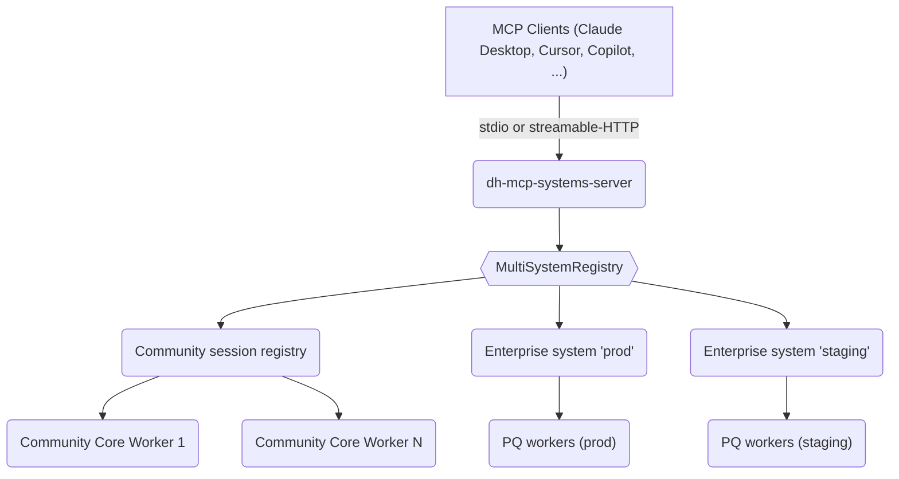
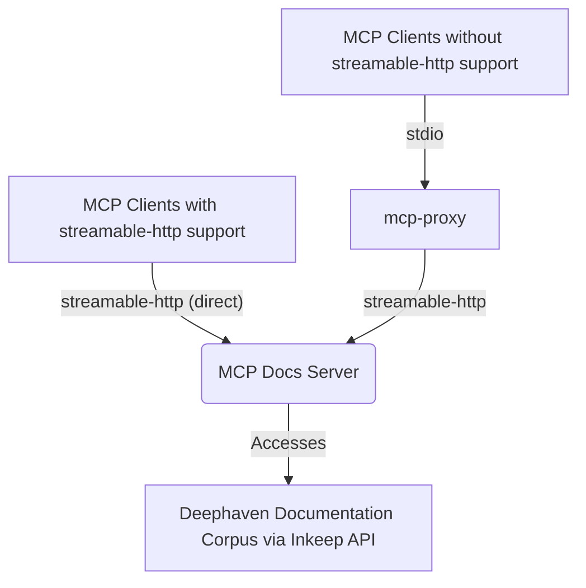

# Deephaven MCP

> **You are reading the [Developer & Contributor Guide](DEVELOPER_GUIDE.md) for Deephaven MCP.**

> **Project repository:** [https://github.com/deephaven/deephaven-mcp](https://github.com/deephaven/deephaven-mcp)

> **Note:** This document contains low-level technical details for contributors working on the [deephaven-mcp](https://github.com/deephaven/deephaven-mcp) project. **End users seeking high-level usage and onboarding information should refer to the main documentation in the [`../README.md`](../README.md).**

This repository houses the Python-based [Model Context Protocol (MCP)](https://modelcontextprotocol.io/) servers for Deephaven:

1. **Deephaven MCP Servers**: Provide tools for interacting with Deephaven Community Core and Enterprise instances via separate server processes.
2. **Deephaven MCP Docs Server**: Provides conversational Q&A about Deephaven documentation.

> **Requirements**: [Python](https://www.python.org/) 3.12 or later is required to run these servers.

---

## Table of Contents

- [Deephaven MCP](#deephaven-mcp)
  - [Table of Contents](#table-of-contents)
  - [Introduction](#introduction)
    - [About This Project](#about-this-project)
    - [Key Features](#key-features)
    - [System Architecture](#system-architecture)
  - [Prerequisites](#prerequisites)
    - [Required for All Users](#required-for-all-users)
    - [Systems Server Prerequisites](#systems-server-prerequisites)
    - [Docs Server Prerequisites (Only If Using Docs Server)](#docs-server-prerequisites-only-if-using-docs-server)
    - [Development Prerequisites (Contributors Only)](#development-prerequisites-contributors-only)
  - [Optional Dependencies](#optional-dependencies)
    - [Quick Verification Checklist](#quick-verification-checklist)
  - [Quick Start Guide](#quick-start-guide)
    - [Systems Server Quick Start](#systems-server-quick-start)
    - [Docs Server Quick Start](#docs-server-quick-start)
  - [Command Line Entry Points](#command-line-entry-points)
  - [HTTP Transport Security](#http-transport-security)
    - [PSK gating](#psk-gating)
    - [Loopback-only enforcement](#loopback-only-enforcement)
    - [Health-check endpoint](#health-check-endpoint)
  - [MCP Server Implementations](#mcp-server-implementations)
    - [Community Server](#community-server)
      - [Community Server Overview](#community-server-overview)
        - [Configuration Directory Tree](#configuration-directory-tree)
          - [Environment Variables](#environment-variables)
          - [File Structure Overview](#file-structure-overview)
      - [Systems Sessions Configuration](#systems-sessions-configuration)
    - [Security Configuration](#security-configuration)
      - [Community Session Credential Retrieval](#community-session-credential-retrieval)
      - [Community Session Creation Configuration](#community-session-creation-configuration)
      - [Enterprise Server Configuration](#enterprise-server-configuration)
        - [Enterprise Auth Model](#enterprise-auth-model)
      - [Running the Systems Server](#running-the-systems-server)
        - [Systems Server CLI Arguments](#systems-server-cli-arguments)
      - [Using the Systems Server](#using-the-systems-server)
      - [Session ID Format and Terminology](#session-id-format-and-terminology)
      - [Community Server Tools](#community-server-tools)
      - [Error Handling](#error-handling)
      - [MCP Tools](#mcp-tools)
    - [System Tools](#system-tools)
      - [`list_systems`](#list_systems)
      - [`enterprise_systems_status`](#enterprise_systems_status)
      - [Enterprise Session Tools](#enterprise-session-tools)
        - [`session_enterprise_create`](#session_enterprise_create)
        - [`session_enterprise_delete`](#session_enterprise_delete)
      - [Persistent Query (PQ) Management Tools](#persistent-query-pq-management-tools)
        - [`pq_name_to_id`](#pq_name_to_id)
        - [`pq_list`](#pq_list)
        - [`pq_details`](#pq_details)
        - [`pq_create`](#pq_create)
        - [`pq_delete`](#pq_delete)
        - [`pq_modify`](#pq_modify)
        - [`pq_start`](#pq_start)
        - [`pq_stop`](#pq_stop)
        - [`pq_restart`](#pq_restart)
      - [Community Session Tools](#community-session-tools)
        - [`session_community_create`](#session_community_create)
        - [`session_community_delete`](#session_community_delete)
        - [`session_community_credentials`](#session_community_credentials)
      - [General Session Tools](#general-session-tools)
        - [`sessions_list`](#sessions_list)
        - [`session_details`](#session_details)
        - [`catalog_tables_list`](#catalog_tables_list)
        - [`catalog_namespaces_list`](#catalog_namespaces_list)
        - [`catalog_tables_schema`](#catalog_tables_schema)
        - [`catalog_table_sample`](#catalog_table_sample)
    - [Session Data Tools](#session-data-tools)
      - [`session_tables_schema`](#session_tables_schema)
        - [`session_script_run`](#session_script_run)
        - [`session_pip_list`](#session_pip_list)
        - [`session_table_data`](#session_table_data)
        - [`session_tables_list`](#session_tables_list)
      - [Community Server Test Components](#community-server-test-components)
        - [Community Test Server](#community-test-server)
        - [Community Server Test Client](#community-server-test-client)
    - [Docs Server](#docs-server)
      - [Docs Server Overview](#docs-server-overview)
      - [Docs Server Configuration](#docs-server-configuration)
        - [Docs Server Environment Variables](#docs-server-environment-variables)
        - [Example Configuration](#example-configuration)
      - [Running the Docs Server](#running-the-docs-server)
        - [Docs Server CLI Arguments](#docs-server-cli-arguments)
      - [Docs Server Tools](#docs-server-tools)
        - [`docs_chat`](#docs_chat)
      - [Docs Server HTTP Endpoints](#docs-server-http-endpoints)
      - [Docs Server Test Components](#docs-server-test-components)
        - [Docs Test Client](#docs-test-client)
  - [Integration Methods](#integration-methods)
    - [MCP Inspector](#mcp-inspector)
      - [MCP Inspector with Community Server](#mcp-inspector-with-community-server)
      - [MCP Inspector with Docs Server](#mcp-inspector-with-docs-server)
    - [Claude Desktop](#claude-desktop)
      - [Configuration](#configuration)
      - [Claude Desktop Log Locations](#claude-desktop-log-locations)
    - [mcp-proxy](#mcp-proxy)
      - [mcp-proxy with Community Server](#mcp-proxy-with-community-server)
      - [mcp-proxy with Docs Server](#mcp-proxy-with-docs-server)
    - [Programmatic API](#programmatic-api)
      - [Community Server Example](#community-server-example)
      - [Docs Server Example](#docs-server-example)
  - [Development](#development)
    - [Development Workflow](#development-workflow)
    - [Advanced Development Techniques](#advanced-development-techniques)
    - [Development Commands](#development-commands)
      - [Code Quality \& Pre-commit Checks](#code-quality--pre-commit-checks)
    - [Project Structure](#project-structure)
      - [Key Module Details](#key-module-details)
      - [Script References](#script-references)
    - [Dependencies](#dependencies)
    - [Versioning](#versioning)
    - [Docker Compose](#docker-compose)
    - [Performance Testing](#performance-testing)
      - [MCP Docs Server Stress Testing](#mcp-docs-server-stress-testing)
      - [HTTP Transport Stress Testing](#http-transport-stress-testing)
      - [Usage Example](#usage-example)
      - [Arguments](#arguments)
  - [Testing](#testing)
    - [Unit Tests](#unit-tests)
    - [Integration Tests](#integration-tests)
      - [Integration Test Prerequisites](#integration-test-prerequisites)
      - [Running Integration Tests](#running-integration-tests)
      - [Running Specific Test Classes](#running-specific-test-classes)
      - [Troubleshooting Integration Tests](#troubleshooting-integration-tests)
  - [Troubleshooting](#troubleshooting)
    - [Common Issues](#common-issues)
    - [Common Errors \& Solutions](#common-errors--solutions)
  - [Resources](#resources)
    - [Documentation](#documentation)
    - [Deephaven API Reference](#deephaven-api-reference)
    - [Tools \& Related Projects](#tools--related-projects)
    - [Contributing](#contributing)
    - [Community \& Support](#community--support)
  - [License](#license)

---

## Introduction

### About This Project

The [deephaven-mcp](https://github.com/deephaven/deephaven-mcp) project provides Python implementations of two [Model Context Protocol (MCP)](https://modelcontextprotocol.io/) servers:

1. **Deephaven MCP Systems Server** (`dh-mcp-systems-server`):  <!-- markdownlint-disable-line MD029 -->
   - A single multiplexed binary that hosts every configured Community session **and** every Enterprise (Core+) system in one process.
   - Built with [FastMCP](https://github.com/modelcontextprotocol/python-sdk) (bundled as `mcp.server.fastmcp`).
   - Supports `--transport stdio` (default; AI clients launch it as a subprocess) and `--transport http` (streamable-HTTP, loopback-only, gated by a Pre-Shared Key).
   - Exposes the union of community + enterprise tools: session/table/script tools, dynamic community session creation, persistent-query lifecycle management, catalog discovery, and a `list_systems` discovery tool.
   - Maintains [PyDeephaven](https://github.com/deephaven/deephaven-core/tree/main/py) client sessions per configured worker (community side) and a `CorePlusSessionFactoryManager` per configured Enterprise system, with automatic caching, concurrent access safety, and lifecycle management.

2. **Deephaven MCP Docs Server**:
   - Offers an agentic, LLM-powered API for Deephaven documentation Q&A and chat
   - Uses the [Inkeep](https://inkeep.com/) LLM API (an OpenAI-compatible endpoint) for its LLM capabilities
   - HTTP-only (streamable-http)
   - Designed for integration with orchestration frameworks

Both servers are designed for integration with MCP-compatible tools like the [MCP Inspector](https://github.com/modelcontextprotocol/inspector) and [Claude Desktop](https://claude.ai).

### Key Features

**Systems Server Features:**

- **MCP Server:** Implements the MCP protocol for Deephaven Community Core and Enterprise systems
- **Two transports:** `stdio` (default; AI-client subprocess) and `http` (streamable-HTTP; loopback-only, gated by a Pre-Shared Key)
- **Configurable:** Loads worker configuration from a directory tree of JSON5 files.
- **Async Lifecycle:** Uses FastMCP's async lifespan for robust startup and shutdown handling
- **Lazy Loading:** Sessions are created on-demand to improve startup performance and resilience

**Docs Server Features:**

- **MCP-compatible server** for documentation Q&A and chat
- **HTTP-only:** Uses streamable-http transport exclusively
- **LLM-powered:** Uses the Inkeep LLM API (OpenAI-compatible) for conversational documentation assistance
- **FastMCP backend:** Built on FastMCP framework, deployable locally or via Docker
- **Single tool:** `docs_chat` for conversational documentation assistance
- **Extensible:** Python-based for adding new tools or extending context

### System Architecture

**Systems Server Architecture:**

*One multiplexed `dh-mcp-systems-server` process composes one
community child registry (when `community/sessions/` is non-empty)
and one enterprise child registry per file under `enterprise/systems/`.
Tools that operate on a specific enterprise system take a `system`
argument; PQ tools encode the system in the PQ id (`<system>:<serial>`).*


```mermaid
graph TD
    A["MCP Clients (Claude Desktop, Cursor, Copilot, ...)"] --"stdio or streamable-HTTP"--> S("dh-mcp-systems-server")
    S --> R{{"MultiSystemRegistry"}}
    R --> CR("Community session registry")
    R --> E1("Enterprise system 'prod'")
    R --> E2("Enterprise system 'staging'")
    CR --> CW1("Community Core Worker 1")
    CR --> CW2("Community Core Worker N")
    E1 --> EP("PQ workers (prod)")
    E2 --> ES("PQ workers (staging)")
```

**Typical Usage:** A single `dh-mcp-systems-server` process exposes
every configured Community session and Enterprise system through one
stdio or streamable-HTTP MCP transport. AI clients call `list_systems`
to discover what's configured and route subsequent calls via the
`system` / `session_id` / `pq_id` arguments.

**Docs Server Architecture:**


```mermaid
graph TD
    A["MCP Clients with streamable-http support"] --"streamable-http (direct)"--> B("MCP Docs Server")
    C["MCP Clients without streamable-http support"] --"stdio"--> D["mcp-proxy"]
    D --"streamable-http"--> B
    B --"Accesses"--> E["Deephaven Documentation Corpus via Inkeep API"]
```

**Transport:**

The Docs Server uses **streamable-http exclusively**. Clients without native streamable-http support can use [mcp-proxy](#mcp-proxy-with-docs-server) to bridge stdio to streamable-http. (The systems server, by contrast, supports both stdio and streamable-HTTP natively.)

The MCP Docs Server processes natural language questions about Deephaven documentation using LLM capabilities via the Inkeep API.

## Prerequisites

Before using the Deephaven MCP servers, ensure you have the following prerequisites installed and configured:

### Required for All Users

**Python 3.12 or Later**

- **Requirement**: [Python](https://www.python.org/) 3.12+ is required to run both MCP servers
- **Installation**: Download from [python.org](https://www.python.org/downloads/) or use your system's package manager
- **Verification**: Run `python --version` to confirm Python 3.12 or later is installed

**Configuration File**

- **Requirement**: A directory tree of JSON5 configuration files (not a single file) for the Systems Server
- **Location**: Default `~/.deephaven/ai/config/` (POSIX) or `%APPDATA%/Deephaven/ai/config/` (Windows). Override with the `DH_MCP_DATA_DIR` env var or the `--config-dir` CLI flag.
- **Details**: See [Configuration Directory Tree](#configuration-directory-tree) for the layout summary, [`docs/CONFIGURATION.md`](CONFIGURATION.md) for the authoritative schema reference, and [`config-samples/ai/config/`](../config-samples/ai/config/) for a sample tree.

### Systems Server Prerequisites

**For Static Community Sessions**

- **Requirement**: Access to running Deephaven Community Core instance(s)
- **Configuration**: Connection details (host, port, auth) specified in per-session JSON files under `community/sessions/`
- **More Info**: See [Systems Sessions Configuration](#systems-sessions-configuration)

**For Dynamic Community Sessions (Optional)**

Choose **one** of the following launch methods for dynamically creating Deephaven sessions:

- **Docker Launch Method**:
  - **Requirement**: [Docker](https://www.docker.com/get-started/) installed and running
  - **Installation**: No additional Python packages required beyond base `deephaven-mcp`
  - **Verification**: Run `docker ps` to confirm Docker daemon is accessible
  - **Best For**: Production, isolated environments, cross-platform consistency

- **Python Launch Method**:
  - **Requirement**: `deephaven-server` Python package
  - **Installation**: `pip install deephaven-server` (in MCP venv or a custom venv)
  - **Verification**: Run `deephaven server --help` to confirm the command is available
  - **Best For**: Development environments, faster startup, no Docker dependency
  - **Custom Venv**: Use the `python.venv_path` config setting to specify a different Python environment

**For Enterprise Systems (Optional)**

- **Requirement**: Deephaven Enterprise (Core+) system(s) with accessible connection.json URL
- **Installation**: `pip install "deephaven-mcp[enterprise]"` (installs `deephaven-coreplus-client` from PyPI)
- **Configuration**: Each Enterprise system gets one file at `enterprise/systems/<system_name>.json` under your configuration directory.
- **More Info**: See [Enterprise Server Configuration](#enterprise-server-configuration) and [Development Workflow](#development-workflow)

### Docs Server Prerequisites (Only If Using Docs Server)

> **Note**: These prerequisites are only required if you plan to use the MCP Docs Server. Most users only need the Systems Servers (Community or Enterprise) and can skip this section.

**Inkeep API Key**

- **Requirement**: Valid API key from [Inkeep](https://inkeep.com/) for documentation Q&A
- **Configuration**: Set via `INKEEP_API_KEY` environment variable (required)
- **Obtaining**: Contact Inkeep or visit [inkeep.com](https://inkeep.com/) to obtain an API key

### Development Prerequisites (Contributors Only)

**Development Tools**

- **Required**: Git, Python 3.12+, virtual environment tool (`venv` or `uv`)
- **Recommended**: [`uv`](https://github.com/astral-sh/uv) for faster package management
- **Installation**: See the [uv installation guide](https://github.com/astral-sh/uv#installation), or [`docs/UV.md`](UV.md) for a quick orientation if you are new to `uv`

**Testing Requirements**

- **Unit Tests**: Development dependencies installed via `pip install -e ".[dev]"`
- **Integration Tests**:
  - Docker must be installed and running (for Docker integration tests)
  - `deephaven-server` package installed (for python integration tests)
- **More Info**: See [Testing](#testing) section

## Optional Dependencies

The `deephaven-mcp` package provides optional dependency groups (extras) to tailor the installation to your specific needs:

| Extra | Purpose | Install Command |
|-------|---------|-----------------|
| `[community]` | Python-based Community Core session creation (no Docker required) | `pip install "deephaven-mcp[community]"` |
| `[enterprise]` | Connect to Deephaven Enterprise (Core+) systems | `pip install "deephaven-mcp[enterprise]"` |
| `[test]` | Run unit and integration tests | `pip install "deephaven-mcp[test]"` |
| `[lint]` | Code quality tools (linting, formatting, type checking) | `pip install "deephaven-mcp[lint]"` |
| `[dev]` | Full development environment with all features | `pip install "deephaven-mcp[dev]"` |

**Common Installation Patterns:**

```bash
# Basic installation (connect to existing instances)
pip install deephaven-mcp

# With python session creation for Community Core
pip install "deephaven-mcp[community]"

# With Enterprise support
pip install "deephaven-mcp[enterprise]"

# Both Community + Enterprise
pip install "deephaven-mcp[community,enterprise]"

# Full development environment (includes all features)
pip install -e ".[dev]"
```

### Quick Verification Checklist

Before proceeding with the Quick Start Guide, verify your setup:

- ✅ Python 3.12+ installed: `python --version`
- ✅ Configuration directory populated (for Systems Server): see [`config-samples/ai/config/`](../config-samples/ai/config/)
- ✅ Environment variable set when overriding the default location: `export DH_MCP_DATA_DIR=/path/to/your/data-root`
- ✅ Inkeep API key set (for Docs Server): `export INKEEP_API_KEY=your-key`
- ✅ Docker running (for docker launch method): `docker ps`
- ✅ OR deephaven-server installed (for python launch method): `deephaven server --help`

## Quick Start Guide

### Systems Server Quick Start

1. **Set up the configuration directory:**
   `dh-mcp-systems-server` reads a directory tree of small JSON files
   (default `~/.deephaven/ai/config/`). Create at least one community
   session file:

   ```json5
   // ~/.deephaven/ai/config/community/sessions/local_session.json
   {
     "session_name": "local_session",  // must match the filename stem
     "host": "localhost",              // Deephaven server address
     "port": 10000                     // Default Deephaven port
   }
   ```

   See [`config-samples/ai/config/`](../config-samples/ai/config/) for a complete
   sample tree (community sessions, enterprise systems, and
   `server.json` for the HTTP-transport PSK).

   > **Dynamic Community Session Creation (Optional):** To enable
   > on-demand creation of Deephaven Community sessions, add a
   > `session_creation` block to `~/.deephaven/ai/config/community/settings.json`.
   > Choose your launch method:
   >
   > - **Docker (default):** Requires Docker installed and running. No additional Python packages needed.
   >
   >   ```json
   >   {
   >     "session_creation": {
   >       "max_concurrent_sessions": 5,
   >       "defaults": {"launch_method": "docker"}
   >     }
   >   }
   >   ```
   >
   > - **Python:** Faster startup, no Docker needed. Install `deephaven-server` in your Python environment.
   >
   >   ```json5
   >   {
   >     "session_creation": {
   >       "max_concurrent_sessions": 5,
   >       "defaults": {
   >         "launch_method": "python",
   >         "python": { "venv_path": null }  // null uses MCP venv, or specify "/path/to/custom/venv"
   >       }
   >     }
   >   }
   >   ```
   >
   > See [Community Session Creation Configuration](#community-session-creation-configuration) for all options.

2. **Start a test Deephaven server in one terminal:**

   ```sh
   # For anonymous authentication (no MCP auth needed)
   uv run scripts/run_deephaven_test_server.py --table-group simple

   # OR for PSK authentication (if your MCP config uses auth tokens)
   uv run scripts/run_deephaven_test_server.py --table-group simple --auth-token Deephaven123
   ```

   > This script is located at [`../scripts/run_deephaven_test_server.py`](../scripts/run_deephaven_test_server.py) and creates a local Deephaven server with test data. Use the `--auth-token` parameter if your MCP configuration requires PSK authentication.

3. **Run the Systems Server (HTTP transport, for the Inspector):**

   ```sh
   # server.json must declare a PSK; here we read it from $DH_MCP_PSK
   export DH_MCP_PSK='your-shared-secret'
   uv run dh-mcp-systems-server --transport http --port 8000
   ```

   For desktop AI clients, drop the `--transport http` flag and let
   the client launch the server as a stdio subprocess instead.

4. **Test with the MCP Inspector:**

   ```sh
   npx @modelcontextprotocol/inspector@latest
   ```

   Connect to `http://127.0.0.1:8000/mcp` in the Inspector UI and add
   the request header `X-Deephaven-PSK: your-shared-secret`.

### Docs Server Quick Start

1. **Set up Inkeep API key:**

   ```sh
   export INKEEP_API_KEY=your-inkeep-api-key  # Get from https://inkeep.com
   ```

2. **Run the Docs Server:**

   ```sh
   uv run dh-mcp-docs-server
   ```

3. **Test with the MCP Inspector:**

   ```sh
   npx @modelcontextprotocol/inspector@latest
   ```

   Connect to `http://localhost:8001/mcp` in the Inspector UI and test the `docs_chat` tool.

## Command Line Entry Points

This package registers the following console entry points for easy command-line access:

| Command | Description | Source |
|---------|-------------|--------|
| `dh-mcp` | Thin local client for the Systems Server: manages a per-user background daemon and calls MCP tools. See [`docs/CLI.md`](CLI.md). | `deephaven_mcp.cli._main:main` |
| `dh-mcp-systems-server` | Start the multiplexed Systems Server (hosts every configured Community session and Enterprise system in one process). Supports `--transport stdio` (default) or `--transport http`. | `deephaven_mcp.mcp_systems_server.server:main` |
| `dh-mcp-docs-server` | Start the Docs Server | `deephaven_mcp.mcp_docs_server.main:main` |

These commands are automatically available in your PATH after installing the package.

## HTTP Transport Security

> **See also: [`docs/SECURITY.md`](SECURITY.md)** for the project's
> security model and hardening checklist. The section below is the
> deep operator reference for the multiplexed `dh-mcp-systems-server`'s
> HTTP transport.

`dh-mcp-systems-server` supports two transports:

- **`stdio`** (default) — the AI client launches the server as a
  subprocess; auth comes from the fact that only that client can
  write to the pipe.
- **`http`** (streamable-HTTP) — a long-lived HTTP service that
  binds **only** to loopback and is gated by a Pre-Shared Key.
  Production deployments terminate TLS at a reverse proxy on the same
  host and forward to `127.0.0.1:<port>`; the server itself never
  uses TLS.

### PSK gating

When started with `--transport http`, the server requires `server.json`
(in the configuration directory) to declare a `psk` value. Use
`"${env:NAME}"` templating inside the value if you want to source the
secret from an environment variable. Every request must
then carry the `X-Deephaven-PSK` HTTP header with that value. The
middleware enforces this with a constant-time comparison
(`hmac.compare_digest`); requests with a missing or mismatched header
are rejected with HTTP `401`.

```json5
// $DH_MCP_DATA_DIR/config/server.json
{
  "psk": "${env:DH_MCP_PSK}"   // server reads $DH_MCP_PSK at startup
}
```

### Loopback-only enforcement

The server validates `--host` at startup using
[`socket.getaddrinfo`](https://docs.python.org/3/library/socket.html#socket.getaddrinfo)
and refuses to bind to any address that is not exclusively loopback.
Accepted values are `127.0.0.1`, `::1`, `localhost` (case-insensitive),
and any hostname whose resolution yields only loopback addresses.
Unresolvable hosts are also refused so the safe default is to fail
closed.

If you need to expose the server beyond loopback, terminate TLS at a
reverse proxy on the same host:

```nginx
# nginx fragment (TLS terminating in front of the systems server)
upstream deephaven_mcp { server 127.0.0.1:8000; }
server {
    listen 443 ssl http2;
    ssl_certificate     /etc/ssl/certs/example.crt;
    ssl_certificate_key /etc/ssl/private/example.key;
    location /mcp {
        proxy_pass         http://deephaven_mcp;
        proxy_http_version 1.1;
        proxy_set_header   X-Deephaven-PSK $http_x_deephaven_psk;
    }
}
```

### Health-check endpoint

The systems server exposes a `/health` endpoint that returns `200 OK`
with JSON body `{"status": "ok"}`. The endpoint is designed for
liveness/readiness probes from load balancers and orchestrator agents
(Kubernetes, Cloud Run, AWS ALB, etc.). `/health` is registered via
`@server.custom_route("/health", methods=["GET"])` and is added to
`PSKMiddleware`'s `bypass_paths`, so external probes do not need to
share the PSK.

The **docs server** (`dh-mcp-docs-server`) registers `/health` the
same way and mounts no auth middleware at all, so the bypass is moot
there.

No other path is bypassed; in particular `/healthz` is **not** an
alias and is rejected normally.

## MCP Server Implementations

### Community Server

> **Note:** This describes the community-side capabilities exposed by the unified `dh-mcp-systems-server`. There is no longer a separate Community server process — community sessions and enterprise systems are multiplexed inside the single systems server.

#### Community Server Overview

The Deephaven MCP Community Server is an [MCP](https://github.com/modelcontextprotocol/spec)-compatible server (built with [FastMCP](https://github.com/modelcontextprotocol/python-sdk)) that provides tools for interacting with Deephaven Community Core instances.

Key architectural features include:

- **Efficient Session Management**: Implements a sophisticated session caching system using [PyDeephaven](https://github.com/deephaven/deephaven-core/tree/main/py) that automatically reuses existing connections when possible and manages session lifecycles.
- **Concurrent Access Safety**: Uses [asyncio](https://docs.python.org/3/library/asyncio.html) Lock mechanisms to ensure thread-safe operations during session management.
- **Automatic Resource Cleanup**: Gracefully handles session termination and cleanup during server shutdown or reload operations.
- **On-Demand Session Creation**: Sessions to worker nodes are created only when needed and cached for future use.
- **Async-First Design**: Built around [asyncio](https://docs.python.org/3/library/asyncio.html) for high-concurrency performance and non-blocking operations.
- **Configurable Session Behavior**: Supports worker configuration options such as `never_timeout` to control session persistence and lifecycle management.

##### Configuration Directory Tree

The multiplexed `dh-mcp-systems-server` reads a *directory tree* of small JSON5 files (not a single configuration file). The default location is `~/.deephaven/ai/config/` on POSIX or `%APPDATA%/Deephaven/ai/config/` on Windows; override with the `DH_MCP_DATA_DIR` env var or the `--config-dir` CLI flag.

> **Authoritative reference:** [`docs/CONFIGURATION.md`](CONFIGURATION.md) is
> the single source of truth for the on-disk layout, every Pydantic schema,
> the `${env:VAR}` / `${file:PATH}` templating engine, and the schema-level
> defaults. The summary below is for quick orientation only — when prose here
> disagrees with `CONFIGURATION.md`, `CONFIGURATION.md` wins.

Layout:

```text
$DH_MCP_DATA_DIR/config/
  server.json                       # optional; HTTP transport + PSK
  community/
    settings.json                   # optional; session-creation defaults, timeouts, security
    sessions/
      <name>.json                   # zero or more static community sessions
  enterprise/
    settings.json                   # optional; enterprise-wide timeouts
    systems/
      <name>.json                   # zero or more enterprise systems
```

Every file is JSON5 (comments and trailing commas allowed) and validated by Pydantic v2. Unknown fields are rejected. Filename stems are cross-checked against the `session_name` / `system_name` field inside each file. The directory permission audit (POSIX strict, Windows best-effort) runs before any file is parsed. There is **no** flat `deephaven_mcp.json` file and **no** `DH_MCP_CONFIG_FILE` env var — both were removed in the multi-section refactor.

**File Format**: The configuration file supports both standard JSON and JSON5 formats:

- Single-line comments: `// This is a comment`
- Multi-line comments: `/* This is a multi-line comment */`
- Trailing commas are also supported

This allows you to add documentation directly in your configuration file to explain connection details, authentication choices, or other configuration decisions.

###### Environment Variables

The Community Server's behavior, particularly how it finds its configuration, can be controlled by the following environment variables:

| Variable             | Required | Description                                                                                                                                                              | Where Used              |
|----------------------|----------|--------------------------------------------------------------------------------------------------------------------------------------------------------------------------|-------------------------|
| `DH_MCP_DATA_DIR`  | No       | Path to the user-data **root** under which both `config/` (configuration tree) and `runtime/` (daemon registry / lock / log) live. When unset, the platform default is used (`~/.deephaven/ai/` on POSIX, `%APPDATA%/Deephaven/ai/` on Windows). The `--config-dir` and `--runtime-dir` CLI flags target individual subdirectories and **bypass** this env var.<br><br>Example:<br>`export DH_MCP_DATA_DIR="/home/user/.deephaven/ai"`<br>`uv run dh-mcp-systems-server`                                                                                                                                          | Systems Server, Test Client |
| (HTTP port)          | No       | Set the `port` field in `server.json` (default: `8000`). Only relevant under `--transport http`. Overridden by the `--port` CLI flag. There is no `DH_MCP_HTTP_PORT` env var; use `"port": "${env:NAME}"` for env-var indirection.                                    | Systems Server (optional)              |
| `PYTHONLOGLEVEL`     | No       | Sets the Python logging level for the server (e.g., `DEBUG`, `INFO`, `WARNING`, `ERROR`).                                                                                    | Server (optional)       |

> Environment variables must be set in the shell or process environment before starting the server; there is no built-in `.env` file support.

For the complete list of environment variables (including timeout-tuning vars and credential indirection variables), see [`docs/ENV.md`](ENV.md).

###### File Structure Overview

The configuration is split across files in the directory tree shown above:

- **`server.json`** (optional): Server-process tunables — `transport` (`"stdio"` / `"http"`), `host`, `port`, `psk`, `server_name`. The HTTP transport is gated by the PSK in this file.
- **`community/settings.json`** (optional): Community-wide globals — `security.credential_retrieval_mode`, `session_creation.defaults`, and a `timeouts` umbrella block (`timeouts.client.*` for outbound community client calls; `timeouts.eviction.*` for the MCP-side idle-session sweeper).
- **`community/sessions/<name>.json`** (zero or more): One static community session per file. Each file declares `session_name` (must equal the filename stem), `host`, `port`, `programming_language`, an optional `tls` block, and an `auth.credentials` discriminated-union block.
- **`enterprise/settings.json`** (optional): Enterprise-wide `timeouts` umbrella block (`timeouts.client.*` consumed by the enterprise client layer; `timeouts.eviction.*` consumed by the MCP-side idle-session sweeper, applied uniformly to every system) plus a `pq_tools` block holding the persistent-query tool defaults.
- **`enterprise/systems/<name>.json`** (zero or more): One enterprise system per file. Each file declares `system_name` (filename stem match), `connection_json_url`, `auth.credentials`, optional `session_creation`, and per-system timer overrides.

Authentication credentials live exclusively under `auth.credentials` as a discriminated union (`type`: `anonymous`, `psk`, `password`, `private_key`, `custom`). The legacy flat fields (`auth_type`, `auth_token`, `auth_token_env_var`, `client_private_key`, `tls_root_certs` paths, etc.) are gone. Authors who want to pull a value from an environment variable or file write `"${env:NAME}"` / `"${file:/path}"` directly inside the JSON value.

For the **complete schema** — every field, every default, every example — see [`docs/CONFIGURATION.md`](CONFIGURATION.md). For ready-to-edit example files, see [`config-samples/ai/config/`](../config-samples/ai/config/).

#### Systems Sessions Configuration

This section formerly mirrored the per-session schema for community sessions. The schema is now authoritative in [`docs/CONFIGURATION.md`](CONFIGURATION.md#per-session-community-files); a sample file lives at [`config-samples/ai/config/community/sessions/local_dev.json`](../config-samples/ai/config/community/sessions/local_dev.json). Quick orientation only — the per-file shape is:

```json5
{
  "session_name": "local_dev",
  "host": "localhost",
  "port": 10000,
  "programming_language": "Python",
  "auth": {
    "credentials": {
      "type": "psk",
      "token": "${env:DH_LOCAL_DEV_PSK}"
    }
  }
}
```

Optional blocks include `tls` (server-trust bundle + optional mTLS client cert) and the various credentials types under `auth.credentials.type`.

### Security Configuration

The optional `security` block in `community/settings.json` controls security-sensitive behavior for community sessions. It is the single place where the operator opts into (or out of) credential exposure to MCP tools, so security decisions are explicit and easy to audit.

#### Community Session Credential Retrieval

The `session_community_credentials` MCP tool allows programmatic retrieval of authentication credentials for community sessions. This is **disabled by default** for security.

**Configuration:** `security.credential_retrieval_mode`

Controls which community session credentials can be retrieved via the MCP tool. This setting applies to:

- **Static sessions**: Pre-configured in `sessions`
- **Dynamic sessions**: Created on-demand via `session_community_create`

**Valid modes:**

- **`"none"`** (default): Credential retrieval disabled for all sessions
  - Most secure option
  - Tool returns error with instructions to enable
  
- **`"dynamic_only"`**: Only auto-generated tokens (dynamic sessions)
  - Allows retrieval for sessions created via `session_community_create`
  - Denies retrieval for pre-configured static sessions
  - **Recommended**: Users typically need dynamic tokens but already have static credentials
  
- **`"static_only"`**: Only pre-configured tokens (static sessions)
  - Allows retrieval for sessions from `sessions`
  - Denies retrieval for dynamically created sessions
  - **Rare use case**: Static credentials are already in your config file
  
- **`"all"`**: Both dynamic and static session credentials
  - Maximum convenience, minimum security
  - Only enable if you fully understand the security implications

**Security Considerations:**

- Credentials are returned in plain text
- All retrieval attempts are logged for audit
- Consider: Do AI agents really need access to credentials you already have?
- Recommendation: Use `"dynamic_only"` if needed, `"none"` otherwise

**Example `community/settings.json`:**

```json5
{
  "security": {
    "credential_retrieval_mode": "dynamic_only"
  },
  "session_creation": {
    "max_concurrent_sessions": 5,
    "defaults": {
      "launch_method": "docker",
      "auth": {
        "credentials": { "type": "psk", "token": "${env:DH_DYNAMIC_SESSION_TOKEN}" }
      },
      "heap_size_gb": 4
    }
  },
  "timeouts": {
    "eviction": {
      "session_idle_timeout_seconds": 3600.0,
      "sweep_interval_seconds": 60.0
    }
  }
}
```

Static community sessions live in their own files under `community/sessions/`; the server-process PSK that gates inbound HTTP requests lives in `server.json`.

**Per-Section Settings:**

Duration knobs live under `timeouts.eviction.*` (community and enterprise share the same shape):

- `timeouts.eviction.session_idle_timeout_seconds` (float, **optional, default: 3600.0**): Seconds of Deephaven-session inactivity after which idle sessions in the registry are closed; static sessions are kept and lazily reconnected, dynamic sessions are removed. Must be positive.
- `timeouts.eviction.sweep_interval_seconds` (float, **optional, default: 60.0**): How often the per-registry idle sweeper wakes (seconds). Must be positive.

#### Community Session Creation Configuration

Dynamic community sessions are configured under the `session_creation`
block of `community/settings.json`. The full schema (every field, every
default, the `auth.credentials` discriminated union) lives in
[`docs/CONFIGURATION.md`](CONFIGURATION.md#community-settingsjson) and
is the authoritative reference; the bullets below cover only the
operational notes that are not part of the schema itself.

**Launch Method Requirements:**

The `launch_method` field on `session_creation.defaults` selects how
new dynamic sessions start.

- **`"docker"`** (default):
  - Requires [Docker](https://www.docker.com/get-started/) installed and running on the host.
  - Works with the base `deephaven-mcp` installation; no extra Python packages.
  - Verify with `docker ps`.

- **`"python"`**:
  - Requires the `deephaven-server` Python package: `pip install deephaven-server`.
  - Use the optional `python.venv_path` field to point at a different venv; `null` (default) reuses the MCP server's own venv.
  - Verify with `deephaven server --help`.

> **💡 Tip**: For development environments, the python method is often faster and simpler. For production or isolated environments, the docker method provides better consistency and isolation.

**MCP Tool: `session_community_credentials`**

When `credential_retrieval_mode` is set to a value other than `"none"` (the default), this tool retrieves connection credentials for both static and dynamic Community sessions.

**Arguments:**

- `session_id` (string): Full session ID — `"community:community:session-name"` for both static and dynamic community sessions. The static-vs-dynamic distinction lives on the manager's `origin` field, not in the id.

**Returns:**

- `connection_url` (string): Base URL without authentication
- `connection_url_with_auth` (string): Full URL with auth token for browser
- `auth_token` (string): Raw authentication token
- `auth_type` (string): Authentication type (e.g., `"io.deephaven.authentication.psk.PskAuthenticationHandler"`, `"Anonymous"`)

**Example Usage (via AI agent):**

```text
User: "Get me the browser URL for my-analysis session"
AI: [calls session_community_credentials with session_id="community:community:my-analysis"]
AI: "Here's your browser URL: http://localhost:45123/?psk=abc123..."

User: "What's the URL for my static local-dev session?"
AI: [calls session_community_credentials with session_id="community:community:local-dev"]
AI: "Here's the URL: http://localhost:10000/?psk=your-token"
```

**Security Notes:**

- All credential retrievals are logged for audit
- Credentials are returned in plain text
- Only use for legitimate browser access needs
- Consider security implications before enabling

**Alternative: Console Logging**

If `credential_retrieval_mode` is `"none"` (default), credentials are still accessible via console output. When a session is created with an auto-generated token, connection information is logged:

```text
======================================================================
🔑 Session 'my-analysis' Created - Browser Access Information:
   Port: 45123
   Base URL: http://localhost:45123
   Auth Token: abc123xyz789...
   Browser URL: http://localhost:45123/?psk=abc123xyz789

   To retrieve credentials via MCP tool, set security.credential_retrieval_mode
   in your `community/settings.json` configuration.
======================================================================
```

This is similar to how Jupyter displays tokens when starting a notebook server.

**Example `community/settings.json`:**

```json5
{
  "security": {
    "credential_retrieval_mode": "dynamic_only"
  },
  "session_creation": {
    "max_concurrent_sessions": 5,
    "defaults": {
      "launch_method": "docker",
      "auth": {
        "credentials": { "type": "psk", "token": "${env:DH_DYNAMIC_SESSION_TOKEN}" }
      },
      "heap_size_gb": 4,
      "extra_jvm_args": ["-XX:+UseG1GC"],
      "docker_image": "ghcr.io/deephaven/server:latest",
      "docker_memory_limit_gb": 8.0
    }
  }
}
```

#### Enterprise Server Configuration

> **Note:** This describes the enterprise-side capabilities exposed by the unified `dh-mcp-systems-server`. There is no longer a separate Enterprise server process — community sessions and enterprise systems are multiplexed inside the single systems server.

Each Enterprise system gets one file under
`$DH_MCP_DATA_DIR/config/enterprise/systems/<system_name>.json`. The
filename stem must equal the `system_name` field. The single
multiplexed `dh-mcp-systems-server` hosts every file it finds.

The full per-system schema (every required field, every optional
block, the `auth.credentials` discriminated-union shape, and the
`session_creation.defaults` block consumed by
`session_enterprise_create`) lives in
[`docs/CONFIGURATION.md`](CONFIGURATION.md#enterprisesystemsnamejson)
and is the authoritative reference. The notes below cover only what
is specific to operational use.

> **Server-stored credentials.** The systems server reads the
> credentials needed to talk to each Core+ controller from each
> per-system `auth.credentials` block (one of `type=password`,
> `type=private_key`) at startup. No per-request `X-Deephaven-*`
> credential headers are involved — HTTP-transport requests are
> gated by the single PSK in `server.json`.

**Example `enterprise/systems/prod.json`:**

```json5
// $DH_MCP_DATA_DIR/config/enterprise/systems/prod.json
{
  "system_name": "prod",
  "connection_json_url": "https://enterprise.example.com/iris/connection.json",
  "auth": {
    "credentials": {
      "type": "password",
      "username": "iris",
      "password": "${env:DH_PROD_PASSWORD}"
    }
  },
  "session_creation": {
    "max_concurrent_sessions": 5,
    "defaults": {
      "heap_size_gb": 4.0,
      "programming_language": "Python",
      "auto_delete_timeout": 1800
    }
  }
}
```

Drop one file per system into `enterprise/systems/` and the single
`dh-mcp-systems-server` instance will host all of them; tools that
operate on a specific system take a `system` argument that selects
the right per-system registry.

##### Enterprise Auth Model

The systems server holds a single set of credentials per Enterprise
system (built once at startup from each
`enterprise/systems/<system>.json` file's `auth.credentials` block)
and reuses it for the lifetime of the process. There is no
per-request credential resolution, no `X-Deephaven-*` credential
headers, and no middleware-driven exchange.

**Supported credential kinds** (set `auth.credentials.type` per system):

- `"password"` — builds a `PasswordCredentials` from `username`
  plus `password` (with `${env:NAME}` templating recommended for the
  password value rather than inlining it). At session-creation time
  the session factory authenticates with
  `SessionManager.password(username, password)`.
- `"private_key"` — builds a `PrivateKeyCredentials` from `key_text`
  (typically `"${file:/path/to/key.pem}"` so the templating engine
  reads the PEM contents at config-load time). The session factory
  authenticates with `SessionManager.private_key(key_text)`.

The `anonymous`, `psk`, and `custom` kinds are community-only and
are rejected on enterprise systems.

**Credential lifecycle:**

- Credentials are validated and embedded into the per-system
  `EnterpriseSystemConfig` at startup; the corresponding
  `EnterpriseSessionRegistry` uses them to build its
  `CorePlusSessionFactoryManager` and start its discovery task.
- Credentials are not refreshed at runtime. To pick up an updated
  `${env:NAME}` value or rotate a private-key file, restart the
  systems server.
- The server never writes credentials to disk; in-memory copies live
  only inside the per-system factory manager and are cleared when
  the server shuts down. All `SecretStr` fields redact under
  `model_dump(context={"redact": True})` and in `repr`.

**Security Considerations:**

- HTTP-transport requests are gated by the systems server's PSK
  (`X-Deephaven-PSK`) and bind only to loopback. Production deployments
  terminate TLS at a reverse proxy on the same host — see
  [HTTP Transport Security](#http-transport-security).
- Per-system files contain credentials (or the names of env vars or
  files that hold them). Lock down `$DH_MCP_DATA_DIR/config` with
  `chmod 700` and per-file `chmod 600`; the startup permission audit
  fails fast otherwise.

**File Paths:**

Ensure any file paths referenced via `${file:...}` (private-key
files, TLS PEM bundles) are absolute and readable by the user
running the systems server.

#### Running the Systems Server

A single `dh-mcp-systems-server` process hosts every configured
Community session and Enterprise system. Choose your transport:

##### Systems Server CLI Arguments

| Argument | Description | Default |
|----------|-------------|---------|
| `--transport {stdio,http}` | Transport to expose. `stdio` carries no authentication and is intended for AI clients launching the server as a subprocess. `http` serves streamable-HTTP gated by `server.json`'s PSK. | `stdio` |
| `--host` | HTTP transport bind address. Must be a loopback host (`127.0.0.1`, `::1`, or `localhost`). Ignored under `stdio`. | `127.0.0.1` |
| `--port` | HTTP transport TCP port (overrides `server.json`'s `port` field). Ignored under `stdio`. | `8000` |
| `--config-dir` | Override for the `config` subdirectory only. Bypasses `DH_MCP_DATA_DIR` for the config subdir; the env var still applies to the runtime subdir unless `--runtime-dir` also overrides it. | `$DH_MCP_DATA_DIR/config` or platform default |
| `--runtime-dir` | Override for the `runtime` subdirectory (daemon registry, lock, and log). Bypasses `DH_MCP_DATA_DIR` for the runtime subdir; the env var still applies to the config subdir unless `--config-dir` also overrides it. Only meaningful under `--daemon`. | `$DH_MCP_DATA_DIR/runtime` or platform default |
| `-h, --help` | Show help message | - |

> **Note:** Non-loopback `--host` values are rejected at startup — the
> HTTP transport never uses TLS itself. Production deployments
> terminate TLS at a reverse proxy on the same host (see
> [HTTP Transport Security](#http-transport-security)).

```sh
# stdio (default; no flags needed when launched as an AI-client subprocess)
uv run dh-mcp-systems-server

# HTTP transport on default port 8000 — run in background, log to named file
export DH_MCP_PSK='your-shared-secret'
uv run dh-mcp-systems-server --transport http >dh-mcp-systems.log 2>&1 &

# Custom config directory and port
DH_MCP_DATA_DIR=/opt/deephaven/mcp uv run dh-mcp-systems-server \
    --transport http --port 8010 >dh-mcp-systems.log 2>&1 &
```

Connect HTTP-transport MCP clients to `http://127.0.0.1:8000/mcp`
(or the port you chose) and have them send `X-Deephaven-PSK: <psk>`
on every request.

To stop the server: `pkill -f dh-mcp-systems-server` or
`kill $(lsof -ti tcp:8000)`.

#### Using the Systems Server

Once running, you can interact with the Systems Server in several ways:

- Connect using [MCP Inspector](#mcp-inspector-with-community-server)
- Use with [Claude Desktop](#claude-desktop) (stdio is simplest; HTTP via `mcp-proxy` is also supported)
- Run the [Community Server Test Client](#community-server-test-client) script
- Build your own MCP client application

#### Session ID Format and Terminology

The Community Server uses a consistent session identifier format across all MCP tools:

**Session ID Format**: `{type}:{source}:{session_name}`

Where:

- `type`: Either `"community"` or `"enterprise"`
- `source`: For community sessions, always the literal `"community"` (the umbrella system name; the static-vs-dynamic distinction lives on the manager's `origin` field, not in the id). For enterprise sessions, the server's configured `system_name` (e.g. `"prod"`, `"staging"`).
- `session_name`: The specific session name within that source

For enterprise sessions, `source` equals the server's configured `system_name`, which is embedded in the session ID to support multiple enterprise servers running simultaneously without ID collisions. Each enterprise server validates that the `system_name` component of an incoming session ID matches its own, providing clear errors when a session ID from one server is accidentally sent to another.

**Examples**:

- `"community:community:my_session"` - A community session named "my_session" (the middle segment is the umbrella system name; the static-vs-dynamic distinction lives on the manager's `origin` field, not in the id)
- `"enterprise:prod:analytics_session"` - An enterprise session named "analytics_session" on the `"prod"` enterprise system

**Terminology Clarification**:

- **Worker**: A Deephaven Community Core instance (configured per-file under `community/sessions/<name>.json`)
- **System**: A Deephaven Enterprise instance/factory (managed by the DHE server; identified by the configured `system_name` value in session IDs)
- **Session**: A specific connection/session within a worker or system
- **Session ID**: The fully qualified identifier used by MCP tools to reference a specific session

All MCP tools that interact with Deephaven instances use the `session_id` parameter with this format, replacing the older `session_name` parameter from previous versions.

#### Community Server Tools

> **Note:** This describes the community-side tools exposed by the unified `dh-mcp-systems-server`.

The Community Server exposes the following MCP tools, each designed for a specific aspect of Deephaven worker management:

All Community Server tools return responses with a consistent format:

- Success: `{ "success": true, ... }` with additional fields depending on the tool
- Error: `{ "success": false, "error": "Error description", "isError": true }`

#### Error Handling

All Community Server tools use a consistent error response format when encountering problems:

```json
{
  "success": false,
  "error": "Human-readable error description",
  "isError": true
}
```

This consistent format makes error handling and response parsing more predictable across all tools.

#### MCP Tools

The two MCP servers together provide the following tools. Each tool is available on the **Community Server**, the **Enterprise Server**, or **both**:

**Quick Reference:**

| Tool | Category | Purpose | Server |
|------|----------|---------|--------|
| [`list_systems`](#list_systems) | System | List every configured Community session and Enterprise system | Both |
| [`enterprise_systems_status`](#enterprise_systems_status) | System | Check status of an enterprise system | Enterprise |
| [`sessions_list`](#sessions_list) | Session Management | List all active sessions | Both |
| [`session_details`](#session_details) | Session Management | Get detailed session information | Both |
| [`session_community_create`](#session_community_create) | Session Management | Create new community session | Community |
| [`session_community_delete`](#session_community_delete) | Session Management | Delete community session | Community |
| [`session_community_credentials`](#session_community_credentials) | Session Management | Get community session credentials | Community |
| [`session_enterprise_create`](#session_enterprise_create) | Session Management | Create new enterprise session | Enterprise |
| [`session_enterprise_delete`](#session_enterprise_delete) | Session Management | Delete enterprise session | Enterprise |
| [`pq_name_to_id`](#pq_name_to_id) | PQ Management | Convert PQ name to canonical pq_id | Enterprise |
| [`pq_list`](#pq_list) | PQ Management | List all persistent queries | Enterprise |
| [`pq_details`](#pq_details) | PQ Management | Get detailed PQ information | Enterprise |
| [`pq_create`](#pq_create) | PQ Management | Create a new persistent query | Enterprise |
| [`pq_delete`](#pq_delete) | PQ Management | Delete one or more persistent queries | Enterprise |
| [`pq_modify`](#pq_modify) | PQ Management | Modify a persistent query configuration | Enterprise |
| [`pq_start`](#pq_start) | PQ Management | Start one or more persistent queries | Enterprise |
| [`pq_stop`](#pq_stop) | PQ Management | Stop one or more persistent queries | Enterprise |
| [`pq_restart`](#pq_restart) | PQ Management | Restart one or more persistent queries | Enterprise |
| [`catalog_tables_list`](#catalog_tables_list) | Catalog Tools | List catalog table entries | Enterprise |
| [`catalog_namespaces_list`](#catalog_namespaces_list) | Catalog Tools | List catalog namespaces | Enterprise |
| [`catalog_tables_schema`](#catalog_tables_schema) | Catalog Tools | Get catalog table schemas | Enterprise |
| [`catalog_table_sample`](#catalog_table_sample) | Catalog Tools | Sample catalog table data | Enterprise |
| [`session_tables_schema`](#session_tables_schema) | Data Tools | Get table schemas from session | Both |
| [`session_tables_list`](#session_tables_list) | Data Tools | List table names in session | Both |
| [`session_table_data`](#session_table_data) | Data Tools | Retrieve table data | Both |
| [`session_script_run`](#session_script_run) | Data Tools | Execute Python script | Both |
| [`session_pip_list`](#session_pip_list) | Data Tools | List installed pip packages | Both |

---

### System Tools

#### `list_systems`

**Purpose**: List every Deephaven system the systems server is
configured to serve.

**Parameters**: None

**Returns**:

```json
{
  "success": true,
  "systems": [
    { "name": "community", "type": "community" },
    { "name": "prod",      "type": "enterprise" },
    { "name": "staging",   "type": "enterprise" }
  ]
}
```

On error:

```json
{
  "success": false,
  "error": "Error message",
  "isError": true
}
```

**Description**: Returns a discovery list of every Community session
and Enterprise system the multiplexed `dh-mcp-systems-server` was
configured with at startup. The umbrella Community side (when
`community/sessions/` is non-empty) appears as a single
`("community", "community")` entry; each file under
`enterprise/systems/` becomes one `(<name>, "enterprise")` entry.
Useful for AI agents to discover which `system` arguments are valid
for enterprise-targeted tools.

> **Note:** The previous `mcp_reload` tool has been removed.
> Configuration changes require a server restart.

#### `enterprise_systems_status`

**Purpose**: Get status of the configured enterprise (Core+) system with its status and configuration details (redacted).

**Parameters**:

- `attempt_to_connect` (optional, boolean): If True, actively attempts to connect to the system to verify its status. Default is False (only checks existing connections for faster response).

**Returns**:

```json5
{
  "success": true,
  "systems": [
    {
      "name": "prod",
      "liveness_status": "ONLINE",
      "liveness_detail": "System is healthy and ready for operational use",
      "is_alive": true,
      "config": {
        "system_name": "prod",
        "connection_json_url": "https://enterprise.example.com/iris/connection.json",
        "auth": {
          "type": "password",
          "username": "iris",
          "password": "[REDACTED]"
        }
      }
    }
  ]
}
```

On error:

```json
{
  "success": false,
  "error": "Error message",
  "isError": true
}
```

**Description**: This tool provides status information about the configured enterprise system. Status values include "ONLINE", "OFFLINE", "UNAUTHORIZED", "MISCONFIGURED", or "UNKNOWN". Sensitive configuration fields are redacted for security.

#### Enterprise Session Tools

> **Note:** This describes the enterprise-side tools exposed by the unified `dh-mcp-systems-server`.

##### `session_enterprise_create`

**Purpose**: Create a new enterprise session on the configured enterprise system.

**Parameters**:

- `session_name` (optional, string): Custom name for the session. If not provided, an auto-generated name will be used
- `heap_size_gb` (optional, float | int): JVM heap size in gigabytes for the session (e.g., 4 or 2.5). Enterprise library handles conversion internally
- `programming_language` (optional, string): Programming language for the session ("Python" or "Groovy")
- `auto_delete_timeout` (optional, integer): Auto-deletion timeout in seconds for idle sessions
- `server` (optional, string): Target server/environment name where the session will be created
- `engine` (optional, string): Engine type for the session (e.g., "DeephavenCommunity")
- `extra_jvm_args` (optional, array): Additional JVM arguments for the session
- `extra_environment_vars` (optional, array): Environment variables for the session in format ["NAME=value"]
- `admin_groups` (optional, array): User groups with administrative permissions for the session
- `viewer_groups` (optional, array): User groups with read-only access to the session
- `timeout_seconds` (optional, float): Session startup timeout in seconds
- `session_arguments` (optional, object): Additional arguments for pydeephaven.Session constructor

**Returns**:

```json
{
  "success": true,
  "session_id": "enterprise:prod:analytics-worker-001",
  "system_name": "prod",
  "session_name": "analytics-worker-001",
  "configuration": {
    "heap_size_gb": null,
    "auto_delete_timeout": null,
    "server": null,
    "engine": "DeephavenCommunity"
  }
}
```

On error:

```json
{
  "success": false,
  "error": "Error message",
  "isError": true
}
```

**Description**: This tool creates a new enterprise session on the configured enterprise system and registers it in the shared registry for future use. The session is configured with either provided parameters or defaults from the enterprise system configuration. Parameter resolution follows the priority: tool parameter → config default → API default.

##### `session_enterprise_delete`

**Purpose**: Delete an enterprise session by terminating it and removing it from the shared session registry.

**Parameters**:

- `session_id` (required, string): Full session identifier in format `"enterprise:{system_name}:{session_name}"`. The server validates that the `system_name` component matches its own configured system name; a mismatch returns a clear error rather than "not found".

**Returns**:

```json
{
  "success": true,
  "session_id": "enterprise:prod:analytics-worker-001",
  "system_name": "prod",
  "session_name": "analytics-worker-001"
}
```

On error:

```json
{
  "success": false,
  "error": "Error message",
  "isError": true
}
```

Cross-server error:

```json
{
  "success": false,
  "error": "Session 'enterprise:dev:session-1' belongs to system 'dev', but this server manages 'prod'",
  "isError": true
}
```

**Description**: This tool permanently terminates an enterprise session and removes it from the shared session registry (visible to every connected MCP client). The session cannot be recovered after deletion. Use with caution as any unsaved work in the session will be lost.

#### Persistent Query (PQ) Management Tools

Persistent Queries (PQs) are recipes for creating and managing long-running worker sessions in Deephaven Enterprise. Unlike ephemeral sessions created via `session_enterprise_create`, PQs can be configured to run on schedules, restart automatically on failure, and persist across server restarts.

**Key Concepts:**

- **PQ Definition**: A configuration specifying how to create a worker session (heap size, JVM args, schedule, etc.)
- **PQ Serial**: Immutable unique identifier for a PQ (recommended for all operations)
- **PQ Name**: Human-readable name (can change, less reliable than serial)
- **PQ States**: UNINITIALIZED, RUNNING, STOPPED, FAILED, COMPLETED, etc.
- **Session Integration**: Running PQs create sessions accessible via standard session tools using `session_id` format `enterprise:system:{pq_name}`

##### `pq_name_to_id`

**Purpose**: Convert a PQ name to its canonical pq_id format.

**Parameters**:

- `pq_name` (required, string): Name of the persistent query

**Returns**:

```json
{
  "success": true,
  "pq_id": "enterprise:system:12345",
  "serial": 12345,
  "name": "analytics_worker",
  "system_name": "system"
}
```

**Description**: Helper tool to look up a PQ by name and return its pq_id in the canonical format `enterprise:{system_name}:{serial}`. Use this when you know the PQ name but need the pq_id for other PQ operations. The tool performs a network lookup to find the serial number. Returns an error if the PQ doesn't exist.

##### `pq_list`

**Purpose**: List all persistent queries on the configured enterprise system.

**Parameters**: None

**Returns**:

```json
{
  "success": true,
  "system_name": "system",
  "pqs": [
    {
      "pq_id": "enterprise:system:12345",
      "serial": 12345,
      "name": "analytics_worker",
      "status": "RUNNING",
      "enabled": true,
      "owner": "admin_user",
      "heap_size_gb": 8.0,
      "worker_kind": "DeephavenCommunity",
      "configuration_type": "Script",
      "script_language": "Python",
      "server_name": "QueryServer_1",
      "admin_groups": ["admins"],
      "viewer_groups": ["analysts"],
      "is_scheduled": true,
      "num_failures": 0,
      "session_id": "enterprise:system:analytics_worker"
    }
  ]
}
```

**Description**: Returns a list of all PQs with comprehensive metadata. The `status` field indicates the current state (RUNNING, STOPPED, INITIALIZING, FAILED, etc.). Running or initializing PQs include a `session_id` field that can be used with session data tools. Filter results by status, owner, worker_kind, configuration_type, or script_language.

##### `pq_details`

**Purpose**: Get detailed information about a specific persistent query.

**Parameters**:

- `pq_id` (required, string): PQ identifier in format `"enterprise:{system_name}:{serial}"`

**Returns**:

```json
{
  "success": true,
  "pq_id": "enterprise:prod:12345",
  "serial": 12345,
  "name": "analytics_worker",
  "state": "RUNNING",
  "session_id": "enterprise:prod:analytics_worker",
  "config": {
    "heap_size_gb": 8.0,
    "engine": "DeephavenCommunity",
    "script_language": "Python"
  },
  "state_details": {
    "connection_details": {
      "processor_host": "worker-01.example.com"
    }
  },
  "replicas": [],
  "spares": []
}
```

**Description**: Returns comprehensive PQ details including configuration, state, and worker connection information. Worker host/port are in the `state_details.connection_details` subobject. Use the `session_id` with session tools to interact with the running PQ session.

##### `pq_create`

**Purpose**: Create a new persistent query.

**Parameters**:

- `pq_name` (required, string): Human-readable name for the PQ
- `heap_size_gb` (required, float | int): JVM heap size in GB
- `script_body` (optional, string): Inline script code (mutually exclusive with script_path)
- `script_path` (optional, string): Path to script in Git repository (mutually exclusive with script_body)
- `programming_language` (optional, string): "Python" or "Groovy" (default: "Python")
- `configuration_type` (optional, string): "Script" or "RunAndDone" (default: "Script")
- `enabled` (optional, bool): Whether PQ is enabled (default: true)
- `schedule` (optional, list[string]): Scheduling configuration as ["Key=Value", ...]
- `server` (optional, string): Specific server to run on
- `engine` (optional, string): Worker engine type (default: "DeephavenCommunity")
- `jvm_profile` (optional, string): JVM profile name
- `extra_jvm_args` (optional, list[string]): Additional JVM arguments
- `extra_class_path` (optional, list[string]): Additional classpath entries
- `python_virtual_environment` (optional, string): Python virtual environment name
- `extra_environment_vars` (optional, list[string]): Environment variables as ["KEY=value", ...]
- `init_timeout_nanos` (optional, int): Initialization timeout in nanoseconds
- `auto_delete_timeout` (optional, int): Seconds of inactivity before auto-deletion (default: None - permanent PQ)
- `admin_groups` (optional, list[string]): Groups with admin access
- `viewer_groups` (optional, list[string]): Groups with viewer access
- `restart_users` (optional, string): Restart permission policy (default: None)

**Returns**:

```json
{
  "success": true,
  "pq_id": "enterprise:prod:12345",
  "serial": 12345,
  "name": "analytics_worker",
  "state": "UNINITIALIZED",
  "message": "PQ 'analytics_worker' created successfully with serial 12345"
}
```

**Description**: Creates a new PQ in UNINITIALIZED state. Use `pq_start` to run it.

##### `pq_delete`

**Purpose**: Permanently delete one or more persistent queries (best-effort batch operation).

**Parameters**:

- `pq_id` (required, string | list[string]): PQ identifier or list of identifiers in format `"enterprise:{system_name}:{serial}"`
- `timeout_seconds` (optional, int): Max seconds to retrieve PQ information (default: 10)

**Returns**:

```json
{
  "success": true,
  "results": [
    {
      "pq_id": "enterprise:prod:12345",
      "serial": 12345,
      "success": true,
      "name": "analytics_worker",
      "error": null
    },
    {
      "pq_id": "enterprise:prod:67890",
      "serial": 67890,
      "success": false,
      "name": null,
      "error": "PQ not found"
    }
  ],
  "summary": {
    "total": 2,
    "succeeded": 1,
    "failed": 1
  },
  "message": "Deleted 1 of 2 PQ(s), 1 failed"
}
```

**Description**: Permanently removes PQs and all associated data. Operates in **best-effort mode**: processes each PQ independently, continuing even if some deletions fail. All PQ IDs must be from the same enterprise system. Use `pq_name_to_id` if you only have PQ names. If running, it will be stopped first. This operation cannot be undone.

##### `pq_modify`

**Purpose**: Modify an existing persistent query configuration.

**Parameters**:

- `pq_id` (required, string): PQ identifier in format `"enterprise:{system_name}:{serial}"`
- `restart` (optional, bool): Restart PQ after modification to apply changes (default: false)
- `pq_name` (optional, string): New name for the PQ
- `heap_size_gb` (optional, float | int): JVM heap size in GB
- `script_body` (optional, string): Inline script code (mutually exclusive with script_path)
- `script_path` (optional, string): Path to script file (mutually exclusive with script_body)
- `programming_language` (optional, string): "Python" or "Groovy"
- `configuration_type` (optional, string): Query type ("Script", "RunAndDone", etc.)
- `enabled` (optional, bool): Whether query is enabled
- `schedule` (optional, list[string]): Scheduling configuration
- `server` (optional, string): Specific server to run on
- `engine` (optional, string): Engine type (e.g., "DeephavenCommunity")
- `jvm_profile` (optional, string): Named JVM profile
- `extra_jvm_args` (optional, list[string]): Additional JVM arguments
- `extra_class_path` (optional, list[string]): Additional classpath entries
- `python_virtual_environment` (optional, string): Named Python virtual environment
- `extra_environment_vars` (optional, list[string]): Additional environment variables
- `init_timeout_nanos` (optional, int): Initialization timeout in nanoseconds
- `auto_delete_timeout` (optional, int): Auto-deletion timeout in seconds. Omit to leave unchanged, 0 for permanent (no expiration), positive integer for timeout
- `admin_groups` (optional, list[string]): User groups with admin access
- `viewer_groups` (optional, list[string]): User groups with viewer access
- `restart_users` (optional, string): Who can restart ("RU_ADMIN", "RU_ADMIN_AND_VIEWERS", "RU_VIEWERS_WHEN_DOWN")

**Returns**:

```json
{
  "success": true,
  "pq_id": "enterprise:prod:12345",
  "serial": 12345,
  "name": "analytics_worker",
  "restarted": false,
  "message": "PQ 'analytics_worker' modified successfully"
}
```

**Description**: Updates a PQ's configuration by merging provided parameters with the current config. Only specified (non-None) parameters are updated - all others remain unchanged. Changes can be applied to PQs in any state.

**Important Notes**:

- At least one parameter must be provided (returns error if no changes specified)
- List parameters (extra_jvm_args, schedule, etc.) completely replace existing values
- `restart=true` restarts the PQ immediately to apply changes
- `restart=false` saves changes but requires manual restart to take effect
- Some changes (heap size, script content, JVM args) require restart to apply
- Can modify RUNNING PQs but `restart=true` will disrupt active sessions
- Use `pq_details` first to see current configuration before modifying

##### `pq_start`

**Purpose**: Start one or more persistent queries (best-effort batch operation).

**Parameters**:

- `pq_id` (required, string | list[string]): PQ identifier or list of identifiers in format `"enterprise:{system_name}:{serial}"`
- `timeout_seconds` (optional, int): Max seconds to wait for PQs to start (default: 30). Set to 0 for fire-and-forget.

**Returns**:

```json
{
  "success": true,
  "results": [
    {
      "pq_id": "enterprise:prod:12345",
      "serial": 12345,
      "success": true,
      "name": "analytics",
      "state": "RUNNING",
      "session_id": "enterprise:prod:analytics",
      "error": null
    },
    {
      "pq_id": "enterprise:prod:67890",
      "serial": 67890,
      "success": false,
      "name": null,
      "state": null,
      "session_id": null,
      "error": "Timeout waiting for PQ to start"
    }
  ],
  "summary": {
    "total": 2,
    "succeeded": 1,
    "failed": 1
  },
  "message": "Started 1 of 2 PQ(s), 1 failed"
}
```

**Description**: Starts stopped or newly created PQs. Operates in **best-effort mode**: processes each PQ independently. Returns `session_id` for successfully started PQs. If timeout occurs, PQ continues starting in background. All PQ IDs must be from the same enterprise system.

##### `pq_stop`

**Purpose**: Stop one or more running persistent queries (best-effort batch operation).

**Parameters**:

- `pq_id` (required, string | list[string]): PQ identifier or list of identifiers in format `"enterprise:{system_name}:{serial}"`
- `timeout_seconds` (optional, int): Max seconds to wait for PQs to stop (default: 30). Set to 0 for fire-and-forget.

**Returns**:

```json
{
  "success": true,
  "results": [
    {
      "pq_id": "enterprise:prod:12345",
      "serial": 12345,
      "success": true,
      "name": "analytics_worker",
      "state": "STOPPED",
      "error": null
    },
    {
      "pq_id": "enterprise:prod:67890",
      "serial": 67890,
      "success": false,
      "name": null,
      "state": null,
      "error": "PQ already stopped"
    }
  ],
  "summary": {
    "total": 2,
    "succeeded": 1,
    "failed": 1
  },
  "message": "Stopped 1 of 2 PQ(s), 1 failed"
}
```

**Description**: Gracefully stops running PQs. Operates in **best-effort mode**: processes each PQ independently. PQ definitions are preserved and can be restarted. If timeout occurs, PQ continues stopping in background. All PQ IDs must be from the same enterprise system.

##### `pq_restart`

**Purpose**: Restart one or more persistent queries (best-effort batch operation).

**Parameters**:

- `pq_id` (required, string | list[string]): PQ identifier or list of identifiers in format `"enterprise:{system_name}:{serial}"`
- `timeout_seconds` (optional, int): Max seconds to wait for PQs to restart (default: 30). Set to 0 for fire-and-forget.

**Returns**:

```json
{
  "success": true,
  "results": [
    {
      "pq_id": "enterprise:prod:12345",
      "serial": 12345,
      "success": true,
      "name": "analytics_worker",
      "state": "RUNNING",
      "session_id": "enterprise:prod:analytics_worker",
      "error": null
    },
    {
      "pq_id": "enterprise:prod:67890",
      "serial": 67890,
      "success": false,
      "name": null,
      "state": null,
      "session_id": null,
      "error": "PQ cannot be restarted"
    }
  ],
  "summary": {
    "total": 2,
    "succeeded": 1,
    "failed": 1
  },
  "message": "Restarted 1 of 2 PQ(s), 1 failed"
}
```

**Description**: Restarts stopped, failed, or completed PQs using original configuration. Operates in **best-effort mode**: processes each PQ independently. More efficient than deleting and recreating. Preserves PQ serial numbers. If timeout occurs, PQ continues restarting in background. All PQ IDs must be from the same enterprise system.

**Workflow Examples**:

1. **Create and start a new PQ:**

   ```text
   pq_create → pq_start → use session_id with session tools
   ```

2. **Manage existing PQ:**

   ```text
   pq_list → pq_details → pq_stop → pq_restart
   ```

3. **Query running PQ data:**

   ```text
   pq_details → get session_id → session_tables_list → session_table_data
   ```

#### Community Session Tools

> **Note:** This describes the community-side tools exposed by the unified `dh-mcp-systems-server`.

##### `session_community_create`

**Purpose**: Create a new dynamically launched Deephaven Community session via Docker or Python.

**Parameters**:

- `session_name` (required, string): Unique name for the session
- `launch_method` (optional, string): How to launch the session: `"docker"` or `"python"` (default: from config or "docker")
- `programming_language` (optional, string): Programming language for Docker sessions: `"Python"` or `"Groovy"` (default: from config or "Python"). Docker only. Mutually exclusive with `docker_image`. Automatically selects Docker image: Python → ghcr.io/deephaven/server:latest, Groovy → ghcr.io/deephaven/server-slim:latest. Raises error if used with python launch method.
- `auth_type` (optional, string): Authentication type: `"PSK"` or `"Anonymous"` (case-insensitive shorthand), or full class name `"io.deephaven.authentication.psk.PskAuthenticationHandler"` (default: `"io.deephaven.authentication.psk.PskAuthenticationHandler"`). Note: Basic auth is not supported for dynamic sessions.
- `auth_token` (optional, string): Pre-shared key for PSK authentication. If omitted with PSK auth, a secure token is auto-generated
- `docker_image` (optional, string): Custom Docker image to use (Docker only). Mutually exclusive with `programming_language`. If neither specified, defaults to Python image. Raises error if used with python launch method.
- `docker_memory_limit_gb` (optional, float): Container memory limit in GB (Docker only)
- `docker_cpu_limit` (optional, float): Container CPU limit in cores (Docker only)
- `docker_volumes` (optional, array): Volume mounts in format `["host:container:mode"]` (Docker only)
- `python_venv_path` (optional, string): Path to custom Python venv directory (Python only). If provided, uses deephaven from that venv. If null (default), uses same venv as MCP server. Raises error if used with docker.
- `heap_size_gb` (optional, float | int): JVM heap size in gigabytes (e.g., 4 or 2.5, default: from config or 4). Integer values use 'g' suffix (4 → `-Xmx4g`). Float values converted to MB (2.5 → `-Xmx2560m`)
- `extra_jvm_args` (optional, array): Additional JVM arguments
- `environment_vars` (optional, object): Environment variables as key-value pairs

**Note**: Startup parameters (`startup_timeout_seconds`, `startup_check_interval_seconds`, `startup_retries`) are configured via the `community/settings.json` `session_creation.defaults` block only and are not exposed as tool parameters.

**Returns**:

```json5
{
  "success": true,
  "session_id": "community:community:my-session",
  "session_name": "my-session",
  "connection_url": "http://localhost:45123",
  "auth_type": "io.deephaven.authentication.psk.PskAuthenticationHandler",
  "launch_method": "docker",
  "port": 45123,
  "container_id": "a1b2c3d4..."
}
```

On error:

```json
{
  "success": false,
  "error": "Session limit reached: 5/5 sessions active",
  "isError": true
}
```

**Description**: This tool dynamically creates a new Deephaven Community session by launching it via Docker or Python-based Deephaven. The session is registered in the MCP server and will be automatically cleaned up when the MCP server shuts down. Auto-generated PSK tokens are logged at WARNING level for visibility. Parameter resolution follows the priority: tool parameter → config default → hardcoded default.

##### `session_community_delete`

**Purpose**: Delete a dynamically created Deephaven Community session.

**Parameters**:

- `session_id` (required, string): Full session identifier in format `"community:community:{session_name}"`. Only dynamically created sessions (manager `origin` `DYNAMIC`) can be deleted; passing a static session ID (manager `origin` `STATIC`) returns a clear error.

**Returns**:

```json
{
  "success": true,
  "session_id": "community:community:my-session",
  "session_name": "my-session"
}
```

On error:

```json
{
  "success": false,
  "error": "Session 'community:community:nonexistent' not found",
  "isError": true
}
```

**Description**: This tool deletes a community session that was created via `session_community_create`. It stops the underlying Docker container or python process and removes the session from the registry. Only dynamically created sessions (source='dynamic') can be deleted - static sessions from configuration cannot be deleted. This operation is irreversible.

##### `session_community_credentials`

**Purpose**: Retrieve authentication credentials for a community session.

**Parameters**:

- `session_id` (required, string): The session ID in format `community:{source}:{session_name}`

**Returns**:

```json5
{
  "success": true,
  "auth_type": "PSK",
  "auth_token": "your-secure-token-123",
  "connection_url": "http://localhost:45123",
  "connection_url_with_auth": "http://localhost:45123/?psk=your-secure-token-123"
}
```

On error:

```json
{
  "success": false,
  "error": "Credential retrieval is disabled. Set security.credential_retrieval_mode in config.",
  "isError": true
}
```

**Description**: This tool retrieves connection credentials for community sessions, allowing AI agents or users to obtain the authentication token and connection URLs needed to access a session via browser or API. This functionality is **disabled by default** for security and must be explicitly enabled via the `security.credential_retrieval_mode` configuration setting. The retrieval mode can be set to allow credentials for dynamic sessions only (`"dynamic_only"`), static sessions only (`"static_only"`), all sessions (`"all"`), or none (`"none"`, the default).

**Security Note**: When enabled, this tool provides access to authentication credentials. Use appropriate access controls and consider the security implications for your environment.

#### General Session Tools

##### `sessions_list`

**Purpose**: List all sessions (community and enterprise) with basic metadata.

**Parameters**: None

**Returns**:

```json
{
  "success": true,
  "sessions": [
    {
      "session_id": "community:community:session_name",
      "type": "community",
      "system": "community",
      "origin": "static",
      "session_name": "session_name"
    },
    {
      "session_id": "enterprise:staging_env:analytics_session",
      "type": "enterprise",
      "system": "staging_env",
      "origin": null,
      "session_name": "analytics_session"
    }
  ]
}
```

On error:

```json
{
  "success": false,
  "error": "Error message",
  "isError": true
}
```

**Description**: This is a lightweight operation that doesn't connect to sessions or check their status. For detailed information about a specific session, use `session_details`. When enterprise session discovery is still in progress or completed with errors, an optional `initialization` field is included with a `status` string and optional `errors` dict mapping factory names to error descriptions.

##### `session_details`

**Purpose**: Get detailed information about a specific session.

**Parameters**:

- `session_id` (required, string): The session identifier (fully qualified name) to get details for.
- `attempt_to_connect` (optional, boolean): Whether to attempt connecting to the session to verify its status. Defaults to False for faster response.

**Returns**:

```json
{
  "success": true,
  "session": {
    "session_id": "community:community:session_name",
    "type": "community",
    "system": "community",
    "origin": "static",
    "session_name": "session_name",
    "available": true,
    "liveness_status": "ONLINE",
    "programming_language": "python",
    "deephaven_community_version": "0.36.1"
  }
}
```

On error:

```json
{
  "success": false,
  "error": "Error message",
  "isError": true
}
```

**Description**: This tool provides comprehensive status information about a specific session. It supports two operational modes: quick status check (default) or active connection verification. Additional optional fields may appear depending on session type: `liveness_detail` (detailed status explanation), `programming_language_version`, `deephaven_community_version`, `deephaven_enterprise_version`, and for dynamically created sessions: `connection_url`, `connection_url_with_auth`, `auth_type`, `launch_method`, `port`, `container_id` (Docker), or `process_id` (Python). Fields with null values are omitted.

##### `catalog_tables_list`

**Purpose**: Retrieve catalog table entries from a Deephaven Enterprise (Core+) session with optional filtering.

**Parameters**:

- `session_id` (required, string): ID of the Deephaven enterprise session to query.
- `max_rows` (optional, integer): Maximum number of catalog entries to return. Defaults to 10000. Set to null to retrieve entire catalog (use with caution for large deployments).
- `filters` (optional, list[string]): List of Deephaven where clause expressions to filter catalog results. Multiple filters are combined with AND logic. Use backticks (`) for string literals.
- `format` (optional, string): Output format for catalog data. Options: "optimize-rendering" (default), "optimize-accuracy", "optimize-cost", "optimize-speed", or explicit formats: "json-row", "json-column", "csv", "markdown-table", "markdown-kv", "yaml", "xml".

**Returns**:

```json
{
  "success": true,
  "session_id": "enterprise:prod:analytics",
  "format": "json-row",
  "row_count": 150,
  "is_complete": true,
  "columns": [
    {"name": "Namespace", "type": "string"},
    {"name": "TableName", "type": "string"},
    {"name": "Size", "type": "int64"}
  ],
  "data": [
    {"Namespace": "market_data", "TableName": "daily_prices", "Size": 1000000},
    {"Namespace": "market_data", "TableName": "live_trades", "Size": 5000000}
  ]
}
```

On error:

```json
{
  "success": false,
  "error": "Error message",
  "isError": true
}
```

**Filter Examples**:

```python
# Exact namespace match
filters=["Namespace = `market_data`"]

# Table name contains (case-sensitive)
filters=["TableName.contains(`price`)"]

# Table name contains (case-insensitive)
filters=["TableName.toLowerCase().contains(`price`)"]

# Multiple filters (AND logic)
filters=["Namespace = `market_data`", "TableName.contains(`daily`)"]

# Exclude test tables
filters=["Namespace not in `test`, `staging`"]

# Regex pattern matching
filters=["TableName.matches(`.*_daily_.*`)"]
```

**Description**: This tool retrieves catalog table entries from an enterprise session, which contains metadata about all accessible tables including names, namespaces, and other descriptive information. Only works with Deephaven Enterprise (Core+) sessions. The catalog enables discovery of available data sources before querying specific tables.

**Important Notes**:

- String literals in filters MUST use backticks (`), not single (') or double (") quotes
- Filters are case-sensitive by default; use `.toLowerCase()` for case-insensitive matching
- Multiple filters in the list are combined with AND logic
- For complete filter syntax, see: <https://deephaven.io/core/docs/how-to-guides/use-filters/>

##### `catalog_namespaces_list`

**Purpose**: Retrieve distinct namespaces from a Deephaven Enterprise (Core+) catalog for efficient data domain discovery.

**Parameters**:

- `session_id` (required, string): ID of the Deephaven enterprise session to query.
- `max_rows` (optional, integer): Maximum number of namespaces to return. Defaults to 1000. Set to null to retrieve all namespaces (use with caution).
- `filters` (optional, list[string]): List of Deephaven where clause expressions to filter the catalog before extracting namespaces. Use backticks (`) for string literals.
- `format` (optional, string): Output format for namespace data. Options: "optimize-rendering" (default), "optimize-accuracy", "optimize-cost", "optimize-speed", or explicit formats: "json-row", "json-column", "csv", "markdown-table", "markdown-kv", "yaml", "xml".

**Returns**:

- `success` (boolean): True if namespaces were retrieved successfully
- `session_id` (string): The session ID (on success)
- `format` (string): Actual format used (on success)
- `row_count` (integer): Number of namespaces returned (on success)
- `is_complete` (boolean): True if all namespaces returned, False if truncated (on success)
- `columns` (list): Schema information with single column: `{"name": "Namespace", "type": "string"}`
- `data` (list/dict/string): Namespace data in requested format (on success)
- `error` (string): Error message (on failure)
- `isError` (boolean): True (on failure only)

**Example Usage**:

```json
{
  "session_id": "enterprise:prod:analytics"
}
```

**Description**: This tool retrieves the distinct list of namespaces from an enterprise catalog, enabling efficient discovery of data domains before drilling down into specific tables. This is typically the first step in exploring an enterprise data catalog. Much faster than retrieving the full catalog when you just need to know what data domains exist.

**Important Notes**:

- Returns only distinct namespace values (one column: "Namespace")
- Filters are applied to the full catalog before extracting namespaces
- Default max_rows of 1000 is lighter than catalog_tables (10000)
- Ideal for top-down data exploration: namespaces → tables → schemas → data

##### `catalog_tables_schema`

**Purpose**: Retrieve full metadata schemas for catalog tables in a Deephaven Enterprise (Core+) session with flexible filtering.

**Parameters**:

- `session_id` (required, string): ID of the Deephaven enterprise session to query.
- `namespace` (optional, string): Filter to tables in this specific namespace. If None, searches all namespaces.
- `table_names` (optional, list[string]): List of specific table names to retrieve schemas for. If None, retrieves schemas for all tables (up to max_tables limit).
- `filters` (optional, list[string]): List of Deephaven where clause expressions to filter the catalog. Multiple filters are combined with AND logic. Use backticks (`) for string literals.
- `max_tables` (optional, integer): Maximum number of table schemas to retrieve. Defaults to 100 for safety. Set to null to retrieve all matching schemas (use with extreme caution for large catalogs).

**Returns**:

```json
{
  "success": true,
  "schemas": [
    {
      "success": true,
      "namespace": "market_data",
      "table": "daily_prices",
      "format": "json-row",
      "data": [
        {"Name": "Date", "DataType": "LocalDate", "IsPartitioning": false},
        {"Name": "Price", "DataType": "double", "IsPartitioning": false}
      ],
      "meta_columns": [
        {"name": "Name", "type": "string"},
        {"name": "DataType", "type": "string"},
        {"name": "IsPartitioning", "type": "bool"}
      ],
      "row_count": 2
    },
    {
      "success": false,
      "namespace": "market_data",
      "table": "missing_table",
      "error": "Table not found in catalog",
      "isError": true
    }
  ],
  "count": 2,
  "is_complete": true
}
```

On complete failure:

```json
{
  "success": false,
  "error": "Error message",
  "isError": true
}
```

**Example Usage**:

```python
# Get schemas for all tables in a namespace (up to 100)
catalog_tables_schema(session_id="enterprise:prod:analytics", namespace="market_data")

# Get schemas for specific tables in a namespace
catalog_tables_schema(
    session_id="enterprise:prod:analytics",
    namespace="market_data",
    table_names=["daily_prices", "quotes"]
)

# Filter-based discovery across namespaces
catalog_tables_schema(
    session_id="enterprise:prod:analytics",
    filters=["TableName.contains(`price`)"]
)

# Get all schemas (requires explicit None, use with caution)
catalog_tables_schema(
    session_id="enterprise:prod:analytics",
    max_tables=None
)
```

**Description**: This tool retrieves FULL metadata schemas for tables in the enterprise catalog. The metadata includes all column properties (Name, DataType, IsPartitioning, ComponentType, etc.), not just simplified name/type pairs. Essential for understanding the complete structure of catalog tables before loading them with `db.live_table()` or `db.historical_table()`. Only works with Deephaven Enterprise (Core+) sessions. The tool supports flexible filtering by namespace, specific table names, or custom filter expressions.

**Response Fields** (per table):

- `format`: Always "json-row" - indicates data is a list of dicts
- `data`: Full metadata rows with all column properties
- `meta_columns`: Schema of the metadata table itself (describes what fields are in `data`)
- `row_count`: Number of columns in the catalog table (equals length of `data`)
- `namespace`: Catalog namespace (only in catalog schemas, not session schemas)
- `count`: Total number of table schemas returned (top-level field)
- `is_complete`: Whether all matching tables were retrieved or truncated by max_tables

**Performance Considerations**:

- Default max_tables=100 is safe for most use cases
- Fetching schemas for 1000+ tables can take significant time (several minutes)
- Use namespace or filters to narrow down the search space
- Specify exact table_names when you know what you need for fastest results
- Each schema fetch requires a separate query to the catalog

**Important Notes**:

- Individual table failures don't stop processing of other tables (similar to `session_tables_schema`)
- Returns both `namespace` and `table` fields for each schema result
- String literals in filters MUST use backticks (`), not quotes
- Filters are applied at the catalog level before fetching schemas
- Use `catalog_tables_list` first to discover available tables, then use this tool to get their schemas

##### `catalog_table_sample`

**Purpose**: Retrieve sample data from a catalog table in a Deephaven Enterprise (Core+) session for previewing contents.

**Parameters**:

- `session_id` (required, string): ID of the Deephaven enterprise session to query.
- `namespace` (required, string): The catalog namespace containing the table.
- `table_name` (required, string): Name of the catalog table to sample.
- `max_rows` (optional, integer): Maximum number of rows to retrieve. Defaults to 100. Set to null to retrieve entire table (use with caution for large tables).
- `head` (optional, boolean): If True (default), retrieve from beginning. If False, retrieve from end (most recent rows for time-series data).
- `format` (optional, string): Output format. Options: "optimize-rendering" (default), "optimize-accuracy", "optimize-cost", "optimize-speed", or explicit formats: "json-row", "json-column", "csv", "markdown-table", "markdown-kv", "yaml", "xml".

**Returns**:

```json
{
  "success": true,
  "namespace": "market_data",
  "table_name": "daily_prices",
  "format": "markdown-table",
  "schema": [
    {"name": "Date", "type": "date32[day]"},
    {"name": "Symbol", "type": "string"},
    {"name": "Price", "type": "double"}
  ],
  "row_count": 100,
  "is_complete": false,
  "data": "| Date | Symbol | Price |\n| --- | --- | --- |\n| 2024-01-01 | AAPL | 150.25 |\n..."
}
```

On error:

```json
{
  "success": false,
  "error": "Error message",
  "isError": true
}
```

**Description**: This tool retrieves sample data from catalog tables for previewing contents before loading the full table. It attempts to load the table using `historical_table` first, then falls back to `live_table` if needed. The tool enforces a 50MB response limit to prevent memory issues. Only works with Deephaven Enterprise (Core+) sessions.

**Use Cases**:

- Preview catalog table contents before loading full tables
- Verify table structure and data format
- Sample recent data from time-series tables (use `head=false`)
- Quick data exploration without loading entire tables

**Performance Considerations**:

- Default max_rows=100 is safe for previewing
- Use `optimize-rendering` (default) for best table display in AI interfaces
- Use `optimize-cost` (csv) for large samples to minimize token usage
- Response size limit: 50MB maximum to prevent memory issues

**Important Notes**:

- Only works with enterprise (Core+) sessions
- Requires valid namespace and table_name from the catalog
- Check `is_complete` field to know if sample represents entire table
- Combine with `catalog_tables_schema` to understand table structure first
- Use `catalog_tables_list` to discover available tables and namespaces

---

### Session Data Tools

#### `session_tables_schema`

**Purpose**: Retrieve full metadata schemas for one or more tables from a Deephaven session.

**Parameters**:

- `session_id` (required, string): ID of the Deephaven session to query.
- `table_names` (optional, list[string]): List of table names to retrieve schemas for. If None, all available tables will be queried.

**Returns**:

```json
{
  "success": true,
  "count": 2,
  "schemas": [
    {
      "success": true,
      "table": "table_name",
      "format": "json-row",
      "data": [
        {"Name": "column1", "DataType": "int", "IsPartitioning": false},
        {"Name": "column2", "DataType": "java.lang.String", "IsPartitioning": false}
      ],
      "meta_columns": [
        {"name": "Name", "type": "string"},
        {"name": "DataType", "type": "string"},
        {"name": "IsPartitioning", "type": "bool"}
      ],
      "row_count": 2
    },
    {
      "success": false,
      "table": "missing_table",
      "error": "Table not found",
      "isError": true
    }
  ]
}
```

On complete failure (e.g., session not available):

```json
{
  "success": false,
  "error": "Failed to connect to session: ...",
  "isError": true
}
```

**Description**: This tool returns the FULL metadata schemas for the specified tables in the given Deephaven session. The metadata includes all column properties (Name, DataType, IsPartitioning, ComponentType, etc.), not just simplified name/type pairs. If no table_names are provided, schemas for all tables in the session are returned. The tool maintains the ability to report individual table successes/failures while providing an overall operation status.

**Response Fields**:

- `format`: Always "json-row" - indicates data is a list of dicts
- `data`: Full metadata rows with all column properties
- `meta_columns`: Schema of the metadata table itself (describes what fields are in `data`)
- `row_count`: Number of columns in the original table (equals length of `data`)
- `count`: Total number of table schemas returned (top-level field)

##### `session_script_run`

**Purpose**: Execute a script on a specified Deephaven session.

**Parameters**:

- `session_id` (required, string): ID of the Deephaven session on which to execute the script.
- `script` (optional, string): The Python script to execute.
- `script_path` (optional, string): Path to a Python script file to execute.

**Note**: Exactly one of `script` or `script_path` must be provided.

**Returns**:

```json
{
  "success": true
}
```

On error:

```json
{
  "success": false,
  "error": "Error message",
  "isError": true
}
```

**Description**: This tool executes a Python script on the specified Deephaven session. The script can be provided either as a string or as a file path. The tool only returns success status and does not include stdout or created tables in the response.

##### `session_pip_list`

**Purpose**: Retrieve installed pip packages from a specified Deephaven session.

**Parameters**:

- `session_id` (required, string): ID of the Deephaven session to query.

**Returns**:

```json
{
  "success": true,
  "result": [
    {"package": "numpy", "version": "1.25.0"},
    {"package": "pandas", "version": "2.1.0"},
    {"package": "deephaven-core", "version": "0.36.1"}
  ]
}
```

On error:

```json
{
  "success": false,
  "error": "Error message",
  "isError": true
}
```

**Description**: This tool queries the specified Deephaven session for information about installed pip packages using importlib.metadata. It executes a query on the session to retrieve package names and versions for all installed Python packages available in that session's environment.

##### `session_table_data`

**Purpose**: Retrieve table data from a specified Deephaven session with flexible formatting options optimized for AI agent consumption.

**Parameters**:

- `session_id` (required, string): ID of the Deephaven session to query.
- `table_name` (required, string): Name of the table to retrieve data from.
- `max_rows` (optional, int): Maximum number of rows to retrieve. Defaults to 1000. Set to None for entire table.
- `head` (optional, boolean): If True (default), retrieve from beginning. If False, retrieve from end.
- `format` (optional, string): Output format. See Format Options below. Defaults to "optimize-rendering".

**Format Options**:

Different formats have different tradeoffs for AI agent comprehension and token usage. Based on empirical research ([source](https://www.improvingagents.com/blog/best-input-data-format-for-llms)), format accuracy ranges from 61% (markdown-kv) to 44% (csv).

**Optimization Strategies:**

- `"optimize-rendering"` (default): Always use markdown-table (best for AI agent table display, ~55% accuracy)
- `"optimize-accuracy"`: Always use markdown-kv (highest comprehension at ~61%, more tokens)
- `"optimize-cost"`: Always use csv (fewest tokens, ~44% accuracy, may be harder to parse)
- `"optimize-speed"`: Always use json-column (fastest conversion, ~50% accuracy)

**Explicit Formats:**

- `"json-row"`: Array of row objects `[{col1: val1}, ...]`
- `"json-column"`: Column-oriented object `{col1: [val1, val2], ...}`
- `"csv"`: Comma-separated values string
- `"markdown-table"`: Markdown table format (pipe-delimited)
- `"markdown-kv"`: Markdown key-value pairs per record
- `"yaml"`: YAML format
- `"xml"`: XML format

**When to Use Each Format:**

- **Table Display**: Use `optimize-rendering` (default, best for displaying tables in AI interfaces)
- **Better Comprehension**: Use `optimize-accuracy` or explicit `markdown-kv` (uses more tokens)
- **Large Tables**: Use `optimize-cost` or explicit `csv` (fewer tokens)
- **Fastest Response**: Use `optimize-speed` or explicit `json-column`
- **Legacy Systems**: Use `xml` for enterprise integrations
- **Structured Data**: Use `yaml` for configuration-like tables

**Returns**:

```json
{
  "success": true,
  "table_name": "my_table",
  "format": "markdown-kv",
  "schema": [
    {"name": "col1", "type": "int64"},
    {"name": "col2", "type": "string"}
  ],
  "row_count": 100,
  "is_complete": true,
  "data": "## Record 1\ncol1: 1\ncol2: a\n\n## Record 2\ncol1: 2\ncol2: b\n..."
}
```

On error:

```json
{
  "success": false,
  "error": "Error message",
  "isError": true
}
```

**Description**: This tool retrieves actual table data with flexible output formatting. Different formats have different tradeoffs between AI agent comprehension and token usage. The tool enforces a 50MB response limit to prevent memory issues. The `is_complete` field indicates whether the entire table was retrieved or truncated by `max_rows`. The `format` field in the response shows the actual format used (important when using optimization strategies, as they resolve to specific formats).

##### `session_tables_list`

**Purpose**: Retrieve the names of all tables in a Deephaven session (lightweight operation).

**Parameters**:

- `session_id` (required, string): ID of the Deephaven session to query.

**Returns**:

```json
{
  "success": true,
  "session_id": "community:community:session_name",
  "table_names": ["table1", "table2", "table3"],
  "count": 3
}
```

On error:

```json
{
  "success": false,
  "error": "Error message",
  "isError": true
}
```

**Description**: This tool provides a lightweight way to discover what tables exist in a session without fetching their schemas. It's much faster than `session_tables_schema` when you only need table names. Works with both Community and Enterprise sessions. Use this for quick table discovery, then follow up with `session_tables_schema` for specific tables you're interested in.

#### Community Server Test Components

##### Community Test Server

For development and testing the MCP Community server, you often need a running Deephaven Community Core server. A script is provided for this:

```sh
uv run scripts/run_deephaven_test_server.py --table-group {simple|financial|all} [--auth-token TOKEN]
```

**Arguments:**

- `--table-group {simple|financial|all}` (**required**): Which demo tables to create
- `--host HOST` (default: `localhost`): Host to bind to
- `--port PORT` (default: `10000`): Port to listen on
- `--auth-token TOKEN` (optional): Authentication token for PSK auth. If omitted, uses anonymous auth.

##### Community Server Test Client

A Python script ([`../scripts/mcp_systems_test_client.py`](../scripts/mcp_systems_test_client.py)) is available as a smoke-test client for the systems MCP server. It connects to a running server, lists all registered tools, and calls a representative read-only subset. Exits with code `0` on full success and `1` if any tool call raised — usable as a CI smoke gate or post-deploy ping.

```sh
uv run scripts/mcp_systems_test_client.py --transport {stdio|streamable-http} [OPTIONS]
```

**Key Arguments:**

- `--transport`: Choose `streamable-http` (default) or `stdio`
- `--env`: Pass environment variables as `KEY=VALUE` (e.g., `DH_MCP_DATA_DIR=/path/to/your/data-root`). Can be repeated for multiple variables
- `--url`: URL for HTTP transport. Default `http://127.0.0.1:8000/mcp` (match the systems server's port — default `8000`)
- `--stdio-cmd`: Command to launch the server as a subprocess (default `uv run dh-mcp-systems-server --transport stdio`)
- `--psk`: Pre-shared key for HTTP transport, sent in the `X-Deephaven-PSK` header (required when the server has a PSK configured)
- `--session-id`: Fully qualified community session id to exercise. Default `community:community:default`
- `--strict`: Abort on the first failed tool call (otherwise the script tries every tool and reports the total at the end)

**Example Usage:**

```sh
# Smoke-test a running streamable-http server (default)
uv run scripts/mcp_systems_test_client.py --psk your-psk

# CI gate (exit 1 on any tool failure)
uv run scripts/mcp_systems_test_client.py --psk your-psk --strict
```

> ⚠️ **Prerequisites:**
>
> - The systems server must be running (see [Running the Systems Server](#running-the-systems-server))
> - For HTTP transport, the server is gated by `PSKMiddleware`; pass the configured PSK via `--psk`
> - For troubleshooting connection issues, see [Common Errors & Solutions](#common-errors--solutions)

---

### Docs Server

#### Docs Server Overview

The Deephaven MCP Docs Server is a specialized MCP server that provides a single tool for conversational chat about Deephaven documentation.

- **HTTP-only**: Uses streamable-http transport exclusively (no stdio mode)
- **LLM**: Uses the [Inkeep](https://inkeep.com/) `inkeep-context-expert` model (an OpenAI-compatible endpoint) with domain-specific knowledge of Deephaven documentation
- **System Prompting**: Uses a specialized system prompt that instructs the model to answer with reference to Deephaven documentation
- **Error Resilience**: Implements robust error handling with custom `OpenAIClientError` for detailed diagnostics
- **Conversational Context**: Maintains conversation history for multi-turn Q&A sessions
- **Health Monitoring**: Provides a dedicated `/health` endpoint for operational monitoring

The server helps users learn and troubleshoot Deephaven through natural language conversation about features, APIs, and concepts.

The MCP Docs Server acts as a bridge between users (or client applications) and the Deephaven documentation.


```mermaid
graph TD
    A["MCP Clients with streamable-http support"] --"streamable-http (direct)"--> B("MCP Docs Server")
    C["MCP Clients without streamable-http support"] --"stdio"--> D["mcp-proxy"]
    D --"streamable-http"--> B
    B --"Accesses"--> E["Deephaven Documentation Corpus via Inkeep API"]
```

Users or API clients send natural language questions or documentation queries over HTTP using the Model Context Protocol (MCP). These requests are received by the server, which is built on FastMCP and powered by a large language model (LLM) via the Inkeep API.

#### Docs Server Configuration

The MCP Docs Server requires an Inkeep API key for accessing documentation and generating responses.

##### Docs Server Environment Variables

- **`INKEEP_API_KEY`**: (Required) Your Inkeep API key for accessing the documentation assistant. This is the only API used by the `docs_chat` tool and must be set; the server refuses to start without it.
- **`PYTHONLOGLEVEL`**: (Optional) Set to 'DEBUG', 'INFO', 'WARNING', etc. to control logging verbosity. Useful for troubleshooting issues.
- **`MCP_DOCS_HOST`**: (Optional) Host to bind the server to (default: `127.0.0.1`). Set to `0.0.0.0` for external access.
- **`MCP_DOCS_PORT`**: (Optional) Port for the server (default: `8001`). Falls back to `PORT` env var for Cloud Run compatibility.

For a full list of environment variables across all servers, see [`docs/ENV.md`](ENV.md).

##### Example Configuration

```sh
# Required for accessing Deephaven documentation knowledge base
export INKEEP_API_KEY=your-inkeep-api-key

# Optional for detailed logging
export PYTHONLOGLEVEL=DEBUG
```

> **Security Note:** Always store API keys in environment variables or secure configuration files, never hardcode them in application code.

#### Running the Docs Server

Ensure `INKEEP_API_KEY` is set before running the Docs Server.

##### Docs Server CLI Arguments

The Docs Server has no CLI arguments — it always uses streamable-http transport. Configure host and port via environment variables.

```sh
# Default (host=127.0.0.1, port=8001)
INKEEP_API_KEY=your-api-key uv run dh-mcp-docs-server

# Custom host and port
MCP_DOCS_HOST=0.0.0.0 MCP_DOCS_PORT=8080 INKEEP_API_KEY=your-api-key uv run dh-mcp-docs-server
```

#### Docs Server Tools

The Deephaven MCP Docs Server exposes a single MCP-compatible tool:

##### `docs_chat`

- **Purpose**: Interact with the Deephaven documentation assistant using conversational natural language queries
- **Parameters**:
  - `prompt` (required): Query or question about Deephaven or its documentation as a natural language string
  - `history` (optional): Previous conversation history for context (list of messages with 'role' and 'content' keys)

    ```python
    [
        {"role": "user", "content": "How do I install Deephaven?"},
        {"role": "assistant", "content": "To install Deephaven, ..."}
    ]
    ```

  - `deephaven_core_version` (optional): The version of Deephaven Community Core installed for the relevant worker. Providing this enables the documentation assistant to tailor its answers for greater accuracy.
  - `deephaven_enterprise_version` (optional): The version of Deephaven Core+ (Enterprise) installed for the relevant worker. Providing this enables the documentation assistant to tailor its answers for greater accuracy.
  - `programming_language` (optional): Programming language context for the user's question (e.g., "python", "groovy"). If provided, the assistant tailors its answer for this language.
- **Returns**:
  
  ```json
  {
    "success": true,
    "response": "Assistant's response message"
  }
  ```

  On error:

  ```json
  {
    "success": false,
    "error": "Error message",
    "isError": true
  }
  ```

- **Error Handling**: If the underlying LLM API call fails, a structured error response is returned. Common errors include:
  - Invalid or missing API keys
  - Network connectivity issues
  - Rate limiting from the LLM provider
  - Invalid message format in history
  All errors are logged and returned in the structured format for consistent error handling
- **Usage Notes**:
  - This tool is asynchronous and should be awaited when used programmatically
  - For multi-turn conversations, providing conversation history improves contextual understanding
  - Providing Deephaven version arguments for a worker will result in more accurate and context-specific answers.
  - Providing the `programming_language` argument will tailor the assistant's answer for that language (e.g., "python", "groovy").
  - Powered by Inkeep's LLM API service for retrieving documentation-specific responses

**Example (programmatic use):**

```python
from unittest.mock import MagicMock
from deephaven_mcp.mcp_docs_server._mcp import docs_chat

async def get_docs_answer():
    # context is injected by the MCP framework; pass a mock for direct calls
    context = MagicMock()
    response = await docs_chat(
        context=context,
        prompt="How do I filter tables in Deephaven?",
        history=[
            {"role": "user", "content": "How do I create a table?"},
            {"role": "assistant", "content": "To create a table in Deephaven..."},
        ],
        deephaven_core_version="1.2.3",
        deephaven_enterprise_version="4.5.6",
        programming_language="python",
    )
    return response
```

#### Docs Server HTTP Endpoints

**Example Usage:**

```sh
curl http://localhost:8001/health
# Response: {"status": "ok"}
```

**`/health` (GET)**

- **Purpose**: Health check endpoint for liveness and readiness probes in deployment environments
- **Parameters**: None
- **Returns**: JSON response `{"status": "ok"}` with HTTP 200 status code
- **Usage**: Used by load balancers, orchestrators, or monitoring tools to verify the server is running
- **Implementation**: Defined using `@mcp_server.custom_route("/health", methods=["GET"])` decorator in the source code
- **Availability**: Available when the server is running (streamable-http only)
- **Authentication**: No authentication or parameters required
- **Deployment**: Intended for use as a liveness or readiness probe in Kubernetes, Cloud Run, or similar environments
- **Note**: This endpoint is available on both MCP servers in this repo (Systems and Docs). On the systems server, `/health` is added to `PSKMiddleware`'s `bypass_paths`, so external probes do not need to share the PSK (see [Transport Security → Health-check endpoint](#health-check-endpoint)).

#### Docs Server Test Components

##### Docs Test Client

A Python script is provided for testing the MCP Docs tool and validating server functionality without setting up a full MCP Inspector deployment. The script connects to the docs server, demonstrates calling the `docs_chat` tool with your query, and displays the response.

**Script Location**: [`../scripts/mcp_docs_test_client.py`](../scripts/mcp_docs_test_client.py)

**Arguments:**

- `--url`: streamable-http server URL (default: `http://localhost:8001/mcp`)
- `--prompt`: Prompt/question to send to the docs_chat tool (default: `"How do I use Deephaven tables?"`)
- `--history`: Optional chat history (JSON string) for multi-turn conversations
- `--token`: Optional Bearer token sent in the `Authorization` header

**Example Usage:**

```sh
# Connect to a running server (default)
uv run scripts/mcp_docs_test_client.py --prompt "What is Deephaven?"

# Multi-turn conversation with history (using JSON string for previous messages)
uv run scripts/mcp_docs_test_client.py --prompt "How do I filter this table?" \
  --history '[{"role":"user","content":"How do I create a table?"},{"role":"assistant","content":"To create a table in Deephaven..."}]'
```

> ⚠️ **Prerequisites:**
>
> - For the Docs Server test client, you need a valid [Inkeep API key](https://inkeep.com/) (required)
> - For troubleshooting API issues, see [Common Errors & Solutions](#common-errors--solutions)

> 💡 **Tips:**
>
> - Replace placeholder API keys with your actual keys
> - For multi-turn conversations, the history parameter accepts properly formatted JSON
> - Use `jq` to format complex history objects: `echo '$HISTORY' | jq -c .`

---

## Integration Methods

### MCP Inspector

The [MCP Inspector](https://github.com/modelcontextprotocol/inspector) is a web-based tool for interactively exploring and testing MCP servers. It provides an intuitive UI for discovering available tools, invoking them, and inspecting responses.

#### MCP Inspector with Community Server

1. **Start a Deephaven Community Core worker** (in one terminal):

   ```sh
   # For anonymous authentication (no MCP auth needed)
   uv run scripts/run_deephaven_test_server.py --table-group simple
   
   # OR for PSK authentication (if your MCP config uses auth tokens)
   uv run scripts/run_deephaven_test_server.py --table-group simple --auth-token Deephaven123
   ```

2. **Start the MCP Systems server** (in another terminal):

   ```sh
   export DH_MCP_PSK='your-shared-secret'   # only if using --transport http
   uv run dh-mcp-systems-server --transport http --port 8000
   ```

3. **Start the MCP Inspector** (in a third terminal):

   ```sh
   npx @modelcontextprotocol/inspector@latest
   ```

4. **Connect to the MCP server**:
   - Open the Inspector in your browser (URL shown in terminal, typically `http://localhost:6274`)
   - In the Inspector UI, select "Connect" and enter the server URL: `http://127.0.0.1:8000/mcp` (and add the request header `X-Deephaven-PSK: <psk>` to match `server.json`).
   - Explore and invoke tools like `list_systems`, `sessions_list`, `session_tables_schema` and `session_script_run`.

#### MCP Inspector with Docs Server

1. **Start the MCP Docs server** (in a terminal):

   ```sh
   INKEEP_API_KEY=your-api-key uv run dh-mcp-docs-server
   ```

2. **Start the MCP Inspector** (in another terminal):

   ```sh
   npx @modelcontextprotocol/inspector@latest
   ```

3. **Connect to the MCP server**:
   - Open the Inspector in your browser (URL shown in terminal, typically `http://localhost:6274`)
   - In the Inspector UI, select "Connect" and enter the server URL: `http://localhost:8001/mcp`
   - Explore and invoke the `docs_chat` tool to ask questions about Deephaven documentation

### Claude Desktop

Claude Desktop is very useful for debugging and interactively exploring MCP servers. The configuration file format described in this documentation is also used by most AI Agents that support MCP, making it easy to reuse your setup across different tools.

#### Configuration

1. **Open Claude Desktop.**
2. **Navigate to `Settings > Developer > Edit Config`.**
3. **Edit the `claude_desktop_config.json` file.**
4. **Add your MCP server under the `mcpServers` section.**
   - Both servers (Systems, Docs) are HTTP-only. Start them first, then configure Claude Desktop using `mcp-proxy` as a stdio bridge (Claude Desktop does not support HTTP transport natively). `mcp-proxy` is **not** a dependency of this project; install it separately with `uv tool install --python-preference managed mcp-proxy`.
   - Example configuration:

     ```json5
     {
       "mcpServers": {
         "mcp-systems": {
           "command": "mcp-proxy",
           "args": ["--transport=streamablehttp", "http://127.0.0.1:8000/mcp"]
         },
         "mcp-docs": {
           "command": "mcp-proxy",
           "args": ["--transport=streamablehttp", "http://127.0.0.1:8001/mcp"]
         }
       }
     }
     ```

   > **Note:** Start the Docs Server before connecting Claude Desktop:
   >
   > ```sh
   > INKEEP_API_KEY=your-inkeep-api-key uv run dh-mcp-docs-server
   > ```

   > **Note:** When using HTTP transport, the Systems Server must
   > already be running before Claude Desktop connects. Start it with:
   >
   > ```sh
   > export DH_MCP_PSK='your-shared-secret'
   > uv run dh-mcp-systems-server --transport http --port 8000
   > ```
   >
   > For stdio transport, no separate process is needed — Claude
   > Desktop launches the server as a subprocess (set
   > `"command": "dh-mcp-systems-server"` and
   > `"args": ["--transport", "stdio"]` in your MCP block).

5. **Save the configuration and restart Claude Desktop if needed.**

#### Claude Desktop Log Locations

For troubleshooting Claude Desktop MCP integration, log files are located at:

- **macOS:** `~/Library/Logs/Claude`
- **Windows:** `%APPDATA%\Claude\logs`

- `mcp.log` contains general logging about MCP connections and connection failures
- Files named `mcp-server-SERVERNAME.log` contain error (stderr) logs from each configured server

### mcp-proxy

[mcp-proxy](https://github.com/modelcontextprotocol/mcp-proxy) enables MCP clients that only support stdio to connect to streamable-HTTP servers. This is useful for clients that do not natively support streamable-HTTP. `mcp-proxy` is **not** a dependency of this project; install it separately with `uv tool install --python-preference managed mcp-proxy` (this places `mcp-proxy` on your PATH).

**Use Cases:**

- **Legacy Client Support**: Enable older MCP clients that only support stdio to use modern streamable-http servers
- **Development Testing**: Test streamable-http servers with stdio-based tooling

#### mcp-proxy with Community Server

1. Ensure the MCP Systems Server is running:

   ```sh
   export DH_MCP_PSK='your-shared-secret'
   uv run dh-mcp-systems-server --transport http --port 8000
   ```

2. Configure Claude Desktop to launch `mcp-proxy` as a stdio bridge:

   ```json5
   {
     "mcpServers": {
       "deephaven-community": {
         "command": "mcp-proxy",
         "args": ["--transport=streamablehttp", "http://127.0.0.1:8000/mcp"]
       }
     }
   }
   ```

   (Replace the URL if your server uses a different host or port)

#### mcp-proxy with Docs Server

1. Ensure the MCP Docs Server is running:

   ```sh
   INKEEP_API_KEY=your-api-key uv run dh-mcp-docs-server
   ```

2. Configure Claude Desktop to launch `mcp-proxy` as a stdio bridge:

   ```json5
   {
     "mcpServers": {
       "deephaven-docs": {
         "command": "mcp-proxy",
         "args": ["--transport=streamablehttp", "http://127.0.0.1:8001/mcp"]
       }
     }
   }
   ```

### Programmatic API

Both servers can be used programmatically within Python applications:

#### Community Server Example

```python
# Community Server
from deephaven_mcp.mcp_systems_server.server import community

# Enterprise Server
from deephaven_mcp.mcp_systems_server.server import enterprise

# main() parses --transport, --host, --port, --config-dir, etc. and starts the server.
# stdio (default) carries no auth; --transport http serves streamable-HTTP gated
# by server.json's PSK and bound only to loopback.
# Typically invoked via the CLI command:
#   dh-mcp-systems-server [--transport stdio|http]
```

#### Docs Server Example

```python
# Import the server components
from deephaven_mcp.mcp_docs_server import mcp_server
from deephaven_mcp.mcp_docs_server.main import run_server

# Use the docs_chat tool directly (asynchronous)
from deephaven_mcp.mcp_docs_server._mcp import docs_chat
from unittest.mock import MagicMock

# Example: Get documentation answer
# Note: context is injected by the MCP framework; pass a mock when calling directly
async def get_answer():
    context = MagicMock()  # MCP framework injects this in production
    response = await docs_chat(
        context=context,
        prompt="How do I filter tables in Deephaven?",
        history=[{"role": "user", "content": "Hello"}],
        programming_language="python",
    )
    return response

# Start the server (always uses streamable-http)
run_server()
```

Both servers expose their tools through FastMCP, following the Model Context Protocol.

---

## Development

<div align="center">

🛠️ *Guidelines and tools for developers working on the MCP servers* 💻

</div>

### Development Workflow

1. **Set up your environment**:

   ```sh
   # Clone the repository
   git clone https://github.com/deephaven/deephaven-mcp.git
   cd deephaven-mcp
   ```

2. **Create a virtual environment**:

   ```sh
   uv venv .venv -p 3.12 # Or a later Python version, e.g. 3.13
   ```

3. **Install dependencies with uv (editable mode for development)**:

   ```sh
   uv pip install -e ".[dev]"
   ```

   The `[dev]` extra installs everything: all tests, linting tools, Community Core support, and Enterprise (Core+) support.

   > **Tip:** Regenerate the entire environment in one line:
   >
   > ```sh
   > rm -rf .venv && uv venv -p 3.12 && uv pip install -e ".[dev]"
   > ```

   > [`uv`](https://github.com/astral-sh/uv) is a fast Python package installer and resolver, but you can also use regular `pip install -e ".[dev]"` if preferred.

4. **Run the test server** (in one terminal):

   ```sh
   # For anonymous authentication (no MCP auth needed)
   uv run scripts/run_deephaven_test_server.py --table-group simple
   
   # OR for PSK authentication (if your MCP config uses auth tokens)
   uv run scripts/run_deephaven_test_server.py --table-group simple --auth-token Deephaven123
   ```

5. **Run the MCP Systems Server** (in another terminal):

   ```sh
   export DH_MCP_PSK='your-shared-secret'   # only for --transport http
   uv run dh-mcp-systems-server --transport http --port 8000
   ```

6. **Use the MCP Inspector or test client** to validate your changes.

### Advanced Development Techniques

- **Run the server directly (development mode):**

  ```sh
  # stdio (no auth, simplest for local debugging)
  uv run dh-mcp-systems-server

  # HTTP transport (requires server.json PSK)
  export DH_MCP_PSK='your-shared-secret'
  uv run dh-mcp-systems-server --transport http --port 8000
  ```

  Use the MCP Inspector or test client for interactive debugging.
  Enterprise systems are picked up automatically from
  `$DH_MCP_DATA_DIR/config/enterprise/systems/`.

- **Interactive Tools:**
  Use the Inspector or the test client for interactive tool calls and debugging during development.

- **Code Style & Linting:**

  ```sh
  # Sort imports with isort
  uv run isort . --skip _version.py --skip .venv
  
  # Format code with black
  uv run black . --exclude '(_version.py|.venv)'
  
  # Lint code with ruff
  uv run ruff check src --fix --exclude _version.py --exclude .venv
  ```
  
  > The project follows Python best practices using [isort](https://pycqa.github.io/isort/), [black](https://black.readthedocs.io/), and [ruff](https://beta.ruff.rs/docs/) for code quality.

- **Type Checking:**

  ```sh
  # Run static type checking with mypy
  uv run mypy src/
  ```
  
  > [mypy](https://mypy.readthedocs.io/) provides static type checking for Python code.

### Development Commands

#### Code Quality & Pre-commit Checks

To help maintain a consistent and high-quality codebase, the [`bin/precommit.sh`](../bin/precommit.sh) script is provided. This script will:

| Tool         | Purpose                                        | How to Run (manual)                | What is Enforced |
|--------------|------------------------------------------------|-------------------------------------|------------------|
| isort        | Sort Python imports                            | `uv run isort . --skip _version.py --skip .venv` | Import order, grouping |
| black        | Format Python code                             | `uv run black . --exclude '(_version.py\|.venv)'` | PEP 8 formatting |
| ruff         | Lint code, autofix common issues, docstring style (PEP 257) | `uv run ruff check src --fix --exclude _version.py --exclude .venv` | Linting, best practices, PEP 257 docstrings |
| mypy         | Static type checking                           | `uv run mypy src/`                  | Type correctness |
| markdownlint | Lint and format markdown documentation         | `npx --yes markdownlint-cli2 --fix` | Markdown style, consistency |

The script will run all of these tools in order. If any step fails, the script will stop and print an error. Fix the reported issues and rerun the script until it completes successfully. Only commit code that passes all code quality checks.

**Docstring policy:**

- All public modules, classes, and functions must have clear, PEP 257-compliant docstrings (unless explicitly ignored in config)
- Docstrings should start with a summary line, use proper formatting, and describe parameters, return values, and exceptions where relevant
- Docstring rules are enforced via ruff's pydocstyle (`D`) rules, configured in `pyproject.toml` (see `[tool.ruff.lint.pydocstyle]`, `convention = "pep257"`)
- Test files are excluded from docstring checks via `[tool.ruff.lint.per-file-ignores]`

**Markdown documentation policy:**

- All markdown files (`.md`) must pass markdownlint checks
- Configuration is defined in `.markdownlint-cli2.jsonc` at the project root
- Run with `--fix` flag to automatically correct formatting issues
- Some rules are disabled for practical reasons (e.g., line length for URLs, table alignment)

You may also configure this script as a git pre-commit hook or run it in your CI pipeline to enforce code quality for all contributors.

```sh
# Run all code style, lint, and docstring checks
bin/precommit.sh

# Run unit tests with pytest
uv run pytest  # Runs all unit tests (use -m integration for integration tests)

# Run code style and lint checks individually
uv run isort . --skip _version.py --skip .venv
uv run black . --exclude '(_version.py|.venv)'
uv run ruff check src --fix --exclude _version.py --exclude .venv
uv run mypy src/

# Check import order only (no changes)
uv run isort . --check-only --diff --skip _version.py --skip .venv

# Check formatting only (no changes)
uv run black . --check
```

### Project Structure

The codebase is organized as follows:

```text

deephaven-mcp/
├── src/
│   └── deephaven_mcp/      # Main Python package
│       ├── auth/                # Inbound PSK middleware, outbound credential dataclasses, outbound TLS dataclasses
│       ├── client/             # Core+ client components
│       ├── config/             # Configuration models and validators
│       ├── formatters/         # Data formatting utilities
│       ├── mcp_docs_server/    # Source for the Docs MCP server
│       ├── mcp_systems_server/ # Source for the Systems MCP server
│       ├── resource_manager/   # Resource (session, etc.) management
│       ├── __init__.py
│       ├── _env.py             # Typed env-var helpers (env_str/int/float/bool/required)
│       ├── _exceptions.py      # Custom exception classes
│       ├── _health.py          # Canonical /health probe path constant
│       ├── _logging.py         # Logging configuration
│       ├── _monkeypatch.py     # Runtime patches
│       ├── _redaction.py       # Sensitive-value redaction utilities
│       ├── _version.py         # Version information
│       ├── openai.py           # OpenAI client integration
│       └── queries.py          # Query management
├── tests/                    # Unit and integration tests
│   ├── auth/
│   ├── client/
│   ├── config/
│   ├── formatters/
│   ├── mcp_docs_server/
│   ├── mcp_systems_server/
│   ├── openai_tests/
│   ├── package/
│   ├── queries/
│   ├── resource_manager/
│   ├── testio/
│   ├── utils/
│   └── ...                   # Individual test files and other directories
├── scripts/                  # Standalone utility and test scripts
├── docs/                     # Project documentation
├── ops/                      # Operations (Docker, Terraform)
├── .github/                  # GitHub Actions workflows
├── bin/                      # Executable scripts (e.g., precommit.sh)
├── pyproject.toml            # Project definition and dependencies
├── README.md                 # Main project README
├── LICENSE
└── CONTRIBUTING.md

```

- **`src/`**: Contains the main `deephaven_mcp` Python package source code.
- **`tests/`**: Contains all unit and integration tests, with a structure that mirrors the `src/` directory.
- **`scripts/`**: Holds utility scripts for tasks like running test servers or clients.
- **`docs/`**: All project documentation, including this developer guide.
- **`ops/`**: Contains operational configurations for deployment, infrastructure-as-code (Terraform), and containerization (Docker). This directory includes:
  - `docker/`: Dockerfiles and Docker Compose configurations for each service
  - `terraform/`: Terraform modules for cloud infrastructure (GCP resources, registries, etc.)
  - `run_terraform.sh`: Unified helper script for workspace-aware Terraform operations
  - `README.md`: Comprehensive guide for infrastructure and deployment operations
- **`bin/`**: Executable helper scripts, often used for CI/CD or local development hooks.

#### Key Module Details

**MCP Community/Enterprise Servers (`mcp_systems_server/`)**:

- Implements the MCP protocol for Deephaven Community Core and Enterprise workers
- Provides tools for worker management, session orchestration, and script execution
- HTTP-only (streamable-http transport)
- Built with FastMCP for robust async lifecycle management

**MCP Docs Server (`mcp_docs_server/`)**:

- Provides LLM-powered documentation Q&A capabilities
- Integrates with the Inkeep LLM API (OpenAI-compatible endpoint) for conversational assistance
- HTTP-only (streamable-http transport)
- Includes rate limiting and query management features

**Resource Manager (`resource_manager/`)**:

- Unified API for managing lifecycle of sessions, factories, and other resources
- Automatic caching, liveness checking, and cleanup for Community/Enterprise sessions
- Registry pattern for centralized resource management
- Coroutine-safe operations with asyncio.Lock protection
- Secure async loading of certificates and credentials using aiofiles

**Configuration (`config/`):**

- The single home for all product configuration, shared by both the systems server and the `dh-mcp` CLI
- Path, permission, and JSON5-loading **primitives** at the package root (`config/__init__.py` re-exports only these, so `import deephaven_mcp.config` stays cheap)
- `config/schema/` — the Pydantic v2 section schemas built on the project's `StrictSchema` / `RedactableSchema` bases, one module per on-disk section: `_server.py` (`server.json`), `_cli.py` (`cli.json`), `_community.py` (`community/`), `_enterprise.py` (`enterprise/`)
- `config/tree.py` — `ConfigTree` (mirrors the on-disk directory one-for-one) and `ConfigTreeLoader` (the aggregator both subsystems load)
- `${env:VAR}` and `${file:PATH}` templating resolved at file-load time, with `SecretStr`-typed fields for sensitive values
- Comprehensive validation with detailed error messages

**Client (`client/`):**

- Core+ client components for Enterprise Deephaven connections
- Authentication handlers (API key, password, SAML private key)
- Protocol buffer integration and session factory management
- TLS/SSL support with custom certificate handling

**Auth (`auth/`):**

- Authentication primitives for the MCP servers, split into three subpackages
- `middleware/_psk.py`: `PSKMiddleware`, the Starlette middleware that gates inbound HTTP requests on the shared PSK (`X-Deephaven-PSK` header), with `/health` as a bypass path
- `credentials/_credentials.py`: outbound credential Pydantic models (`AnonymousCredentials`, `PSKCredentials`, `PasswordCredentials`, `PrivateKeyCredentials`, `CustomTokenCredentials`) forwarded to community and enterprise session-creation entry points
- `tls/_tls.py`: outbound TLS Pydantic models (`ClientCertificate`, `TlsConfig`) describing optional server-trust material and optional mTLS client identity for community sessions

**Core Utilities**:

- **`openai.py`**: OpenAI client integration with async support and rate limiting
- **`queries.py`**: Query management and execution framework
- **`_env.py`**: Typed environment-variable helpers (`env_str`, `env_int`, `env_float`, `env_bool`, `env_required`). The systems server itself reads only `DH_MCP_DATA_DIR` and `PYTHONLOGLEVEL` from the environment; the helpers are used by the docs server and by utility scripts.
- **`_exceptions.py`**: Custom exception classes for MCP-specific errors
- **`_health.py`**: Single source of truth for the `/health` probe path
- **`_logging.py`**: Centralized logging configuration with sensitive data redaction
- **`_redaction.py`**: Constants and helpers for redacting sensitive values in logs

#### Script References

The project includes several utility scripts to help with development and testing:

| Script | Purpose | Usage |
|--------|---------|-------|
| [`../scripts/run_deephaven_test_server.py`](../scripts/run_deephaven_test_server.py) | Starts a local Deephaven server for testing | `uv run scripts/run_deephaven_test_server.py --table-group simple [--auth-token TOKEN]` |
| [`../scripts/mcp_systems_test_client.py`](../scripts/mcp_systems_test_client.py) | Smoke-test client for the systems server (exits 0 on full success, 1 on tool failure) | `uv run scripts/mcp_systems_test_client.py --psk YOUR_PSK` |
| [`../scripts/mcp_docs_test_client.py`](../scripts/mcp_docs_test_client.py) | Tests the Docs Server chat functionality | `uv run scripts/mcp_docs_test_client.py --prompt "What is Deephaven?"` |
| [`../scripts/mcp_docs_stress_test.py`](../scripts/mcp_docs_stress_test.py) | Comprehensive stress test for docs server (validates timeout fixes) | `uv run scripts/mcp_docs_stress_test.py` |
| [`../scripts/mcp_docs_stress_http.py`](../scripts/mcp_docs_stress_http.py) | Stress tests the streamable-HTTP endpoint with concurrent connections | `uv run scripts/mcp_docs_stress_http.py --url "http://localhost:8001/mcp"` |
| [`../bin/precommit.sh`](../bin/precommit.sh) | Runs pre-commit code quality checks | `bin/precommit.sh` |

### Dependencies

All dependencies are managed in the [pyproject.toml](../pyproject.toml) file, which includes:

- Core runtime dependencies for async I/O, MCP protocol, Deephaven integration, and LLM APIs
- Development dependencies for testing, code quality, and CI

These dependencies are automatically installed when using `pip install -e .` or [uv](https://github.com/astral-sh/uv) `pip install -e .`. For the complete list, refer to the `dependencies` and `optional-dependencies` sections in [pyproject.toml](../pyproject.toml).

### Versioning

This package uses [setuptools-scm](https://github.com/pypa/setuptools_scm) for dynamic versioning based on git tags. Version information is automatically generated during the build process and stored in `src/deephaven_mcp/_version.py`. This file should not be manually edited or tracked in version control.

### Docker Compose

A [Docker Compose](https://docs.docker.com/compose/) configuration for the MCP Docs server is provided at [`ops/docker/mcp-docs/docker-compose.yml`](../ops/docker/mcp-docs/docker-compose.yml):

```sh
# Start the MCP Docs server
docker compose -f ops/docker/mcp-docs/docker-compose.yml up --build

# View logs
docker compose -f ops/docker/mcp-docs/docker-compose.yml logs -f

# Stop services
docker compose -f ops/docker/mcp-docs/docker-compose.yml down
```

> **Note:** The build context is the repo root, so all code/assets are accessible to the Dockerfile. Other services may have their own Compose files under the `docker/` directory.

### Performance Testing

Multiple scripts are provided for comprehensive performance testing of the MCP servers under various conditions and transport methods.

#### MCP Docs Server Stress Testing

The [`../scripts/mcp_docs_stress_test.py`](../scripts/mcp_docs_stress_test.py) script provides comprehensive stress testing of the MCP docs server to validate performance, stability, and error handling under concurrent load. This script was specifically created to validate fixes for "Truncated response body" timeout errors that occurred during high-volume usage.

**Key Features:**

- Tests concurrent requests against the `docs_chat` tool
- Validates timeout fixes and connection management
- Measures response times, throughput, and success rates
- Generates detailed performance metrics and error reports
- Uses the same dependency injection pattern as production
- Includes proper resource cleanup to prevent connection leaks

**Usage:**

```sh
# Ensure INKEEP_API_KEY is set
export INKEEP_API_KEY=your-api-key-here

# Run the stress test (100 concurrent requests by default)
uv run scripts/mcp_docs_stress_test.py
```

**Expected Results:**

- 100% success rate (no timeout errors)
- Response times: 15-180 seconds per request
- Throughput: 0.5-2.0 requests/second
- Detailed JSON results saved to `stress_test_results.json`

**Troubleshooting:**

- Ensure `INKEEP_API_KEY` is properly set as an environment variable
- Run from the project root directory
- Check network connectivity if requests fail
- Review the JSON results file for detailed error analysis

#### HTTP Transport Stress Testing

A script is also provided for stress testing the streamable-HTTP transport for production deployments. This is useful for validating the stability and performance of production or staging deployments under load. The script uses [aiohttp](https://docs.aiohttp.org/) for asynchronous HTTP requests and [aiolimiter](https://github.com/mjpieters/aiolimiter) for rate limiting.

#### Usage Example

The [`../scripts/mcp_docs_stress_http.py`](../scripts/mcp_docs_stress_http.py) script can be used to stress test HTTP endpoints:

```sh
uv run scripts/mcp_docs_stress_http.py \
    --concurrency 10 \
    --requests-per-conn 100 \
    --url "http://localhost:8001/mcp" \
    --max-errors 5 \
    --rps 10 \
    --max-response-time 2
```

#### Arguments

- `--concurrency`: Number of concurrent connections (default: 100)
- `--requests-per-conn`: Number of requests per connection (default: 100)
- `--url`: Target endpoint URL
- `--max-errors`: Maximum number of errors before stopping the test (default: 5)
- `--rps`: Requests per second limit per connection (default: `10000`; effectively unthrottled for typical tests)
- `--max-response-time`: Maximum allowed response time in seconds (default: 1)

The script will create multiple concurrent connections and send requests to the specified endpoint, reporting errors and response times. It will print "PASSED" if the test completes without exceeding the error threshold, or "FAILED" with the reason if the error threshold is reached.

---

## Testing

### Unit Tests

Unit tests are fast and require no external dependencies. They run automatically on every commit.

Run all unit tests:

```sh
uv run pytest tests/ -v
```

Run tests for a specific module:

```sh
uv run pytest tests/resource_manager/ -v
```

### Integration Tests

Integration tests launch real Docker containers and python processes to verify end-to-end functionality with actual Deephaven instances.

#### Integration Test Prerequisites

- **Docker** must be installed and running
- **Development dependencies** must be installed: `uv pip install -e ".[dev]"`
  - This includes `deephaven-server` which provides the `deephaven server` command needed for python integration tests

#### Running Integration Tests

```sh
uv run pytest -m integration
```

#### Running Specific Test Classes

```sh
# Docker integration tests only
uv run pytest tests/resource_manager/test_launcher_integration.py::TestDockerLauncherIntegration -m integration

# Python integration tests only
uv run pytest tests/resource_manager/test_launcher_integration.py::TestPythonLauncherIntegration -m integration

# Orphan cleanup integration tests
uv run pytest tests/resource_manager/test_launcher_integration.py::TestOrphanCleanupIntegration -m integration

# Instance tracker integration tests
uv run pytest tests/resource_manager/test_launcher_integration.py::TestInstanceTrackerIntegration -m integration
```

#### Troubleshooting Integration Tests

**Problem:** Tests fail and you need to see Deephaven subprocess output

**Solution:** Enable DEBUG logging to see all subprocess output:

```sh
uv run pytest -m integration --log-cli-level=DEBUG -v
```

Or use `-s` to see output directly in the terminal:

```sh
uv run pytest -m integration -s
```

**Problem:** Docker tests fail with connection errors

**Solution:** Ensure Docker daemon is running:

```sh
docker ps
```

**Problem:** Python integration tests are skipped

**Solution:** The python tests require `deephaven-server` which is included in dev dependencies. Reinstall:

```sh
uv pip install -e ".[dev]"
```

---

## Troubleshooting

<div align="center">

🔍 *Common issues and their solutions to help you quickly resolve problems* 🔧

</div>

### Common Issues

1. **Worker Configuration Errors**:
   - The worker configuration must be valid JSON or JSON5 (comments and trailing commas are supported)
   - All required fields must be present for each worker
   - Unknown fields in community session configuration will cause validation errors; unknown fields in enterprise configuration are logged as warnings and ignored
   - Check error messages for specific validation issues

2. **API Key Issues**:
   - Ensure your Inkeep API key is valid and active
   - Verify the API key is properly set in environment variables
   - Check for typos in key names or values

3. **HTTP Transport Connection Failures**:
   - Verify the server is running with `--transport http` and listening on the expected port (default: `8000`, override with `--port` or the `port` field in `server.json`)
   - Check for firewall or network issues
   - Ensure the client is using the correct URL: `http://127.0.0.1:8000/mcp` (or whichever `--port` you chose)
   - Ensure the client sends `X-Deephaven-PSK: <psk>` on every non-`/health` request

4. **Deephaven Worker Connectivity**:
   - Confirm the Deephaven server is running and accessible
   - Verify that the worker configuration has the correct host/port
   - Check for authentication issues if using secured connections

5. **Environment Variable Problems**:
   - Make sure `DH_MCP_DATA_DIR` points to a valid, readable directory (or unset both `DH_MCP_DATA_DIR` and `--config-dir` to use the platform default)
   - The value should be an absolute path for reliability across different working directories
   - Environment variables must be set in the shell before starting the server; there is no built-in `.env` file support

6. **Debug with Logging**:
   - Set `PYTHONLOGLEVEL=DEBUG` for more detailed logs
   - All servers use streamable-http transport; logs appear in the terminal where the server is running
   - The server automatically redacts sensitive fields (auth_token, binary credentials) in logs

### Common Errors & Solutions

1. **Config Directory Not Found / permissions audit failure:**
   - Ensure `DH_MCP_DATA_DIR` (or `--config-dir`) points to a valid directory containing the expected `community/` and/or `enterprise/` subtrees
   - Example error: `FileNotFoundError: No such file or directory: ...` or a permission audit failure naming the offending file
   - Fix: Verify the directory path; on POSIX, `chmod 700` the directory and `chmod 600` each file

2. **Invalid JSON/Schema in Config:**
   - Double-check your Deephaven MCP config file for syntax errors or unsupported fields
   - Use a JSON validator if unsure about the format
   - Common errors: missing commas, unquoted keys (JSON5 supports comments and trailing commas)

3. **Port Already in Use:**
   - Change the port in your config or ensure no other process is using it
   - Example error: `OSError: [Errno 98] Address already in use`
   - Fix: Use a different port or stop the process using the current port

4. **Connection Timeouts:**
   - Check that Deephaven workers are running and reachable
   - Verify network connectivity between MCP server and workers
   - If using TLS, ensure certificates are valid and trusted

5. **Transport Issues:**
   - The systems server uses stdio (default) or streamable-http; for HTTP, verify the URL (e.g., `http://127.0.0.1:8000/mcp`)
   - Ensure the server port is open and not firewalled
   - Verify the `port` in `server.json` or the `--port` CLI arg matches the URL your client connects to

6. **HTTP transport startup refusal / `401 Unauthorized`:**
   - **Symptom (startup):** `--host` rejected because it is not a loopback address.
   - **Symptom (runtime):** Requests rejected with HTTP `401` from `PSKMiddleware`.
   - **Cause:** The HTTP transport binds only to loopback and requires the `X-Deephaven-PSK` header on every non-`/health` request.
   - **Fix:** See [HTTP Transport Security](#http-transport-security):
     - Bind to `127.0.0.1`, `::1`, or `localhost` only.
     - Make sure `server.json` declares a `psk` value (with optional `${env:NAME}` templating) and that the env var is set if you used the indirection.
     - Have your MCP client send `X-Deephaven-PSK: <psk>` on every request (the `/health` endpoint is exempt).
     - To expose the server beyond loopback, terminate TLS at a reverse proxy on the same host and forward to `127.0.0.1:<port>`.

7. **Missing Dependencies:**
   - Ensure all Python dependencies are installed (`uv pip install ".[dev]"`)
   - Java must be installed and in PATH for running Deephaven test servers

8. **Session Errors:**
   - Review logs for session cache or connection errors
   - Configuration changes require a server restart — the `mcp_reload` tool has been removed.

9. **Development-Specific Issues:**
   - **Test Execution**: Always use `uv run pytest` instead of `pytest` for consistency
   - **Code Quality**: Run [`bin/precommit.sh`](../bin/precommit.sh) before committing to catch style and lint issues
   - **Virtual Environment**: Ensure you're using the correct virtual environment with `uv` or `pip+venv`
   - **IDE Configuration**: Use absolute paths in IDE configurations for MCP server integration
   - **Module Import Errors**: If encountering import errors, verify the package is installed in development mode: `uv pip install -e ".[dev]"`
   - **Resource Manager Issues**: Check async safety and ensure proper session lifecycle management
   - **Performance Testing**: Use the stress test scripts in [`scripts/`](../scripts/) to identify bottlenecks or connection issues

---

## Resources

<div align="center">

📖 *Additional documentation, references, and tools to support your work* 📚

</div>

### Documentation

- [Environment Variables Reference (`docs/ENV.md`)](ENV.md) — full list of env vars recognized by every MCP server in this repo
- [`docs/UV.md`](UV.md) — generic `uv` crash course for developers new to the tool
- [Model Context Protocol (MCP) Specification](https://github.com/modelcontextprotocol/spec)
- [Deephaven Documentation](https://deephaven.io/docs/)
- [Inkeep API Documentation](https://inkeep.com/docs)

### Deephaven API Reference

- [Deephaven Python Client API](https://docs.deephaven.io/core/client-api/python/): Main Python client documentation
- [Table API Reference](https://docs.deephaven.io/core/client-api/python/table/): For working with Deephaven tables
- [Query API Reference](https://docs.deephaven.io/core/client-api/python/query/): For formulating Deephaven queries
- [Formula API Reference](https://docs.deephaven.io/core/client-api/python/formula/): For creating Deephaven formulas
- [Session API Reference](https://docs.deephaven.io/core/client-api/python/session/): For managing Deephaven sessions

### Tools & Related Projects

- [MCP Inspector](https://github.com/modelcontextprotocol/inspector) - Interactive UI for exploring MCP servers
- [MCP Proxy](https://github.com/modelcontextprotocol/mcp-proxy) - Bridge from HTTP transports to stdio transport
- [FastMCP](https://github.com/modelcontextprotocol/python-sdk) - Python MCP SDK (includes FastMCP, bundled as `mcp.server.fastmcp`)
- [FastMCP Tutorial](https://www.firecrawl.dev/blog/fastmcp-tutorial-building-mcp-servers-python) - Guide to building MCP servers with Python
- [Claude Desktop](https://claude.ai/download) - Anthropic's desktop app with MCP support
- [autogen-ext](https://github.com/microsoft/autogen) - Microsoft AutoGen framework with MCP tool support via `autogen_ext.tools.mcp`
- [Model Context Protocol (MCP)](https://github.com/modelcontextprotocol) - Main MCP organization with specs and tools
- [PyArrow](https://arrow.apache.org/docs/python/) - Python library for Apache Arrow (used for table data formatting)

### Contributing

- [Contributing Guidelines](../CONTRIBUTING.md) - Guide for making contributions to the project
- [GitHub Issues](https://github.com/deephaven/deephaven-mcp/issues) - Report bugs or request features
- [Pull Requests](https://github.com/deephaven/deephaven-mcp/pulls) - View open changes and contribute your own

### Community & Support

- [Deephaven Community Slack](https://deephaven.io/slack) - Join the community for questions, discussions, and support
- [Deephaven Community Forums](https://github.com/deephaven/deephaven-core/discussions) - GitHub discussions for Deephaven Core

## License

This project is licensed under the Apache License 2.0. See the [LICENSE](../LICENSE) file for details.
